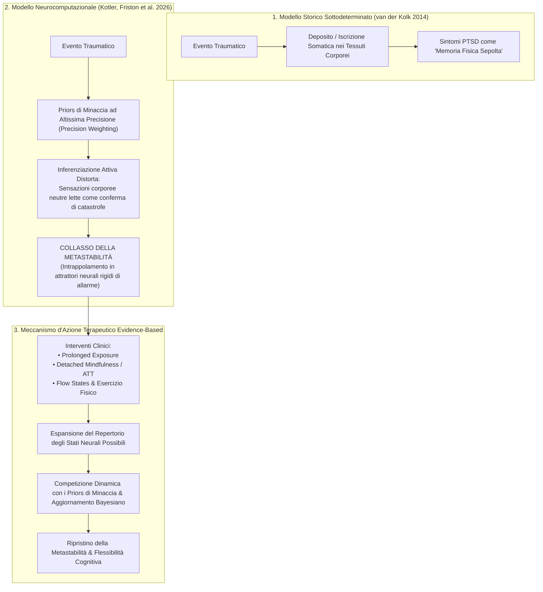
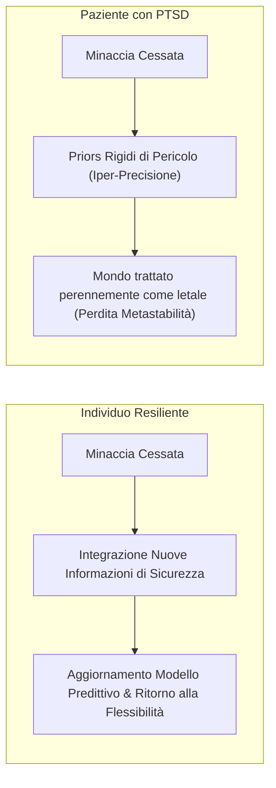

# Metastabilità Neurale e Predictive Coding nel Trauma Psicologico (Kotler et al., 2026)

## Definizione Operativa
- La **Teoria della Metastabilità e del Predictive Coding nel Trauma** (Kotler, Mannino, Fox & Friston, 2026) è un modello neurocomputazionale che ridefinisce l'eziologia e il mantenimento del Disturbo da Stress Post-Traumatico (**PTSD**), superando il dogma somatico-meccanicistico del *"corpo che accusa il colpo"* (*"The Body Keeps the Score"*; van der Kolk, 2014).
- **Assunto Computazionale:** Il trauma non è una traccia passiva "immagazzinata" o "sepolta" nei tessuti corporei periferici. È invece il risultato di un'alterazione del **modello generativo bayesiano** cerebrale (*Predictive Processing / Active Inference*), caratterizzato dall'assegnazione di un'eccessiva precisione statistica (**Hyper-Precision Weighting**) ai *priors* di minaccia e pericolo imminente.
- **Perdita di Metastabilità:** In condizioni fisiologiche, la **metastabilità** rappresenta la capacità del sistema nervoso di transitare in modo fluido, flessibile ed economico tra molteplici configurazioni neurali e mentali in risposta all'ambiente. Nel PTSD, il sistema subisce un collasso dinamico, rimanendo intrappolato in rigidi stati attrattori difensivi (iperarousal, flashback, evitamento esperienziale), rendendo il cervello incapace di integrare l'evidenza sensoriale e interocettiva di sicurezza attuale.

---

## Principi Fondamentali del Modello

### 1. Superamento del Paradigma del "Deposito Corporeo"
- **Il Paradosso della Resilienza Epidemiologica:** Gli studi longitudinali sull'esposizione a traumi estremi dimostrano che solo una minoranza delle vittime sviluppa PTSD, mentre la maggioranza esibisce un recupero spontaneo e una resilienza stabile. Se il trauma fosse un accumulo fisico nei tessuti muscolari o fasciali, la relazione tra evento avverso e danno clinico sarebbe quasi deterministica e diretta.
- **La Vera Discriminante: L'Aggiornamento delle Previsioni:** Ciò che distingue l'individuo resiliente dal paziente traumatizzato non è l'assenza di alterazioni corporee immediate durante l'evento, ma la **flessibilità del sistema nervoso centrale nell'aggiornare i propri modelli predittivi** una volta ripristinata la sicurezza ambientale.

### 2. Precision Weighting e Inferenziazione Interocettiva
- Nel formalismo bayesiano di Friston, il cervello regola l'influenza delle predizioni rispetto agli errori di predizione sensoriale (*prediction errors*) calibrandone la **precisione** ($\Pi$).
- Nel PTSD, la precisione assegnata ai *priors* di minaccia è patologicamente elevata. Di conseguenza:
  - Un fisiologico aumento del battito cardiaco, una tensione muscolare o uno stimolo ambientale ambiguo non vengono interpretati come normali risposte transitorie, ma fungono da evidenza forzata che conferma la presenza attiva del trauma originario.
  - Il corpo non "ricorda da solo", ma è il sistema nervoso centrale che legge lo stato corporeo attraverso una lente predittiva rigida e impermeabile alla disconferma.

### 3. La Metastabilità come Indicatore di Salute Mentale
- **Definizione Computazionale:** La metastabilità descrive un regime dinamico non-lineare in cui sottosistemi neurali oscillano in coordinazione transitoria senza fondersi in una sincronia globale invariabile né frammentarsi in un disordine casuale.
- **Stato Traumatico:** Rappresenta una drammatica riduzione dello spazio degli stati accessibili dal cervello. Il sistema rimane vincolato in "pozzi di potenziale" (*potential wells*) profondi e iper-stabili: ipervigilanza, condotte di fuga ed evitamento.

---

## Confronto Teorico e Implicazioni Cliniche

| Dimensione di Confronto | Paradigma Somatico Tradizionale (van der Kolk) | Paradigma Neurocomputazionale (Kotler et al., Friston 2026) |
| :--- | :--- | :--- |
| **Natura del Trauma** | Memoria somatica "depositata" e bloccata nei tessuti periferici | Modello generativo predittivo che assegna eccessiva precisione al pericolo |
| **Meccanismo dei Sintomi** | Rilascio somatico spontaneo / memorie corporee non integrate | Inferenziazione attiva rigida che interpreta ogni segnale come minaccia attiva |
| **Obiettivo Terapeutico** | "Liberare" o catarticamente scaricare le emozioni sepolte | **Ricalibrare l'accuratezza predittiva e ripristinare la metastabilità** |
| **Ruolo del Corpo** | Archivio autonomo del trauma | Sorgente di dati interocettivi interpretati dai modelli neurali centrali |
| **Interventi Indicati** | Tecniche corporee catartiche / rilascio somatico | **Esposizione prolungata, abituazione, flow states, mindfulness, esercizio** |

---

## Meccanismo d'Azione delle Psicoterapie Evidence-Based

La prospettiva della metastabilità offre una spiegazione unitaria e rigorosa di come agiscono i trattamenti evidence-based per il trauma:

1. **Esposizione Prolungata (*Prolonged Exposure* - PE):**
   - Mantenendo il paziente a contatto con gli stimoli temuti senza permettere condotte di evitamento o rassicurazioni premature, l'esposizione genera massicci *prediction errors* di sicurezza.
   - Questi errori forzano la riduzione della precisione associata ai vecchi *priors* di pericolo, aggiornando la matrice probabilistica cerebrale.
2. **Mindfulness e Attention Training Technique (ATT):**
   - Sviluppano il controllo metacognitivo sul fuoco attentivo, consentendo al paziente di disancorarsi dal monitoraggio automatico della minaccia interocettiva.
3. **Esperienze di Flusso (*Flow States*) ed Esercizio Strutturato:**
   - Ampliano la gamma delle configurazioni neurali disponibili, inducendo stati dinamici ad alta integrazione che competono efficacemente con gli attrattori rigidi del trauma.

---

**Riferimenti Bibliografici:**
- Kotler, S., Mannino, M., Fox, G., & Friston, K. (2026). The body does not keep the score: trauma, predictive coding, and the restoration of metastability. *Frontiers in Systems Neuroscience*, 20, 1812957. DOI: 10.3389/fnsys.2026.1812957.
- van der Kolk, B. A. (2014). *The Body Keeps the Score: Brain, Mind, and Body in the Healing of Trauma*. Viking.
- Friston, K. (2010). The free-energy principle: a unified brain theory?. *Nature Reviews Neuroscience*, 11(2), 127–138.
- Foa, E. B., Hembree, E. A., Rothbaum, B. O., & Rauch, S. A. M. (2019). *Prolonged Exposure Therapy for PTSD: Emotional Processing of Traumatic Experiences*. Oxford University Press.

## Relazioni
- Vedi anche: [[bollettino-iperlab-intherapy-n01-1]], [[early-vs-late-dropout-cbt]], [[treatment-outcome-and-relapse-prediction]], [[processes-of-change-in-psychotherapy]], [[process-based-therapy]], [[clinical-fidelity-assessment]], [[rischi-esposizione-cptsd-ia]], [[000]]\n