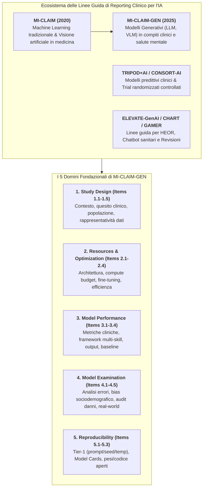
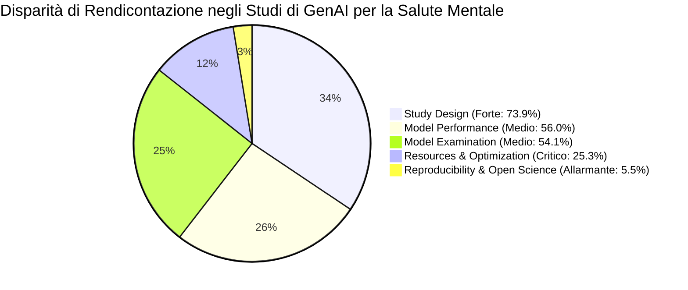
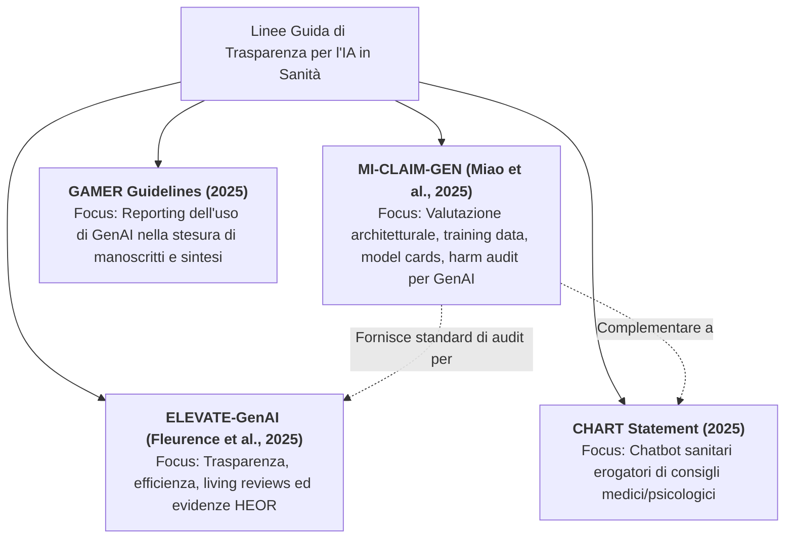

# MI-CLAIM-GEN Checklist

## Definizione Operativa
- La **MI-CLAIM-GEN Checklist** (*Minimum Information about Clinical Artificial Intelligence for Generative Modeling Research*) è lo standard metodologico internazionale di rendicontazione elaborato da Miao et al. (2025; *Nature Medicine*, doi: [10.1038/s41591-024-03470-0](https://doi.org/10.1038/s41591-024-03470-0)) specificamente concepito per valutare la qualità, la trasparenza e la riproducibilità degli studi clinici basati su Intelligenza Artificiale Generativa (GenAI) e Large Language Models (LLM) in sanità e salute mentale.
- **Architettura a 5 Domini Metodologici:** Struttura la valutazione della trasparenza scientifica su cinque aree chiave: (1) *Study Design*, (2) *Resources and Optimization*, (3) *Model Performance and Evaluation*, (4) *Model Examination and Safety*, e (5) *Reproducibility and Open Science*.
- **Utilità Clinica e Psicoterapia CBT:** Costituisce uno strumento fondamentale di *critical appraisal* per clinici e ricercatori per discernere tra modelli con eccellenza teorica/aneddotica e sistemi realmente validati per la pratica clinica, smascherando studi affetti da opacità dei dati di training, assenza di audit sui danni iatrogeni (*harm assessment*) e totale irriproducibilità dei prompt.

---

## Evidenze dalla Letteratura

### 1. I 5 Domini Metodologici di MI-CLAIM-GEN

| Dominio | Sotto-Componenti e Requisiti di Trasparenza | Stato di Conformità nella Salute Mentale (Wang et al., 2025) |
| :--- | :--- | :---: |
| **1. Study Design** | • **1.1 Contesto Clinico:** Razionale e setting di cura. • **1.2 Quesito di Ricerca:** Formulazione clinica esplicita. • **1.3 Task Definition:** Input/output previsti. • **1.4 Popolazione:** Caratteristiche demografiche. • **1.5 Rappresentatività Dati:** Documentazione del dataset di training originario. | **73.9% conformità complessiva** (Item 1.1 al 97%, Item 1.2 al 100%, ma Item 1.5 **solo all'11%**) |
| **2. Resources & Optimization** | • **2.1 Architettura & Pesi:** Modello, versione, checkpoint esatto. • **2.2 Compute Infrastructure:** Hardware (GPU/TPU) e consumi. • **2.3 Hyperparameters:** Parametri di tuning, LoRA, temperature, top-p. • **2.4 Efficienza Computazionale:** Latenza e throughput. | **25.3% conformità complessiva** (Grave sotto-rendicontazione delle risorse e dei parametri di inferenza) |
| **3. Model Performance & Evaluation** | • **3.1 Metriche Cliniche & NLP:** Accuratezza, sensibilità, F1, BLEU, ROUGE. • **3.2 Framework Olistico:** Valutazione multi-skill contestuale. • **3.3 Descrizione Output:** Trascrizioni qualitative delle risposte. • **3.4 Baseline Comparison:** Confronto con modelli preesistenti o umani. | **56.0% conformità complessiva** (Item 3c all'89%, ma framework di valutazione completo **solo al 20%**) |
| **4. Model Examination & Safety** | • **4.1 Error Analysis:** Tipologia e frequenza di allucinazioni. • **4.2 Demographic Fairness:** Audit di disparità (sesso, etnia, età). • **4.3 Robustness:** Stress testing e stabilità del prompt. • **4.4 Real-World Setting:** Valutazione in condizioni d'uso ecologiche. • **4.5 Harm Assessment:** Valutazione post-deployment dei danni potenziali. | **54.1% conformità complessiva** (Valutazione in setting reali e audit dei danni quasi completamente assenti) |
| **5. Reproducibility & Open Science** | • **5.1 Tier-1 Reproducibility:** Rilascio di prompt esatti, seed, script di pipeline. • **5.2 Model Card / System Card:** Documentazione standardizzata di scopo e limiti. • **5.3 Open Artifacts:** Repository pubblici di codice e pesi (GitHub/Zenodo). | **5.5% conformità complessiva** (**0% di Model Cards formali**, solo il 14% raggiunge la conformità Tier-1) |

---

### 2. Risultati dell'Audit Empirico sulla GenAI in Salute Mentale (Wang et al., 2025)

Nell'applicazione sistematica della checklist MI-CLAIM-GEN su un corpus di 79 studi peer-reviewed (periodo 2019–2024), Wang, Zhou e Zhou (2025) hanno riscontrato un punteggio medio di conformità pari al **45.39%** (753/1659 item valutati positivamente secondo il protocollo Joanna Briggs Institute; Santos et al., 2018):

#### Snodi Critici Emersi dall'Audit:
1. **La "Scatola Nera" dei Dati di Addestramento (Item 1.5):** Solo l'**11%** degli studi descrive la composizione sociodemografica o la rappresentatività dei dati di pretraining/fine-tuning. Tale omissione impedisce di stimare il rischio di bias culturale (WEIRD bias) o di mancata decodifica di manifestazioni somatiche del disagio psicologico (Ryder et al., 2008).
2. **Deficit dei Framework di Valutazione Olistica (Item 3b):** Solo il **20%** degli studi adotta un framework di valutazione multidimensionale che esamini congiuntamente accuratezza teorica, sicurezza, aderenza alle linee guida, tenuta relazionale ed empatia percepita. Il restante 80% ricade nella *single-task zero-shot trap* (Wang et al., 2025).
3. **Assenza di Validazione in Setting Reali e Audit dei Danni (Items 4d, 4e):** La quasi totalità delle pubblicazioni valuta i modelli su vignette cliniche sintetiche o benchmark chiusi, trascurando l'impatto clinico effettivo su pazienti reali (*in-the-wild evaluations*).
4. **Crisi della Riproducibilità Scientifica (Dominio 5):** **Nessuno studio (0%) ha fornito una Model Card formale** e solo il **14%** ha soddisfatto i criteri di riproducibilità *Tier-1* (pubblicazione del prompt integrale con relative istruzioni di sistema, temperature, top-p e seed numerico).

---

## Integrazione con altri Standard di Reporting Clinico

---

## Raccomandazioni per la Ricerca e l'Uso Clinico

1. **Adozione Obbligatoria delle Model Cards nei Trial di Salute Mentale:**
   - Ogni modello o pipeline proposta deve essere corredata da una *Model Card* standardizzata che specifichi esplicitamente i casi d'uso previsti (*intended use*), i contesti d'uso controindicati (*out-of-scope uses*), le popolazioni testate e le limitazioni note (Miao et al., 2025; Wang et al., 2025).
2. **Rilascio Integrale dei Parametri Tier-1:**
   - Pubblicare sistematicamente la formulazione esatta dei prompt di sistema (*system prompt*), le catene di ragionamento (*few-shot exemplars*, catene CoT), le temperature di campionamento e le versioni di runtime per garantire la verificabilità empirica indipendente.
3. **Audit dei Danni Post-Deployment (*Harm Assessment*):**
   - Integrare protocolli longitudinali per il monitoraggio continuativo di effetti iatrogeni, dipendenza emotiva, allucinazioni diagnostiche e interruzioni traumatiche del dialogo terapeutico.

---

**Riferimenti Bibliografici:**
- Miao, B. Y., Chen, I. Y., Williams, C. Y., Davidson, J., Garcia-Agundez, A., Sun, S., et al. (2025). The MI-CLAIM-GEN checklist for generative artificial intelligence in health. *Nature Medicine*, 31(5), 1394–1398. https://doi.org/10.1038/s41591-024-03470-0
- Wang, X., Zhou, Y., & Zhou, G. (2025). The Application and Ethical Implication of Generative AI in Mental Health: Systematic Review. *JMIR Mental Health*, 12, e70610. https://doi.org/10.2196/70610
- Fleurence, R. L., et al. (2025). ELEVATE-GenAI: Reporting Guidelines for Generative AI in Health Economics and Outcomes Research. *Value in Health*, 28(6), 701–712. https://doi.org/10.1016/j.jval.2025.06.018
- Ryder, A. G., Yang, J., Zhu, X., et al. (2008). The cultural shaping of depression: somatic symptoms in China, psychological symptoms in North America? *Journal of Abnormal Psychology*, 117(2), 300–313. https://doi.org/10.1038/0021-843X.117.2.300
- Santos, W. M., Secoli, S. R., & Püschel, V. A. (2018). The Joanna Briggs Institute approach for systematic reviews. *Revista Latino-Americana de Enfermagem*, 26, e3074. https://doi.org/10.1590/1518-8345.2885.3074

---

## Relazioni
- Vedi anche: [[mental-v12i1e70610]], [[genai4mh-framework]], [[elevate-genai-framework]], [[chart-reporting-guideline]], [[gamer-reporting-guideline]], [[single-task-zero-shot-evaluation-trap]], [[clinician-user-evaluation-discrepancy]], [[five-domain-chatbot-validation-framework]], [[traffic-light-quality-appraisal-clinical-ai]], [[gai-research-integrity-and-verification]]
