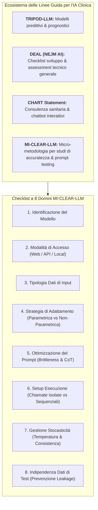
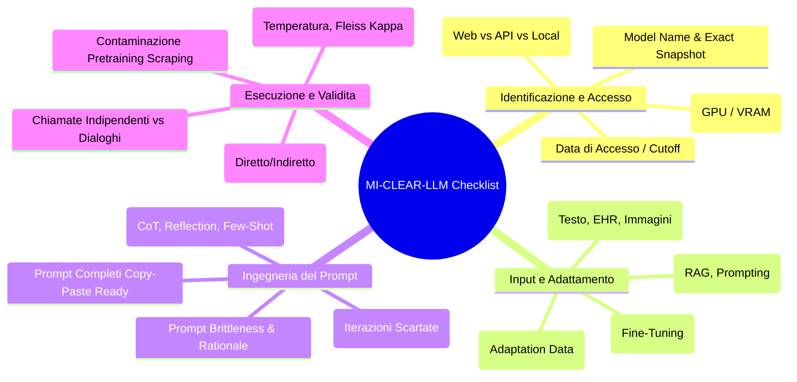

# MI-CLEAR-LLM: Minimum Reporting Items for LLM Accuracy in Healthcare

## Definizione Operativa
- Il **MI-CLEAR-LLM** (*MInimum reporting items for CLear Evaluation of Accuracy Reports of Large Language Models in healthcare*) è la linea guida metodologica di riferimento per la rendicontazione trasparente e standardizzata degli studi biomedici e clinici volti a valutare l'accuratezza prestazionale dei Large Language Models (LLM) e Large Multimodal Models (LMM).
- **Consenso e Origine:** Proposto inizialmente nel 2024 e aggiornato nel 2025 su *Korean Journal of Radiology* da Park et al. (2025; doi: 10.3348/kjr.2025.1522), il framework definisce una **checklist essenziale articolata in 8 categorie chiave** specificamente disegnate per catturare le determinanti tecniche, infrastrutturali e stocastiche che condizionano l'output dei modelli generativi.
- **Scopo Metodologico:** Fornire ai ricercatori, ai revisori paritari e agli editori medici uno standard operativo snello e pragmatico che colmi le lacune delle linee guida generaliste di IA, focalizzandosi sulle modalità di specificazione, accesso, adattamento, interrogazione e isolamento dei dati nei compiti di accuratezza diagnostica, interpretazione di referti ed estrazione di dati clinici.

---

## I Principi Fondamentali di MI-CLEAR-LLM

### 1. Tracciabilità Tecnica degli Snapshot e degli Ambienti
L'accuratezza di un modello linguistico non è una proprietà astratta o statica, bensì una funzione dipendente dal checkpoint esatto, dall'infrastruttura computazionale e dalla data di esecuzione:
- **Snapshot e Minor Versions:** Gli LLM proprietari (es. GPT-4o, Claude 3.5) vengono costantemente aggiornati tramite rilasci silenti di snapshot minori (es. `gpt-4o-2024-05-13` vs `gpt-4o-2024-11-20`). Gli studi devono riportare lo snapshot esatto o, in sua assenza, la data precisa delle interrogazioni.
- **Commit Hash e Quantizzazione Open-Source:** Per i modelli open-source autogestiti (LLaMA, DeepSeek, Mistral), è indispensabile documentare la provenienza dei pesi, il commit hash, la precisione numerica (es. FP16, 8-bit, 4-bit quantization via *bitsandbytes*) e l'ambiente hardware (GPU type e VRAM).

---

### 2. Tassonomia delle Modalità di Accesso
MI-CLEAR-LLM classifica l'accesso ai modelli in tre architetture distinte:

1. **Interfaccia Web Chatbot (es. ChatGPT Web):**
   - *Vantaggi:* Massima accessibilità immediata; ideale solo per studi ecologici sull'interazione conversazionale utente-macchina.
   - *Criticità Metodologiche:* Opacità dei system prompt, memoria intersessione persistente, impossibilità di isolare le singole query, potenziale trasmissione di dati sensibili a server di terze parti.
2. **Accesso API a Modelli Proprietari (es. OpenAI/Anthropic/Google API):**
   - *Vantaggi:* Pieno controllo su iperparametri (temperatura, top-p, seed), formati di output vincolati (JSON), automazione batch su ampi campioni, garanzia di isolamento atomico tra le chiamate.
   - *Criticità Metodologiche:* Costi computazionali a token; persistente dipendenza da server esterni e da modifiche non tracciate dell'infrastruttura di serving.
3. **Deployment Locale Autogestito (es. vLLM, Ollama, HuggingFace su GPU dedicate):**
   - *Vantaggi:* Controllo assoluto dell'intera pipeline (pesi, decoding, quantizzazione), riproducibilità deterministica al 100%, rispetto integrale della privacy e del GDPR/HIPAA (nessun dato esce dall'infrastruttura ospedaliera).
   - *Criticità Metodologiche:* Elevata complessità di configurazione ingegneristica e necessità di ingenti risorse hardware (es. 80GB-180GB VRAM per modelli di grandi dimensioni).

---

### 3. Rigore Terminologico: Parametrico vs Non-Parametrico
Uno dei contributi cardine di MI-CLEAR-LLM è la standardizzazione della nomenclatura metodologica:
- **Parametric Adaptation:** Procedura che modifica i parametri interni (pesi) della rete neurale mediante training supervisionato su corpus di dominio.
- **Non-Parametric Adaptation:** Ottimizzazione che opera esclusivamente nel contesto di input o tramite retrieval dinamico (RAG, prompt engineering, few-shot demonstration).
- **Regola di Reporting:** Vietato l'uso generico del termine "training data" per definire i casi utilizzati per perfezionare i prompt; gli autori devono impiegare la dicitura **"prompt development data"** o **"adaptation data"** per distinguere nettamente tali campioni dai dataset di training per machine learning.

---

### 4. Gestione della "Prompt Brittleness"
La sensibilità estrema dei modelli linguistici a minime variazioni lessicali (**prompt brittleness**) richiede che:
- Venga fornito il testo integrale e *copy-paste ready* di tutti i prompt impiegati.
- Venga esplicitato il razionale della scelta lessicale (allineamento con dizionari standardizzati come RadLex, SNOMED-CT o linee guida cliniche).
- Vengano descritte le tecniche deliberate adottate (Chain-of-Thought, Reflection, Few-Shot In-Context Learning).
- Venga documentato il processo iterativo, includendo le varianti scartate (*negative reporting*).

---

### 5. Prevenzione del Data Leakage e Isolamento del Test Set
La validità dei test di accuratezza poggia sulla rigorosa separazione delle fonti:
- **Leakage Diretto:** Condivisione di casi tra adaptation set e test set.
- **Leakage Indiretto:** Mancato accecamento (*blinding*) del personale che sviluppa i prompt, il quale potrebbe involontariamente conformare le istruzioni alle caratteristiche note dei casi di test.
- **Contaminazione del Pretraining Corpus:** Uso di quiz o casi clinici open-access reperibili online, potenzialmente memorizzati dal modello durante la fase di web scraping del pretraining.

---

## Integrazione con Altre Linee Guida di Reporting

| Linea Guida | Ente / Rivista di Riferimento | Focus Primario | Rapporto con MI-CLEAR-LLM |
| :--- | :--- | :--- | :--- |
| **[[TRIPOD-LLM]]** | Gallifant et al. (*Nat Med*, 2025) | Studi prognostici e modelli predittivi clinici basati su LLM. | Macro-linea guida per trial predittivi; MI-CLEAR-LLM ne approfondisce gli aspetti di interrogazione tecnica e API. |
| **[[DEAL]]** | Tripathi et al. (*NEJM AI*, 2025) | Sviluppo, valutazione ed auditing tecnico di LLM clinici. | DEAL fornisce un quadro trasversale; MI-CLEAR-LLM standardizza la micro-metodologia degli accuracy reports. |
| **[[chart-reporting-guideline\|CHART]]** | Huo et al. (*JAMA Netw Open*, 2025) | Studi di consulenza sanitaria interattiva (*Chatbot Health Advice*). | CHART si focalizza sull'interazione clinica paziente-chatbot; MI-CLEAR-LLM copre i test di accuratezza e benchmarking sistematico. |
| **[[ELEVATE-GenAI2025\|ELEVATE-GenAI]]** | Fleurence et al. (*Value in Health*, 2025) | Ricerca di Economia Sanitaria e RWE (HEOR). | Specializzata in SLR e modelli di Markov; MI-CLEAR-LLM è orientata alla diagnostica e all'imaging. |

---

## Related pages
- [[MI-CLEAR-LLM_2025]]
- [[stochasticity-management-in-clinical-llms]]
- [[chart-reporting-guideline]]
- [[CHART2025]]
- [[elevate-genai-framework]]
- [[gamer-reporting-guideline]]
- [[living-guidelines-in-health-ai]]
- [[chai-blueprint-health-ai]]
- [[clinical-fidelity-assessment]]
- [[single-task-zero-shot-evaluation-trap]]
- [[traffic-light-quality-appraisal-clinical-ai]]
- [[power-safety-paradox]]
- [[prompting-in-psychology]]
- [[large-language-models]]
- [[open-weight-privacy-compliant-synthesis]]
- [[gdpr-governance-mental-health-ai]]
- [[software-as-a-medical-device-salute-mentale]]
