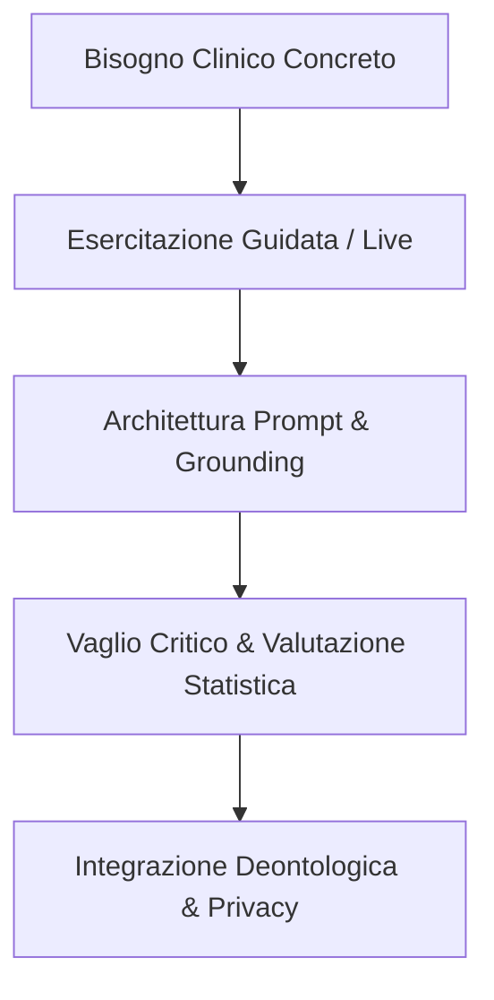

# Microprogettazione Formativa per l'IA in Psicoterapia

**Summary**: Framework metodologico e procedurale per la progettazione di percorsi formativi avanzati sull'integrazione dell'intelligenza artificiale nella pratica clinica e nella didattica specialistica della psicoterapia.
**Sources**: 07-08 Riunione_ Pianificazione corso IA per psicoterapia — struttura, validazione interessi, microprogettazione e coordinamento.txt
**Last updated**: 2026-08-27
---

## 1. Principi Pedagogici e Posizionamento Metodologico

La **microprogettazione formativa per l'IA in psicoterapia** definisce i criteri strutturali e pedagogici necessari per costruire moduli formativi realmente ancorati alla clinica:

- **Inversione Didattica (Dall'Esperienza alla Cornice)**: Superamento della sequenza tradizionale che introduce l'IA a partire da nozioni puramente normative o astratte. L'ingaggio formativo si costruisce partendo dai bisogni operativi e dai processi di seduta (es. concettualizzazione del caso, pianificazione delle esposizioni), introducendo la cornice etico-normativa (GDPR, AI Act) e le architetture tecniche come requisiti operativi integrati nella prassi.
- **Rifiuto dei Modelli Derivati dal Marketing**: Differenziazione netta rispetto ai corsi generici sull'IA, focalizzati sulla produzione di contenuti promozionali o automazioni superficiali, a favore di un addestramento all'uso analitico, diagnostico e riflessivo dello strumento.
- **Targeting Differenziato e Preservazione del Ragionamento**: Riserva dei moduli applicativi avanzati a discenti con solide basi metodologiche (terapeuti specializzati o allievi del 3°/4° anno), escludendo i primi anni di formazione per prevenire fenomeni di *automation bias* o de-skilling prima che gli schemi clinici siano consolidati.

---

## 2. Architettura Didattica Modulare

Il modello formativo si articola su due livelli progressivi:

1. **Livello Base (Fondamenti e Prompting Clinico)**:
   - Comprensione della natura statistica e non deterministica degli LLM.
   - Tecniche di prompt engineering applicate alla psicoterapia (ruoli, scomposizione dei compiti, contestualizzazione clinica).
   - Utilizzo di strumenti per l'autoformazione, la revisione bibliografica e la deep research (es. *Perplexity*, *NotebookLM*).
   - Redazione assistita di sintesi di seduta e compiti a casa (homework).

2. **Livello Avanzato (Knowledge Base e Personal Skills)**:
   - Costruzione e manutenzione del [[second-brain-clinico|Second Brain Clinico]] in ambienti locali (es. *Obsidian*).
   - Sviluppo di custom skills (es. in *Claude*) per compiti specialistici (scoring di reattivi, estrazione item critici per la psicodiagnostica).
   - Gestione strutturata di protocolli complessi (es. linee guida di assessment per il rischio suicidario).

---

## 3. Iter Procedurale di Sviluppo (Macro -> Validazione -> Micro)

L'iter di allestimento dei percorsi di formazione continua segue cinque fasi sequenziali:

1. **Macroprogettazione**: Stesura della griglia preliminare degli obiettivi di apprendimento e dei moduli tematici.
2. **Validazione di Mercato**: Somministrazione di survey esplorative alla popolazione target per mappare interessi, disponibilità oraria e vincoli di frequenza.
3. **Focus Group Qualitativi**: Incontri mirati con allievi e docenti per calibrare i prerequisiti ed evitare assunzioni errate sul livello di alfabetizzazione digitale di partenza.
4. **Microprogettazione Esecutiva**: Dettaglio puntuale di ogni incontro (lezioni live, simulazioni cliniche guidate, esercizi "take-home" di fine modulo).
5. **Governance e Ruoli**: Strutturazione dei ruoli (progettazione, docenza d'aula, tutoraggio e coordinamento continuo) con piani di remunerazione dedicati.

---

## 4. Dimensione Relazionale e Metacognitiva nella Didattica

La formazione clinica all'IA integra due ulteriori assi fondamentali:
- **Indagine sull'uso dell'IA da parte del paziente**: Addestramento del terapeuta a esplorare l'impiego di assistenti conversazionali da parte dei pazienti (es. utilizzo di chatbot per rimuginio ossessivo o ricerca di rassicurazioni) e a condurre adeguati interventi di psicoeducazione.
- **Autoconsapevolezza metacognitiva del terapeuta**: Monitoraggio dei propri schemi e piani cognitivi attivati dall'interazione con l'IA (es. ricerca di rassicurazione rispetto all'incertezza diagnostica) per preservare l'autonomia di giudizio.

---

## Related pages
- [[07-08_Riunione_Pianificazione_Corso]]
- [[second-brain-clinico]]
- [[human-in-the-reasoning]]
- [[augmented-psychotherapy]]
- [[simulazione-pazienti-ai]]
- [[prompting-in-psychology]]
