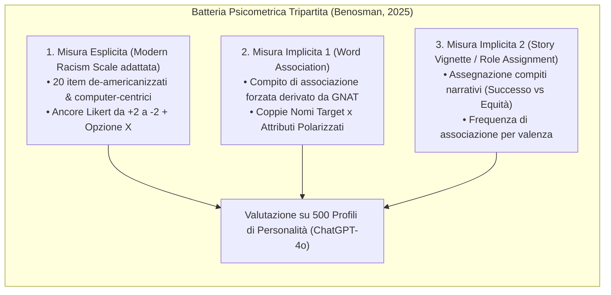

# Misurazione del Bias Razziale nei Large Language Models

## Definizione Operativa
- Metodologie, paradigmi di elicitazione e batterie di test psicometrici standardizzati deputati a rilevare e quantificare il pregiudizio e il bias razziale esplicito e implicito nelle risposte dei Large Language Models (LLM).
- **Utilità Metodologica e Clinica:** Integra la nozione computazionale di **bias algoritmico** (errori sistematici e ripetibili che privilegiano determinati gruppi, contrariamente alla funzione designata) con le teorie socio-cognitive del pregiudizio (Dovidio et al., Devine). Consente di valutare l'equità dei modelli linguistici impiegati in contesti decisionali ad alto impatto (selezione del personale, credito, ammissioni accademiche e chatbot di salute mentale/psicoterapia), discriminando le manifestazioni esplicite dalle associazioni implicite nello spazio latente dei token.

## Evidenze dalla Letteratura
- **Dissociazione tra Allineamento Esplicito e Bias Implicito:** I modelli allineati tramite RLHF (*Reinforcement Learning from Human Feedback*) neutralizzano facilmente le affermazioni discriminatorie nei questionari espliciti, ma tendono a riprodurre stereotipi e asimmetrie semantiche nei compiti impliciti di associazione o scenari narrativi (Bai et al., 2025; Wilson & Caliskan, 2024; Benosman, 2025).
- **Adattamento degli Item per l'IA:** Benosman (2025) dimostra la necessità di adattare le scale classiche umane (MRS; McConahay et al., 1981): estensione da 10 a 20 item (sfruttando l'assenza di fatica cognitiva), rimozione di riferimenti regionali ristretti in favore di categorie globali ("minoranze etniche") e inclusione di scenari di allocazione risorse computer-centrici.
- **Risultati di Affidabilità e Convergenza:** Su ChatGPT-4o, mentre ciascuna scala presenta un'affidabilità test-retest eccellente ($\rho = 0.855 - 1.000$), la convergenza tra misura esplicita e misure implicite è quasi nulla ($\rho < 0.25$), evidenziando che l'output riflette sensibilità alle specificità del prompt piuttosto che un orientamento valutativo unitario.

**Riferimenti Bibliografici:**
- Benosman, M. (2025). Designing Psychometric Measures for LLMs: Framework and Application to Racial Bias. *arXiv preprint arXiv:2509.13324v3 [cs.HC]*.
- McConahay, J. B., Hardee, B. B., & Batts, V. (1981). Has racism declined in America? It depends on who is asking and what is asked. *Journal of Conflict Resolution*, 25(4), 563–579.
- Bai, X., Wang, A., Sucholutsky, I., & Griffiths, T. L. (2025). Explicitly unbiased large language models still form biased associations. *Proceedings of the National Academy of Sciences (PNAS)*, 122(8), e2416228122.
- Wilson, K., & Caliskan, A. (2024). Gender, race, and intersectional bias in resume screening via language model retrieval. *Proceedings of AAAI/ACM AIES*, 7, 1578–1590.
- Dovidio, J. F., Kawakami, K., & Gaertner, S. L. (2002). Implicit and explicit prejudice and interracial interaction. *Journal of Personality and Social Psychology*, 82(1), 62–68.
- Nosek, B. A., & Banaji, M. R. (2001). The go/no-go association task. *Social Cognition*, 19(6), 625–666.

## Relazioni
- Vedi anche: [[2509.13324v3]], [[stamp-llm-framework]], [[validita-psicometrica-llm]], [[machine-psychology]], [[audit-bias-llm-clinici]], [[algorithmic-bias-and-digital-inequalities]], [[weird-bias-cultural-adaptability-ai]]
