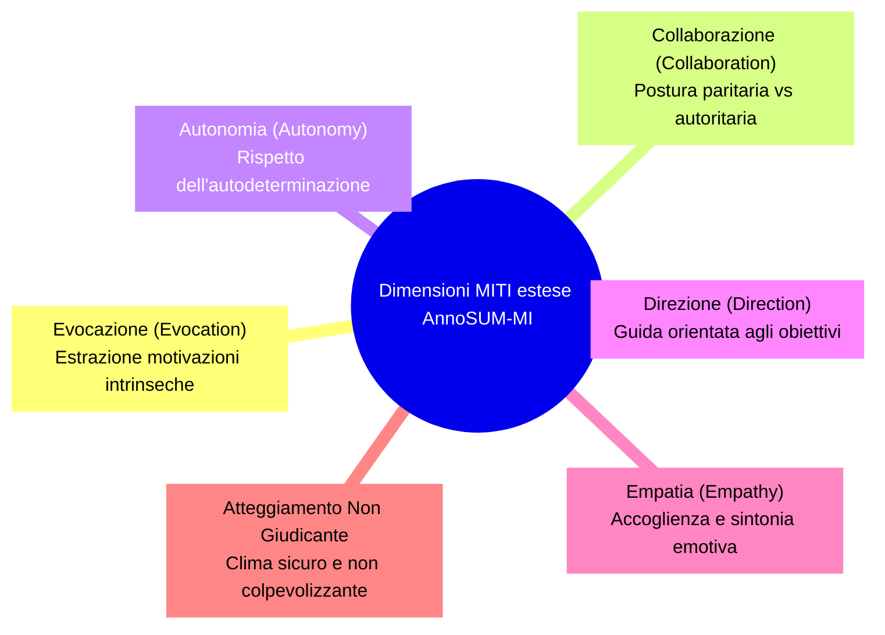

# Schema di Annotazione MITI per Riassunti Terapeutici (AnnoSUM-MI)

## Definizione Operativa
- Sistema di codifica standardizzato a sei dimensioni (Evocazione, Collaborazione, Autonomia, Direzione, Empatia e Atteggiamento Non Giudicante) derivato dal *Motivational Interviewing Treatment Integrity* (MITI 4.1) per valutare l'aderenza, la fedeltà clinica e la qualità delle sintesi di dialoghi psicoterapeutici generate da Large Language Models (LLM).
- **Utilità CBT:** Consente ai terapeuti cognitivo-comportamentali e ai supervisori clinici di disporre di una griglia psicometrica robusta (scala Likert a 5 ancore) per verificare se le sintesi prodotte dall'AI mantengono intatti i fattori aspecifici e relazionali (es. validazione, supporto all'autonomia, alleanza terapeutica) e le spinte motivazionali del paziente (*change talk*), discriminando tra sedute ad alta e bassa qualità metodologica.

## Evidenze dalla Letteratura
- **Fondazione Psicometrica nel MITI 4.1:** Il manuale MITI (Moyers et al., 2014, 2016) rappresenta il gold standard per la quantificazione dell'integrità del trattamento nel Colloquio Motivazionale. Nel framework AnnoSUM-MI (Kumar et al., 2025), le 5 dimensioni globali MITI sono state integrate dalla dimensione "Atteggiamento Non Giudicante" per catturare la totale assenza di bias o condanna morale nelle interazioni d'aiuto.
- **Ancoraggio su Scala Likert a 5 Livelli:**
  - *1 (Extremely Low):* Dimensione del tutto assente o trascurabile.
  - *2 (Low):* Dimensione debolmente dimostrata con impatto clinico limitato.
  - *3 (Moderate):* Dimensione manifesta con impatto moderato sulla conversazione.
  - *4 (High):* Dimensione fortemente evidente che influenza positivamente la sessione.
  - *5 (Extremely High):* Dimensione dominante e fattore trainante del successo terapeutico.
- **Affidabilità e Validazione su Corpus Clinici:**
  - Applicato a 131 sessioni del dataset AnnoMI (Wu et al., 2022, 2023) che include trascrizioni reali ad alta ($n = 108$) e bassa ($n = 23$) qualità.
  - L'accordo inter-annotatore tra giudici esperti su 15 sessioni condivise ha riportato un coefficiente $\text{Cohen's } \kappa = 0.50$ ($0.52$), pienamente allineato agli standard di concordanza moderata per valutazioni cliniche osservazionali complesse a parametri multipli (Landis & Koch, 1977; Hallgren, 2012; Tanana et al., 2016).
- **Benchmarking Automatizzato tramite LLM:**
  - Utilizzato come benchmark di classificazione multi-output multi-classe per verificare la capacità degli LLM (ChatGPT-4.0, Gemini-2.0 Flash, DeepSeek-V3) di autovalutarsi e valutare sintesi esterne.
  - I risultati mostrano che la presenza di prompt arricchiti (*few-shot*) con descrizioni esplicite delle ancore Likert aumenta la concordanza tra predizione dell'LLM e ground truth umana (Kumar et al., 2025).

**Riferimenti Bibliografici:**
- Kumar, V., Rajawat, P. S., & Ntoutsi, E. (2025). Mitigating semantic drift: Evaluating LLMs’ efficacy in psychotherapy through MI dialogue summarization leveraging MITI code. In *2025 International Joint Conference on Neural Networks (IJCNN)*, pp. 1–8. arXiv preprint arXiv:2511.22818v1.
- Moyers, T. B., Manuel, J. K., Ernst, D., & Fortini, C. (2014). *Motivational Interviewing Treatment Integrity Coding Manual 4.1 (MITI 4.1)*. University of New Mexico CASAA.
- Moyers, T. B., Rowell, L. N., Manuel, J. K., Ernst, D., & Houck, J. M. (2016). The Motivational Interviewing Treatment Integrity code (MITI 4): Rationale, preliminary reliability and validity. *Journal of Substance Abuse Treatment*, 65, 36–42.
- Wu, Z., Balloccu, S., Kumar, V., Helaoui, R., Reiter, E., Reforgiato Recupero, D., & Riboni, D. (2022). Anno-MI: A dataset of expert-annotated counselling dialogues. In *ICASSP 2022 - 2022 IEEE International Conference on Acoustics, Speech and Signal Processing (ICASSP)*, pp. 6177–6181.
- Wu, Z., Balloccu, S., Kumar, V., Helaoui, R., Reforgiato Recupero, D., & Riboni, D. (2023). Creation, analysis and evaluation of AnnoMI, a dataset of expert-annotated counselling dialogues. *Future Internet*, 15(3), 110.
- Tanana, M., Hallgren, K. A., Imel, Z. E., Atkins, D. C., & Srikumar, V. (2016). A comparison of natural language processing methods for automated coding of motivational interviewing. *Journal of Substance Abuse Treatment*, 65, 43–50.
- Landis, J. R., & Koch, G. G. (1977). The measurement of observer agreement for categorical data. *Biometrics*, 33(1), 159–174.
- Hallgren, K. A. (2012). Computing inter-rater reliability for observational data: An overview and tutorial. *Tutorials in Quantitative Methods for Psychology*, 8(1), 23–34.

## Relazioni
- Vedi anche: [[2511.22818v1]], [[semantic-drift-psicoterapia]], [[clinical-fidelity-assessment]], [[supervisione-clinica-ai]], [[in-session-warning-signs]], [[stamp-llm-framework]], [[cbt-dialogue-systems-and-tools]], [[validita-psicometrica-llm]], [[simulazione-pazienti-ai]]
