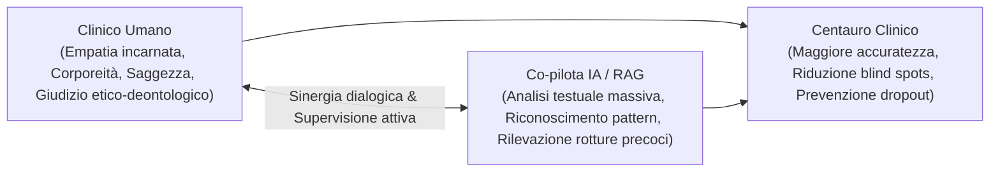
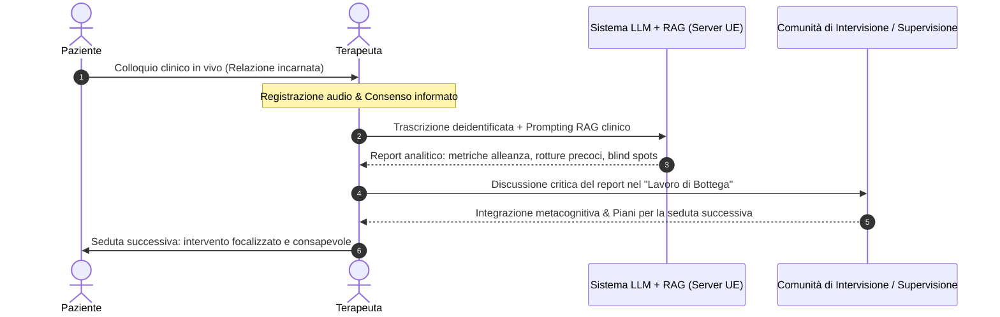

# Modello Centauro Clinico (Centaur Clinical Model)

**Summary**: Paradigma di integrazione clinico-computazionale ispirato al "Centaur Chess" di Garry Kasparov, in cui il terapeuta umano, potenziato da sistemi di intelligenza artificiale (LLM e RAG) e da feedback sistematici di processo, raggiunge un'efficacia e una precisione clinica superiori sia al professionista isolato sia all'algoritmo autonomo.
**Sources**: 06-10 Lezione_ RAG, LLM in Psicoterapia e Governance Etica.txt
**Last updated**: 2026-08-27
---

## Origine Epistemologica e Definizione

Il **Modello Centauro Clinico** (*Centaur Clinical Model*) trae origine dalla svolta teorica introdotta nel 1997 dal campione mondiale di scacchi Garry Kasparov dopo la celebre sconfitta contro il supercomputer *Deep Blue* di IBM. Kasparov osservò che la combinazione collaborativa di un giocatore umano e di un computer (definita *Centaur Chess* o *Advanced Chess*) era sistematicamente in grado di superare sia il più abile gran maestro umano da solo sia il più potente supercomputer privo di guida umana.

Trasposto nella psicoterapia cognitivo-comportamentale e nella cura della salute mentale, il principio centauro stabilisce una chiara gerarchia di efficacia e sicurezza clinica:

$$\text{Clinico Umano} + \text{Co-pilota IA / RAG} > \text{Clinico Umano da Solo} \gg \text{Intelligenza Artificiale Autonoma}$$

---

## Fondamenti Teorici ed Evidenze Empiriche

Il modello poggia su tre assi di ricerca e metodologia clinica:

### 1. Feedback-Informed Practice e Pratica Deliberata
- **Il limite dell'anzianità di servizio**: Dati empirici longitudinali (*Goldberg & Rousmaniere*, studio su 170 terapeuti e 6.500 pazienti seguiti fino a 18 anni) dimostrano che l'esperienza clinica da sola non migliora gli esiti dei trattamenti, evidenziando spesso una lieve flessione delle performance nel tempo.
- **La pratica senza feedback**: La pratica clinica routinaria e non supervisionata rischia di rendere permanenti gli errori del terapeuta.
- **Il ruolo della pratica deliberata**: La crescita professionale richiede un monitoraggio continuo e la riflessione sistematica sui **feedback negativi** e sulle micro-rotture dell'alleanza al di fuori del tempo di seduta.

### 2. Elaborazione del Linguaggio Naturale (NLP) e Codifica Clinica
- **Affidabilità computazionale**: I modelli di elaborazione del linguaggio naturale (*Natural Language Processing*) raggiungono livelli di accordo statistico comparabili a quelli di codificatori umani esperti nel rilevare costrutti chiave come empatia, distress e qualità dell'alleanza terapeutica (es. trial *Listen*).
- **Validazione psicometrica**: I pattern estratti dall'algoritmo devono essere costantemente calibrati e correlati con misure gold-standard validate (es. *Working Alliance Inventory - WAI*).

### 3. Predizione Algoritmica del Drop-out
- **Potere predittivo del Machine Learning**: Modelli basati su dati pre-seduta (*Bennemann et al., 2022*, su 2.543 pazienti CBT mediante algoritmi Random Forest e k-Nearest Neighbors) sono in grado di predire fino al 63,4% dei casi di abbandono della terapia, superando nettamente il tasso base del giudizio clinico intuitivo (30%).

---

## Applicazione Operativa nella Seduta di Psicoterapia

Nel Modello Centauro, l'intelligenza artificiale non interagisce con il paziente durante il colloquio (per evitare la distruzione dell'autenticità e la tecnodipendenza in seduta), ma opera in fase **post-seduta** come assistente di analisi di secondo livello:

### Funzioni Chiave del Co-pilota Centauro:
1. **Identificazione dei Blind Spots**: Segnalazione di micro-enactment relazionali trascurati dal clinico (es. inviti ad accudimenti onnipotenti o sconfinamenti di setting glissati per imbarazzo).
2. **Diagnosi Temporale delle Rotture dell'Alleanza**: Discriminazione tra rotture da confronto manifesto e **rotture da ritiro intellettualizzante** (*Safran & Muran*), spesso mascherate da un eloquio iper-produttivo.
3. **Allarmi Multidisciplinari**: Intercettazione di segnali somatici o farmacologici a rischio (es. autogestione non presidiata di farmaci come GLP-1).

---

## Linee Rosse, Rischi Epistemologici e Governance

Per prevenire derive iatrogene, il Modello Centauro stabilisce confini deontologici invalicabili:

- **Divieto di Agenti Autonomi con Pazienti Fragili**: Nessun LLM autonomo a contatto diretto con popolazioni vulnerabili. Il fallimento del chatbot *Tessa* (NEDA), che ha suggerito diete restrittive estreme a pazienti con disturbi alimentari, dimostra i rischi letali dell'automazione priva di supervisione.
- **Human-in-the-Loop e Titolarità Deontologica**: Ogni decisione diagnostica e terapeutica appartiene esclusivamente al professionista umano. L'output dell'IA è un'ipotesi probabilistica, mai un verdetto.
- **Prevenzione dell'Effetto Minority Report**: Consapevolezza che gli indici predittivi di rottura non devono tramutarsi in profezie che si autoavverano alterando negativamente la disponibilità emotiva del terapeuta.
- **Integrazione nel "Lavoro di Bottega"**: La tecnologia deve rimanere radicata negli spazi comunitari di intervisione e supervisione tra pari, impedendo l'isolamento del clinico e l'adesione acritica (*automation bias*).

---

## Related pages
- [[06-10_Lezione_RAG_LLM]]
- [[supervisione-clinica-ai]]
- [[uso-problematico-chatbot-ai]]
- [[augmented-psychotherapy]]
- [[digital-therapeutic-alliance]]
- [[human-in-the-reasoning]]
- [[ai-assisted-psychotherapy]]
- [[large-language-models]]
- [[rag-in-psicoterapia]]
