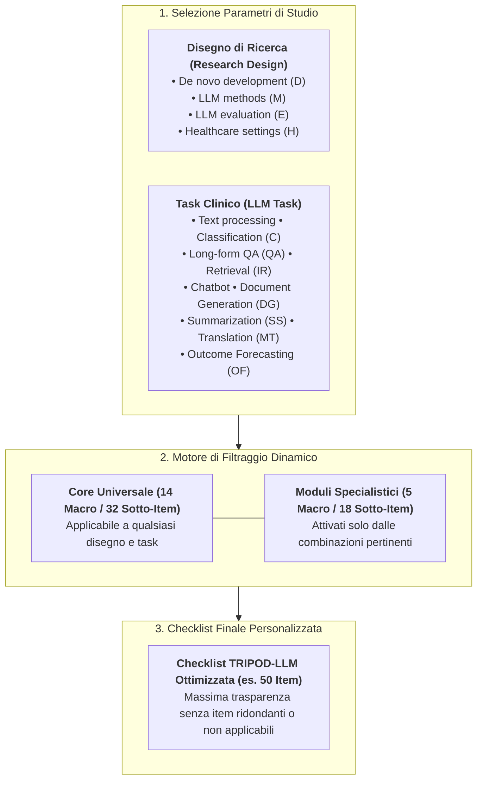
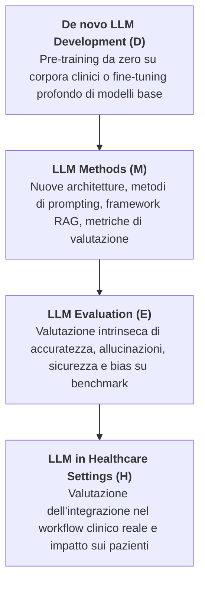
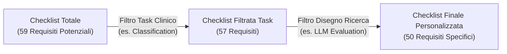

# Modular Reporting Framework for Large Language Models in Healthcare

## Definizione Operativa
- Il **Modular Reporting Framework for LLMs** è il paradigma metodologico introdotto dallo standard internazionale [[TRIPOD_LLM2025|TRIPOD-LLM]] (Gallifant et al., *Nature Medicine* 2025) per superare i limiti delle checklist di rendicontazione monolitiche e statiche nella ricerca biomedica basata su modelli linguistici generativi.
- **Superamento del Modello Monolitico:** Mentre le linee guida tradizionali dell'[[chart-reporting-guideline|EQUATOR Network]] (come CONSORT, STROBE o TRIPOD 2015) applicavano un insieme rigido e indifferenziato di requisiti a qualsiasi studio, i Large Language Models ([[large-language-models|LLM]]) operano come modelli fondazionali multi-scopo capaci di spaziare dalla classificazione all'estrazione di informazioni, dalla sintesi documentale al dialogo clinico interattivo.
- **Architettura a Matrice Bidimensionale:** Il framework adotta una struttura a matrice che interseca **4 Disegni di Ricerca** (*Research Designs*) e **9 Categorie di Task Clinici** (*LLM Tasks*), consentendo un filtraggio dinamico e contestuale dei requisiti di trasparenza metodologica (riducendo i 59/50 item totali solo alle voci pertinenti allo specifico studio).
- **Integrazione Digitale:** Il framework è reso operativo tramite un'applicazione web interattiva open-access ([tripod-llm.vercel.app](https://tripod-llm.vercel.app/)) che guida gli autori nella selezione delle variabili di studio e genera automaticamente il documento PDF conforme da allegare alla sottomissione editoriale.



---

## I Due Assi della Matrice Modulare

### 1. Asse dei Disegni di Ricerca (*Research Designs*)
TRIPOD-LLM identifica 4 archetipi metodologici primari che coprono l'intero ciclo di vita di un modello linguistico in ambito sanitario:



- **De novo LLM Development (D):** Studi che addestrano nuovi modelli su larga scala (es. pre-training di modelli ospedalieri come *GatorTron* o *MEDITRON-70B*). Richiedono la rendicontazione integrale dell'origine dei dati di pre-training, dei cutoff temporali, delle procedure di tokenizzazione e delle risorse di calcolo (*compute*).
- **LLM Methods (M):** Indagini metodologiche incentrate su nuovi algoritmi di inferenza, architetture transformer specializzate o tecniche avanzate di [[coast-framework-clinical-prompting|prompting]] e [[clinical-chain-of-thought-paradox|reasoning]]. Richiedono la trasparenza dei dettagli algoritmici, delle strategie di allineamento e dei parametri computazionali.
- **LLM Evaluation (E):** Studi retrospettivi o prospettici che misurano l'efficacia, l'accuratezza o la presenza di bias in modelli esistenti su dataset clinici isolati (*held-out test sets*).
- **LLM Evaluation in Healthcare Settings (H):** Valutazioni sul campo in cui l'LLM è incorporato nei flussi assistenziali (es. triage in pronto soccorso, risposta a messaggi nei portali pazienti, scribi ambientali). Impongono la descrizione dettagliata dell'allocazione dell'autonomia, della supervisione umana (*Human-in-the-Loop*) e del coinvolgimento di pazienti e cittadini (PPIE).

---

### 2. Asse delle Categorie di Task LLM (*LLM Tasks*)
La matrice mappa 9 categorie funzionali di compiti clinici, ciascuna associata a requisiti di rendicontazione specifici:

| Categoria di Task | Codice | Focus Metodologico e Requisiti Specialistici di Reporting |
| :--- | :---: | :--- |
| **Text Processing** | — | Manipolazione a basso livello del testo: tokenizzazione medica, lemmatizzazione e Named Entity Recognition (NER). |
| **Classification** | **C** | Assegnazione di etichette diagnostiche, fenotipizzazione clinica e QA a risposta multipla. Richiede la definizione esplicita delle probabilità e delle soglie decisionali (Item 6e). |
| **Long-form Question Answering** | **QA** | Risposte complesse a quesiti clinici con sintesi multi-documento. Richiede metriche di qualità generativa, rilevanza clinica e quantificazione delle omissioni (Item 7a). |
| **Information Retrieval** | **IR** | Reperimento di linee guida o dati da cartelle cliniche. Richiede la documentazione dell'architettura di indicizzazione e delle metriche di recupero (Item 7a). |
| **Conversational Agent (Chatbot)** | — | Dialogo interattivo multi-turno per triage o educazione del paziente. Richiede il tracciamento della coerenza inter-turno e dei protocolli di sicurezza. |
| **Documentation Generation** | **DG** | Generazione automatica di lettere di dimissione o note ambulatoriali da audio ambientale (Item 7a). Richiede l'audit di fedeltà e l'assenza di confabulazioni nosografiche. |
| **Summarization and Simplification** | **SS** | Sintesi di cartelle complesse o traduzione in linguaggio accessibile (*patient-friendly*). Richiede la descrizione del preprocessing pre-sintesi (Item 10) e metriche di leggibilità. |
| **Machine Translation** | **MT** | Traduzione multilingue di testi sanitari. Richiede la valutazione della preservazione semantica dei termini farmacologici e diagnostici (Item 7a). |
| **Outcome Forecasting** | **OF** | Predizione prognostica longitudinale (es. mortalità, re-ricovero) a partire da testi clinici. Richiede la calibrazione e la definizione delle soglie probabilistiche (Item 6e). |

---

## Meccanismo di Riduzione Dinamica degli Item

Il vantaggio epistemologico e pratico del framework modulare risiede nella capacità di eliminare il "rumore di rendicontazione" (*reporting overhead*), focalizzando l'attenzione dei ricercatori e dei revisori solo sui nodi critici dello studio:



1. **Esempio Studio di Valutazione Diagnostica (Evaluation + Classification):** Lo studio viene esentato dagli item sul calcolo del compute per pre-training (Item 12), dal preprocessing per sintesi (Item 10) o dalle strategie di SFT/RLHF (Item 6b), ma deve obbligatoriamente soddisfare i requisiti su date estreme dei dati testuali (Item 5c), parametri di inferenza (Item 6c), identificazione delle soglie di probabilità (Item 6e) e qualifiche dei valutatori umani (Item 7d).
2. **Esempio Studio su Scribi Ambientali (Methods + Documentation Generation):** Vengono attivati gli item sulle pipeline di trascrizione, sulle metriche di qualità generativa (Item 7a), sulle risorse computazionali (Item 12) e sulla robustezza dell'output rispetto a rumore acustico o interruzioni dialettali.

---

## Confronto tra Architetture di Reporting in Sanità

```mermaid
mindmap
  root((Architetture di Reporting))
    Monolitica Statica
      CONSORT / STROBE
      Tutti gli item obbligatori per tutti gli studi
      Rigidita e rapida obsolescenza
    Dicotomica Sviluppo/Valutazione
      TRIPOD+AI (2024)
      Matrice D (Development), E (Evaluation), D;E
      Calibrata su predittori tabulari/ML classico
    Matrice Modulare Bidimensionale
      TRIPOD-LLM (2025)
      4 Disegni di Ricerca x 9 Task Clinici
      Filtraggio dinamico via Web App
      Adattamento ai compiti generativi multi-scopo
```

---

## Implicazioni Metodologiche per la Ricerca Clinica

1. **Flessibilità senza Perdita di Rigore:** La modularità impedisce che gli autori omettano dettagli cruciali etichettandoli come "non applicabili", poiché il sistema seleziona a priori i criteri vincolanti per ciascuna combinazione.
2. **Supporto alla Peer Review:** I revisori editoriali ricevono un report pre-filtrato che riflette esattamente la metodologia dichiarata dagli autori, velocizzando la verifica di conformità.
3. **Evolutività nel Framework Living Guideline:** Nuovi task clinici (es. agenti autonomi multi-step, generazione di piani terapeutici multimodali) possono essere integrati come moduli aggiuntivi durante i cicli di revisione trimestrali senza dover riscrivere l'intera struttura fondazionale dello standard.

---

## Relazioni
- Linea Guida Madre: [[TRIPOD_LLM2025]]
- Concetti Metodologici Correlati: [[task-specific-generative-evaluation-healthcare]], [[living-guidelines-in-health-ai]], [[tripod-llm-reporting-guideline]], [[TRIPOD_AI2024]]
- Governance e Sicurezza: [[human-oversight-and-liability-in-clinical-ai]], [[dataset-integrity-and-contamination-in-medical-ai]], [[stochasticity-management-in-clinical-llms]]
