# Multi-Omics and Artificial Intelligence in Psychiatry (Integrazione Multi-Omica e Intelligenza Artificiale in Psichiatria)

## Definizione Operativa
- L'approccio **Multi-Omico guidato da Intelligenza Artificiale** in psichiatria biologica rappresenta la convergenza tra la biologia dei sistemi ad alto rendimento (genomica, epigenomica e metilazione del DNA, trascrittomica bulk e a singola cellula, RNA non codificanti, proteomica e metabolomica) e algoritmi avanzati di Machine Learning (ML), Deep Learning (DL) e Natural Language Processing (NLP) per decodificare l'eterogeneità neurobiologica del Disturbo Depressivo Maggiore (MDD) e del comportamento suicidario (Wang & Dwivedi, 2025).
- **Utilità Clinica e Psichiatria di Precisione:** Supera i limiti storici della diagnostica psichiatrica—fondata esclusivamente su colloqui soggettivi e scale cliniche—e affronta il fallimento terapeutico (~33% di non-risposta agli antidepressivi). Consente: (1) classificazione diagnostica obiettiva (accuratezza 90–100%), (2) stratificazione precoce del rischio suicidario tramite firme ematiche (accuratezza 92.6%), (3) predizione quantitativa dei punteggi su scale cliniche (HDRS-17 $R^2 = 0.961$; SSI $R^2 = 0.943$), e (4) sviluppo della biopsia liquida basata su vescicole extracellulari ed esosomi derivati dal SNC.

```mermaid
flowchart TD
    subgraph MultiOmicsData ["Strati Biologici Multi-Omici"]
        O1["Genomica (GWAS, SNP, Hi-C 3D)"]
        O2["Epigenomica (Siti CpG Metilati & m6A)"]
        O3["Trascrittomica (mRNA, miRNA, lncRNA, circRNA)"]
        O4["Risoluzione Cellulare (snRNA-seq & Trascrittomica Spaziale)"]
        O5["Proteomica (scMS, DBiT-seq) & Metabolomica"]
    end

    subgraph IntegrationPipeline ["Metodi di Fusione Computazionale"]
        I1["1. WGCNA & Robust Rank Aggregation (RRA)"]
        I2["2. Convergent Functional Genomics (CFG Bayesiano)"]
        I3["3. Deep Autoencoders & Multimodal Feature Selection"]
    end

    subgraph AIArchitectures ["Modelli di Apprendimento Automatico"]
        M1["Support Vector Machine (SVM)"]
        M2["Random Deep Forest (Leave-One-Out CV)"]
        M3["Deep Neural Networks Multimodali (PsychENCODE)"]
        M4["NLP su EHR & Analisi Acustica/Vocale"]
    end

    subgraph ClinicalTranslational ["Obiettivi Clinici e Psichiatria di Precisione"]
        C1["Diagnosi Differenziale Obiettiva (MDD vs SSD vs Controlli)"]
        C2["Previsione Rischio Suicidario & Stima Gravita (SSI, HDRS)"]
        C3["Selezione Farmacologica Personalizzata (SSRI, Ketamina)"]
        C4["Biopsia Liquida: Esosomi Cerebrali nel Sangue Periferico"]
    end

    MultiOmicsData --> IntegrationPipeline
    IntegrationPipeline --> AIArchitectures
    AIArchitectures --> ClinicalTranslational
```

---

## Evidenze dalla Letteratura

### 1. I Paradigmi di Integrazione Multi-Omica
La comprensione della fisiopatologia complessa del MDD e del suicidio richiede di superare le analisi monostrato:
- **Sovrapposizione e Regressione Multivariata:** Integrazione di varianti genetiche (GWAS), profili di metilazione del DNA (siti CpG) e dati trascrittomici per identificare la cascata di causalità biologica ($DNA \to Epigenetica \to RNA \to Proteine$).
- **Teoria dei Grafi e Reti di Co-Espressione (WGCNA):** Raggruppamento di migliaia di geni in moduli funzionali co-regolati. Ha permesso di svelare 19 moduli ematici e cerebrali condivisi associati all'ideazione suicidaria, arricchiti in pathways infiammatorie e di risposta immunitaria (Sun et al., 2024; Han et al., 2022).
- **Convergent Functional Genomics (CFG):** Framework bayesiano che assegna punteggi di evidenza convergente combinando studi umani, modelli animali e profili trascrittomici per prioritizzare biomarcatori ad alta traslabilità clinica (Le-Niculescu et al., 2009, 2013).

---

### 2. Modelli di Machine Learning e Performance Predittive

L'applicazione di algoritmi supervisionati su trascrittoma ed epigenoma ematico ha prodotto risultati diagnostici e prognostici ad elevata accuratezza:

| Modello AI | Dati Biologici di Input | Target Clinico | Metriche e Risultati | Riferimenti |
| :--- | :--- | :--- | :--- | :--- |
| **Support Vector Machine (SVM)** | Espressione genica ematica (48 signature geniche) | Distinzione a 3 vie: depressione sottosindromica (SSD), MDD e controlli | **100% Accuratezza** di classificazione | Yi et al., 2012 |
| **SVM con Equazione Logistica** | Pannello ridotto di 10 RNA marker ematici | Diagnosi oggettiva di MDD | **90.6% Sensibilità e Specificità** cross-validata | Yu et al., 2016 |
| **Random Deep Forest (LOOCV)** | Dati multi-omici ematici (DEGs + siti CpG metilati) | Distinzione tra soggetti MDD con e senza tentativi di suicidio | **92.6% Accuratezza** (63 feature decisive composte da siti CpG) | Bhak et al., 2019 |
| **Regressione ML Multi-Omica** | Profili trascrittomici e metilomici ematici | Stima quantitativa della gravità depressiva e del rischio suicidario | **$R^2 = 0.961$** su Hamilton Depression (HDRS-17) **$R^2 = 0.943$** su Scale for Suicide Ideation (SSI) | Bhak et al., 2019 |
| **ML Supervisionato/Non-Sup.** | Microarray lncRNA cerebrali ed ematici | Distinzione suicidio dipendente/indipendente da MDD; risposta a fluoxetina | Elevata AUC; scoperta dei lncRNA `Spp2`, `Olr25`, `Mboat7`, `Adam6` | Peng et al., 2023; Wang et al., 2024 |

---

### 3. Deep Learning Multimodale ed Elaborazione del Linguaggio Naturale (NLP)
- **PsychENCODE e Deep Learning Multimodale:** Reti neurali profonde integrate con WGCNA su dati genomici (SNP), trascrittomici e di conformazione tridimensionale della cromatina (*Hi-C*) nella corteccia prefrontale dorsolaterale (dlPFC) hanno decodificato i moduli molecolari sinaptici e immunologici condivisi tra disturbi dell'umore e schizofrenia (Gusev et al., 2018).
- **NLP su Cartelle Elettroniche (EHR) e Social Media:** Algoritmi sequenziali (RNN/Transformer) estraggono segnali di vulnerabilità e ideazione suicidaria da note cliniche narrative non strutturate, migliorando la tempestività dell'intervento (Al Hanai et al., 2018; Walsh et al., 2018).
- **Biomarcatori Vocali e Comportamentali:** Modelli di apprendimento automatico analizzano le caratteristiche acustiche e prosodiche del parlato durante i colloqui clinici, fornendo un correlato oggettivo dello stato affettivo (Birnbaum et al., 2022).

---

### 4. La Biopsia Liquida: Esosomi Cerebrali Circolanti
- **Attraversamento della BEE:** Le vescicole extracellulari (*Extracellular Vesicles / Exosomes*) secrete da neuroni, astrociti, microglia e oligodendrociti oltrepassano intatte la barriera emato-encefalica.
- **Isolamento Immuno-Guidato:** Tramite anticorpi diretti contro marker di superficie tessuto-specifici del SNC, è possibile isolare dal plasma periferico gli esosomi cerebrali e sequenziarne il carico molecolare (miRNA, lncRNA, proteine).
- **Valore Clinico:** Costituisce una "finestra molecolare non invasiva sul cervello", permettendo di differenziare la patologia neurobiologica centrale dai processi infiammatori periferici aspecifici e di monitorare dinamicamente l'efficacia dei farmaci.

---

### 5. Sfide Metodologiche e Direzioni Future
1. **Dimensioni Campionarie e Rischio Overfitting:** I dataset multi-omici presentano altissima dimensionalità ($p \gg n$). È cruciale l'adozione di schemi rigorosi di validazione incrociata (*nested cross-validation*, *leave-one-out*) e coorti multicentriche indipendenti.
2. **Fusione con Neuroimaging ed Elettrofisiologia:** Sviluppo di modelli predittivi integrati che combinino omica ematica, parametri fMRI (connettività cortico-limbica) e tracciati EEG.
3. **Organoidi Cerebrali 3D:** Impiego di organoidi derivati da iPSC per validare funzionalmente *in vitro* i target molecolari (*druggable targets*) identificati dai modelli computazionali.

---

**Riferimenti Bibliografici:**
- Wang, Q., & Dwivedi, Y. (2025). Recent developments in omics studies and artificial intelligence in depression and suicide. *Translational Psychiatry*, 15(1), 275. https://doi.org/10.1038/s41398-025-03497-y
- Bhak, Y., Jeong, H. O., Cho, Y. S., Jeon, S., Cho, J., Gim, J. A., et al. (2019). Depression and suicide risk prediction models using blood-derived multi-omics data. *Translational Psychiatry*, 9(1), 262.
- Gusev, A., Mancuso, N., Won, H., Kousi, M., Finucane, H. K., Reshef, Y., et al. (2018). Transcriptome-wide association study of schizophrenia and chromatin activity yields mechanistic disease insights. *Nature Genetics*, 50(4), 538–548.
- Le-Niculescu, H., Levey, D., Ayalew, M., Palmer, L., Gavrin, L., Jain, N., et al. (2013). Discovery and validation of blood biomarkers for suicidality. *Molecular Psychiatry*, 18(12), 1249–1264.
- Yi, Z., Li, Z., Yu, S., Yuan, C., Hong, W., Wang, Z., et al. (2012). Blood-based gene expression profiles models for classification of subsyndromal symptomatic depression and major depressive disorder. *PLoS ONE*, 7(2), e31283.
- Yu, J., Xue, A., Redei, E., & Bagheri, N. (2016). A support vector machine model provides an accurate transcript-level-based diagnostic for major depressive disorder. *Translational Psychiatry*, 6(10), e931.

---

## Relazioni
- Vedi anche: [[41398-2025-article-3497]], [[non-coding-rna-psychiatric-biomarkers]], [[explainable-mental-health-diagnosis]], [[personalized-networks-in-psychotherapy]], [[network-based-mental-healthcare]], [[ai-assisted-psychotherapy]], [[software-as-a-medical-device-salute-mentale]], [[11920-2026-article-1690]]
