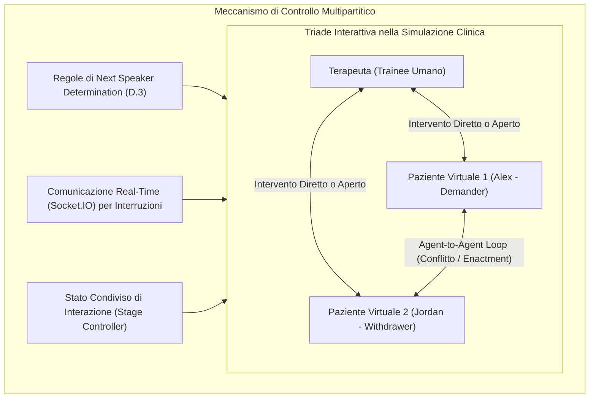

# Simulazione di Interazioni Multipartitiche con LLM

## Definizione Operativa
- Paradigma di progettazione per agenti conversazionali basati su modelli linguistici (LLM) finalizzato alla modellizzazione di dinamiche interattive a più partecipanti ($\ge 3$ attori), superando il tradizionale setting diadico (1-a-1 utente-sistema).
- **Sfide Computazionali e Relazionali:**
  1. **Determinazione Dinamica del Turno (*Turn-Taking & Next Speaker Selection*):** In un dialogo triadico (ad es. un terapeuta e due partner in conflitto), non esiste una sequenza rigida alternata. Il sistema deve determinare dinamicamente chi parla dopo ogni turno in funzione dell'interlocutore designato, del contenuto dell'enunciato e dello stadio relazionale attivo.
  2. **Interdipendenza e Co-evoluzione degli Stati:** Le risposte di ciascun agente non dipendono unicamente dall'input dell'utente principale (il terapeuta), ma anche dalle provocazioni, difese e segnali emotivi espressi dagli altri agenti virtuali presenti nel setting.
  3. **Possibilità di Interruzione Real-Time:** Capacità dell'utente umano di intervenire e interrompere una conversazione diretta in corso tra due agenti (scambio *agent-to-agent*) per riprendere la conduzione dell'interazione.

---

## Evidenze dalla Letteratura

### 1. Risoluzione della Deriva di Ruolo (*Role Consistency*)
Negli scambi prolungati tra più agenti, i sistemi basati esclusivamente su system prompt monolitici tendono a perdere il registro, ad allinearsi eccessivamente all'interlocutore (*sycophantic drift*) o a frammentare la coerenza della narrazione (Ganesh et al., 2023; Luz de Araujo et al., 2026). L'adozione di un'architettura a stati espliciti con tracciamento condiviso dell'interazione garantisce una consistenza di ruolo nettamente superiore (**70.7%** vs **4.9%** per Role Fidelity; Wang et al., 2026).

### 2. Algoritmo di Determinazione del Prossimo Speaker
Per governare il turn-taking senza generare cacofonie o risposte simultanee incoerenti, il framework multi-agente implementa un algoritmo decisionale prioritario a 8 regole:
1. Se il terapeuta invia un messaggio non ignorabile $\rightarrow$ il turno spetta al/ai paziente/i interpellato/i.
2. Se il terapeuta nomina esplicitamente un paziente per nome (es. *"Alex, cosa provi?"*) $\rightarrow$ risponde quel paziente.
3. Se l'intervento del terapeuta non specifica un destinatario $\rightarrow$ la risposta è aperta ad entrambi (*both*).
4. Se Alex pronuncia un'accusa o menziona le azioni di Jordan con *"you"* $\rightarrow$ il turno passa a Jordan.
5. Se Jordan risponde direttamente ad Alex con *"you"* $\rightarrow$ il turno passa ad Alex.
6. Se Alex parla esplicitamente a Jordan $\rightarrow$ risponde Jordan.
7. Se Jordan parla esplicitamente ad Alex $\rightarrow$ risponde Alex.
8. Se un agente parla senza rivolgersi all'altro $\rightarrow$ la parola torna al terapeuta.

### 3. Loop Agent-to-Agent e Interrompibilità
Nelle fasi di scontro (*Problem Raising* ed *Escalation*), il rilevamento di formule accusatorie innesca scambi autonomi tra i due agenti (3 turni in Problem Raising, 5 turni in Escalation). L'integrazione di un'infrastruttura client-server asincrona (React + Flask + Socket.IO) permette al terapeuta di intervenire in qualsiasi momento per spezzare il loop, simulando l'atto clinico di contenimento e interruzione dei pattern conflittuali disfunzionali.

### 4. Generalizzabilità ad Altri Domini Complessi
L'architettura per interazioni multipartitiche triadiche costituisce una base metodologica esportabile a tutti i contesti in cui un operatore deve gestire dinamiche relazionali tra più controparti:
- **Mediazione e Negoziazione:** Gestione di tavoli negoziali multilaterali con interessi contrapposti.
- **Interrogatori Forensi e Colloqui Giudiziari:** Interazione con più testimoni o co-imputati.
- **Crisis Communication e Leadership:** Coordinamento di team sotto stress emotivo e decisioni in situazioni di emergenza.

---

**Riferimenti Bibliografici:**
- Wang, C., Chen, A., Bao, C., Jin, S., Swartz, H., Wu, T., Kraut, R. E., & Zhu, H. (2026). Simulating Couple Conflict: Designing A Multi-Agent System for Therapy Training and Practice. *arXiv preprint arXiv:2601.10970v2 [cs.CY]*, 1–21. https://doi.org/10.48550/arXiv.2601.10970
- Ganesh, A., Palmer, M., & Kann, K. (2023). A survey of challenges and methods in the computational modeling of multi-party dialog. In *Proceedings of the 5th Workshop on NLP for Conversational AI (NLP4ConvAI 2023)*, pp. 140–154.
- Luz de Araujo, P. H., Hedderich, M. A., Modarressi, A., Schuetze, H., & Roth, B. (2026). Persistent personas? Role-playing, instruction following, and safety in extended interactions. In *Proceedings of EACL 2026*, pp. 5329–5359.

## Relazioni
- Vedi anche: [[2601.10970v2]], [[demand-withdraw-multi-agent-dynamics]], [[simulazione-pazienti-ai]], [[clinical-ai-simulation]], [[trainer-simulator]], [[clinical-fidelity-assessment]], [[reverse-training-simulazione]], [[modello-centauro-clinico]]
