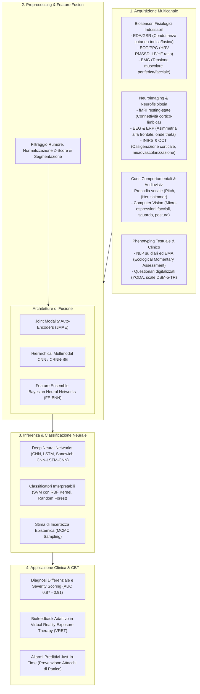
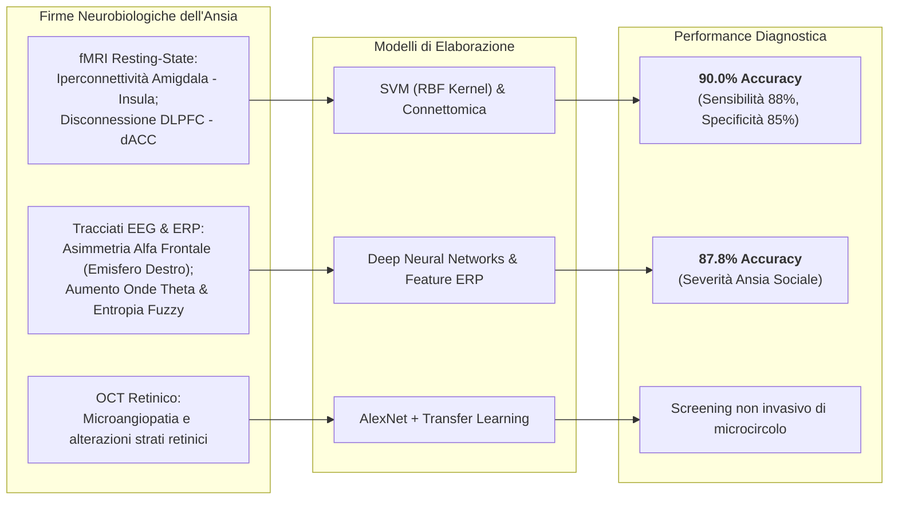
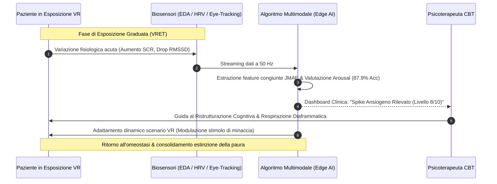

# Multimodal AI for Anxiety Disorders Recognition (Riconoscimento Multimodale dell'Ansia tramite Intelligenza Artificiale)

## Definizione Operativa
- Il paradigma di **Multimodal AI for Anxiety Recognition** (riconoscimento multimodale dell'ansia basato su intelligenza artificiale) definisce l'integrazione computazionale e bioingegneristica di flussi di dati eterogenei provenienti da molteplici canali sensoriali, fisiologici, comportamentali e clinici per l'identificazione precoce, la quantificazione oggettiva e la predizione dei disturbi d'ansia e degli stati di iperarousal autonomico (Degante-Aguilar et al., 2025; *Frontiers in Digital Health*, doi: 10.3389/fdgth.2025.1646724).
- **Utilità Clinica e CBT:** Supera i limiti strutturali degli strumenti di screening tradizionali basati su questionari autosomministrati (Beck Anxiety Inventory - BAI, STAI, GAD-7) e interviste cliniche retrospettive — intrinsecamente soggetti a bias di desiderabilità sociale, distorsioni di memoria e oscillazioni soggettive del paziente. L'integrazione di segnali elettrofisiologici continui (attività elettrodermica EDA/GSR, elettrocardiogramma ECG, elettromiografia EMG), connettomica cerebrale (fMRI resting-state, EEG, ERP), analisi audiovisiva e digital phenotyping consente di:
  1. *Rilevare marker biologici oggettivi* dell'iperattività simpatica prima della consapevolezza soggettiva dell'attacco d'ansia;
  2. *Supportare la diagnostica differenziale* tra Disturbo d'Ansia Generalizzata (GAD), Disturbo di Panico, Fobia Sociale (SAD), Ansia da Separazione e Disturbo Ossessivo-Compulsivo (OCD);
  3. *Guidare la psicoterapia cognitivo-comportamentale (CBT)* mediante biofeedback in tempo reale durante i protocolli di esposizione graduale in Realtà Virtuale (VRET) e interventi adattivi just-in-time (*JITAI*).

---

## Evidenze dalla Letteratura e Architetture di Sistema

### 1. Dinamiche Fisiologiche e Biosensing dell'Ansia
- **Attività Elettrodermica (EDA/GSR):** L'ansia acuta e cronica induce una stimolazione diretta delle ghiandole sudoripare eccrine da parte del sistema nervoso simpatico. Gli algoritmi di machine learning decompongono l'EDA in *Skin Conductance Level (SCL)* (componente tonica legata allo stato basale di allerta) e *Skin Conductance Responses (SCR)* (picchi fasici in risposta a stimoli ansiogeni).
- **Variabilità della Frequenza Cardiaca (HRV):** La modulazione vagale cardiaca viene analizzata nel dominio del tempo (SDNN, RMSSD, pNN50) e della frequenza (High Frequency HF: 0.15–0.4 Hz, indicatore dell'attività parasimpatica; Low Frequency LF: 0.04–0.15 Hz; e rapporto LF/HF, indicatore del bilancio simpato-vagale). Una soppressione persistente di HF-HRV riflette un deficit nei circuiti prefrontali inibitori dell'ansia.
- **Fusione Elettrofisiologica Tri-Modale (ECG + EDA + EMG):** Negli esperimenti di stress e ansia in ambienti immersivi VR condotti da Orozco-Mora et al. (2022), l'integrazione combinata di segnali ECG, EDA ed EMG ha permesso a modelli di machine learning di raggiungere un'accuratezza diagnostica del **99.0%** nel distinguere gli stati di ansia/stress indotto da scenari virtuali complessi rispetto alla condizione di riposo basale (a fronte dell'83.1% ottenuto con soli due segnali).
- **Autoencoder Multimodali a Fusione Congiunta (JMAE):** Radhika et al. (2022) hanno dimostrato che l'impiego di un *Joint Modality Auto-Encoder (JMAE)* per l'apprendimento non supervisionato di rappresentazioni congiunte frequenza-tempo (da ECG ed EDA), seguito da un classificatore *Convolutional Recurrent Neural Network con Squeeze-and-Excitation (CRNN-SE)*, massimizza la discriminazione tra stati di iperattivazione ansiosa e calma su molteplici dataset di riferimento (ASCERTAIN, CLAS, MAUS, WAUC).

---

### 2. Neuroimaging Funzionale, Connettività Cerebrale ed Elettroencefalografia

- **fMRI Resting-State e Connettomica Funzionale:** La disfunzione dei circuiti top-down di regolazione emotiva (inclusi la corteccia prefrontale dorsolaterale DLPFC, la corteccia cingolata anteriore dACC e il complesso amigdala-ippocampo) costituisce il correlato neurale primario dei disturbi d'ansia e dell'OCD. L'applicazione di Support Vector Machines (SVM) e Deep Neural Networks su gradienti di connettoma funzionale a riposo consente di classificare soggetti patologici naïve al trattamento rispetto a controlli sani con un'accuratezza del **90.0%** (Bu et al., 2019; Yang et al., 2019; Deshpande et al., 2024).
- **EEG, Entropia Fuzzy e Potenziali Evocati (ERP):** Nei soggetti con Disturbo d'Ansia Sociale (SAD), i pattern di connettività effettiva cerebrale e le fluttuazioni spettrali nelle bande theta e beta riflettono processi di bias attenzionale verso stimoli di minaccia sociale. L'analisi della complessità non lineare tramite *fuzzy entropy* combinata con classificatori neurali ha raggiunto accuratezze comprese tra l'**85% e l'87.88%** nella determinazione del livello di severità del disturbo (Al-Ezzi et al., 2021, 2022; Tian et al., 2024).

---

### 3. Modelli Bayesiani e Valutazione Clinica Strutturata (FE-BNN)
- **Feature Ensemble Bayesian Neural Network (FE-BNN):** Nel contesto diagnostico clinico ed epidemiologico su larga scala, Xiong et al. (2021) hanno impiegato reti neurali bayesiane con campionamento *Markov Chain Monte Carlo (MCMC)* e selezione di feature tramite regolarizzazione Lasso per analizzare i pattern sintomatologici raccolti dallo strumento standardizzato online *YODA* (Youth Online Diagnostic Assessment):
  - *Social Anxiety Disorder (SAD):* **AUC = 0.9091**;
  - *Generalized Anxiety Disorder (GAD):* **AUC = 0.8769**;
  - *Separation Anxiety Disorder:* **AUC = 0.8683**.
- **Quantificazione dell'Incertezza:** A differenza delle reti neurali deterministiche convenzionali che producono predizioni *overconfident*, le reti bayesiane forniscono distribuzioni a posteriori sui pesi, permettendo al clinico di distinguere tra casi con alta confidenza diagnostica e casi al confine nosografico (*borderline cases*) che richiedono approfondimento psicodiagnostico umano.

---

## Integrazione nei Protocolli Clinici CBT e Biofeedback

1. **Virtual Reality Exposure Therapy (VRET) Bio-Guidata:** Nelle terapie di esposizione per fobie specifiche, agorafobia e disturbo da panico, l'IA multimodale adatta in tempo reale l'intensità e la complessità dello stimolo virtuale (es. altezza, folla, spazio chiuso) in base alla risposta autonomica del paziente, prevenendo sia l'abituazione precoce (stimolo troppo blando) sia la ritraumatizzazione (stimolo soverchiante).
2. **Interventi Adattivi Just-In-Time (JITAI):** Il monitoraggio passivo mediante smartwatch consente di identificare le traiettorie di salita dell'arousal nelle ore antecedenti un potenziale attacco di panico, inviando notifiche proattive per la pratica di tecniche di defusione cognitiva, grounding somatosensoriale o respirazione rallentata.
3. **Monitoraggio Oggettivo dell'Efficacia Terapeutica:** Fornisce una misura quantitativa del ripristino del controllo autonomico vagale nel corso delle settimane di psicoterapia, correlando la riduzione dei punteggi psicometrici con la normalizzazione della reattività fisiologica agli stressor standardizzati.

---

## Sfide Aperte e Limitazioni Metodologiche

1. **Artefatti di Movimento e Variabilità Ecologica:** La registrazione dei biosegnali in condizioni di vita quotidiana (*free-living conditions*) è suscettibile a rumore da movimento, sudorazione termica e posture fisiche, richiedendo algoritmi avanzati di de-noising e motion-compensation.
2. **Calibrazione Personalizzata vs Modelli di Popolazione:** I pattern fisiologici di base differiscono ampiamente tra individui in funzione di età, sesso, assunzione di farmaci (es. beta-bloccanti, SSRI/SNRI) e comorbidità cardiovascolari, imponendo l'adozione di tecniche di *few-shot transfer learning* e calibrazione soggettiva del baseline.
3. **Etica, Privacy e Riservatezza dei Dati Biometrici:** Il tracciamento fisiologico continuo genera dati biometrici sensibili ad alta risoluzione, la cui conservazione ed elaborazione deve garantire conformità al GDPR (UE) e agli standard di sicurezza SaMD (*Software as a Medical Device*).

---

## Riferimenti Bibliografici
- Degante-Aguilar, E., Melendez-Armenta, R. A., Luna-Chontal, G., & Fernandez-Dominguez, F. J. (2025). Artificial intelligence techniques applied to anxiety disorders recognition: a systematic review. *Frontiers in Digital Health*, 7, 1646724. https://doi.org/10.3389/fdgth.2025.1646724
- Al-Ezzi, A., Yahya, N., Kamel, N., Faye, I., Alsaih, K., & Gunaseli, E. (2021). Severity assessment of social anxiety disorder using deep learning models on brain effective connectivity. *IEEE Access*, 9, 86899–86913.
- Bu, X., Hu, X., Zhang, L., Li, B., Zhou, M., Lu, L., et al. (2019). Investigating the predictive value of different resting-state functional MRI parameters in obsessive-compulsive disorder. *Translational Psychiatry*, 9, 17.
- Deshpande, G., Masood, J., Huynh, N., Denney, T. S., & Dretsch, M. N. (2024). Interpretable deep learning for neuroimaging-based diagnostic classification. *IEEE Access*, 12, 55474–55490.
- Orozco-Mora, C. E., Oceguera-Cuevas, D., Fuentes-Aguilar, R. Q., & Hernandez-Melgarejo, G. (2022). Stress level estimation based on physiological signals for virtual reality applications. *IEEE Access*, 10, 68755–68767.
- Radhika, K., Subramanian, R., & Oruganti, V. R. M. (2022). Joint modality features in frequency domain for stress detection. *IEEE Access*, 10, 57201–57211.
- Tian, X., Zhu, L., Zhang, M., Wang, S., Lu, Y., Xu, X., et al. (2024). Social anxiety prediction based on ERP features: a deep learning approach. *Journal of Affective Disorders*, 367, 545–553.
- Xiong, H., Berkovsky, S., Romano, M., Sharan, R. V., Liu, S., Coiera, E., et al. (2021). Prediction of anxiety disorders using a feature ensemble based bayesian neural network. *Journal of Biomedical Informatics*, 123, 103921.

---

## Relazioni
- [[fdgth-07-1646724]]
- [[social-media-phenotyping-anxiety]]
- [[wearable-sensor-fusion-adherence]]
- [[video-observed-therapy-ai]]
- [[clinical-readiness-gap-in-mh-chatbots]]
- [[modello-centauro-clinico]]
- [[software-as-a-medical-device-salute-mentale]]
- [[multi-omics-ai-psychiatry]]
- [[pretraining-simulated-data-clinical-ml]]
