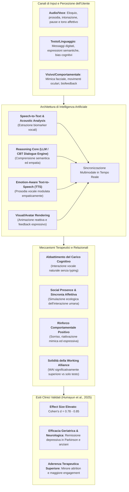
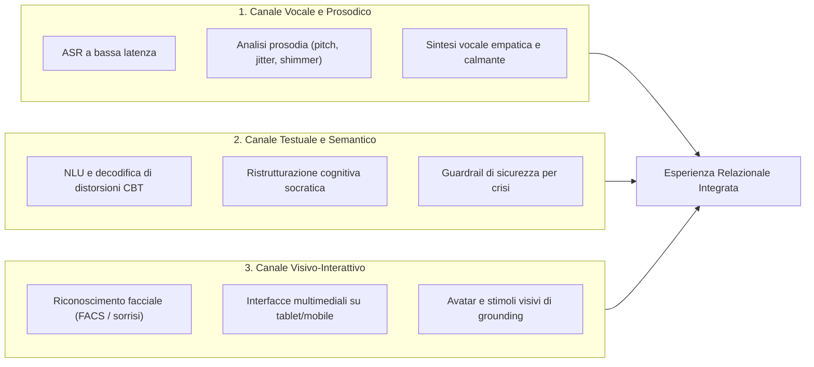
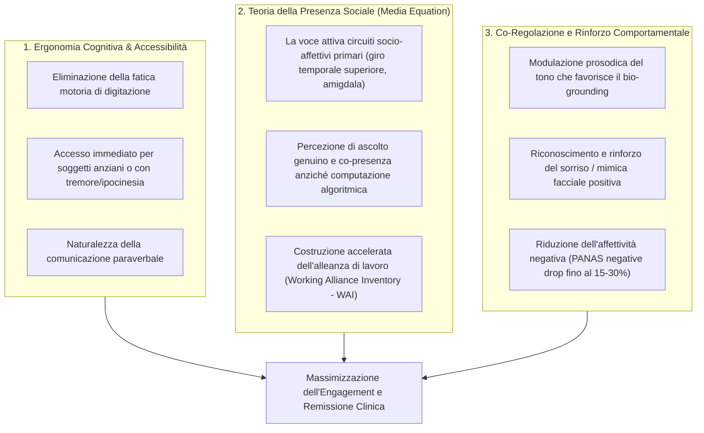
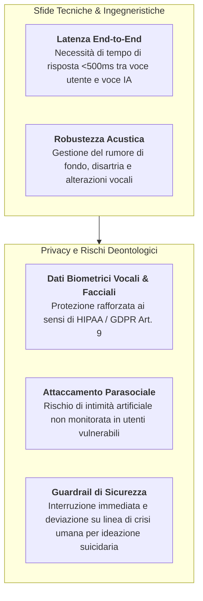

---
tags: [multimodal-ai, conversational-agents, voice-interfaces, speech-processing, nonverbal-cues, digital-mental-health, therapeutic-alliance, accessibility, parkinsons-disease, older-adults, humayun-2025]
source_papers: ["pone.0332207.pdf"]
---

# Multimodal Conversational Agents in Mental Health (Agenti Conversazionali Multimodali nella Salute Mentale)

## Definizione Operativa
- Il concetto di **Multimodal Conversational Agents in Mental Health** definisce la classe di agenti interattivi basati su intelligenza artificiale che integrano e sincronizzano simultaneamente molteplici canali comunicativi e percettivi:
  1. **Testo in linguaggio naturale:** Modelli di Natural Language Processing ([[large-language-models|LLM]]) per la decodifica semantica e la ristrutturazione cognitiva;
  2. **Voce e prosodia:** Moduli di *Automatic Speech Recognition* (ASR) e *Text-to-Speech* (TTS) sensibili all'intonazione affettiva, al ritmo e ai biomarker vocali;
  3. **Segnali visivo-espressivi e interfacce multimediali:** Rilevamento della mimica facciale (sorrisi, micro-espressioni), biofeedback e supporti grafici interattivi (Humayun et al., 2025; *PLoS ONE*, doi: [10.1371/journal.pone.0332207](https://doi.org/10.1371/journal.pone.0332207)).
- **Evidenze Meta-Analitiche di Superiorità:** Nella sintesi quantitativa condotta da Humayun et al. (2025), gli agenti conversazionali multimodali hanno conseguito dimensioni dell'effetto sistematicamente superiori (**Cohen's $d = 0.78 - 0.85$**, es. Liu et al., 2022; Drouin et al., 2022) rispetto ai chatbot puramente testuali ($d = 0.62 - 0.70$, es. Prochaska et al., 2021; Klos et al., 2021; Romanovskyi et al., 2021).
- **Accessibilità e Popolazioni Speciali:** L'interazione vocale e visiva abbatte il carico cognitivo e motorio della digitazione su tastiera, rivelandosi decisiva per gli **anziani (*older adults*)** e per pazienti con disturbi neurologici del movimento (es. malattia di Parkinson con depressione comorbida, Ogawa et al., 2022).

---

## I Tre Canali di Integrazione Multimodale

### 1. Il Canale Vocale e Prosodico (*Voice & Acoustic Processing*)
- **Ascolto e Riconoscimento:** Moduli di *Automatic Speech Recognition* (ASR) combinati con l'analisi dei pattern acustici (prosodia, velocità dell'eloquio, esitazioni, frequenza fondamentale). Nei disturbi dell'umore e nelle condizioni neurodegenerative, la voce riflette direttamente il livello di anedonia, rallentamento psicomotorio o disregolazione autonomica ([[vocal-biomarkers-in-depression|Vocal Biomarkers in Depression]]).
- **Sintesi Vocale Calibrata:** L'output vocale sintetizzato modula tono, volume e ritmo per trasmettere calore, comprensione e contenimento affettivo, simulando l'intonazione rassicurante della voce terapeutica umana.

### 2. Il Canale Testuale e Semantico (*Semantic & CBT Reasoning*)
- **Elaborazione del Linguaggio Naturale:** Il motore di comprensione testuale (LLM specializzato o albero decisionale esperto) analizza i contenuti esternalizzati dal paziente, estrae le credenze disfunzionali (es. catastrofizzazione, pensiero dicotomico) e struttura la risposta secondo protocolli empiricamente validati di terapia cognitivo-comportamentale ([[ai-enhanced-cbt|AI-Enhanced CBT]]).

### 3. Il Canale Visivo-Interattivo e Comportamentale (*Visual & Multimedia Feedback*)
- **Rilevamento delle Espressioni e Biofeedback:** Telecamere e sensori ottici rilevano micro-espressioni e reazioni emotive immediate. Nello studio di Ogawa et al. (2022), il chatbot interattivo su tablet ha analizzato e stimolato attivamente la mimica del sorriso (*facial expressivity*) e la cadenza verbale in pazienti con malattia di Parkinson.
- **Supporto Grafico e Multimedialità:** Integrazione dinamica di diagrammi interattivi, audio-esercizi di respirazione diaframmatica e schede visive all'interno dell'interfaccia di conversazione (es. XiaoNan su WeChat; Liu et al., 2022).

---

## Meccanismi Psicologici e Neurocognitivi del Vantaggio Multimodale

1. **Teoria della Presenza Sociale e 'Media Equation':** Secondo la teoria di Reeves & Nass, gli esseri umani rispondono agli stimoli vocali e visivi interattivi applicando istintivamente euristiche sociali evolute. L'agente multimodale non viene percepito come un mero software di testo, bensì come una figura interlocutoria viva, potenziando l'apertura emotiva e la sincerità del paziente.
2. **Abbattimento dell'Attrito Operativo:** Nei pazienti geriatrici o con deficit motori (es. ipocinesia e tremore nel Parkinson), la necessità di digitare lunghi messaggi su schermi touch screen costituisce un fattore primario di abbandono precoce (*early dropout*). L'interazione vocale tablet-based ripristina la fruibilità spontanea dell'intervento.
3. **Rinforzo Comportamentale Positivo:** La combinazione di voce ed espressione visiva stimola la riattivazione della mimica facciale e della reattività affettiva, contrastando l'appiattimento emotivo (*blunted affect*) tipico della depressione maggiore e dei quadri parkinsoniani.

---

## Tabella Comparativa: Agenti Unimodali (Solo Testo) vs Multimodali

| Dimensione di Analisi | Agenti Conversazionali Solo Testo (es. Woebot classico, Tess, Elomia) | Agenti Conversazionali Multimodali (es. XiaoNan, Replika, AI Tablet PD) |
| :--- | :--- | :--- |
| **Canali di Input/Output** | Esclusivamente messaggi di testo digitati/letti su smartphone | Testo, voce sintetica/riconosciuta, immagini, mimica facciale e interfacce multimediali |
| **Carico Cognitivo Richiesto** | Medio-alto (lettura, decodifica visiva continua, digitazione manuale) | Basso-minimo (interazione vocale fluida e ascolto naturale) |
| **Risonanza Emotiva e Tono** | Desunta unicamente da punteggiatura, emoji e formulazione verbale | Veicolata da intonazione prosodica, cadenza vocale e segnali audiovisivi |
| **Alleanza Terapeutica (WAI)** | Moderata ($d \approx 0.62 - 0.70$) | Elevata ($d \approx 0.78 - 0.85$, $p < 0.05$ vs controlli) |
| **Idoneità Geriatrica / Neurologica** | Scarsa o problematica (ostacoli visivi, motori e digitali) | Ottimale (accesso hands-free, elevata accettabilità e aderenza) |
| **Requisiti Computazionali & Rete** | Bassi (trasmissione di payload JSON testuali leggeri) | Elevati (elaborazione audio/video in real-time, streaming a bassa latenza) |
| **Superficie di Rischio Privacy (PHI)** | Limitata al testo dei log di chat | Estesa a dati biometrici unici (impronte vocali, video/immagini facciali) |

---

## Sfide Tecniche, Sicurezza e Governance dei Dati

1. **Gestione della Latenza Conversazionale (*Turn-Taking*):** Nell'interazione vocale terapeutica, pause superiori a 800–1000 ms spezzano il senso di sintonia empatica. L'integrazione di pipeline *Speech-to-Speech* ultra-rapide e modelli di decodifica on-device è fondamentale per mantenere la fluidità relazionale.
2. **Trattamento dei Dati Biometrici Vocali e Facciali:** La voce e il volto costituiscono identificatori biometrici diretti ai sensi del GDPR. I sistemi devono garantire la crittografia end-to-end, l'elaborazione locale o l'anonimizzazione dei flussi prima del passaggio a server cloud.
3. **Prevenzione dell'Intimità Artificiale (*Artificial Intimacy*):** La ricchezza relazionale degli agenti multimodali (specie in app di compagnia sociale come Replika, Drouin et al., 2022) richiede un design rigoroso che espliciti costantemente la natura algoritmica del sistema, evitando dipendenze affettive patologiche o l'allontanamento dalle relazioni umane reali ([[artificial-intimacy|Artificial Intimacy]]).

---

## Pagine Correlate
- [[pone.0332207|PLoS ONE Meta-Analysis (Humayun et al., 2025)]]: Sintesi meta-analitica su 6 RCT e gradienti di effect size.
- [[conversational-ai-vs-bibliotherapy|Conversational AI vs Bibliotherapy]]: Dinamiche dell'alleanza di lavoro e reciprocità dialogica rispetto a testi statici.
- [[digital-therapeutic-alliance|Digital Therapeutic Alliance]]: Metriche e costrutti per misurare l'alleanza uomo-IA.
- [[vocal-biomarkers-in-depression|Vocal Biomarkers in Depression]]: Analisi acustica e prosodica come marker clinico predittivo.
- [[multimodal-observable-cues-in-psychiatry|Multimodal Observable Cues in Psychiatry]]: Integrazione di segnali visivi, vocali e psicometrici in psichiatria.
- [[artificial-intimacy|Artificial Intimacy]]: Rischi relazionali e attaccamento affettivo nei sistemi di IA sociale.
