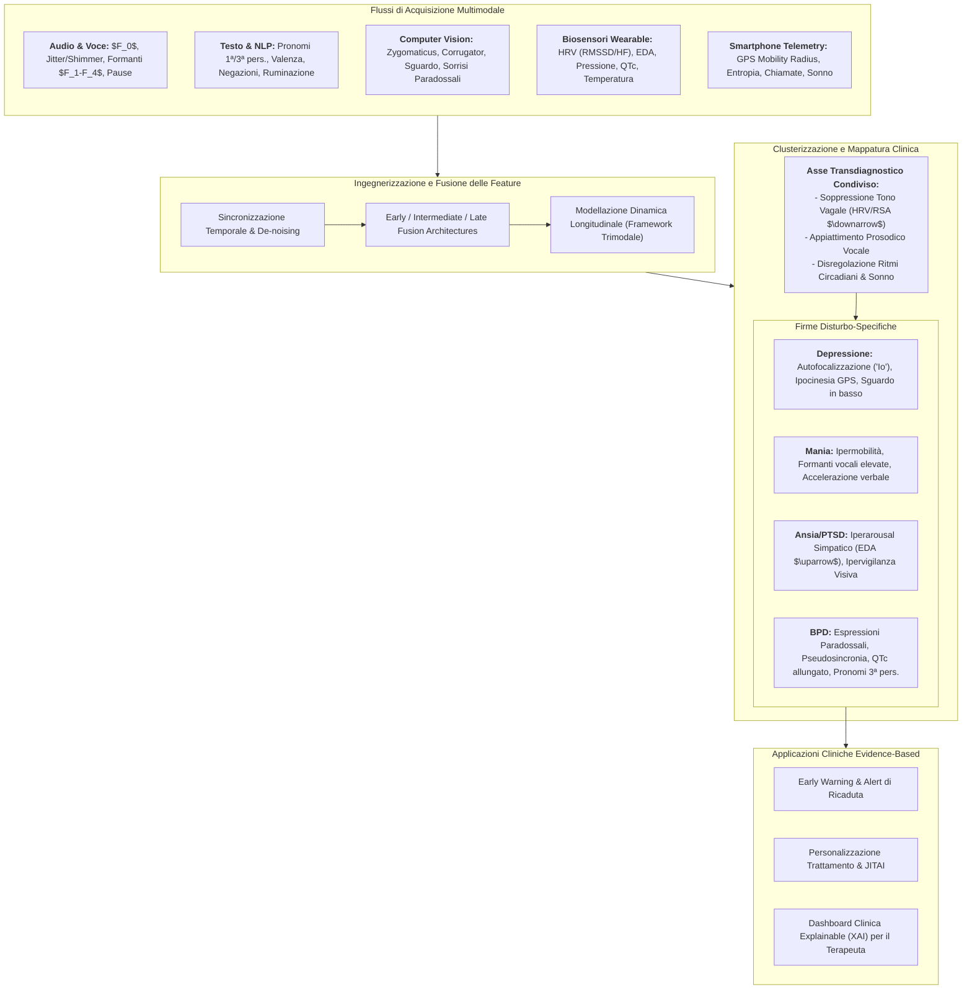
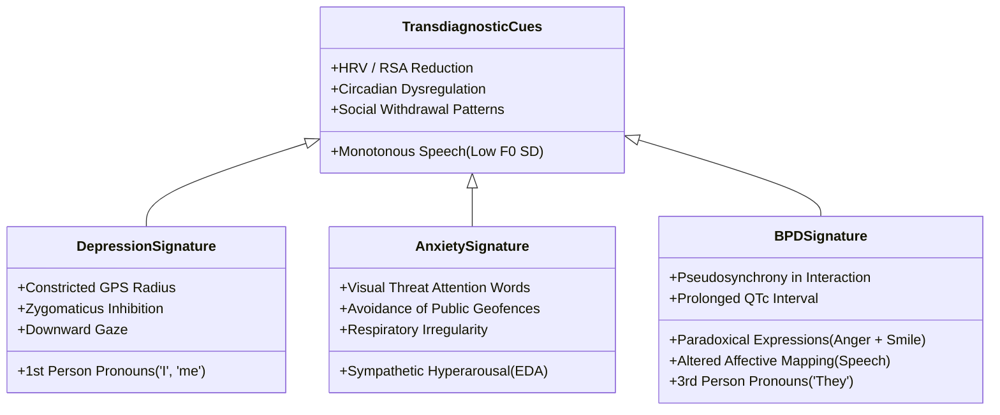

# Multimodal Observable Cues and Digital Phenotyping in Psychiatry (Indicatori Osservabili Multimodali e Fenotipizzazione Digitale in Psichiatria)

## Definizione Operativa
- Il paradigma dei **Multimodal Observable Cues** (indicatori osservabili multimodali) e del **Digital Phenotyping** in salute mentale definisce la quantificazione computazionale, continua e non invasiva del comportamento umano, delle dinamiche affettive e dell'attività fisiologica attraverso flussi di dati generati spontaneamente dall'individuo nel suo ambiente ecologico naturale (Močnik et al., 2025; *Frontiers in Artificial Intelligence*, doi: [10.3389/frai.2025.1696448](https://doi.org/10.3389/frai.2025.1696448); Oudin et al., 2023; Wang et al., 2025).
- **Integrazione Sensoriale e Trascendenza dei Metodi Tradizionali:** Supera la natura soggettiva, episodica e retrospettiva della psicodiagnosi classica (interviste semistrutturate e questionari autosomministrati come PHQ-9 o GAD-7) mediante la fusione di sei canali informativi oggettivi:
  1. *Linguaggio naturale ed espressione testuale* (analisi lessicale, sintattica e pragmatica tramite NLP);
  2. *Segnali vocali e paralinguistici* (acustica, prosodia, frequenza fondamentale $F_0$, formanti, jitter, shimmer, latenze di risposta e pause);
  3. *Espressioni facciali e dinamiche oculari* (computer vision, Action Units del FACS, attivazione dei muscoli zigomatico e corrugatore, ammiccamento e fissazione visiva);
  4. *Segnali motori e postura corporea* (fidgeting, gesti adattatori, ampiezza e lentezza dei movimenti corporei);
  5. *Fisiologia autonomica periferica* (variabilità della frequenza cardiaca HRV, aritmia sinusale respiratoria RSA, conduttanza cutanea EDA/SCL, pressione arteriosa e intervallo QTc);
  6. *Telemetria digitale passiva (*[[wearable-sensor-fusion-adherence|Passive Sensing]]*)* (raggio di mobilità GPS, entropia dei luoghi visitati, log delle chiamate/messaggi, utilizzo delle app e ritmo circadiano sonno-veglia).
- **Fondamento per l'[[explainable-mental-health-diagnosis|Explainable AI (XAI)]]:** A differenza delle architetture deep learning puramente "black-box", l'ancoraggio a feature clinico-comportamentali osservabili garantisce trasparenza epistemica, consentendo al clinico di comprendere quali parametri specifici guidino la stima del rischio diagnostico o prognostico.

---

## Tassonomia dei Canali Sensoriali e Indicatori Computazionali

### 1. Dominio Linguistico e Natural Language Processing (NLP)
- **Focalizzazione dell'Attenzione:** L'uso dei pronomi funge da marcatore cardine dello stato psicologico:
  - *Autofocalizzazione Internalizzante (Depressione):* Sovra-rappresentazione di pronomi di prima persona singolare (*io, me, mio*), riflettente ruminazione egocentrata e ritiro sociale (Khoo et al., 2024; Zierer et al., 2024).
  - *Esternalizzazione Relazionale (Disturbo Borderline):* Prevalenza di pronomi di terza persona (*loro, gli altri*), associata a sentimenti di persecuzione, alienazione e attribuzione causale esterna (Močnik et al., 2024).
- **Valenza Semantica ed Emozionale:** Presenza di *negativity bias* (parole di tristezza, disperazione, morte nel disturbo depressivo; parole di minaccia e vigilanza visiva nei disturbi d'ansia; oscillazioni marcate tra lessico ostile e affiliativo nel BPD).
- **Complessità Sintattica e Struttura:** I quadri depressivi presentano impoverimento sintattico (riduzione delle subordinate avverbiali, frasi brevi) e massiccio ricorso a espressioni assolutistiche (*"sempre"*, *"mai"*).

### 2. Acustica Vocale e Paralinguistica
- **Frequenza Fondamentale ($F_0$) e Variazione Dinamica:**
  - Nella depressione e nel PTSD, la prosodia è marcatamente ipomodulata, con riduzione della deviazione standard di $F_0$ e della dinamica di intensità (*loudness*), generando il tipico "eloquio piatto/monotono" (Low et al., 2020).
  - Negli stati maniacali bipolari si osserva un incremento significativo di $F_0$, della velocità articolatoria e un innalzamento delle frequenze formanti ($F_1, F_2, F_4$) dovuto alla maggiore tensione del tratto vocale (Saccaro et al., 2021).
- **Dinamiche Temporali e Pause:** Allungamento della latenza di risposta verbale (*response latency*) e aumento della durata delle pause prima dell'inizio dell'eloquio (indice di rallentamento psicomotorio ed esitazione cognitiva).
- **Instabilità Glottica:** Incremento del *jitter* (micro-perturbazioni di frequenza ciclo-per-ciclo) e dello *shimmer* (micro-perturbazioni di ampiezza), indicatori di scarso controllo neuromuscolare laringeo sotto stress o depressione.

### 3. Computer Vision, FACS ed Espressioni Facciali
- **Attivazione Muscolare Differenziale:**
  - *Depressione:* Ipoattivazione del muscolo *zygomaticus major* (responsabile del sollevamento degli angoli della bocca durante il sorriso autentico) e iperattivazione tonica del muscolo *corrugator supercilii* (responsabile dell'aggrottamento delle sopracciglia associato a tristezza e sofferenza).
  - *Disturbo Borderline:* Fenomeno del **sorriso paradossale** (*paradoxical smiling*), caratterizzato dalla co-occorrenza di espressioni di rabbia, disgusto e disprezzo con sorrisi sociali di compiacenza (Močnik et al., 2024).
- **Oculometria e Direzione dello Sguardo:** Riduzione della frequenza dei movimenti saccadici, incremento delle fissazioni rigide e sistematica deviazione dello sguardo verso il basso (*downward gaze*), riflettente vergogna, ritiro ed evitamento sociale.

### 4. Fisiologia Autonomica e Biosensing Wearable
- **Variabilità della Frequenza Cardiaca (HRV):** Costituisce il principale marcatore transdiagnostico di disfunzione della regolazione emotiva.
  - La soppressione della componente ad alta frequenza (HF-HRV, 0.15–0.40 Hz) e dell'aritmia sinusale respiratoria (RSA) documenta il fallimento del "freno vagale" parasimpatico.
  - L'incremento del rapporto LF/HF segnala un'iperattivazione simpatica cronica o disadattiva.
- **Conduttanza Cutanea (EDA/SCL):** Livelli tonici elevati (SCL) e frequenti risposte fasiche (SCR) correlano con stati di iperarousal acuto nell'ansia, nel panico e nel PTSD.
- **Biomarcatori Elettrocardiografici Complessi:** Prolungamento dell'intervallo QTc corretto a riposo nei soggetti con grave disregolazione emotiva e BPD, indice di alterata ripolarizzazione miocardica indotta da stress neurovegetativo cronico (Močnik et al., 2024).

### 5. Telemetria Comportamentale Passiva da Smartphone
- **Mobilità Geospaziale (GPS):**
  - *Depressione:* Drastica riduzione del raggio di mobilità, calo dell'entropia spaziale (tempo trascorso in modo non uniforme in pochi luoghi abituali) e confinamento domiciliare (Rohani et al., 2018; Shin & Bae, 2023).
  - *Disturbo Bipolare (Mania):* Incremento del raggio di spostamento, frequenti transizioni tra celle telefoniche e viaggi disorganizzati (Bufano et al., 2023).
- **Pattern di Utilizzo dello Smartphone:**
  - Riduzione delle telefonate attive/ricevute e diminuzione dei contatti unici interagiti nella depressione.
  - Incremento degli sblocchi dello schermo notturni (*screen-unlock frequency*) con brevi sessioni frammentate, indicatore di insonnia e irrequietezza psicomotoria.

---

## Integrazione Transdiagnostica vs Firme Disturbo-Specifiche

---

## Architetture di Machine Learning e Sfide Computazionali

### 1. Il Framework Trimodale di Dinamica Emotiva (Wang et al., 2025)
Per superare i limiti delle valutazioni statiche, le architetture avanzate integrano:
- **Flusso 1 (Soggettivo):** *Ecological Momentary Assessment (EMA)* periodico per catturare il self-report contestualizzato.
- **Flusso 2 (Biologico):** Biosensori da polso per lo streaming continuo di dati fisiologici (HRV, EDA).
- **Flusso 3 (Comportamentale):** *Speech Emotion Recognition (SER)* applicato a campioni vocali registrati in momenti ecologici chiave.

### 2. Risoluzione del "Small-Data Problem" in Psichiatria Clinica
Poiché i dati clinici longitudinali per singolo paziente sono quantitativamente scarsi e ad alta dimensionalità, le metodologie raccomandate includono:
- **Few-Shot Learning e Transfer Learning:** Pre-addestramento su grandi dataset multimodali generali e fine-tuning con pochi campioni annotati del paziente (Koppe et al., 2021).
- **Science-Guided Machine Learning (SGML):** Incorporazione di vincoli fisiologici e modelli dinamici non lineari della psicopatologia all'interno delle funzioni di perdita neurali, prevenendo overfitting e correlazioni spurie.

---

## Implicazioni Cliniche, Etiche e Governance

1. **Sistemi di Allerta Precoce (*Early Warning Systems*):** Rilevazione passiva di deviazioni subcliniche dal baseline individuale (es. alterazione del ritmo sonno-veglia e calo delle interazioni vocali) prima che si manifesti un episodio depressivo maggiore o una crisi suicidaria.
2. **Just-In-Time Adaptive Interventions (JITAI):** Erogazione di micro-interventi psicologici (es. esercizi di respirazione, ristrutturazione cognitiva, defusione) nel momento esatto in cui i biosensori rilevano un picco di iperattivazione simpatica.
3. **Tutela della Privacy e Conformità Normativa:** L'acquisizione di biosegnali e dati comportamentali passivi impone la massima protezione crittografica, elaborazione *on-device* (Edge AI) e consenso informato granulare conforme al GDPR e alle normative sui dispositivi medici software (SaMD; Welzel et al., 2025).

---

## Riferimenti Bibliografici
- Močnik, G., Rehberger, A., Smogavc, Ž., Mlakar, I., Smrke, U., & Močnik, S. (2025). Multimodal observable cues in mood, anxiety, and borderline personality disorders: a review of reviews to inform explainable AI in mental health. *Frontiers in Artificial Intelligence*, 8:1696448. https://doi.org/10.3389/frai.2025.1696448
- Močnik, S., Smrke, U., Mlakar, I., Močnik, G., Gregorič Kumperščak, H., & Plohl, N. (2024). Beyond clinical observations: a scoping review of AI-detectable observable cues in borderline personality disorder. *Frontiers in Psychiatry*, 15:1345916. https://doi.org/10.3389/fpsyt.2024.1345916
- Oudin, A., Maatoug, R., Bourla, A., Ferreri, F., Bonnot, O., Millet, B., et al. (2023). Digital phenotyping: data-driven psychiatry to redefine mental health. *Journal of Medical Internet Research*, 25:e44502. https://doi.org/10.2196/44502
- Wang, P., Liu, A., & Sun, X. (2025). Integrating emotion dynamics in mental health: a trimodal framework combining ecological momentary assessment, physiological measurements, and speech emotion recognition. *Interdisciplinary Medicine*, 3:e20240095. https://doi.org/10.1002/INMD.20240095
- Koppe, G., Meyer-Lindenberg, A., & Durstewitz, D. (2021). Deep learning for small and big data in psychiatry. *Neuropsychopharmacology*, 46(1), 176–190. https://doi.org/10.1038/s41386-020-0767-z
- Low, D. M., Bentley, K. H., & Ghosh, S. S. (2020). Automated assessment of psychiatric disorders using speech: a systematic review. *Laryngoscope Investigative Otolaryngology*, 5(1), 96–116. https://doi.org/10.1002/lio2.354
- Rohani, D. A., Faurholt-Jepsen, M., Kessing, L. V., & Bardram, J. E. (2018). Correlations between objective behavioral features collected from mobile and wearable devices and depressive mood symptoms in patients with affective disorders: systematic review. *JMIR Mhealth Uhealth*, 6(8):e165. https://doi.org/10.2196/mhealth.9691
- Saccaro, L. F., Amatori, G., Cappelli, A., Mazziotti, R., Dell'Osso, L., & Rutigliano, G. (2021). Portable technologies for digital phenotyping of bipolar disorder: a systematic review. *Journal of Affective Disorders*, 295, 323–338. https://doi.org/10.1016/j.jad.2021.08.052

---

## Related pages
- [[frai-08-1696448]]: Rassegna di revisioni sistematiche su indicatori multimodali per XAI.
- [[bpd-multimodal-behavioral-markers]]: Indicatori comportamentali, fisiologici e relazionali specifici del BPD.
- [[multimodal-anxiety-detection-ai]]: Riconoscimento multimodale dell'ansia e biosensori.
- [[explainable-mental-health-diagnosis]]: Metodi di Explainable AI (XAI) applicati alla diagnosi psichiatrica.
- [[social-media-phenotyping-anxiety]]: Fenotipizzazione dell'ansia tramite analisi dei social media.
- [[wearable-sensor-fusion-adherence]]: Fusione di sensori indossabili e telemetria passiva.
- [[modello-centauro-clinico]]: Integrazione human-in-the-loop per la sintesi tra intuizione clinica e biomarcatori digitali.
