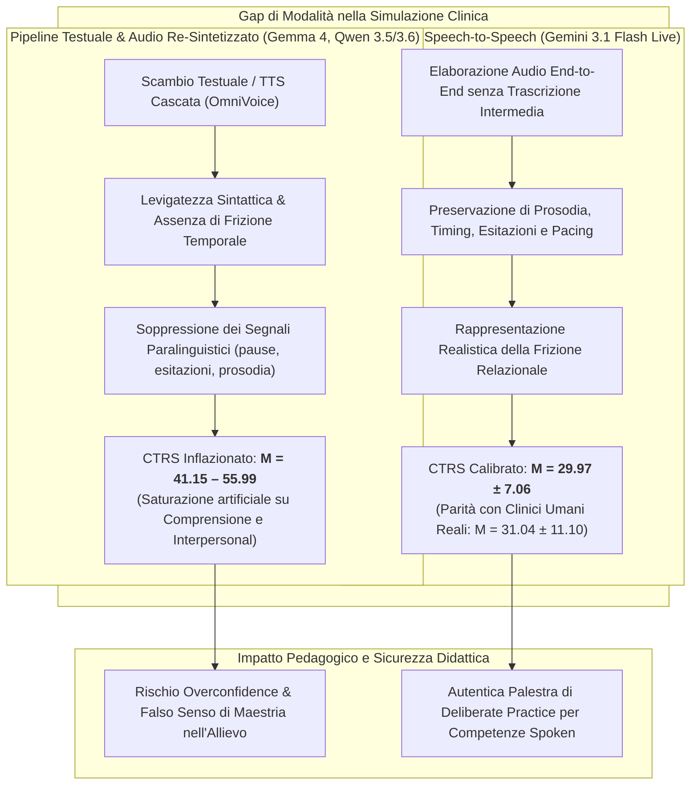

# Native Speech vs Text in Clinical Simulation (Audio Nativo vs Testo nella Simulazione Clinica)

## Definizione Operativa
- Il costrutto di **Native Speech vs Text in Clinical Simulation** descrive la discrepanza sistematica e clinicamente critica tra le prestazioni psicoterapeutiche intermediate da interfacce puramente testuali (o con sintesi vocale text-to-speech a cascata) e quelle intermediate da architetture **speech-to-speech native** (come Gemini 3.1 Flash Live Preview), formalizzato nello studio empirico su MyMentorLLM (Rizzi, Grecucci, Stella, 2026; arXiv:2607.25667v1).
- **Utilità Clinica e Formativa:** Dimostra che il testo scritto induce un'**illusione di competenza terapeutica (*illusion of therapeutic competence*)**, poiché la levigatezza lessicale e la coerenza sintattica dei modelli generativi mascherano le difficoltà di temporizzazione, gestione delle pause, tono, modulazione prosodica e risonanza affettiva. Al contrario, l'interazione audio nativa end-to-end preserva i segnali paralinguistici ed espone i reali limiti e le esitazioni dell'allievo terapeuta, allineando i punteggi della *Cognitive Therapy Rating Scale* (CTRS) alla reale distribuzione dei clinici umani in formazione ($M = 29.97$ per Gemini Live vs $M = 31.04$ per umani, entrambi sotto la soglia di competenza esperta CTRS $\ge 40$).

---

## Confronto Quantitativo tra Modalità

La tabella seguente riassume le differenze nelle valutazioni della Cognitive Therapy Rating Scale (CTRS, scala 0–66) rilevate su 2.100 sedute simulate e confrontate con il benchmark di 1.264 sedute reali condotte da 413 clinici (Goldberg et al., 2020; Rizzi et al., 2026):

| Parametro / Dimensione | Benchmark Umano (Goldberg et al.) | Audio Nativo (Gemini 3.1 Live) | Audio Sintetizzato (Gemma-4-12BA) | Testo Puro (Gemma-4-12BT) | Testo Puro (Qwen3.6-35BT) | Testo Puro (Gemma-4-E2BT) |
| :--- | :---: | :---: | :---: | :---: | :---: | :---: |
| **Punteggio Totale CTRS (SD)** | **31.04 (11.10)** | **29.97 (7.06)** | **48.15 (3.49)** | **50.66 (4.11)** | **41.15 (10.49)** | **55.99 (3.52)** |
| **Soglia CTRS $\ge 40$ (Competenza)** | Al di sotto (principianti) | **Al di sotto (principianti)** | Al di sopra (artificioso) | Al di sopra (artificioso) | Al di sopra (artificioso) | Al di sopra (artificioso) |
| **Comprensione (*Understanding*)** | 3.24 | 3.72 | 5.97 (quasi max) | 5.98 (quasi max) | 4.79 | 6.00 (saturato) |
| **Efficacia Interpersonale** | 3.96 | 3.75 | 5.90 (quasi max) | 5.94 (quasi max) | 4.50 | 6.00 (saturato) |
| **Cognizioni Chiave (*Key Cognitions*)**| 2.84 | 3.76 | 5.65 | 5.85 | 4.57 | 5.99 (saturato) |
| **Preservazione Paralinguistica** | Massima (voce reale) | **Elevata (audio nativo)** | Nulla (appiattito su testo) | Assente | Assente | Assente |
| **Validità per la *Deliberate Practice***| Riferimento gold standard | **Elevata (fedele all'umano)** | Scarsa (troppo ottimistica) | Scarsa (ingannevole) | Moderata | Scarsa (ingannevole) |

---

## Evidenze dalla Letteratura

### 1. Il Ruolo della Paralinguistica nella Comunicazione Clinica
- Negli scambi psicoterapeutici autentici, il contenuto verbale esplicito rappresenta solo una porzione del canale comunicativo. Segnali non verbali e paralinguistici — come il tempo di reazione prima di rispondere, le modulazioni di frequenza fondamentale ($F_0$), le pause intra-frase, i sospiri e le variazioni di volume — costituiscono indicatori critici di sofferenza emotiva, dissociazione o esitazione difensiva (Muntigl, 2016; Low, 2024; Tao et al., 2023).
- Nei sistemi tradizionali *Speech-to-Text $\rightarrow$ LLM $\rightarrow$ Text-to-Speech*, l'informazione acustica grezza viene immediatamente trascritta in una sequenza simbolica pulita, privando il modello di elaborazione dei marker vocali di distress e rimuovendo le difficoltà di coordinazione ritmica tra i due interlocutori.

### 2. Meccanismi dell'Illusione di Competenza nel Testo
- **Saturazione delle Metriche Relazionali:** Quando un LLM opera su testo puro, la sua capacità di formulare frasi empatiche, riflessioni complesse e ristrutturazioni concettualmente impeccabili porta i supervisori automatici (e persino i valutatori umani) ad attribuire punteggi massimi su scale come la CTRS (Goldberg et al., 2020; Rizzi et al., 2026).
- **Falsa Fluidità:** Nel setting testuale non esistono sovrapposizioni di voce, silenzi imbarazzanti, difficoltà nel trovare le parole o disallineamenti di ritmo. L'allievo virtuale appare artificialmente "esperto", vanificando l'obiettivo della *deliberate practice* (Rousmaniere, 2024), che richiede di allenare e correggere proprio gli errori tipici del novizio.
- **La Superiorità dell'Audio Nativo:** Solo con l'avvento dei modelli audio multimodali end-to-end (Gemini 3.1 Flash Live), in cui l'audio entra ed esce direttamente dallo spazio latente del modello senza intermediari testuali discreti, la simulazione riproduce la naturale ruvidezza, i ritardi di elaborazione e la variabilità prosodica dell'eloquio clinico umano.

### 3. Raccomandazioni per i Sistemi di Addestramento Basati su IA
1. **Priorità alle Architetture Native Audio:** I simulatori di pazienti e allievi per le scuole di psicoterapia devono prioritariamente integrare modelli speech-to-speech nativi, evitando di basare l'accreditamento formativo su sole interazioni via chat testuale.
2. **Scoring Multimodale Integrato:** La valutazione della competenza clinica deve combinare l'analisi del trascritto con l'estrazione di feature acustiche (durata dei turni, latenza di risposta, risonanza prosodica) per evitare la sovrastima della qualità della cura.
3. **Calibrazione Empirica del Baseline:** Le personas dei terapeuti in simulazione devono essere regolate su metriche reali di clinici in formazione (come il dataset Goldberg et al., 2020), per evitare che l'agente didattico diventi uno standard irraggiungibile o al contrario irrealisticamente perfetto.

---

## Riferimenti Bibliografici
- Rizzi, R., Grecucci, A., & Stella, M. (2026). MyMentorLLM: A psychotherapy GenAI environment with multimodal voice/text patients, trainees and experts for deliberate practice. *arXiv preprint arXiv:2607.25667v1 [cs.CL]*, 1–27.
- Goldberg, S. B., Rousmaniere, T., Miller, S. D., Whipple, J., Nielsen, S. L., Hoyt, W. T., & Wampold, B. E. (2020). The structure of competence: Evaluating the factor structure of the Cognitive Therapy Rating Scale. *Behavior Therapy*, 51(1), 113–122.
- Low, D. M. (2024). *Speech and text psychometrics: Identifying suicide risk factors with large language models and acoustic networks*. Harvard University.
- Muntigl, P. (2016). Storytelling, Depression, and Psychotherapy. In *Storytelling in Psychotherapy*, Palgrave Macmillan, London, 577–596.
- Rousmaniere, T. (2024). *Deliberate practice for psychotherapists: A guide to improving clinical effectiveness*. Routledge.
- Tao, F., Esposito, A., & Vinciarelli, A. (2023). The androids corpus: A new publicly available benchmark for speech based depression detection. *Depression*, 47, 11–19.

---

## Relazioni
- Vedi anche: [[2607.25667v1]], [[mymentorllm-framework]], [[over-deference-in-llm-supervision]], [[deliberate-practice-in-psicoterapia-ia]], [[supervisione-clinica-ai]], [[simulazione-pazienti-ai]], [[trainer-simulator]], [[ctrs-automated-evaluation]], [[modello-centauro-clinico]], [[large-language-models]]
