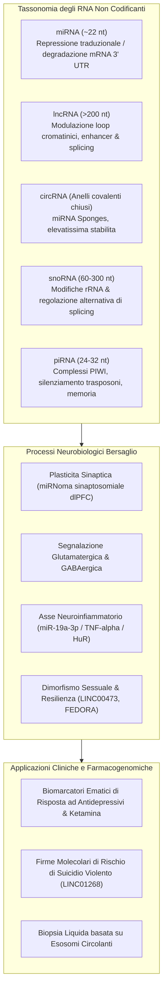

---
tags: [ncrna, mirna, lncrna, circrna, snorna, pirna, epigenetics, synaptic-plasticity, mdd, suicide, biomarkers, ketamine, precision-psychiatry]
source_papers: ["41398_2025_Article_3497.pdf"]
---

# Non-Coding RNA Biomarkers in Psychiatry (Biomarcatori di RNA Non Codificante nella Psichiatria)

## Definizione Operativa
- Gli **RNA non codificanti (ncRNA)** costituiscono oltre il 90% dell'output trascrizionale del genoma umano e rappresentano una classe eterogenea di regolatori master dell'espressione genica a livello epigenetico, trascrizionale e post-trascrizionale.
- **Utilità Clinica e Psichiatria di Precisione:** Nella neurobiologia del Disturbo Depressivo Maggiore (MDD) e del comportamento suicidario, le principali classi di ncRNA—inclusi **microRNA (miRNA)**, **long non-coding RNA (lncRNA)**, **circular RNA (circRNA)**, **small nucleolar RNA (snoRNA)** e **PIWI-interacting RNA (piRNA)**—svolgono ruoli causali e dinamici nella plasticità sinaptica, nella neurogenesi, nella risposta allo stress e nella neuroinfiammazione (Wang & Dwivedi, 2025). Essi consentono: (1) l'identificazione precoce del rischio suicidario violento, (2) la stratificazione diagnostica e fenotipica sesso-specifica, (3) la predizione della risposta a trattamenti farmacologici standard (SSRI) e a rapida azione (ketamina), e (4) lo sviluppo di biomarcatori stabili su biopsia liquida ematica ed esosomiale.

---

## Evidenze dalla Letteratura

### 1. microRNA (miRNA, ~22 nucleotidi)
- **Biogenesi e Meccanismo:** Trascrizione nucleare del pri-miRNA $\to$ taglio da DROSHA/DGCR8 in pre-miRNA $\to$ export citoplasmatico via Exportin 5 $\to$ processamento da parte di Dicer/TRBP $\to$ associazione a proteine Argonaute nel complesso silenziatore RISC per il legame alla regione 3' UTR degli mRNA bersaglio.
- **Rete Prefrontale nel Suicidio:** PCR array e sequencing hanno evidenziato una downregulation diffusa di miRNA nella corteccia prefrontale (PFC) di soggetti morti per suicidio, con una rete co-regolata di 29 miRNA che coordina processi di apoptosi, metilazione del DNA, splicing e crescita assonale (Smalheiser et al., 2012).
- **miRNoma Sinaptico (Synaptosomal miRNome):** L'isolamento di sinaptosomi purificati dalla dlPFC ha individuato 351 miRNA alterati, evidenziando una perturbazione selettiva della regolazione post-trascrizionale a livello sinaptico locale (Yoshino et al., 2021).
- **Marcatori Funzionali Specifici:**
  - `miR-124-3p`: Iperespresso nel cervello postmortem e nel sangue di pazienti con MDD, controlla la trasmissione glutamatergica (Roy et al., 2017).
  - `miR-19a-3p`: Nei soggetti suicidi perde l'interazione inibitoria con l'mRNA di TNF-α a causa della competizione con la proteina legante l'RNA HuR, innescando una sintesi infiammatoria continua (Wang et al., 2018).
  - `miR-1202`: Primate-specifico e arricchito nel cervello umano, regola il recettore metabotropico del glutammato `GRM4` e predice la risposta clinica agli antidepressivi (Lopez et al., 2014; Fiori et al., 2017).
  - `miR-135a`, `miR-16`, `miR-146a/b-5p`, `miR-425-3p`: Biomarcatori ematici dinamici di remissione clinica e regolatori dei circuiti MAPK e Wnt.

---

### 2. Long Non-Coding RNA (lncRNA, >200 nucleotidi)
Oltre il 40% dei lncRNA è espresso selettivamente nel cervello umano, fungendo da impalcatura (*scaffold*), guida o esca (*decoy*) molecolare:
- **LINC00473 (Dimorfismo Sessuale e Resilienza):** Specificamente downregolato nella PFC di donne con depressione; la sua sovraespressione protegge dallo stress cronico e favorisce la resilienza comportamentale femminile (Issler et al., 2020).
- **FEDORA:** Upregolato nella PFC e nel sangue di donne con MDD, arricchito in neuroni ed oligodendrociti; i suoi livelli ematici si riducono rapidamente in caso di risposta positiva alla **ketamina** (Issler et al., 2022).
- **LINC01268 (Suicidio Violento e Aggressività):** Iperespresso nella PFC di individui morti per suicidio con metodi violenti; l'allele di rischio correla con tratti di aggressività lifetime e ridotta reattività fMRI della PFC a volti arrabbiati (Punzi et al., 2019).

---

### 3. Circular RNA (circRNA)
- Molecole ad anello covalentemente chiuso generate da back-splicing esonico, prive di estremità 5' o 3' libere e quindi eccezionalmente resistenti alla degradazione esonucleasica.
- Agiscono come potenti spugne molecolari (*miRNA sponges*):
  - Biomarcatori ematici alterati nel MDD includono `hsa_circRNA_103636`, `circFKBP8`, `circMBNL1` e `circDYM` (Cui et al., 2016; Shi et al., 2021).

---

### 4. Small Nucleolar RNA (snoRNA) e PIWI-interacting RNA (piRNA)
- **snoRNA:** Oltre alla modificazione chimica dell'rRNA, regolano lo splicing alternativo. `SNORD90` è upregolato dagli antidepressivi monoaminergici, reprime il gene `NRG3` (neuregulina 3) e incrementa i livelli di glutammato (Lin et al., 2023). Nei sinaptosomi corticali di soggetti con patologie psichiatriche, `SNORD85` risulta ridotto del 50%.
- **piRNA:** Piccoli RNA (24–32 nt) Dicer-indipendenti associati a proteine PIWI; modelli murini knockout per `Miwi/Piwil1` e `Piwil2` esibiscono iperattività, comportamenti simil-ansiosi e deficit nel consolidamento della memoria di paura (Nandi et al., 2016; Sato et al., 2023).

---

## Riferimenti Bibliografici
- Wang, Q., & Dwivedi, Y. (2025). Recent developments in omics studies and artificial intelligence in depression and suicide. *Translational Psychiatry*, 15(1), 275. https://doi.org/10.1038/s41398-025-03497-y
- Issler, O., van der Zee, Y. Y., Ramakrishnan, A., Wang, J., Tan, C., Loh, Y. E., et al. (2020). Sex-specific role for the long non-coding RNA LINC00473 in depression. *Neuron*, 106(6), 912–926.
- Issler, O., van der Zee, Y. Y., Ramakrishnan, A., Xia, S., Zinsmaier, A. K., Tan, C., et al. (2022). The long noncoding RNA FEDORA is a cell type–and sex-specific regulator of depression. *Science Advances*, 8(2), eabn9494.
- Lopez, J. P., Lim, R., Cruceanu, C., Crapper, L., Fasano, C., Labonte, B., et al. (2014). miR-1202 is a primate-specific and brain-enriched microRNA involved in major depression and antidepressant treatment. *Nature Medicine*, 20(7), 764–768.
- Punzi, G., Ursini, G., Viscanti, G., Radulescu, E., Shin, J. H., Quarto, T., et al. (2019). Association of a noncoding RNA postmortem with suicide by violent means and in vivo with aggressive phenotypes. *Biological Psychiatry*, 85(5), 417–424.
- Smalheiser, N. R., Lugli, G., Rizavi, H. S., Torvik, V. I., Turecki, G., & Dwivedi, Y. (2012). MicroRNA expression is down-regulated and reorganized in prefrontal cortex of depressed suicide subjects. *PLoS ONE*, 7(3), e33201.
- Yoshino, Y., Roy, B., & Dwivedi, Y. (2021). Differential and unique patterns of synaptic miRNA expression in dorsolateral prefrontal cortex of depressed subjects. *Neuropsychopharmacology*, 46(5), 900–910.

---

## Relazioni
- Vedi anche: [[41398-2025-article-3497]], [[multi-omics-ai-psychiatry]], [[ai-assisted-psychotherapy]], [[treatment-outcome-and-relapse-prediction]], [[software-as-a-medical-device-salute-mentale]], [[11920-2026-article-1690]]
