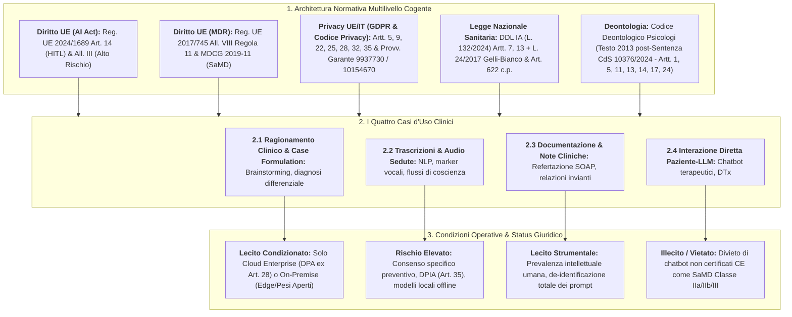
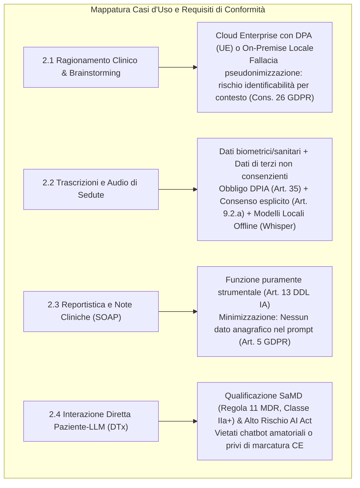
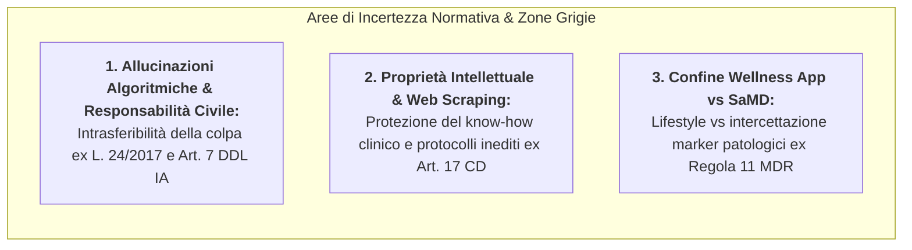
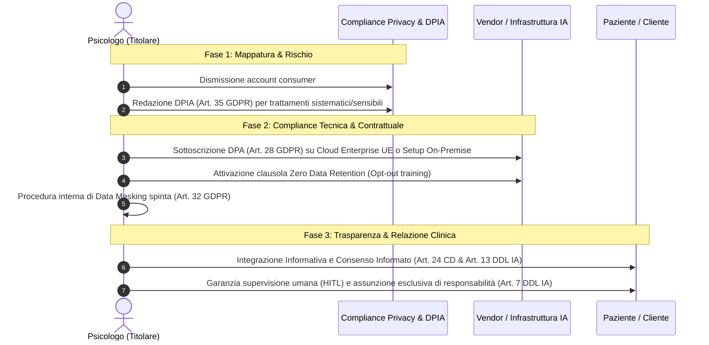

# Rapporto di Analisi Tecnico-Giuridica: Conformità Normativa e Deontologica nell'Impiego dei Large Language Models nella Pratica Psicologica e Psicoterapeutica in Italia

## Definizione Operativa
- Il documento fornisce la mappatura sistematica e multilivello delle fonti giuridiche, regolamentari e deontologiche (Diritto UE, Privacy GDPR/Nazionale, Legislazione Sanitaria Italiana e Codice Deontologico post-Sentenza CdS n. 10376/2024) che disciplinano l'integrazione dei [[large-language-models|Large Language Models (LLM)]] e dell'IA generativa nella psicologia clinica e psicoterapia in Italia.
- **Utilità CBT:** Guida il clinico cognitivo-comportamentale a strutturare workflow operativi conformi (brainstorming su casi complessi, trascrizione/analisi sedute, refertazione SOAP e protocolli digitali) evitando violazioni del segreto professionale, sanzioni privacy e profili di colpa professionale per allucinazioni algoritmiche o affidamento non supervisionato.

---

## 1. Quadro Giuridico e Deontologico di Riferimento

L'integrazione degli LLM e della GenAI nella salute mentale in Italia è governata da una stratificazione normativa vincolante a quattro livelli:

| Livello Normativo | Fonte Giuridica / Documento | Articoli e Principi Rilevanti | Valenza Giuridica |
| :--- | :--- | :--- | :--- |
| **1. Diritto UE** | **Regolamento (UE) 2024/1689 (AI Act)** | **Art. 14:** Sorveglianza umana (*Human-in-the-loop*); **Allegato III:** Sistemi ad alto rischio. Impone governance dei dati, documentazione tecnica e trasparenza per prevenire rischi per la salute e i diritti fondamentali. | Cogente (Regolamento UE) |
| **1. Diritto UE** | **Regolamento (UE) 2017/745 (MDR)** & **Linee Guida MDCG 2019-11** (rev. 2024/2025) | **Allegato VIII, Regola 11:** Classificazione Software as a Medical Device ([[software-as-a-medical-device-salute-mentale|SaMD]]). Software per decisioni diagnostiche/terapeutiche = **Classe IIa** (o **Classe IIb/III** in caso di pericolo di morte o grave deterioramento). | Cogente (MDR) e interpretativa (MDCG) |
| **2. Privacy UE/IT** | **Regolamento (UE) 2016/679 (GDPR)** | **Art. 5:** Principi di limitazione e minimizzazione; **Art. 9:** Trattamento dati particolari/sanitari (deroga par. 2 lett. h per finalità di cura con segreto); **Art. 22:** Divieto decisioni unicamente automatizzate; **Art. 25:** Privacy by design/default; **Art. 28:** DPA con vendor; **Art. 32:** Sicurezza; **Art. 35:** Valutazione d'Impatto (**DPIA**). | Cogente (Regolamento UE) |
| **2. Privacy UE/IT** | **D.Lgs. 196/2003** (agg. D.Lgs. 101/2018) & **Provvedimenti Garante Privacy** | **Art. 2-septies:** Misure di garanzia dati sanitari; **Provv. 9937730 (Ottobre 2023 - Decalogo IA):** Trasparenza, supervisione umana, non discriminazione algoritmica; **Provv. 10154670 (Luglio 2025 - Allarme Referti IA):** Divieto caricamento referti/dati clinici su piattaforme IA senza controllo e DPA. | Cogente (Legge nazionale e Delibere Autorità) |
| **3. Normativa IT** | **DDL Intelligenza Artificiale (Atto S. 1146-B / L. 132/2024-2025)** | **Art. 7:** L'IA in sanità è mero "supporto", decisione clinica riservata esclusivamente al professionista sanitario; **Art. 13:** Nelle professioni intellettuali l'uso è solo strumentale con prevalenza del lavoro umano e obbligo di informativa chiara al cliente; **Art. 9:** Fascicolo Sanitario Elettronico. | Cogente (Legge nazionale) |
| **3. Normativa IT** | **Codice Penale** e **Legge 24/2017 (Gelli-Bianco)** | **Art. 622 c.p.:** Rivelazione del segreto professionale; **Legge 24/2017:** Responsabilità professionale sanitaria per colpa (imperizia, negligenza) e inosservanza delle *leges artis*; intrasferibilità della responsabilità al software. | Cogente (Legge nazionale) |
| **4. Deontologia** | **Codice Deontologico degli Psicologi Italiani** (Testo 2013 ripristinato post-**Sentenza Consiglio di Stato n. 10376/2024**) | **Art. 1:** Responsabilità professionale personale; **Art. 5:** Competenza metodologica e uso esclusivo di strumenti scientificamente validati; **Art. 11:** Segreto professionale rigoroso; **Art. 13:** Deroghe al segreto; **Art. 14:** Riservatezza nei setting di gruppo; **Art. 17:** Stretta custodia di dati, appunti e registrazioni; **Art. 24:** Consenso informato preventivo ed esplicito. | Cogente (Sanzionabile in sede disciplinare dall'Ordine) |

### Lo Stato dell'Arte Deontologico: Il Ripristino del Codice 2013
La **Sentenza del Consiglio di Stato n. 10376 (pubblicata il 24 dicembre 2024)** ha annullato il referendum per la revisione del Codice Deontologico del 2023 a causa di un vizio procedurale (mancata sottoposizione al voto della "Premessa Etica"). Di conseguenza, il testo giuridicamente cogente per lo psicologo italiano è tornato a essere la **versione del 2013**. Nonostante non menzioni esplicitamente l'IA, i suoi articoli cardine (Artt. 5, 11, 17, 24) creano un presidio rigoroso: vietano la cessione del controllo algoritmico (*black-box*), sanciscono il divieto assoluto di data-leakage verso cloud non protetti e impongono l'obbligo di consenso preventivo.

---

## 2. Analisi Dettagliata per Casi d'Uso Clinici

### 2.1 Supporto al Ragionamento Clinico e Concettualizzazione del Caso
- **Prassi:** Brainstorming diagnostico, simulazione di supervisioni cliniche, generazione di schemi di concettualizzazione del caso o diagnosi differenziali evidence-based tramite prompt con quadri sintomatologici.
- **Profilo Privacy/GDPR:** I dati inseriti sono dati sulla salute (Art. 9 GDPR). La base di liceità è l'Art. 9, par. 2, lett. h (cura/diagnosi con segreto professionale). 
- **La Fallacia della De-identificazione del Prompt:** Rimuovere solo nome e cognome produce dati *pseudonimizzati*, non anonimizzati (Considerando 26 GDPR). La convergenza di dettagli biografici specifici (professione rara, eventi traumatici precisi, composizione familiare) genera un'impronta altamente identificabile per contesto. Il caricamento su cloud pubblici consumer senza DPA (Art. 28 GDPR) costituisce un trasferimento illecito di dati sanitari e violazione delle misure di sicurezza (Art. 32 GDPR), espressamente sanzionato dal Garante (Provv. 10154670).
- **Architetture Ammesse:**
  1. *Cloud Enterprise Conforme:* Ambienti dedicati con DPA formalizzato ex Art. 28 GDPR, server localizzati nell'UE e blocco contrattuale e tecnico dell'addestramento continuo dei modelli (*Zero Data Retention*).
  2. *On-Premise / Edge Computing:* Esecuzione di modelli a pesi aperti (es. Llama, Mistral) direttamente sull'hardware locale crittografato dello psicologo, azzerando qualsiasi trasferimento di rete.
- **Vincolo Clinico:** In conformità all'Art. 7 del DDL IA, l'output generato ha valore meramente consultivo e non vincolante; la titolarità della decisione resta in capo al professionista.

### 2.2 Analisi e Trattamento di Trascrizioni e Registrazioni di Sedute
- **Prassi:** Trascrizione automatizzata (speech-to-text) e analisi linguistica/sentiment delle sedute di psicoterapia individuale o di gruppo.
- **Profilo Privacy/GDPR:** Coinvolge simultaneamente dati sanitari e **dati biometrici** (impronta vocale). Richiede una base giuridica rafforzata: consenso informato, preventivo ed esplicito (Art. 9, par. 2, lett. a GDPR) e la redazione obbligatoria di una **DPIA preventiva** (Art. 35 GDPR).
- **Il Rischio dei Dati di Terzi:** Nei colloqui clinici emergono sistematicamente dati sensibili relativi a terzi non consenzienti (familiari, partner, colleghi). L'invio non filtrato di registrazioni integrali a cloud commerciali espone tali soggetti a violazioni sistemiche della riservatezza.
- **Impatto Deontologico:** L'Art. 17 (custodia) e l'Art. 14 (segreto nelle terapie di gruppo) precludono l'uso di interfacce cloud consumer. L'unica soluzione conforme consiste nell'uso di motori di trascrizione ed elaborazione **strettamente locali** (es. Whisper offline), con distruzione immediata dell'audio al termine della trascrizione e de-identificazione prima di qualsiasi analisi (Art. 25 GDPR - Privacy by Design).

### 2.3 Uso Indiretto e Amministrativo (Reportistica, Note SOAP, Relazioni)
- **Prassi:** Redazione di bozze di referti psicodiagnostici, sintesi di note di seduta (SOAP) o relazioni cliniche per invianti e servizi sociali.
- **Profilo Normativo (Art. 13 DDL IA):** L'IA è ammessa esclusivamente per attività strumentali e accessorie, garantendo la **"prevalenza del lavoro intellettuale"** dello psicologo. L'elaborato prodotto dalla macchina non possiede alcun valore legale o clinico finché non viene criticamente revisionato, validato e sottoscritto dal professionista.
- **Principio di Minimizzazione (Art. 5.1.c GDPR):** Il prompt non deve contenere dati anagrafici diretti (nome, cognome, data di nascita, CF). L'intestazione del referto con i dati identificativi deve avvenire esclusivamente a valle, all'interno del programma di videoscrittura locale del clinico.
- **Responsabilità (Art. 1 Codice Deontologico):** Lo psicologo risponde in via esclusiva di ogni inesattezza, discriminazione o errore clinico contenuto nel referto finale.

### 2.4 Interazione Diretta LLM-Paziente (Chatbot Terapeutici e DTx)
- **Prassi:** Applicazioni di IA conversazionale messe a diretto contatto con il paziente per modulazione dell'ansia, interventi di monitoraggio o protocolli terapeutici autonomi (Digital Therapeutics).
- **Profilo Regolatorio MDR (Regola 11) & AI Act:** Se l'applicativo fornisce informazioni per guidare decisioni terapeutiche o interviene attivamente su un disagio psichico, è qualificato ope legis come **Software as a Medical Device (SaMD)** e classificato in **Classe IIa, IIb o III**. La somministrazione ai pazienti di chatbot "fai-da-te" o GPT personalizzati amatoriali privi di certificazione e marcatura CE da parte di un Ente Notificato costituisce un illecito grave.
- **Divieto di Decisioni Automatizzate (Art. 22 GDPR):** Il paziente ha il diritto inalienabile di non subire decisioni sanitarie unicamente automatizzate. È obbligatoria la presenza del professionista nel loop decisionale (*Human-in-the-loop*) con potere di revoca in tempo reale.
- **Violazione Deontologica (Artt. 3 e 5):** L'erogazione di interventi tramite algoritmi non scientificamente validati o non certificati viola i doveri inderogabili di tutela della salute e divieto di suscitare aspettative infondate.

---

## 3. Matrice di Liceità Operativa

| Caso d'Uso Clinico | Status Giuridico | Riferimento Normativo / Deontologico | Condizioni Obbligatorie di Utilizzo |
| :--- | :--- | :--- | :--- |
| **Supporto al Ragionamento Clinico** (Brainstorming diagnostico e supervisione) | **Condizionato** *(Lecito con cautele)* | Art. 9 GDPR; Art. 7 DDL IA; Art. 11 Codice Deontologico; MDR Regola 11 | Divieto di dati identificativi diretti; impiego esclusivo di modelli on-premise locali o Cloud Enterprise con DPA (Art. 28 GDPR) e blocco training; titolarità della decisione interamente in capo al clinico. |
| **Analisi e Trascrizione di Sedute** (Audio e testi integrali) | **Condizionato** *(Rischio Elevato)* | Artt. 9, 25, 32, 35 GDPR; Art. 24 Codice Deontologico; Art. 13 DDL IA | Consenso informato preventivo specifico; DPIA preventiva obbligatoria; esecuzione strettamente offline/locale (es. Whisper offline); distruzione tempestiva dell'audio; divieto assoluto di piattaforme cloud consumer. |
| **Uso Indiretto / Amministrativo** (Refertazione, note SOAP, relazioni) | **Condizionato** *(Lecito con cautele)* | Art. 13 DDL IA; Art. 5 GDPR; Artt. 1 e 5 Codice Deontologico | Prevalenza del lavoro intellettuale umano; revisione critica totale e firma del clinico; rigorosa minimizzazione (dati anagrafici inseriti solo offline); informativa preventiva al paziente. |
| **Interazione Diretta Paziente-LLM** (Chatbot terapeutici / DTx) | **Illecito / Vietato** *(se non certificato CE)* | Reg. UE 2017/745 (MDR); AI Act (Alto Rischio); Art. 22 GDPR; Artt. 3 e 5 Codice Deontologico | Divieto assoluto di sistemi amatoriali non marcati CE come SaMD da un Ente Notificato; divieto di decisioni cliniche automatizzate senza sorveglianza umana attiva (*Human-in-the-loop*). |

---

## 4. Vuoti Normativi e Aree di Incertezza

### 1. [[responsabilita-sanitaria-allucinazioni-algoritmiche|Responsabilità Civile per Allucinazioni Algoritmiche]]
- **Vuoto Normativo:** Assenza di una giurisprudenza consolidata specifica per la psicoterapia IA-assistita in caso di danni derivanti da *allucinazioni* (output formalmente plausibili ma clinicamente aberranti).
- **Inquadramento Giuridico:** Ai sensi dell'Art. 7 del DDL IA e della Legge Gelli-Bianco (L. 24/2017), vige il principio dell'**intrasferibilità della responsabilità**. Il clinico assorbe per intero l'errore del software che ha deciso liberamente di consultare, rispondendo a titolo di colpa professionale (imperizia o negligenza) per omessa verifica delle *leges artis*.

### 2. Proprietà Intellettuale, Segreto e Web Scraping
- **Rischio:** L'immissione di formulazioni cliniche originali, protocolli di intervento inediti o note descrittive in interfacce cloud non protette espone tale materiale al riaddestramento dell'IA, con potenziale esfiltrazione del *know-how* terapeutico.
- **Presidio:** In base al principio di precauzione e all'Art. 17 del Codice Deontologico (custodia), il know-how clinico deve essere protetto con il medesimo rigore applicato ai dati sanitari, ricorrendo solo a software isolati.

### 3. [[demarcazione-wellness-vs-samd-salute-mentale|Confine tra Wellness App e Medical Device]]
- **Zona Grigia:** Le applicazioni per il benessere generale o la gestione dello stress quotidiano (*lifestyle/wellness*) sfuggono alla disciplina dei dispositivi medici. Tuttavia, se un assistente basato su LLM eroga tecniche di mindfulness e contestualmente intercetta marker linguistici di depressione maggiore modulando le risposte, sconfina nella clinica.
- **Criterio Prudenziale:** In assenza di linee guida verticali del CNOP o del Ministero della Salute, qualsiasi software che inferisce costrutti psicopatologici e formula raccomandazioni cliniche mirate deve essere considerato SaMD e sottoposto ai requisiti del MDR 2017/745.

---

## 5. Protocollo Operativo e Check-list di Conformità per il Clinico

Per istituire una solida architettura di *compliance* in qualità di Titolare del Trattamento, lo psicologo deve eseguire la seguente procedura a tre fasi:

### Fase 1: Mappatura Preventiva e Valutazione del Rischio Privacy
1. **Dismissione Tool Consumer:** Cessare immediatamente l'inserimento di qualsiasi materiale clinico o narrativo in chatbot con account gratuiti o abbonamenti commerciali standard (*consumer*).
2. **Scelta dell'Infrastruttura:** Adottare esclusivamente soluzioni **Cloud Enterprise** (server situati all'interno dello Spazio Economico Europeo) o, preferibilmente, sistemi **On-Premise** (modelli open-weight eseguiti su macchine locali protette).
3. **Stesura della DPIA (Art. 35 GDPR):** Formalizzare la Valutazione d'Impatto sulla Protezione dei Dati prima dell'adozione del sistema, documentando i rischi di re-identificazione e le misure di attenuazione adottate.

### Fase 2: Adempimenti Contrattuali e di Sicurezza (Compliance Tecnica)
1. **Stipula del DPA (Art. 28 GDPR):** Formalizzare l'accordo per la nomina del fornitore a Responsabile del Trattamento, con garanzie su sicurezza e notifica dei data breach.
2. **Inibizione dell'Addestramento (Opt-Out / Zero Retention):** Verificare contrattualmente e tramite impostazioni amministrative che i prompt e i dati inviati non vengano salvati né riutilizzati per il training dei modelli.
3. **Proceduralizzazione del Data Masking (Art. 32 GDPR):** Istituire la regola operativa di anonimizzare radicalmente ogni parametro biografico, geografico e temporale prima di sottomettere il prompt.

### Fase 3: Adempimenti Deontologici e Informativi (Rapporto col Paziente)
1. **Integrazione del Consenso Informato (Art. 24 CD & Art. 13 DDL IA):** Aggiornare i moduli informativi spiegando in termini comprensibili l'eventuale ricorso all'IA per attività di supporto/sintesi e le relative garanzie di riservatezza.
2. **Supervisione Umana Obbligatoria (Human-in-the-Loop - Art. 7 DDL IA):** Sottoporre ogni output generato a validazione clinica, rielaborazione autonoma e sottoscrizione da parte del professionista, con contestuale divieto di trascrivere acriticamente note generate dalla macchina.

---

## Evidenze dalla Letteratura e Fonti Giuridiche
- La giurisprudenza europea e nazionale concorda nel considerare i dati sanitari mentali come meritevoli della massima tutela, escludendo che l'anonimizzazione parziale (pseudonimizzazione) elimini il rischio di identificabilità contestuale (Garante Privacy, 2023; 2025).
- L'evoluzione del diritto sanitario e dell'IA Act qualifica gli strumenti diagnostico-terapeutici come SaMD ad alto rischio, vietandone l'impiego privo di marcatura CE (MDCG, 2019; Regolamento UE 2017/745; Regolamento UE 2024/1689).
- Il ripristino del Codice Deontologico del 2013 impone una responsabilità personale inderogabile che rende inoperante qualsiasi esimente basata sul malfunzionamento del software (Consiglio di Stato, 2024; CNOP, 2024).

**Riferimenti Bibliografici:**
- Consiglio di Stato. (2024). *Sentenza n. 10376/2024 del 24 dicembre 2024 (Annullamento referendum revisione Codice Deontologico Psicologi)*. Roma: Consiglio di Stato.
- Consiglio Nazionale Ordine Psicologi [CNOP]. (2024). *Codice Deontologico degli Psicologi Italiani (Testo vigente 2013)*. Roma: CNOP. https://www.psy.it/
- Garante per la Protezione dei Dati Personali. (2023). *Sanità: decalogo del Garante Privacy sull'uso dell'intelligenza artificiale* (Provvedimento n. 9937730). Roma: Garante Privacy. https://www.garanteprivacy.it/home/docweb/-/docweb-display/docweb/9937730
- Garante per la Protezione dei Dati Personali. (2025). *Referti medici e IA, allarme del Garante privacy sui rischi di violazione della riservatezza* (Provvedimento n. 10154670). Roma: Garante Privacy. https://www.garanteprivacy.it/home/docweb/-/docweb-display/docweb/10154670
- Medical Device Coordination Group [MDCG]. (2019). *MDCG 2019-11: Guidance on Qualification and Classification of Software in Regulation (EU) 2017/745 – MDR and Regulation (EU) 2017/746 – IVDR*. European Commission.
- Parlamento Europeo e Consiglio dell'Unione Europea. (2016). *Regolamento (UE) 2016/679 relativo alla protezione delle persone fisiche con riguardo al trattamento dei dati personali (GDPR)*. Gazzetta Ufficiale dell'Unione Europea, L 119/1.
- Parlamento Europeo e Consiglio dell'Unione Europea. (2017). *Regolamento (UE) 2017/745 relativo ai dispositivi medici (MDR)*. Gazzetta Ufficiale dell'Unione Europea, L 117/1.
- Parlamento Europeo e Consiglio dell'Unione Europea. (2024). *Regolamento (UE) 2024/1689 che stabilisce regole armonizzate sull'intelligenza artificiale (AI Act)*. Gazzetta Ufficiale dell'Unione Europea, L 2024/1689.
- Senato della Repubblica Italiana. (2024). *Disegno di Legge Atto Senato n. 1146-B recante disposizioni e delega al Governo in materia di intelligenza artificiale (Legge n. 132)*. Roma: Senato della Repubblica.

---

## Relazioni
- Vedi anche: [[quattro-condizioni-liceita-ia-psicologia]], [[configurazione-sicurezza-piattaforme-ia-clinica]], [[guida-pratica-ai-oppv-1]], [[responsabilita-sanitaria-allucinazioni-algoritmiche]], [[demarcazione-wellness-vs-samd-salute-mentale]], [[software-as-a-medical-device-salute-mentale]], [[human-oversight-and-liability-in-clinical-ai]], [[gdpr-governance-mental-health-ai]], [[informed-consent-for-clinical-ai]], [[large-language-models]], [[over-deference-in-llm-supervision]]
