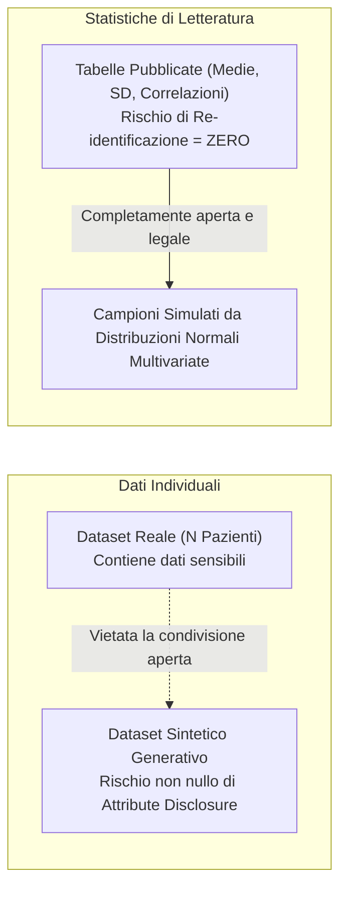

# Scarsità di Dati Aperti, Privacy e Rischi di Re-Identificazione in Psicologia Clinica

**Summary**: Analisi delle barriere etiche, deontologiche e metodologiche che ostacolano l'accesso e la condivisione pubblica di dataset clinici (*Open Data Scarcity*) in salute mentale, dei rischi di re-identificazione insiti nei dati sintetici (*Attribute Disclosure Risk*) e delle raccomandazioni per il reporting trasparente di statistiche disaggregate nei trial clinici (RCT).
**Sources**: Jacobs et al. (2026) - `2601.06159v1.pdf`, Hittmeir et al. (2020), Goncalves et al. (2020)
**Last updated**: 2026-08-27
---

## Il Collo di Bottiglia dei Dati in Psicologia Clinica e Psichiatria

I progressi nell'Intelligenza Artificiale applicata alla salute mentale (dalla predizione degli esiti terapeutici ai sistemi di supporto decisionale) dipendono dalla disponibilità di dataset ampi, eterogenei e multicentrici. Tuttavia, la ricerca psicoterapeutica e psichiatrica soffre di una severa **scarsità strutturale di dati aperti** (*Open Data Scarcity*):

---

## Dati Sintetici e il Dilemma del Rischio di Re-Identificazione

Per superare il divieto di condivisione dei dati grezzi dei pazienti, la comunità scientifica ha proposto l'uso di **dati sintetici** generati tramite reti generative avversarie (GAN), Variational Autoencoders (VAE) o modelli probabilistici (Goncalves et al., 2020).

Tuttavia, i dati sintetici non garantiscono una privacy assoluta:
- **Attribute Disclosure Risk**: Se un modello generativo è addestrato su un dataset clinico reale di dimensioni limitate, rischia di memorizzare combinazioni di attributi rare. Un attaccante in possesso di informazioni ausiliarie parziali sul paziente può inferire la diagnosi psichiatrica o l'esito terapeutico con elevata accuratezza (Hittmeir et al., 2020).
- **Membership Inference Attacks**: È possibile determinare statisticamente se un dato individuo faceva parte della coorte clinica di addestramento.
- **Diffidenza Istituzionale**: I comitati etici e i responsabili della protezione dati (DPO) mantengono un atteggiamento altamente restrittivo verso la pubblicazione aperta anche di coorti sintetiche derivate da pazienti psichiatrici.

---

## Statistiche Descrittive di Letteratura come Alternativa Privacy-Preserving

L'approccio proposto da Jacobs et al. (2026) sfrutta parametri statistici aggregati già pubblicati (medie, deviazioni standard, correlazioni) per simulare coorti senza accedere ad alcun record a livello individuale:

### Il "Reporting Deficit" nei Trial Clinici (RCT)
Sebbene l'uso di statistiche pubblicate azzeri completamente il rischio di violazione della privacy, esso incontra un ostacolo insormontabile nella **pratica di pubblicazione scientifica**:
- Nella maggior parte dei trial controllati randomizzati (RCT) e studi osservazionali, gli autori riportano esclusivamente le statistiche descrittive complessive del campione o i coefficienti di regressione principali.
- Le statistiche descrittive disaggregate per esito clinico (*responders* vs *non-responders*, *remitters* vs *non-remitters*) e le relative **matrici di correlazione/covarianza** per sottogruppo vengono quasi sistematicamente omesse.
- Nello studio di Jacobs et al. (2026), su oltre 188 pubblicazioni uniche sul trattamento CBT del Disturbo Ossessivo-Compulsivo, **solo 7 studi** riportavano i dati necessari per la simulazione parametrica.

---

## Standard Raccomandati per l'Open Science nei Trial Clinici

Per abilitare modelli predittivi robusti e riproducibili nel rispetto della privacy, la comunità scientifica raccomanda l'adozione di standard rigorosi di trasparenza metodologica (estensioni CONSORT/SPIRIT per AI e salute mentale):

| Area | Pratica Corrente | Standard Open Science Raccomandato |
| :--- | :--- | :--- |
| **Statistiche Descrittive** | Medie e SD solo per l'intero campione pre-trattamento. | Pubblicazione di tabelle descrittive complete disaggregate per responder, non-responder, remitter e drop-out. |
| **Relazioni tra Variabili** | Omissione delle matrici di correlazione o inclusione solo a livello globale. | Pubblicazione nei materiali supplementari delle matrici complete di correlazione/covarianza per ciascun sottogruppo di esito. |
| **Formati Aperti e Riutilizzabili** | Dati incorporati in file PDF come immagini o tabelle non strutturate. | Repository aperti (es. OSF, Zenodo) con matrici in formato `.csv` o `.json` machine-readable. |
| **Trasparenza degli Algoritmi** | Mancata condivisione degli script di addestramento e validazione. | Condivisione pubblica del codice sorgente (Python/R) con pipeline riproducibili e semi casuali registrati. |

---

## Related pages
- [[2601-06159v1]]: Studio di valutazione empirica sull'uso di dati simulati da letteratura.
- [[pretraining-simulated-data-clinical-ml]]: Algoritmi e modelli di pretraining su statistiche descrittive.
- [[mccv-and-statistical-validation-clinical-ml]]: Metodologia di cross-validation e test di generalizzazione in campioni clinici.
- [[etica-privacy-bias-ia-clinica]]: Aspetti etici, deontologici e di privacy nell'uso dell'IA in clinica.
- [[treatment-outcome-and-relapse-prediction]]: Predizione degli esiti terapeutici nella psicoterapia.
