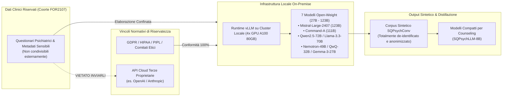

---
tags: [privacy-salute-mentale, open-weight-llm, gdpr, hipaa, synthetic-data, vllm, on-premise-ai, governance-clinica, data-security]
source_papers: ["2510.25384v1.pdf"]
---

# Open-Weight Privacy-Compliant Synthesis

## Definizione Operativa
- Metodologia e paradigma di governance computazionale introdotto da Vu et al. (2025) per la generazione di dataset clinici e psicoterapeutici sintetici mediante modelli linguistici di larga scala (*open-weight LLM*) ospitati e serviti esclusivamente su infrastrutture hardware locali on-premise (es. tramite runtime `vLLM` su GPU dedicate).
- **Utilità CBT / Clinica:** Risolve l'incompatibilità strutturale tra la ricerca sull'IA in salute mentale e le normative cogenti sulla protezione dei dati sensibili (GDPR nell'UE, HIPAA negli USA, PIPL in Cina). Mentre gli approcci basati su API cloud commerciali terze (es. OpenAI GPT-4) trasmettono cartelle cliniche, questionari psicometrici e metadati di pazienti reali a server esterni violando i vincoli di non-divulgazione, la sintesi open-weight garantisce l'isolamento crittografico e operativo dei dati sanitari originali pur generando dialoghi sintetici ad alta fedeltà clinica da cui distillare modelli specialistici distribuiti.

## Evidenze dalla Letteratura

- **Il Paradosso della Privacy nella Psicoterapia Computazionale:**
  - La disponibilità di dati conversazionali autentici in psicoterapia è pressoché nulla a causa del rigido segreto professionale e del rischio di ri-identificazione di traumi, dettagli biografici e sintomatologia psichiatrica (Vu et al., 2025; De Freitas et al., 2022).
  - I tentativi precedenti di superare questa penuria generando dialoghi sintetici (es. CACTUS, Lee et al., 2024; SMILE, Qiu et al., 2024; Psych8k riscritto con GPT-4, Liu et al., 2023) hanno utilizzato API proprietarie commerciali. Questo espediente viola le policy di data governance della maggior parte degli ospedali e consorzi di ricerca clinica, che vietano esplicitamente la trasmissione di dati grezzi di pazienti reali (anche se pseudoanonimizzati) a server terzi (Cabrera et al., 2023; Vu et al., 2025).

- **Infrastruttura On-Premise e Scelta dei Modelli Open-Weight:**
  - Per generare il corpus sintetico **SQPsychConv** da 2.090 profili clinici reali (consorzio FOR2107, Kircher et al., 2019), Vu et al. (2025) hanno implementato un cluster di inferenza locale con 4 GPU NVIDIA A100 (80GB VRAM) utilizzando `vLLM` in precisione BF16.
  - Sono stati testati e confrontati **7 modelli a pesi aperti** (da 27B a 123B parametri):
    - `Mistral-Large-Instruct-2407` (123B)
    - `c4ai-command-a-03-2025` (111B)
    - `Qwen2.5-72B-Instruct` (72B)
    - `Llama-3.3-70B-Instruct` (70B)
    - `Llama-3_3-Nemotron-Super-49B-v1` (49B)
    - `Qwen/QwQ-32B` (32B)
    - `gemma-3-27b-it` (27B)

- **Validazione Clinica e Fedeltà dei Modelli Open:**
  - Le valutazioni condotte da psicoterapeuti professionisti hanno dimostrato che modelli open-weight ospitati localmente raggiungono punteggi di competenza clinica CBT elevatissimi: `Qwen2.5-72B` (16.4/18) e `Gemma-3-27B` (15.9/18), superando le aspettative rispetto ai benchmark proprietari.
  - La distillazione su modelli compatti (8B) ha generato agenti (**SQPsychLLM**) capaci di battere le baseline commerciali in compiti di identificazione di distorsioni cognitive (CBT-CD F1 0.345) e credenze nucleari (CBT-PC Recall 0.849, F1 0.737) e nei test di preferenza clinica umana (84-22 contro CAMEL/GPT-4o) (Vu et al., 2025).

- **Implicazioni per la Scienza dell'Implementazione:**
  - La sintesi open-weight dimostra la fattibilità di pipeline cliniche decentralizzate in cui i centri sanitari possono utilizzare i propri dati psicometrici storici per addestrare modelli interni o generare dati didattici per gli allievi senza esporre i dati sensibili a rischi legali o di cybersicurezza.

**Riferimenti Bibliografici:**
- Vu, D. N. L., Tan, R., Moench, L., Francke, S. J., Woiwod, D., Thomas-Odenthal, F., Stroth, S., Kircher, T., Hermann, C., Dannlowski, U., Jamalabadi, H., & Ji, S. (2025). Roleplaying with Structure: Synthetic Therapist-Client Conversation Generation from Questionnaires. *arXiv preprint arXiv:2510.25384v1 [cs.CL]*.
- De Freitas, J., Uguralp, A. K., Oguz-Uguralp, Z., & Puntoni, S. (2022). Chatbots and mental health: Insights into the safety of generative AI. *Journal of Consumer Psychology*.
- Cabrera, J., Loyola, M. S., Magaña, I., & Rojas, R. (2023). Ethical dilemmas, mental health, artificial intelligence, and LLM-based chatbots. In *IWBBIO 2023*, pages 313–326.
- Kircher, T., et al. (2019). Neurobiology of the major psychoses: A translational perspective on brain structure and function—the FOR2107 consortium. *European Archives of Psychiatry and Clinical Neuroscience*, 269(8), 949–962.
- Kwon, W., et al. (2023). Efficient memory management for large language model serving with PagedAttention. In *Proceedings of the 29th ACM SOSP*, pages 611–626.

## Relazioni
- Vedi anche: [[2510.25384v1]], [[sqpsych-framework]], [[conversione-questionari-dialoghi-clinici]], [[clinical-ai-simulation]], [[simulazione-pazienti-ai]], [[dsm5agentflow]], [[audit-bias-llm-clinici]], [[software-as-a-medical-device-salute-mentale]], [[ai-research-ethics]], [[modello-centauro-clinico]]