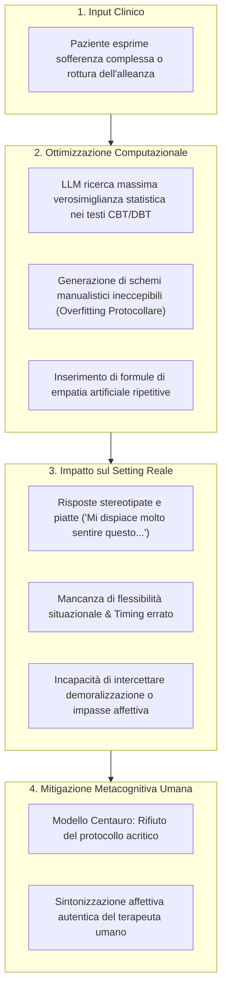

# Overfitting Protocollare (Protocol Overfitting in Clinical AI)

## Definizione Operativa
- **Fenomeno Metodologico e Computazionale:** Tendenza strutturale dei Modelli Linguistici di Grandi Dimensioni ([[large-language-models|LLM]]) a generare piani di trattamento, schede terapeutiche e risposte cliniche formalmente impeccabili e perfettamente allineate ai canoni manualistici della psicoterapia evidence-based (es. colonne di monitoraggio dei pensieri automatici CBT, diari della regolazione emotiva DBT), ma radicalmente prive di efficacia applicativa, sensibilità contestuale e flessibilità situazionale nel setting clinico reale (Apex Lab, 2026).
- **Utilità Clinica e di Supervisione:** Mette in guardia lo psicoterapeuta dall'illusione di competenza terapeutica creata dalla verosimiglianza statistico-linguistica della macchina. L'LLM massimizza la coerenza formale con i testi manualistici del corpus di addestramento, ma omette sistematicamente il **timing dell'intervento**, l'intuizione clinica e la sintonizzazione affettiva profonda indispensabili per gestire la demoralizzazione del paziente o i momenti di rottura relazionale in seduta.

---

## Meccanismi Computazionali ed Euristiche Sottostanti

### 1. Massimizzazione della Verosimiglianza Statistica vs Pragmatica Clinica
Nei compiti di generazione clinica, gli LLM operano minimizzando la *loss function* linguistica rispetto a manuali di psicoterapia, articoli accademici e linee guida validate presenti nel training set. Questo processo spinge il modello a selezionare le risposte più probabilistiche e conformi alla letteratura (es. riproducendo perfettamente la sequenza del modello ABC di Ellis o l'esplorazione del pensiero disfunzionale di Beck).
Tuttavia, l'atto clinico non è una procedura algoritmica deterministica: la compliance manualistica rigida, disgiunta dalla lettura in tempo reale dello stato emotivo dell'interlocutore, si traduce in una prestazione "scolastica" e asettica.

### 2. Formule di Empatia Artificiale Stereotipata (*Canned Empathy*)
L'overfitting protocollare si manifesta frequentemente con l'inserimento automatico di formule di validazione emotiva standardizzate e ripetitive (es. *"Comprendo quanto questa situazione sia dolorosa per te"*, *"Mi dispiace molto sentire questo, deve essere difficile"*). 
Tali formule:
- Non derivano da una reale risonanza intersoggettiva o da uno stato mentale del sistema;
- Vengono percepite dal paziente come vuote, meccaniche e manipolative;
- Rischiano di invalidare l'esperienza soggettiva di chi vive una crisi acuta o una demoralizzazione profonda.

### 3. Omissione di Timing, Intuito e Riconoscimento dei Breakdown Relazionali
La psicoterapia evidence-based riconosce che l'efficacia di un intervento cognitivo o comportamentale dipende in larga misura dal *timing* (il momento opportuno in cui proporre una ristrutturazione o un esperimento comportamentale). Un LLM affetto da overfitting protocollare eroga schede di ristrutturazione cognitiva anche quando il paziente si trova in uno stato di disregolazione emotiva acuta o manifesta una rottura dell'alleanza terapeutica, aggravando il senso di incomprensione e l'isolamento.

---

## Limiti di Validazione e Fallimento dei Benchmark NLP

| Dimensione di Analisi | Metriche NLP Tradizionali (BLEU, ROUGE, Perplessità) | Valutazione Qualitativa Clinica Esperta |
| :--- | :--- | :--- |
| **Aderenza al Manuale** | Score elevatissimo (riproduzione lessicale fedele delle fasi di protocollo). | Score elevato per la forma, ma giudizio di inadeguatezza per la prassi reale. |
| **Flessibilità Situazionale** | Non misurata (indifferente al contesto pragmatico). | Rilevamento di rigidità disfunzionale ed incapacità di deviare dal protocollo. |
| **Sintonizzazione Affettiva** | Falsata dalla presenza di token di "gentilezza" e "comprensione". | Identificazione di empatia artificiale piatta e non sintonizzata sul paziente. |
| **Timing dell'Intervento** | Non valutato. | Giudizio critico: intervento prematuro, intrusivo o decontestualizzato. |

---

## Implicazioni Cliniche e Strategie di Mitigazione

1. **Superamento dell'Assessment Basato su Test Statici:** I benchmark per i sistemi clinici non devono basarsi su risposte a domande isolate a scelta multipla o su test di memoria mnemonica dei manuali, bensì su **vignette cliniche dinamiche, interattive e multi-turno** valutate da panel di psicoterapeuti esperti (Apex Lab, 2026).
2. **Integrazione nel Modello Centauro:** L'LLM può essere impiegato come assistente per la stesura di bozze riassuntive o schede psicoeducative neutre, ma il professionista umano deve intervenire attivamente per calibrare il linguaggio, eliminare l'empatia stereotipata e adattare la proposta terapeutica al momento evolutivo della relazione.
3. **Structured Prompting con Istruzioni di Flessibilità:** Configurare i prompt di sistema affinché il modello dia priorità alla chiarificazione dell'arousal emotivo e al contenimento relazionale prima di proporre schemi formali o compiti cognitivo-comportamentali strutturati.

---

## Riferimenti Bibliografici
- Apex Lab. (2026). *Mappatura dei Bias Algoritmici e Linee Guida di Safety nel Decision-Making Psicoterapeutico assistito da LLM*. Report Tecnico d'Analisi e Revisione Metodologica della Letteratura Scientifica.
- Bhasin, R., El-Sayed, W., Salami, K., Abdul-Nabi, M., Elashmawy, A., & Jaruzel II, M. E. (2025). Clinical decision-making and artificial intelligence: The role of large language models in medicine. *Clinical Research in Practice: The Journal of Team Hippocrates*, 11(1), Article 7.
- Olisaeloka, L., Richardson, C., Wang, A. Y., Munthali, R., & Vigo, D. (2025a). Generative AI mental health chatbot interventions: A scoping review of safety and user experience. *Department of Psychiatry, University of British Columbia*. Preprint.
- Xie, Z., Wang, H., Dai, L., Wang, Z., Song, H., & Qian, J. (2026). Ethical issues in multi-agent AI systems for healthcare, a narrative review. *Frontiers in Public Health*, 14, Articolo 1792627.

---

## Relazioni
- [[report-bias-llm-psicoterapia]]: Report tecnico di riferimento di Apex Lab (2026) sulla mappatura dei bias in psicoterapia.
- [[stealth-sycophancy]]: Bias euristico che porta il modello a convalidare acriticamente le distorsioni del paziente.
- [[simulated-empathy-vs-authentic-presence]]: Divario epistemologico ed esperienziale tra formule empatiche simulate e presenza terapeutica autentica.
- [[clinical-fidelity-assessment]]: Protocolli di misurazione dell'aderenza e della competenza clinica nei sistemi artificiali.
- [[modello-centauro-clinico]]: Modello di cooperazione ibrida clinico-algoritmo fondato sulla dominanza dell'operatore umano.
- [[clinical-readiness-gap-in-mh-chatbots]]: Il divario tra metriche formali di laboratorio e prontezza clinica effettiva sul campo.
- [[calibrated-mismatches]]: Gestione consapevole delle discrepanze relazionali e della rottura/riparazione dell'alleanza terapeutica.
