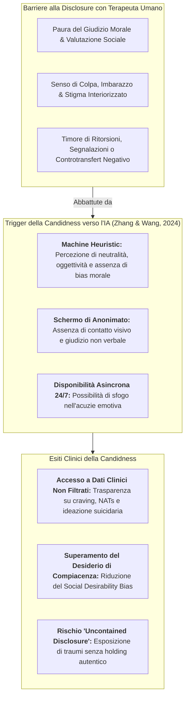

---
tags: [patient-candidness, self-disclosure, machine-heuristic, stigma-reduction, therapeutic-alliance, non-judgmental-ai, confidential-disclosure, mental-health-ai]
source_papers: ["fpsyt-15-1444382.pdf"]
---

# Patient Candidness and Self-Disclosure in AI Interaction (Franchezza e Disclosure del Paziente nell'Interazione con l'IA)

## Definizione Operativa
- Costrutto clinico e socio-cognitivo che descrive la propensione sistematica dei pazienti a manifestare una maggiore sincerità, disinibizione verbale e franchezza (*candidness*) nell'auto-rivelazione (*self-disclosure*) di materiale emotivo intimo, traumatico o socialmente stigmatizzato quando interagiscono con un'interfaccia di intelligenza artificiale rispetto a un clinico umano (Zhang & Wang, 2024; Chaudhry & Debi, 2024; Sundar & Kim, 2019; Fulmer et al., 2018).
- **Utilità Clinica e CBT:** Funziona come canale a bassa soglia di accesso e ad alta confidenzialità per il rilevamento precoce di sintomi critici (ideazione suicidaria, dipendenze, devianze, ossessioni egodistoniche, vissuti di colpa e vergogna) altrimenti taciuti per timore del giudizio o della reazione emotiva del terapeuta. Tuttavia, l'apertura non accompagnata da una risonanza affettiva autentica (*uncontained disclosure*) espone al rischio di isolamento relazionale o affidamento acritico (*overtrust*).

---

## Meccanismi Psicologici Sottostanti

La maggiore franchezza espressiva nell'interazione uomo-macchina è mediata da tre processi psicocognitivi fondamentali:

### 1. L'Attivazione della *Machine Heuristic* (Sundar & Kim, 2019)
- Gli utenti applicano automaticamente la regola euristica per cui le macchine sono strumenti computazionali privi di desideri personali, emozioni soggettive o convinzioni morali.
- Di conseguenza, l'IA è considerata intrinsecamente incapace di provare disprezzo, imbarazzo, disgusto o noia, neutralizzando la percezione di minaccia all'autostima (*ego-threat reduction*).

### 2. Abbattimento del *Social Desirability Bias* e dell'Ansia da Valutazione
- In psicoterapia tradizionale, molti pazienti filtrano i propri pensieri o minimizzano le ricadute per compiacere il clinico, proteggere la propria immagine o evitare interpretazioni spiacevoli (Dougall & Schwartz, 2011; Markin & Kivlighan, 2007).
- Con l'agente artificiale, il bisogno di approvazione sociale decade, consentendo una narrazione grezza e trasparente dei propri stati interni (Chaudhry & Debi, 2024).

### 3. Effetto "Diario Segreto Interattivo" (*Interactive Expressive Writing*)
- L'interazione testuale con un chatbot combina la libertà disinibita della scrittura introspettiva di un diario intimo con il rinforzo linguistico immediato fornito dal modello, favorendo una verbalizzazione più dettagliata e immediata dei vissuti interiori.

---

## Implicazioni Cliniche e Gestione del Setting

| Dimensione | Opportunità Clinica | Rischio Iatrogeno & Limite |
| :--- | :--- | :--- |
| **Screening e Triage del Rischio** | Segnalazione tempestiva di ideazione suicidaria e abuso di sostanze (Levkovich & Elyoseph, 2023). | Mancanza di un protocollo immediato di escalation o intervento d'urgenza in caso di crisi acuta. |
| **Homework e Monitoraggio CBT** | Compilazione veritiera dei diari di automonitoraggio (ABC, pensieri automatici, abitudini). | Possibile compiacenza algoritmica (*sycophancy*) che rinforza distorsioni invece di sfidarle. |
| **Elaborazione Traumatica** | Desensibilizzazione iniziale e prima esplicitazione verbale di eventi traumatici taciuti. | *Uncontained Disclosure*: esplorazione di memorie destabilizzanti senza la sicurezza di una presenza fisica umana. |
| **Alleanza Terapeutica Ibrida** | L'IA raccoglie materiale intimo e lo prepara (con consenso) per il lavoro d'approfondimento in seduta. | Rischio di attaccamento illusorio al bot (*artificial intimacy*) e disinvestimento dal terapeuta umano. |

---

## Raccomandazioni per il Modello Ibrido (Centauro Clinico)
1. **Sfruttare la Candidness per l'Assessment Iniziale:** Utilizzare chatbot calibrati per raccogliere resoconti anamnestici e self-report sinceri prima del colloquio clinico.
2. **Ponte di Connessione con il Clinico:** I dati emersi dall'interazione con l'IA devono essere integrati nella formulazione del caso, permettendo al clinico umano di validare i vissuti e offrire il necessario holding relazionale ed etico.
3. **Guardrail contro l'Overtrust:** Ricordare costantemente al paziente la natura non cosciente dello strumento, evitando che la franchezza comunicativa si trasformi in delega passiva delle scelte di vita (*algorithmic paternalism*).

---

## Riferimenti Bibliografici
- Zhang, Z., & Wang, J. (2024). Can AI replace psychotherapists? Exploring the future of mental health care. *Frontiers in Psychiatry*, 15, 1444382. https://doi.org/10.3389/fpsyt.2024.1444382
- Chaudhry, B. M., & Debi, H. R. (2024). User perceptions and experiences of an AI-driven conversational agent for mental health support. *mHealth*, 10, 55. https://doi.org/10.21037/mhealth-23-55
- Dougall, J. L., & Schwartz, R. C. (2011). The influence of client socioeconomic status on psychotherapists' attributional biases and countertransference reactions. *American Journal of Psychotherapy*, 65(3), 249–265.
- Fulmer, R., Joerin, A., Gentile, B., Lakerink, L., & Rauws, M. (2018). Using psychological artificial intelligence (Tess) to relieve symptoms of depression and anxiety: randomized controlled trial. *JMIR Mental Health*, 5(4), e9782.
- Levkovich, I., & Elyoseph, Z. (2023). Suicide risk assessments through the eyes of ChatGPT-3.5 versus ChatGPT-4: vignette study. *JMIR Mental Health*, 10, e51232.
- Sundar, S. S., & Kim, J. (2019). Machine heuristic: When we trust computers more than humans with our personal information. In *Proceedings of the 2019 CHI Conference on Human Factors in Computing Systems* (pp. 1–9). ACM.

---

## Relazioni
- [[fpsyt-15-1444382]]
- [[machine-heuristics-in-therapy]]
- [[credibility-gap]]
- [[simulated-empathy-vs-authentic-presence]]
- [[digital-therapeutic-alliance]]
- [[sycophantic-mirroring]]
- [[between-session-continuity-ai]]
- [[modello-centauro-clinico]]
- [[algorithmic-paternalism-in-ai-mental-health]]
- [[clinical-readiness-gap-in-mh-chatbots]]