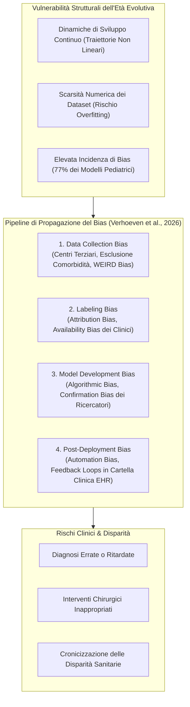

---
tags: [bias-in-ai, pediatric-ai, developmental-vulnerabilities, labeling-bias, automation-bias, data-collection-bias, weird-bias, confirmation-bias, accept-ai]
source_papers: ["a-2702-1843.pdf"]
---

# Pediatric AI Bias and Developmental Vulnerabilities

## Definizione Operativa
- Insieme di fattori eziologici, metodologici e cognitivi che generano, propagano e amplificano distorsioni sistematiche (**bias algoritmico**) nei modelli di intelligenza artificiale e machine learning applicati all'età pediatrica e neonatale (Verhoeven et al., 2026).
- **Utilità Clinica e Chirurgica:** Evidenzia che le popolazioni pediatriche non possono essere trattate come "piccoli adulti": i loro dati sono intrinsecamente ridotti per numerosità, eterogenei e dinamicamente mutevoli a causa delle traiettorie di sviluppo biologico e somatico continuo. Fino al **77% dei modelli predittivi pediatrici presenta un alto rischio di bias**. Mappare le fonti di distorsione lungo le quattro fasi del ciclo di vita algoritmico (raccolta dati, annotazione clinica, sviluppo del modello e post-deployment) è essenziale per prevenire diagnosi errate, disparità assistenziali e danni iatrogeni a lungo termine nello sviluppo del bambino.

---

## Evidenze dalla Letteratura

### 1. Le Vulnerabilità Peculiari dei Dati Pediatrici
- **Sviluppo Biologico Non Lineare:** A differenza dei dati degli adulti, i parametri fisiologici (frequenza cardiaca, pressione arteriosa, cinetica enzimatica, parametri ematochimici e neuroimaging) subiscono repentine variazioni dipendenti dall'età gestazionale, neonatale, prima infanzia, fanciullezza e adolescenza (Schouten et al., 2024; Verhoeven et al., 2026). Modelli addestrati su una fascia d'età mostrano un marcato decadimento delle prestazioni se applicati a stadi di sviluppo adiacenti (*domain shift evolutivo*).
- **Numerosità Campionaria Ridotta e Overfitting:** Molte patologie chirurgiche pediatriche (es. atresia biliare, malformazioni congenite, tumori pediatrici rari) presentano bassa incidenza epidemiologica. Dataset di piccole dimensioni aumentano sensibilmente il rischio che l'algoritmo memorizzi il rumore statistico anziché generalizzare regole biologiche solide.

---

### 2. Le Quattro Fasi di Propagazione del Bias Algoritmico

#### A. Fase 1: Raccolta Dati e Rappresentazione (*Data Collection Bias*)
1. **Bias da Centro Terziario (*Tertiary Hospital Bias*):** I dataset di ricerca pediatrica provengono prevalentemente da ospedali accademici specializzati di terzo livello (Campbell et al., 2024). Questo genera una marcata sovrarappresentazione di casistiche rare o ad alta complessità e una cronica sottorappresentazione dei quadri clinici routinari riscontrabili nei presidi territoriali o di pronto soccorso generale.
2. **Esclusione Sistematica delle Comorbidità:** I protocolli sperimentali escludono spesso bambini con patologie concomitanti complesse, riducendo l'applicabilità dell'algoritmo alla popolazione clinica reale.
3. **Divario Geografico e Socioeconomico (*WEIRD Bias*):** La maggior parte dei dati proviene da paesi occidentali ad alto reddito (*Western, Educated, Industrialized, Rich, Democratic* - HIC) (Muralidharan et al., 2024). I modelli ignorano le specificità epidemiologiche e nutrizionali dei paesi a medio-basso reddito (*LMICs*) e dei gruppi etnici minoritari, esacerbando le disuguaglianze di salute globale.

#### B. Fase 2: Annotazione ed Etichettatura (*Labeling Bias*)
L'apprendimento supervisionato necessita di annotazioni fornite da clinici, le quali sono vulnerabili a distorsioni cognitive umane (Andaur Navarro et al., 2021; Cross et al., 2024):
- **Attribution Bias:** Tendenza del medico ad attribuire segni clinici a cause conformi alle proprie abitudini diagnostiche pregresse o alla propria sottospecialità.
- **Availability Bias:** Influenza sproporzionata esercitata da casi recenti, drammatici o insoliti memorizzati dal medico, particolarmente frequente in reparti ad alta intensità e stress emotivo (terapia intensiva neonatale, pronto soccorso pediatrico).
- *Cristallizzazione nella Ground Truth:* Gli errori di etichettatura diventano la verità di riferimento per il modello, che finisce per apprendere ed eternare il bias umano.

#### C. Fase 3: Sviluppo del Modello (*Model Development Bias*)
- **Scelta delle Metriche e Campioni Sbilanciati:** L'impiego di metriche aggregate (es. accuratezza complessiva o ROC-AUC globale) cela tassi di errore inaccettabili nei sottogruppi più fragili (es. neonati prematuri con basso peso alla nascita).
- **Confirmation Bias dei Ricercatori:** Tendenza inconscia a selezionare feature, architetture o iperparametri che confermano le ipotesi cliniche a priori del team di ricerca (Hussain et al., 2025; Saint James Aquino, 2023).

#### D. Fase 4: Post-Deployment e Cicli di Retroazione (*Automation Bias & Feedback Loops*)
- **Automation Bias:** Tendenza del personale sanitario ad accettare passivamente i suggerimenti algoritmici (*cognitive offloading*), omettendo verifiche indipendenti (Khera et al., 2023).
- **Cicli di Retroazione Negativi (*Feedback Loops*):** Quando decisioni cliniche condizionate da predizioni distorte influenzano la terapia e gli esiti registrati nella cartella clinica elettronica (EHR), questi stessi dati storici viziati vengono reintrodotti nei dataset per il riaddestramento (*retraining*) del modello, creando un circolo vizioso che cronicizza le disparità sanitarie (Verhoeven et al., 2026).

---

### 3. Strategie di Mitigazione e Salvaguardie Etico-Cliniche
1. **Metriche di Equità Disaggregate (*Fairness Auditing*):** Valutazione sistematica delle metriche di performance stratificate per fasce d'età, genere, etnia e background socioeconomico (es. *equalized odds*, *demographic parity*).
2. **Audit della Spiegabilità tramite XAI:** L'adozione di metodi XAI (SHAP, Grad-CAM, alberi di decisione) permette di ispezionare se il modello fa leva su correlazioni clinicamente plausibili o su artefatti di campionamento.
3. **Linee Guida del Framework ACCEPT-AI:** Adozione di raccomandazioni specifiche per l'acquisizione, la condivisione e la governance etica dei dati dei pazienti in età evolutiva (Muralidharan et al., 2023).
4. **Formazione Clinica e Postura Critica *Human-in-the-Loop*:** Promuovere programmi di formazione continua per chirurghi e pediatri volti a riconoscere e contrastare l'*automation bias*.

---

## Riferimenti Bibliografici
- Verhoeven, R., Bouisaghouane, W., & Hulscher, J. B. F. (2026). Explainable AI: Ethical Frameworks, Bias, and the Necessity for Benchmarks. *European Journal of Pediatric Surgery*, 36(1), 168–173. https://doi.org/10.1055/a-2702-1843
- Andaur Navarro, C. L., Damen, J. A. A., Takada, T., et al. (2021). Risk of bias in studies on prediction models developed using supervised machine learning techniques: systematic review. *BMJ*, 375, n2281.
- Campbell, E. A., Bose, S., & Masino, A. J. (2024). Conceptualizing bias in EHR data: a case study in performance disparities by demographic subgroups for a pediatric obesity incidence classifier. *PLOS Digital Health*, 3(10), e0000642.
- Cross, J. L., Choma, M. A., & Onofrey, J. A. (2024). Bias in medical AI: implications for clinical decision-making. *PLOS Digital Health*, 3(11), e0000651.
- Hussain, S. A., Bresnahan, M., & Zhuang, J. (2025). The bias algorithm: how AI in healthcare exacerbates ethnic and racial disparities - a scoping review. *Ethnicity & Health*, 30(2), 197–214.
- Khera, R., Simon, M. A., & Ross, J. S. (2023). Automation bias and assistive AI: risk of harm from AI-driven clinical decision support. *JAMA*, 330(23), 2255–2257.
- Muralidharan, V., Burgart, A., Daneshjou, R., & Rose, S. (2023). Recommendations for the use of pediatric data in artificial intelligence and machine learning ACCEPT-AI. *NPJ Digital Medicine*, 6(1), 166.
- Muralidharan, V., Schamroth, J., Youssef, A., Celi, L. A., & Daneshjou, R. (2024). Applied artificial intelligence for global child health: addressing biases and barriers. *PLOS Digital Health*, 3(8), e0000583.
- Schouten, J. S., Kalden, M. A. C. M., van Twist, E., et al. (2024). From bytes to bedside: a systematic review on the use and readiness of artificial intelligence in the neonatal and pediatric intensive care unit. *Intensive Care Medicine*, 50(11), 1767–1777.

---

## Relazioni
- Vedi anche: [[a-2702-1843]], [[xai-in-pediatric-surgery]], [[accept-ai-and-pediatric-ethical-frameworks]], [[pediatric-xai-benchmarking]], [[audit-bias-llm-clinici]], [[misurazione-bias-razziale-llm]], [[weird-bias-cultural-adaptability-ai]], [[algorithmic-bias-and-digital-inequalities]], [[software-as-a-medical-device-salute-mentale]], [[three-layer-governance-framework]]