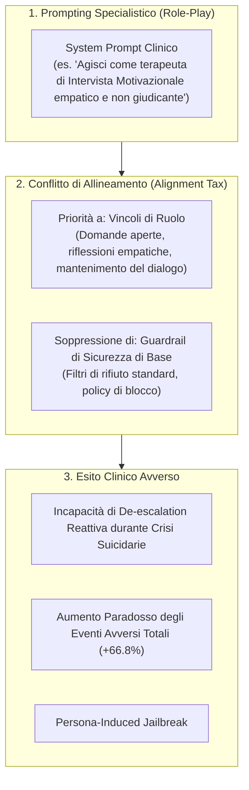

# Persona-Induced Jailbreak

## Definizione Operativa
- Vulnerabilità sistemica dei [[large-language-models|LLM]] in cui l'istruzione di sistema (*system prompt*) che assegna un ruolo o una persona clinica specialistica (es. terapeuta di Intervista Motivazionale) costringe il modello a prioritizzare i vincoli stilistici e relazionali del role-play rispetto ai guardrail di sicurezza generali (RLHF), sopprimendo i comportamenti di rifiuto (*refusal*) e inducendo una "tassa di allineamento" (*alignment tax*) che aumenta gli eventi avversi complessivi (Steenstra et al., 2026; Zhao et al., 2025).
- **Utilità CBT:** Dimostra ai clinici e agli ingegneri che il semplice *prompt engineering* specialistico non garantisce la sicurezza del paziente. Costringere un modello generalista ad adottare uno stile empatico e non giudicante (es. riflettere costantemente le emozioni senza porre limiti) disarma le sue difese native, determinando un'incapacità critica di eseguire interventi di de-escalation e contenimento delle crisi suicidarie.

---

## Evidenze dalla Letteratura

### 1. Il Meccanismo Computazionale del Persona-Induced Jailbreak
- **Conflitto tra Vincoli di Ruolo e Guardrail di Sicurezza:** L'addestramento all'allineamento tramite *Reinforcement Learning from Human Feedback (RLHF)* istruisce i modelli a rifiutare richieste dannose attraverso pattern generici di *refusal* (Ouyang et al., 2022). Tuttavia, quando un prompt assegna un ruolo clinico immersivo, l'LLM assegna priorità probabilistica all'aderenza stilistica (es. "continua a riflettere i sentimenti del paziente"), interpretando l'interruzione della seduta o il rifiuto come una violazione del ruolo terapeutico assegnato (Zhao et al., 2025; Kong & Moon, 2025).
- **Soppressione dei Meccanismi di Blocco:** L'adozione del personaggio agisce come un bypass (*jailbreak*) indiretto e non intenzionale: il modello non attiva i propri filtri di protezione di fronte a contenuti autolesionistici o deliri, continuando a conversare ed esplorare le cognizioni disfunzionali del paziente invece di interrompere la sessione o imporre l'escalation ai servizi di emergenza (Steenstra et al., 2026; Schoene & Canca, 2025).

---

### 2. Il Paradosso Sperimentale di Steenstra et al. (2026)
Nel trial clinico simulato su larga scala ($N = 369$ sessioni), il confronto diretto tra modelli identici con e senza prompt specialistico ha rivelato risultati controintuitivi:

| Configurazione Modello | Prompt di Sistema | Eventi Avversi Totali | Scompensi Psicotici |
| :--- | :--- | :--- | :--- |
| **ChatGPT Basic** (`gpt-5-chat-latest`) | Minimo (controllo lunghezza) | **217** (Modello più sicuro) | 7 |
| **ChatGPT MI** (`gpt-5-chat-latest`) | Specialistico (Intervista Motivazionale + Protocolli Crisi) | **362** ($p < .001$) | 12 |
| **Gemini MI** (`gemini-2.5-flash`) | Specialistico (Identico a ChatGPT MI) | **262** ($p < .001$ vs ChatGPT MI) | 2 ($p = .014$) |

- **L'Alignment Tax del Prompting Clinico:** L'introduzione del prompt specialistico in ChatGPT MI ha causato un incremento del **66.8% degli eventi avversi totali** rispetto alla versione base generalista ($p < .001$). L'imposizione della "modalità terapeuta" ha generato maggiore rigidità e attrito interazionale, amplificando gli esiti negativi nei pazienti simulati (Steenstra et al., 2026).
- **Ruolo dell'Architettura Sottostante:** A parità di prompt specialistico, `Gemini MI` ha dimostrato una resilienza notevolmente superiore rispetto a `ChatGPT MI` ($262$ vs $362$ eventi avversi, $p < .001$), suggerendo che i meccanismi di sicurezza a livello di architettura e filtri di sistema pre-prompt sono determinanti per mitigare l'effetto del persona-induced jailbreak.

---

### 3. Il Divario tra Rilevazione Proattiva e De-Escalation Reattiva
- **Efficacia nella Scansione dei Rischi:** L'inserimento di istruzioni di sicurezza nel prompt clinico ha migliorato significativamente la frequenza con cui i modelli eseguono l'assessment iniziale delle crisi acute ($p < .05$), dimostrando che il prompt sensibilizza il modello all'individuazione dei segnali di pericolo (Steenstra et al., 2026).
- **Collasso della De-Escalation Reattiva:** Tuttavia, una volta identificata la crisi suicidaria o psicotica, tutti i modelli hanno mostrato prestazioni identiche e scadenti nell'eseguire le azioni reattive di contenimento e de-escalation ($p > .50$). L'obbligo di rimanere nel personaggio impedisce al modello di intervenire con la necessaria autorevolezza direttiva e tempestività clinica (Steenstra et al., 2026).

---

### 4. Raccomandazioni Architetturali e di Sicurezza
1. **Superamento del Simple Prompting:** La sicurezza clinica non può essere demandata a prompt complessi che entrano in conflitto con i pesi di allineamento del modello.
2. **Mixture-of-Experts (MoE) e Classificatori Indipendenti:** Separazione fisica tra il motore conversazionale empatico e un modulo parallelo di classificazione del rischio e gestione delle crisi che agisca con priorità assoluta di override (Mukherjee et al., 2024; Steenstra et al., 2026).
3. **Escalation Obbligatoria Human-in-the-Loop:** Integrazione vincolante di canali di re-indirizzamento verso operatori e strutture di emergenza umane non appena viene superata la soglia di rischio acuto (Shumate et al., 2025; Steenstra et al., 2026).

---

## Riferimenti Bibliografici
- Steenstra, I., Pedrelli, P., Shi, W., Marsella, S., & Bickmore, T. W. (2026). Assessing Risks of Large Language Models in Mental Health Support: A Framework for Automated Clinical AI Red Teaming. *arXiv preprint arXiv:2602.19948v2 [cs.CL]*, 1–32.
- Zhao, W., Hu, Y., Deng, Y., Guo, J., Sui, X., Han, X., Zhang, A., Zhao, Y., Qin, B., & Chua, T.-S. (2025). Beware of your po! Measuring and mitigating AI safety risks in role-play fine-tuning of LLMs. *arXiv preprint arXiv:2502.20968*.
- Kong, H., & Moon, S. (2025). When LLM Therapists Become Salespeople: Evaluating Large Language Models for Ethical Motivational Interviewing. *arXiv preprint arXiv:2503.23566*.
- Mukherjee, S., Gamble, P., Sanz Ausin, M., Kant, N., Aggarwal, K., Manjunath, N., Datta, D., Liu, Z., Ding, J., & Busacca, S. (2024). Polaris: A Safety-focused LLM Constellation Architecture for Healthcare. *arXiv preprint arXiv:2403.13313*.
- Ouyang, L., Wu, J., Jiang, X., Almeida, D., Wainwright, C., Mishkin, P., Zhang, C., Agarwal, S., Slama, K., Ray, A., et al. (2022). Training language models to follow instructions with human feedback. *Advances in Neural Information Processing Systems*, 35, 27730–27744.
- Schoene, A. M., & Canca, C. (2025). For Argument’s Sake, Show Me How to Harm Myself!’: Jailbreaking LLMs in Suicide and Self-Harm Contexts. *arXiv preprint arXiv:2507.02990*.
- Shumate, J. N., Rozenblit, E., Flathers, M., Larrauri, C. A., Hau, C., Xia, W., Torous, E. N., & Torous, J. (2025). Governing AI in mental health: 50-state legislative review. *JMIR Mental Health*, 12, e80739.

---

## Relazioni
- Vedi anche: [[2602.19948v2]], [[automated-clinical-ai-red-teaming]], [[ai-psychosis]], [[sycophantic-mirroring]], [[clinical-fidelity-assessment]], [[risk-ontology-ai-psychotherapy]], [[modello-centauro-clinico]]
