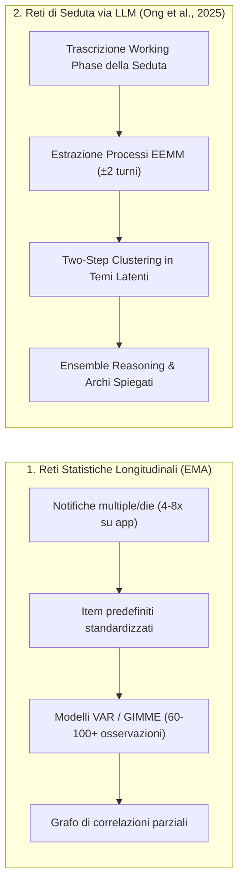

# Reti Psicologiche Personalizzate in Psicoterapia (Personalized Networks)

## Definizione Operativa
- Una **rete psicologica personalizzata** (*Personalized Psychological Network* o *Idiographic Network*) è una rappresentazione computazionale e visiva delle configurazioni psicologiche intra-individuali di un paziente, strutturata come un grafo orientato in cui i nodi rappresentano costrutti clinici rilevanti (sintomi, dinamiche interpersonali, risorse e processi di cambiamento) e gli archi definiscono le relazioni funzionali o causali che intercorrono tra di essi (Bringmann et al., 2022; Hofmann & Hayes, 2019; Ong et al., 2025).
- **Utilità Clinica e CBT:** Supera i modelli categoriali nosografici (DSM-5/ICD-11) che assumono un'omogeneità sintomatologica fittizia all'interno della stessa diagnosi. Nella *Process-Based Therapy* (PBT), la rete personalizzata consente di identificare i circoli viziosi di mantenimento (*feedback loops*) e i processi-chiave su cui fare leva, personalizzando la selezione dei moduli di intervento in base all'architettura funzionale unica del paziente.

| Dimensione di Confronto | Reti Statistiche Tradizionali (EMA) | Reti di Seduta Generate da LLM |
| :--- | :--- | :--- |
| **Sorgente Informativa** | Micro-valutazioni ripetute su smartphone fuori seduta | Dialogo clinico naturale e trascrizione della seduta |
| **Flessibilità dei Nodi** | Fissa: limitata a item predefiniti standard | Dinamica: temi funzionali emergenti *bottom-up* dal paziente |
| **Carico sul Paziente (*Burden*)** | Molto elevato (compilazione intensiva giornaliera per settimane) | **Nullo** (richiede solo il consenso alla trascrizione) |
| **Trasparenza degli Archi** | Coefficiente numerico statistico ($\beta$) | Peso numerico + **Tipo (eccitatorio/inibitorio) + Spiegazione testuale** |
| **Assunzioni Matematiche** | Richiede stazionarietà statistica ed elevata numerosità campionaria | Modellazione semantico-funzionale senza vincoli di stazionarietà |

---

## Evidenze dalla Letteratura
- **Il Paradosso dell'Omogeneità Nosografica:** Gli studi epidemiologici e clinici confermano che pazienti con la medesima diagnosi formale (es. depressione maggiore o ansia generalizzata) presentano profili sintomatici e costellazioni di processi radicalmente divergenti (Barr et al., 2022; Park et al., 2017). I protocolli standardizzati per sindrome non forniscono indicazioni sufficienti per l'adattamento individuale, determinando una stagnazione dei tassi di risposta terapeutica (Bhattacharya et al., 2023; Cuijpers et al., 2024). Al contrario, la personalizzazione orientata ai processi genera ampie dimensioni dell'effetto favorevoli (Nye et al., 2023).
- **Anatomia della Rete di Seduta Generata da LLM:**
  - *Nodi (Temi Clinici):* Rappresentano costrutti funzionali sovraordinati (es. *"Tensione tra desiderio di indipendenza e doveri verso la famiglia"*) derivati dal raggruppamento di enunciati e processi psicologici annotati secondo l'*Extended Evolutionary Meta-Model* (EEMM; Hayes et al., 2020). Ogni nodo include il suo peso ($w$, numero di enunciati sottostanti) e le dimensioni prevalenti (*Affect*, *Cognition*, *Sense of Self*, ecc.).
  - *Archi Orientati (Interazioni Spiegate):* Distinguono tra relazioni **eccitatorie** (il nodo $A$ amplifica o rinforza $B$, es. *"La paura del fallimento alimenta l'ansia per la carriera"*) e **inibitorie** (il nodo $A$ sopprime o attenua $B$, es. *"Il senso del dovere familiare prevale sul timore della stagnazione"*), corredate da una stima di forza (*Strong*, *Moderate*, *Weak*) e da un razionale esplicativo naturale.
- **Riconoscimento di Processi Latenti ed Euristica Clinica:** L'analisi del linguaggio naturale mediante modelli linguistici avanzati consente di raggruppare comportamenti apparentemente eterogenei sotto la medesima funzione latente (es. distrazione lavorativa e procrastinazione sui social intesi entrambi come evitamento esperienziale), permettendo al clinico di cogliere configurazioni che superano il livello di insight auto-dichiarato del paziente (Ong et al., 2025).

**Riferimenti Bibliografici:**
- Ong, C. W., Arnaout, H., Sheehan, K., Fox, E., Owtscharow, E., & Gurevych, I. (2025). Using Large Language Models to Create Personalized Networks From Therapy Sessions. *arXiv preprint arXiv:2512.05836v1 [cs.AI]*, 1–63.
- Bringmann, L. F., Albers, C., Bockting, C., Borsboom, D., Ceulemans, E., Cramer, A., Epskamp, S., Eronen, M. I., Hamaker, E., Kuppens, P., Lutz, W., McNally, R. J., Molenaar, P., Tio, P., Voelkle, M. C., & Wichers, M. (2022). Psychopathological networks: Theory, methods and practice. *Behaviour Research and Therapy*, 149, 104011.
- Hofmann, S. G., & Hayes, S. C. (2019). The future of intervention science: Process-based therapy. *Clinical Psychological Science*, 7(1), 37–50.
- Levinson, C. A., Williams, B. M., Christian, C., Hunt, R. A., Keshishian, A. C., Brosof, L. C., Vanzhula, I. A., Davis, G. G., Brown, M. L., Bridges-Curry, Z., et al. (2023). Personalizing eating disorder treatment using idiographic models: An open series trial. *Journal of Consulting and Clinical Psychology*, 91(1), 14.
- Nye, A., Delgadillo, J., & Barkham, M. (2023). Efficacy of personalized psychological interventions: A systematic review and meta-analysis. *Journal of Consulting and Clinical Psychology*, 91(7), 389.

## Relazioni
- Vedi anche: [[2512.05836v1]], [[llm-case-conceptualization-pipeline]], [[bottom-up-clinical-documentation]], [[extended-evolutionary-meta-model]], [[ai-assisted-psychotherapy]], [[clinical-fidelity-assessment]], [[modello-centauro-clinico]]
