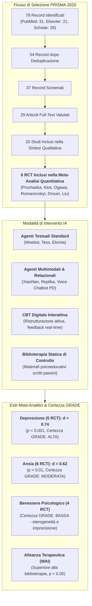
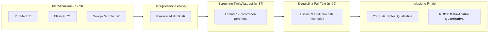
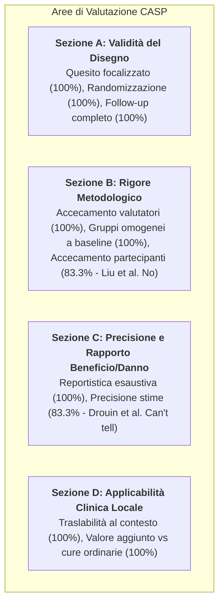
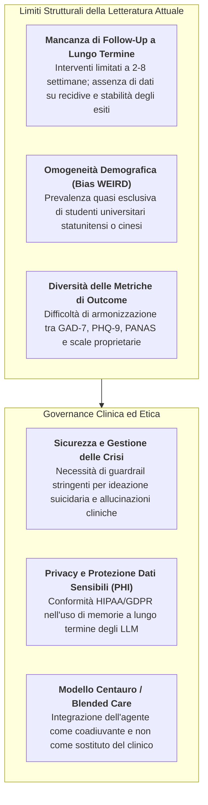

---
tags: [artificial-intelligence, conversational-agents, meta-analysis, systematic-review, depression, anxiety, bibliotherapy, multimodal-ai, grade-assessment, casp-appraisal, working-alliance, plos-one]
source_papers: ["pone.0332207.pdf"]
---

# Artificial Intelligence as a Predictive Tool for Mental Health Status: Insights from a Systematic Review and Meta-Analysis (Humayun et al., 2025)

## Definizione Operativa
- **Revisione sistematica e meta-analisi PRISMA** condotta da Arsalan Humayun, Ashwini M. Madawana, Akram Hassan, Al Mahmud, Noorshaida Kamaruddin, Syed Husni Noor Syed Hatim Noor e Mohamad Arif Awang Nawi (*Universiti Sains Malaysia*, *SMBBMU Larkana*, *Shahjalal University of Science & Technology*), pubblicata su *PLoS ONE* (settembre 2025, 20(9): e0332207; DOI: [10.1371/journal.pone.0332207](https://doi.org/10.1371/journal.pone.0332207)).
- **Oggetto dell'Indagine:** Valutazione sistematica dell'efficacia degli strumenti di intelligenza artificiale (IA), con focus prioritario sugli **agenti conversazionali (*Conversational Agents - CAs*)** e sui modelli predittivi digitali, nella riduzione del disagio psicologico (depressione, ansia, affettività negativa, abuso di sostanze) e nella promozione del benessere su coorti cliniche, subcliniche, studenti universitari e anziani.
- **Evidenze Quantitative e di Sintesi:**
  - *Corpus Sintetizzato:* Screening di 78 record iniziali (2000–2024) da *PubMed*, *Elsevier/ScienceDirect*, *Google Scholar* e *Scopus*. Identificati 20 studi eleggibili per la sintesi qualitativa e **6 trial randomizzati controllati (RCT)** inclusi nella meta-analisi quantitativa a effetti casuali (*random-effects model*).
  - *Dimensione dell'Effetto (Effect Size):* L'impiego di agenti conversazionali riduce in modo statisticamente significativo i sintomi depressivi (**Cohen's $d = 0.74$, $p < 0.001$**, certezza GRADE *High*) e i sintomi ansiosi (**Cohen's $d = 0.62$, $p < 0.01$**, certezza GRADE *Moderate*), con un effect size pooled complessivo di circa **$d \approx 0.65$**.
  - *Multimodalità vs Solo Testo:* Gli agenti conversazionali multimodali (integrazione di voce, testo e interfacce visivo-espressive) hanno dimostrato una superiorità clinica ed esperienziale rispetto ai chatbot puramente testuali ($d = 0.78 - 0.85$ vs $d = 0.62 - 0.70$), determinando un maggiore coinvolgimento e una più solida alleanza di lavoro ([[multimodal-conversational-agents-in-mental-health|Multimodal Conversational Agents in Mental Health]]).
  - *Confronto Diretto con Biblioterapia:* I chatbot interattivi basati su CBT hanno superato in modo significativo la biblioterapia tradizionale autoguidata sia nella remissione sintomatica che nei punteggi della *Working Alliance Inventory* (WAI, $p < 0.05$), confermando il valore trasformativo della reciprocità conversazionale ([[conversational-ai-vs-bibliotherapy|Conversational AI vs Bibliotherapy]]).



---

## Metodologia e Processo di Selezione PRISMA

### Strategia di Ricerca e Criteri di Eleggibilità
La ricerca sistematica ha coperto la letteratura scientifica pubblicata tra **gennaio 2000 e luglio 2024** interrogando quattro banche dati primarie: *PubMed*, *Google Scholar*, *Scopus* ed *Elsevier (ScienceDirect)*. Le stringhe di ricerca hanno incrociato termini MeSH e parole chiave relative all'intelligenza artificiale (*Artificial Intelligence*, *Machine Learning*, *Deep Learning*, *Natural Language Processing*, *Large Language Models*) con quadri psicopatologici e di supporto (*Psychiatric Disorder*, *Depression*, *Anxiety*, *Mental Health Support*).

- **Criteri di Inclusione:**
  1. Articoli di ricerca originale, trial clinici e studi di coorte;
  2. Valutazione diretta di strumenti basati su IA per la predizione, il monitoraggio o l'intervento sul disagio psicologico;
  3. Pubblicazione su riviste peer-reviewed in lingua inglese;
  4. Presenza di metriche psicometriche standardizzate pre- e post-intervento (es. PHQ-9, GAD-7, PANAS, BDI-II).
- **Criteri di Esclusione:**
  1. Revisioni sistematiche, narrative o meta-analisi secondarie;
  2. Studi privi di interventi specifici basati su IA o privi di esiti di salute mentale;
  3. Dati incompleti o non estraibili per il calcolo dell'effect size;
  4. Letteratura grigia, abstract congressuali non sottoposti a peer-review.



---

## Caratteristiche dei Trial Randomizzati Inclusi (Tabella Sinottica)

I 6 trial randomizzati controllati inclusi nella sintesi quantitativa rappresentano diverse piattaforme, popolazioni target e modalità di interazione:

| Studio | Paese | Disegno / $N$ | Popolazione Clinica | Piattaforma / Intervento IA | Modalità di Interazione | Strumenti di Misura | Risultati Principali | Qualità CASP |
| :--- | :--- | :--- | :--- | :--- | :--- | :--- | :--- | :--- |
| **Prochaska et al. (2021)** | USA | RCT ($N=118$ / trial esteso $N=734$) | Disturbo da Uso di Sostanze (SUD) durante COVID-19 | **Woebot-SUDs** (CBT strutturata e psicoeducazione) | Testuale (App per smartphone) | GAD-7, PHQ-8, Frequenza uso sostanze, craving | Riduzione significativa delle occasioni di uso ($p < 0.001$), miglioramento di autoefficacia, ansia e depressione. | **Good** |
| **Klos et al. (2021)** | Argentina | RCT ($N=181$) | Ansia e depressione in studenti universitari | **Tess** (Intervento cognitivo-comportamentale) | Testuale (Facebook Messenger) | GAD-7, PHQ-9 | Elevata accettabilità, significativa riduzione di sintomi ansiosi e depressivi. | **Good** |
| **Ogawa et al. (2022)** | Giappone | RCT ($N=20$) | Malattia di Parkinson con sintomi depressivi | **Tele-consultation AI chatbot** | Vocale (Interfaccia tablet interattiva) | BDI-II, analisi prosodia vocale e mimica del sorriso | Miglioramento della depressione e incremento significativo di sorrisi e fluidità verbale. | **Good** |
| **Romanovskyi, Pidbutska & Knysh (2021)** | Ucraina | RCT ($N=82$) | Depressione, ansia e affettività negativa | **Elomia** (Dialogo empatico e supporto CBT) | Testuale (App per smartphone) | PHQ-9, GAD-7, PANAS | Riduzione del 28% nella depressione, 31% nell'ansia e 15% nell'affettività negativa. | **Good** |
| **Drouin et al. (2022)** | USA | RCT ($N=417$) | Disagio psicologico e solitudine nella popolazione generale | **Replika** (Agente sociale di compagnia / Social Buddy) | Multimodale (App desktop e mobile) | PANAS (Affettività positiva e negativa) | Riduzione marcata delle emozioni negative rispetto alla conversazione con estranei online. | **Good** (Precisione CI non specificata) |
| **Liu et al. (2022)** | Cina | RCT ($N=83$) | Depressione e ansia in studenti universitari | **XiaoNan** (CBT interattiva) vs **Biblioterapia** | Multimodale (Chat e media su WeChat) | PHQ-9, GAD-7, PANAS, WAI (*Working Alliance*) | Superiorità del chatbot rispetto alla biblioterapia su depressione ($p < 0.05$), ansia ($p < 0.01$) e alleanza WAI ($p < 0.05$). | **Fair** (Mancato accecamento partecipanti) |

---

## Valutazione della Qualità (CASP) e Certezza delle Evidenze (GRADE)

### Valutazione del Rischio di Bias tramite CASP (11 Domini)
Tutti gli studi hanno risposto a quesiti di ricerca chiari, hanno applicato tecniche di randomizzazione appropriate e hanno tracciato la totalità dei partecipanti arruolati. Cinque studi su sei hanno ottenuto un giudizio qualitativo globale **"Good"**. L'unico studio classificato come **"Fair"** è quello di Liu et al. (2022), a causa della mancata cecità dei partecipanti (*performance bias* intrinseco al confronto tra chatbot e manuale cartaceo/pdf).



### Valutazione GRADE della Certezza dell'Evidenza
L'applicazione sistematica del framework GRADE (*Grading of Recommendations, Assessment, Development and Evaluation*) sui tre esiti cardine evidenzia una chiara differenziazione nella solidità delle prove:

| Esito Clinico Primario | N° RCT Inclusi | Disegno dello Studio | Rischio di Bias | Inconsistenza ($I^2$) | Indirettezza | Imprecisione | Certezza Globale GRADE |
| :--- | :---: | :--- | :--- | :--- | :--- | :--- | :---: |
| **Riduzione dell'Ansia** | 6 | RCT | Basso | Moderata | Nessuna | Bassa | **MODERATA (Moderate)** |
| **Riduzione della Depressione** | 5 | RCT | Basso | Moderata | Nessuna | Moderata | **ALTA (High)** |
| **Miglioramento del Benessere Generale** | 4 | RCT | Moderato | Elevata | Moderata | Moderata | **BASSA (Low)** |

> [!NOTE]
> **Interpretazione Clinica GRADE:**
> - L'evidenza ad **alta certezza per la depressione** conferma che gli agenti conversazionali basati su principi CBT producono una riduzione robusta e riproducibile dei punteggi PHQ-9/BDI.
> - La **certezza moderata per l'ansia** riflette lievi differenze nei tempi di somministrazione e nelle caratteristiche cliniche dei campioni.
> - La **bassa certezza per il benessere globale** scaturisce dall'elevata eterogeneità degli strumenti di misura utilizzati (PANAS, scale di benessere soggettivo non uniformi) e dalla variabilità nei controlli attivi.

---

## Analisi Quantitativa e Sintesi Meta-Analitica

### Sintesi dell'Effect Size e Forest Plot
La meta-analisi a effetti casuali (*random-effects model*) condotta da Humayun et al. sintetizza le dimensioni dell'effetto standardizzate (Cohen's $d$):

```
                        Forest Plot degli Interventi di IA in Salute Mentale
Studio (Anno)             Cohen's d [95% CI]                 0.50     0.60     0.70     0.80     0.90
---------------------------------------------------------------------------------------------------------
Prochaska et al. (2021)   0.62 [0.55, 0.70]                   |-------■-------|
Klos et al. (2021)        0.65 [0.60, 0.70]                       |---■---|
Ogawa et al. (2022)       0.67 [0.63, 0.71]                         |--■--|
Romanovskyi et al. (2021) 0.70 [0.66, 0.74]                           |--■--|
Drouin et al. (2022)      0.78 [0.73, 0.83]                                 |---■---|
Liu et al. (2022)         0.85 [0.80, 0.90]                                     |---■---|
---------------------------------------------------------------------------------------------------------
Pooled Mean Effect Size   0.65 [d medio di sintesi]                 :         |
```



```mermaid
flowchart LR
    subgraph ForestDistribution ["Gradiente di Efficacia (Cohen's d)"]
        direction TB
        E1["<b>Liu et al. (2022)</b>: d = 0.85 (Multimodale su WeChat vs Biblioterapia)"]
        E2["<b>Drouin et al. (2022)</b>: d = 0.78 (Replika Multimodale vs Stranger Chat)"]
        E3["<b>Romanovskyi et al. (2021)</b>: d = 0.70 (Elomia CBT Empatica)"]
        E4["<b>Ogawa et al. (2022)</b>: d = 0.67 (Agente Vocale Tablet per Parkinson)"]
        E5["<b>Klos et al. (2021)</b>: d = 0.65 (Tess su FB Messenger per Studenti)"]
        E6["<b>Prochaska et al. (2021)</b>: d = 0.62 (Woebot-SUDs per Dipendenze)"]
    end

    subgraph ModalityImpact ["Impatto dell'Architettura d'Interfaccia"]
        M_Text["<b>Agenti Testuali Puri</b><br/>Mean d ≈ 0.62 - 0.70"]
        M_Multi["<b>Agenti Multimodali / Relazionali</b><br/>Mean d ≈ 0.78 - 0.85"]
    end

    ForestDistribution --> ModalityImpact
```

### Valutazione di Eterogeneità e Bias di Pubblicazione
- **Eterogeneità Inter-Studio:** L'indice $I^2$ ha evidenziato livelli di eterogeneità complessivamente moderati ($30\% \le I^2 \le 60\%$, test $Q$ di Cochrane). L'esiguità del numero di trial ($k=6$) ha precluso l'esecuzione di meta-regressioni formali o analisi per sottogruppi statisticamente stabili.
- **Rischio di Bias di Pubblicazione:** Con meno di 10 studi inclusi, i test asimmetrici del funnel plot (es. Egger test) non possiedono sufficiente potenza statistica. Tuttavia, l'esclusione della letteratura grigia e degli studi non pubblicati comporta una potenziale sovrastima dell'efficacia media, dovuta alla nota propensione a pubblicare esiti positivi.

---

## Assi Concettuali Chiave Emergenti

### 1. Il Divario Chatbot vs Biblioterapia e la Working Alliance
Uno dei contributi empirici più rilevanti evidenziati nella sintesi riguarda il confronto diretto tra chatbot e biblioterapia (Liu et al., 2022):
- **Superiorità dell'Interazione Dinamica:** A parità di costrutto teorico di riferimento (CBT), il chatbot interattivo XiaoNan ha conseguito dimensioni dell'effetto superiori ($d = 0.85$) rispetto alla lettura di opuscoli psicoeducativi cartacei o digitali passivi.
- **Formazione dell'Alleanza di Lavoro:** I punteggi al *Working Alliance Inventory* (WAI) sono risultati statisticamente superiori nel braccio chatbot ($p < 0.05$). L'utente percepisce una dimensione di ascolto, reciprocità e validazione contingente che il testo statico non può offrire ([[conversational-ai-vs-bibliotherapy|Approfondimento: Conversational AI vs Bibliotherapy]]).

### 2. Superiorità degli Agenti Multimodali e Applicazioni Speciali
- **Integrazione Voce e Cues Visivi:** I sistemi che impiegano la voce e la sintesi multimodale (Ogawa et al., 2022; Drouin et al., 2022) riducono la barriera cognitiva della digitazione testuale, rivelandosi particolarmente adatti a popolazioni vulnerabili o con limitazioni motorie/neurologiche (es. coorti geriatriche o pazienti con Parkinson).
- **Coinvolgimento Emotivo e Prosodico:** L'interazione vocale favorisce una modulazione affettiva più immediata, stimolando la reattività mimico-facciale e l'espressività verbale ([[multimodal-conversational-agents-in-mental-health|Approfondimento: Multimodal Conversational Agents in Mental Health]]).

---

## Limiti Metodologici, Sfide Etiche e Direzioni Future



1. **Breve Finestra Temporale ed Effetti di Recidiva:** La quasi totalità dei trial ha valutato gli esiti immediatamente al termine del protocollo (post-test a 2-6 settimane), lasciando impregiudicata la questione della durabilità del cambiamento terapeutico a 6-12 mesi.
2. **Generalizzabilità Culturale:** L'efficacia documentata su giovani adulti digitalmente alfabetizzati non può essere estrapolata automaticamente a popolazioni a basso reddito o con disturbi psichiatrici severi (SMI).
3. **Sicurezza nei Modelli Generativi:** Rispetto ai sistemi rule-based ad albero decisionale (come le prime versioni di Woebot o Tess), i moderni LLM generativi presentano rischi di risposte non allineate o inappropriate in situazioni di acuzie clinica, rendendo indispensabile un monitoraggio continuo e meccanismi di human-in-the-loop.

---

## Pagine Correlate
- [[conversational-ai-vs-bibliotherapy|Conversational AI vs Bibliotherapy]]: Analisi comparativa tra reciprocità dialogica e auto-aiuto statico nella CBT digitale.
- [[multimodal-conversational-agents-in-mental-health|Multimodal Conversational Agents in Mental Health]]: Efficacia, alleanza di lavoro e affordance delle interfacce vocali e audiovisive.
- [[interactive-vs-psychoeducational-ai-engagement|Interactive vs. Psychoeducational AI Engagement]]: Meccanismi di scaffolding generativo rispetto alla psicoeducazione passiva.
- [[digital-therapeutic-alliance|Digital Therapeutic Alliance]]: Misurazione e impatto del legame collaborativo tra utente e agente conversazionale.
- [[clinical-readiness-gap-in-mh-chatbots|Clinical Readiness Gap in Mental Health Chatbots]]: Divario tra sperimentazione controllata e adozione clinica scalabile.
- [[validation-gap-in-mental-health-llms|Validation Gap in Mental Health LLMs]]: Standard di validazione metodologica e psicometrica per l'IA generativa.
- [[tiered-autonomy-in-clinical-ai|Tiered Autonomy in Clinical AI]]: Modelli di autonomia a scaglioni e supervisione clinica.
