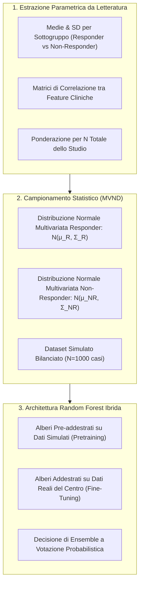

# Pretraining con Dati Simulati da Letteratura nel Machine Learning Clinico

**Summary**: Metodologia di pre-addestramento algoritmico basata sulla generazione di dati sintetici a partire da statistiche descrittive aggregate pubblicate nella letteratura scientifica (medie, deviazioni standard, matrici di correlazione disaggregate per gruppi di outcome terapeutico), finalizzata a mitigare l'overfitting e compensare la scarsità di dataset clinici aperti prima del fine-tuning su campioni reali.
**Sources**: Jacobs et al. (2026) - `2601.06159v1.pdf`
**Last updated**: 2026-08-27
---

## Definizione e Razionale Teorico

Nel contesto della medicina personalizzata e della psichiatria computazionale, i modelli di Machine Learning (ML) necessitano di volumi rilevanti di dati per identificare pattern predittivi robusti ed evitare l'overfitting. A causa delle restrizioni etico-legali sulla condivisione dei dati clinici, il **pretraining con dati simulati da letteratura** (Jacobs et al., 2026) si propone come un ponte metodologico:
1. **Smorzamento del Rumore Locale (*Noise Averaging*)**: Integrare statistiche provenienti da studi internazionali eterogenei permette di mediare il rumore idiosincratico di singoli dataset clinici locali.
2. **Riduzione del Bias di Campionamento (*Sampling Bias Mitigation*)**: L'aggregazione di parametri di diverse popolazioni riduce il rischio che il modello si fissi su caratteristiche contingenti di una specifica coorte locale.
3. **Inizializzazione Informata degli Alberi Decisionali**: Nei Random Forest, l'ensemble viene pre-popolato con alberi decisionali addestrati su distribuzioni note di *responder* e *non-responder*, combinandosi con alberi calibrati sulle associazioni del dataset reale.

---

## Formulazione Matematica e Procedura Algoritmica

### 1. Ponderazione dei Parametri di Letteratura
Per aggregare i dati da $K$ studi indipendenti, le medie dei responder ($\bar{x}_{R,k}$) e non-responder ($\bar{x}_{NR,k}$) vengono ponderate in base alla dimensione campionaria totale dello studio ($n_k$), prevenendo distorsioni indotte da tassi di risposta sbilanciati nei singoli trial:
$$\bar{\mu}_R = \frac{\sum_{k=1}^K n_k \bar{x}_{R,k}}{\sum_{k=1}^K n_k}, \qquad \bar{\mu}_{NR} = \frac{\sum_{k=1}^K n_k \bar{x}_{NR,k}}{\sum_{k=1}^K n_k}$$

Le varianze vengono stimate elevando al quadrato le deviazioni standard ponderate ($s_j^2$), consentendo la trasformazione della matrice di correlazione empirica $\mathbf{R}$ nella matrice di varianza-covarianza $\boldsymbol{\Sigma}$:
$$\Sigma_{ij} = R_{ij} \cdot s_i \cdot s_j$$

### 2. Generazione del Dataset Simulato
Vengono generati $m = 500$ vettori di feature per la classe 1 (responder) e $m = 500$ per la classe 0 (non-responder) mediante campionamento normale multivariato:
$$\mathbf{x}_{\text{sim}}^{(R)} \sim \mathcal{N}(\bar{\boldsymbol{\mu}}_R, \boldsymbol{\Sigma}_R), \qquad \mathbf{x}_{\text{sim}}^{(NR)} \sim \mathcal{N}(\bar{\boldsymbol{\mu}}_{NR}, \boldsymbol{\Sigma}_{NR})$$

### 3. Ponderazione nell'Ensemble di Random Forest
Dato un numero prefissato di alberi totali $B = 200$, la quota di alberi pre-addestrati $B_{\text{sim}}$ e di alberi fine-tuned $B_{\text{real}}$ viene controllata dal parametro di peso $w \in \{0.2, 0.5, 1.0\}$:
$$B_{\text{sim}} = \text{round}\left( \frac{w}{1 + w} \cdot B \right), \qquad B_{\text{real}} = B - B_{\text{sim}}$$
La predizione finale per un caso test unseen $\mathbf{x}^*$ è data dalla media delle probabilità di classe stimate da tutti i $B$ alberi:
$$\hat{P}(y = 1 \mid \mathbf{x}^*) = \frac{1}{B} \left[ \sum_{i=1}^{B_{\text{sim}}} \hat{p}_i^{\text{sim}}(\mathbf{x}^*) + \sum_{j=1}^{B_{\text{real}}} \hat{p}_j^{\text{real}}(\mathbf{x}^*) \right]$$

---

## Evidenze Empiriche e Limiti Clinici

| Studio / Setting | Risultato con Pretraining | Modello Standard (Solo Reale) | Esito Statistico e Interpretazione |
| :--- | :--- | :--- | :--- |
| **Studio 1 (Risposta OCD - CBT)** | Balanced Acc: $0.549 \pm 0.052$ (All-feat, 50%) | Balanced Acc: $0.526 \pm 0.035$ | $t(99) = 0.89, p = 0.19$ (n.s.). Miglioramento solo descrittivo (+2.3%). |
| **Studio 1 (Sbilanciato, No SMOTE)** | Balanced Acc: $0.571 \pm 0.050$ (All-feat, 100%) | Balanced Acc: $0.516 \pm 0.020$ | $t(99) = 2.04, p = 0.02$. Beneficio significativo come surrogato del bilanciamento. |
| **Studio 2 (Remissione OCD - CBT)** | Balanced Acc: $0.517 \pm 0.027$ (All-feat, 100%) | Balanced Acc: $\mathbf{0.650 \pm 0.036}$ | Pretraining nettamente deleterio; perdita di specificità e degradazione del segnale. |

---

## Implicazioni e Linee Guida Operative

1. **Non Applicare in Modo Indiscriminato**: Quando il dataset clinico reale possiede un segnale predittivo sufficiente (es. AUC $> 0.70$ come nello Studio 2), forzare alberi pre-addestrati su dati simulati approssimati introduce distorsioni che degradano le prestazioni.
2. **Surrogato di Bilanciamento per Classi Rare**: Il pretraining offre i massimi vantaggi quando applicato a dataset reali fortemente sbilanciati in cui la classe minoritaria (es. non-responders) è poco rappresentata e le tecniche di oversampling convenzionale (SMOTE) non riescono a estrarre struttura.
3. **Necessità di Modelli Generativi Non Parametrici**: Superare la distribuzione normale multivariata implementando la stima di densità via kernel (*Kernel Density Estimation*, Rosenblatt, 1956) per rispettare asimmetrie ed effetti pavimento/soffitto tipici delle scale cliniche (YBOCS, BDI-II, HAM-D).

---

## Related pages
- [[2601-06159v1]]: Sintesi completa dello studio empirico originale.
- [[open-data-scarcity-clinical-psychology]]: Quadro etico e metodologico della carenza di dati condivisi in ambito clinico.
- [[mccv-and-statistical-validation-clinical-ml]]: Protocolli di validazione MCCV e inferenza statistica corretta.
- [[treatment-outcome-and-relapse-prediction]]: Modelli predittivi dell'efficacia psicoterapeutica.
- [[ai-clinical-decision-support]]: Sistemi di supporto alle decisioni cliniche.
