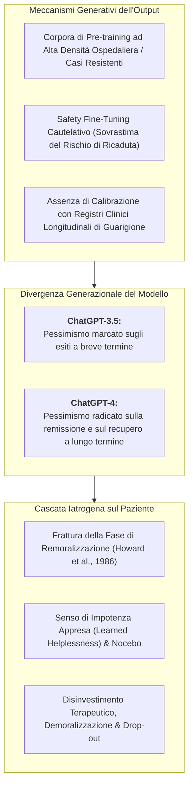
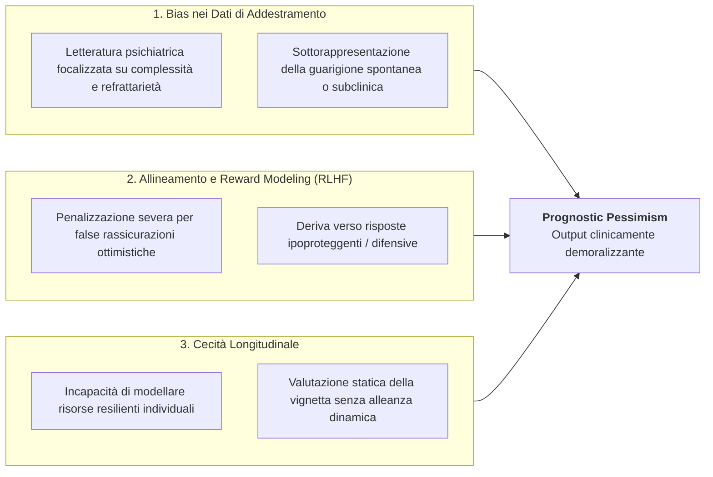
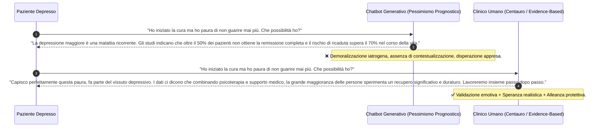

---
tags: [prognostic-pessimism, mental-health-ai, clinical-trajectories, psychiatric-forecasting, chatgpt-bias, learned-helplessness, nocebo-effect, treatment-demoralization, longitudinal-calibration, clinical-psychology]
source_papers: ["mental-v12-e81204.pdf"]
---

# Prognostic Pessimism in Clinical AI (Pessimismo Prognostico nell'Intelligenza Artificiale Clinica)

## Definizione Operativa
- Il costrutto di **Prognostic Pessimism in Clinical AI** (Pessimismo Prognostico dell'IA Clinica) definisce la tendenza sistematica ed empiricamente replicata dei modelli linguistici di grandi dimensioni ([[large-language-models|LLM]]), in particolare della famiglia ChatGPT (GPT-3.5 e GPT-4), a formulare previsioni cliniche sul decorso e sulla guarigione da disturbi mentali marcatamente più negative, infauste e cronificanti rispetto a quelle espresse da clinici umani (psichiatri e psicologi) o stimate da modelli statistici longitudinali (Balan & Gumpel, 2025; *JMIR Mental Health*, doi: [10.2196/81204](https://doi.org/10.2196/81204); Elyoseph, Levkovich & Shinan-Altman, 2024; Elyoseph & Levkovich, 2024; Levkovich, 2025).
- **Rilevanza Clinica e Rischio Iatrogeno:**
  - Nella psicoterapia evidence-based e nel modello delle fasi di cambiamento (Howard et al., 1986), l'instillazione della speranza e l'aspettativa positiva (*remoralization*) costituiscono il primo fattore comune predittivo di esito favorevole;
  - Se un paziente in condizioni di vulnerabilità o distress riceve da un chatbot una prognosi iper-pessimistica, l'interazione può innescare **demoralizzazione iatrogena** (*treatment demoralization*), senso di impotenza appresa (*learned helplessness*) ed effetto nocebo, inducendo disinvestimento emotivo o abbandono precoce del trattamento (*drop-out*).

---

## Evidenze Empiriche e Fenomenologia del Bias

La scoping review di Balan & Gumpel (2025) ha analizzato i trial primari dedicati alla prognosi generata da ChatGPT, rilevando una convergenza unanime sul fenomeno:

### 1. Depressione Maggiore e Stima di Guarigione
- Nello studio di **Elyoseph, Levkovich & Shinan-Altman (2024)**, vignette cliniche standardizzate descriventi pazienti con disturbo depressivo maggiore sono state sottoposte a ChatGPT-3.5, ChatGPT-4, professionisti della salute mentale (psichiatri e psicoterapeuti) e a un campione di controllo della popolazione generale:
  - ChatGPT ha stimato tassi di recupero e percentuali di miglioramento sintomatico significativamente inferiori rispetto sia ai clinici che al pubblico laico;
  - I professionisti umani hanno calibrato le loro stime tenendo conto della responsività ai trattamenti combinati (farmacoterapia + psicoterapia), mentre il modello generativo ha trattato l'episodio depressivo come una condizione ad alto tasso di cronicità intrinseca.

### 2. Schizofrenia ed Esiti di Recovery
- Nella ricerca di **Elyoseph & Levkovich (2024)**, focalizzata sul recupero nei disturbi dello spettro psicotico:
  - ChatGPT ha espresso una visione marcatamente più pessimistica sulle prospettive di reintegrazione psicosociale, funzionamento lavorativo e remissione dei sintomi negativi rispetto agli psichiatri;
  - Il modello ha sottostimato la variabilità delle traiettorie individuali positive, appiattendo la prognosi sui casi storici a prognosi infausta.

### 3. Divergenza Temporale tra Versioni del Modello
- **ChatGPT-3.5 vs ChatGPT-4:** Come evidenziato da Balan & Gumpel (2025) e Levkovich (2025):
  - *GPT-3.5:* Tende a prevedere fallimenti immediati o mancata risposta nelle prime 4-8 settimane di presa in carico;
  - *GPT-4:* Pur mostrando una comprensione linguistica più sfumata dei fattori di rischio, manifesta un pessimismo strutturale sul lungo periodo (>12-24 mesi), predicendo tassi di recidiva sproporzionati rispetto alle evidenze epidemiologiche.

---

## Determinanti Computazionali ed Epistemiche

1. **Bias di Campionamento nei Corpora Accademici (*Publication & Referral Bias*):** Gli articoli scientifici e le cartelle cliniche indicizzate nel web privilegiano la discussione di quadri atipici, resistenti al trattamento (*treatment-resistant depression*) o con comorbilità severe. I decorsi favorevoli non complicati raramente generano letteratura accademica voluminosa, portando il modello a sovrastimare la cronicità statistica.
2. **Asimmetria del Safety Tuning (RLHF):** Durante l'addestramento con rinforzo umano (RLHF), le risposte che minimizzano eccessivamente il rischio o offrono rassicurazioni prive di fondamento vengono penalizzate come "pericolose". Di conseguenza, il modello impara che adottare un tono severo e cauto riduce le penalità, scivolando in un pessimismo sistemico non calibrato.
3. **Mancanza di Interazione Relazionale e Resilienza:** La prognosi clinica umana non è un mero calcolo attuariale statico, ma integra la valutazione delle risorse dell'Io, del supporto sociale, della motivazione e dell'alleanza di lavoro. Il modello, analizzando unicamente il testo della vignetta, valuta la patologia in isolamento dalle risorse protettive.

---

## Confronto Clinico: Dialogo Prognostico

---

## Raccomandazioni di Mitigazione e Governance

Per neutralizzare l'impatto iatrogeno del pessimismo prognostico, Balan & Gumpel (2025) e le linee guida internazionali raccomandano:

1. **Divieto di Erogazione Prognostica Standalone:** I sistemi di IA non devono formulare stime prognostiche percentualistiche o predizioni di decorso direttamente all'utente finale;
2. **Calibrazione su Dati Longitudinali del Mondo Reale:** I moduli predittivi devono essere addestrati e calibrati su registri clinici longitudinali di popolazione (*Electronic Health Records* rappresentativi di cure primarie e secondarie), superando il bias della letteratura accademica pato-centrica;
3. **Recovery-Oriented Prompting:** Implementazione di prompt di sistema che vincolino l'output del modello a inquadrare la prognosi entro i paradigmi di *recovery*, sottolineando la plasticità del cambiamento e la pluralità dei percorsi terapeutici disponibili;
4. **Preservazione del [[modello-centauro-clinico|Modello Centauro]]:** La comunicazione della prognosi e il contenimento dell'angoscia sul futuro devono rimanere una prerogativa esclusiva del clinico umano, capace di dosare speranza e realismo all'interno della relazione terapeutica.

---

## Riferimenti Bibliografici
- Balan, R., & Gumpel, T. P. (2025). ChatGPT Clinical Use in Mental Health Care: Scoping Review of Empirical Evidence. *JMIR Mental Health*, 12, e81204. https://doi.org/10.2196/81204
- Elyoseph, Z., & Levkovich, I. (2024). Comparing the perspectives of generative AI, mental health experts, and the general public on schizophrenia recovery: case vignette study. *JMIR Mental Health*, 11, e53043. https://doi.org/10.2196/53043
- Elyoseph, Z., Levkovich, I., & Shinan-Altman, S. (2024). Assessing prognosis in depression: comparing perspectives of AI models, mental health professionals and the general public. *Family Medicine and Community Health*, 12(Suppl 1), e002583. https://doi.org/10.1136/fmch-2023-002583
- Fimiani, R., Gazzillo, F., Gorman, B., et al. (2023). The therapeutic effects of the therapists’ ability to pass their patients’ tests in psychotherapy. *Psychotherapy Research*, 33(6), 729–742. https://doi.org/10.1080/10503307.2022.2157227
- Howard, K. I., Kopta, S. M., Krause, M. S., & Orlinsky, D. E. (1986). The dose-effect relationship in psychotherapy. *American Psychologist*, 41(2), 159–164. https://doi.org/10.1037/0003-066X.41.2.159
- Levkovich, I. (2025). Evaluating diagnostic accuracy and treatment efficacy in mental health: a comparative analysis of large language model tools and mental health professionals. *European Journal of Investigation in Health, Psychology and Education*, 15(1), 9. https://doi.org/10.3390/ejihpe15010009

---

## Relazioni
- [[mental-v12-e81204]]: Scoping review di Balan & Gumpel (2025) su 60 studi empirici di ChatGPT in salute mentale.
- [[prompt-experiment-gap-in-clinical-ai]]: Divario tra sperimentazioni su prompt sintetici e validazione clinica su pazienti reali.
- [[clinical-readiness-gap-in-mh-chatbots]]: Divario tra scorrevolezza testuale ed evidenze di efficacia terapeutica controllata.
- [[modello-centauro-clinico]]: Preservazione del ruolo ermeneutico e relazionale del terapeuta umano.
- [[sycophantic-mirroring]]: Rischio opposto di compiacenza illusoria nei modelli linguistici.
- [[digital-therapeutic-alliance]]: Costruzione dell'alleanza di lavoro e instillazione della speranza terapeutica.
- [[care-continuum-ai-functions-mental-health]]: Mappatura delle funzioni algoritmiche lungo il continuum di cura.
