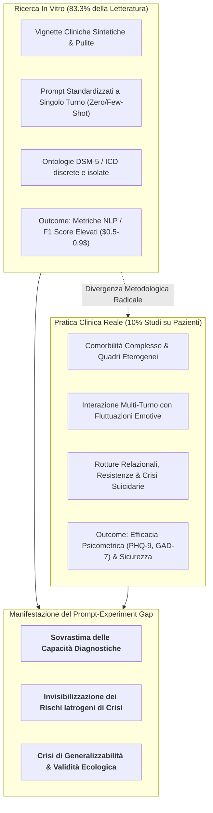
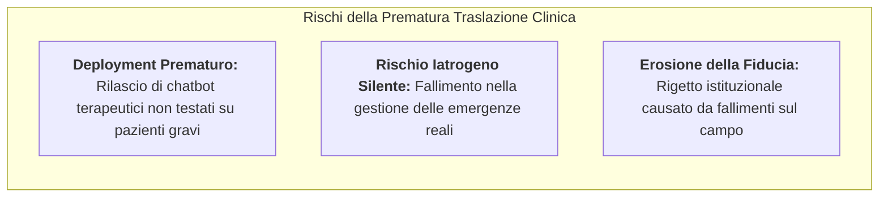

---
tags: [prompt-experiment-gap, synthetic-benchmarks, ecological-validity, clinical-trials, evaluation-frameworks, digital-mental-health, prompt-engineering, generalizability-crisis, clinical-psychology]
source_papers: ["mental-v12-e81204.pdf"]
---

# Prompt-Experiment Gap in Clinical AI (Divario dei Prompt-Experiment nell'IA Clinica)

## Definizione Operativa
- Il **Prompt-Experiment Gap** (Divario dei Prompt-Experiment) definisce la profonda dissociazione metodologica ed ecologica rilevata nella ricerca sui Large Language Models ([[large-language-models|LLM]]) applicati alla salute mentale, caratterizzata da una schiacciante predominanza di studi condotti esclusivamente tramite **prompt sintetici e vignette simulate in vitro** rispetto alla quasi totale assenza di sperimentazioni su pazienti clinici reali (Balan & Gumpel, 2025; *JMIR Mental Health*, doi: [10.2196/81204](https://doi.org/10.2196/81204)).
- **Entità e Impatto Sistemico:**
  - Nella scoping review di Balan & Gumpel (2025) su 60 studi primari su ChatGPT in salute mentale, l'**83.3% ($n=50$)** delle ricerche è costituito da meri *prompt experiments* (testo standardizzato inviato al modello senza alcuna interazione umana);
  - Soltanto il **10% ($n=6$)** ha coinvolto partecipanti provenienti da popolazioni cliniche reali e appena il **5% ($n=3$)** ha adottato un disegno controllato randomizzato (RCT);
  - Questo divario produce una **falsa impressione di maturità clinica** (*illusory clinical readiness*): i modelli appaiono altamente competenti ($F_1 = 0.50-0.90$) nel risolvere casi clinici formalizzati e puliti, ma falliscono catastroficamente di fronte alla complessità, all'ambiguità e all'instabilità emotiva dei pazienti del mondo reale.

---

## I Quattro Fattori Strutturali del Prompt-Experiment Gap

Balan & Gumpel (2025) evidenziano quattro dimensioni critiche che rendono i benchmark basati su prompt inaffidabili per guidare l'adozione clinica:

### 1. Riduzionismo da Vignetta Sintetica vs Comorbilità Reale
- Nei prompt sperimentali, i quadri clinici vengono condensati in brevi paragrafi coerenti che elencano pedissequamente i criteri diagnostici del DSM-5 (es. "Paziente di 30 anni con umore depresso da 3 settimane, insonnia, anedonia e astenia").
- Nella realtà clinica (Steffen et al., 2020; Greger et al., 2025), oltre il **70% dei pazienti** presenta comorbilità multiple (es. depressione maggiore con disturbo borderline di personalità e abuso di sostanze), sintomi fluttuanti e narrazioni frammentate, contesti in cui l'accuratezza di ChatGPT crolla al di sotto di $F_1 = 0.50$ (Cardamone et al., 2025).

### 2. Disaccoppiamento tra Fluenza Linguistica ed Efficacia Terapeutica
- La valutazione basata su prompt misura unicamente la *plausibilità formale* della risposta del modello (grammatica, tono empatico simulato, pertinenza lessicale).
- Tuttavia, la coerenza conversazionale non equivale a un meccanismo di cambiamento psicoterapeutico (APA Task Force, 2006). L'assenza di metriche psicometriche validate (riduzione duratura dei punteggi PHQ-9 o GAD-7, miglioramento del funzionamento sociale) impedisce di stabilire se l'interazione generi reale beneficio clinico o mero intrattenimento digitale.

### 3. Cecità alla Dinamica Relazionale Multi-Turno e alle Crisi Acute
- I prompt experiment sono prevalentemente *statici* o limitati a pochi turni di scambio.
- Negli interventi reali, i momenti più critici emergono in modo latente nel corso di conversazioni prolungate: escalation dell'ideazione suicidaria, scoppi di rabbia, tentativi di manipolazione o formazione di attaccamenti para-sociali distorti ([[artificial-intimacy|intimità artificiale]]). In tali scenari dinamici, i modelli standard mostrano gravi ritardi nell'attivazione di alert e referral appropriati (Heston, 2023; McBain et al., 2025).

### 4. Bias Demografico di Selezione (Digital Natives WEIRD)
- Nei rarissimi studi che coinvolgono utenti reali ($n=10$), i campioni sono composti quasi esclusivamente da giovani adulti altamente scolarizzati, a loro agio con le tecnologie digitali (*digital natives*), mentre risultano totalmente trascurate le fasce vulnerabili: adolescenti, anziani con decadimento cognitivo o popolazioni marginalizzate prive di alfabetizzazione digitale (Benvenuti et al., 2023; Wang & Li, 2024).

---

## Matrice Comparativa: In Vitro vs In Vivo

| Dimensione | Prompt Experiments (In Vitro) | Sperimentazione Clinica Reale (In Vivo) |
| :--- | :--- | :--- |
| **Input Primario** | Testo formattato, vignette sintetiche prive di rumore | Narrazione disordinata, reticenze, prosodia, non-verbale |
| **Complessità Diagnostica** | Categoriale singola (es. Depressione vs Ansia) | Multi-comorbilità, tratti di personalità, somatizzazioni |
| **Dinamica Conversazionale** | Interazione a 1 o 2 turni (Zero/Few-Shot) | Processo terapeutico longitudinale su settimane o mesi |
| **Metriche di Valutazione** | $F_1$ score, accuratezza lessicale, plausibilità soggettiva | Riduzione sintomatica psicometrica, tassi di drop-out, alleanza |
| **Rilevazione del Rischio** | Esercizio teorico su parole-chiave di rischio | Gestione di disclosure ambigue, emergenze e acting-out |
| **Interferenze Psicologiche** | Assenti (valutazione computazionale asettica) | [[algorithm-aversion|Algorithm aversion]], sfiducia, attaccamento para-sociale |

---

## Conseguenze per la Ricerca e l'Adozione Sanitaria

1. **Rischio di Validazione Circolare:** Gli sviluppatori addestrano e valutano i modelli sugli stessi formati di prompt sintetici, creando un circuito chiuso in cui l'IA ottiene punteggi perfetti senza mai confrontarsi con la complessità ecologica della mente umana.
2. **Ignorare l'Algorithm Aversion:** I prompt experiment non catturano l'impatto psicologico dell'interazione con una macchina. Nella realtà clinica, la semplice consapevolezza che un consiglio provenga da un'IA riduce la fiducia e la compliance del paziente, anche quando il contenuto è identico a quello umano (Reis et al., 2024; Keung & So, 2025).

---

## Roadmap per Colmare il Prompt-Experiment Gap

Per trasformare le promesse dell'IA generativa in interventi sanitari evidence-based, Balan & Gumpel (2025) propongono:

1. **Transizione verso Trial Clinici Controllati (RCT):** Prioritizzare investimenti in studi clinici controllati con gruppi di confronto attivi (terapia umana standard, interventi digitali tradizionali evidence-based);
2. **Adozione di Framework di Valutazione Multidimensionali:** Misurare outcome clinici standardizzati (PHQ-9, GAD-7, Working Alliance Inventory - WAI) e monitorare parametri di sicurezza a lungo termine;
3. **Simulazioni Ecologiche Multi-Turno e Red-Teaming Clinico:** Testare i modelli tramite simulazioni dinamiche complesse che includano tentativi di manipolazione, discorsi deliranti e variazioni culturali prima del testing su umani;
4. **Co-Design Partecipativo:** Coinvolgimento diretto di clinici, comitati etici e rappresentanze di pazienti nella formulazione dei prompt e nella definizione dei protocolli di escalation.

---

## Riferimenti Bibliografici
- Balan, R., & Gumpel, T. P. (2025). ChatGPT Clinical Use in Mental Health Care: Scoping Review of Empirical Evidence. *JMIR Mental Health*, 12, e81204. https://doi.org/10.2196/81204
- APA Presidential Task Force on Evidence-Based Practice. (2006). Evidence-based practice in psychology. *American Psychologist*, 61(4), 271–285. https://doi.org/10.1037/0003-066X.41.2.159
- Benvenuti, M., Wright, M., Naslund, J., & Miers, A. C. (2023). How technology use is changing adolescents’ behaviors and their social, physical, and cognitive development. *Current Psychology*, 42(19), 16466–16469. https://doi.org/10.1007/s12144-023-04254-4
- Cardamone, N. C., Olfson, M., Schmutte, T., et al. (2025). Classifying unstructured text in electronic health records for mental health prediction models: large language model evaluation study. *JMIR Medical Informatics*, 13, e65454. https://doi.org/10.2196/65454
- Greger, H. K., Kayed, N. S., Lehmann, S., et al. (2025). Prevalence and comorbidity of mental disorders among young adults with a history of residential youth care - a two-wave longitudinal study of stability and change. *European Archives of Psychiatry and Clinical Neuroscience*. https://doi.org/10.1007/s00406-025-02007-x
- Heston, T. F. (2023). Safety of large language models in addressing depression. *Cureus*, 15(12), e50729. https://doi.org/10.7759/cureus.50729
- Keung, W. M., & So, T. Y. (2025). Attitudes towards AI counseling: the existence of perceptual fear in affecting perceived chatbot support quality. *Frontiers in Psychology*, 16, 1538387. https://doi.org/10.3389/fpsyg.2025.1538387
- McBain, R. K., Cantor, J. H., Zhang, L. A., et al. (2025). Competency of large language models in evaluating appropriate responses to suicidal ideation: comparative study. *Journal of Medical Internet Research*, 27, e67891. https://doi.org/10.2196/67891
- Reis, M., Reis, F., & Kunde, W. (2024). Influence of believed AI involvement on the perception of digital medical advice. *Nature Medicine*, 30(11), 3098–3100. https://doi.org/10.1038/s41591-024-03180-7
- Steffen, A., Nübel, J., Jacobi, F., Bätzing, J., & Holstiege, J. (2020). Mental and somatic comorbidity of depression: a comprehensive cross-sectional analysis of 202 diagnosis groups using German nationwide ambulatory claims data. *BMC Psychiatry*, 20(1), 142. https://doi.org/10.1186/s12888-020-02546-8
- Wang, Y., & Li, S. (2024). Tech vs. tradition: ChatGPT and mindfulness in enhancing older adults' emotional health. *Behavioral Sciences*, 14(10), 923. https://doi.org/10.3390/bs14100923

---

## Relazioni
- [[mental-v12-e81204]]: Scoping review di Balan & Gumpel (2025) su 60 studi empirici di ChatGPT in salute mentale.
- [[prognostic-pessimism-in-clinical-ai]]: Analisi del bias di pessimismo prognostico sistematico nei modelli generativi.
- [[clinical-readiness-gap-in-mh-chatbots]]: Divario tra fluenza computazionale e rigorosa prontezza clinico-regolatoria.
- [[algorithmic-tractability-in-psychotherapy]]: Tassonomia della trattabilità algoritmica di quadri clinici manualizzati vs complessi.
- [[epistemological-paradox-in-clinical-ai]]: Dilemma etico tra necessità di sperimentazione su popolazioni vulnerabili e rischio iatrogeno.
- [[modello-centauro-clinico]]: Cooperazione human-in-the-loop per colmare i limiti dei modelli generativi.
- [[traffic-light-quality-appraisal-clinical-ai]]: Framework per valutare il rigore metodologico degli studi su IA clinica.
