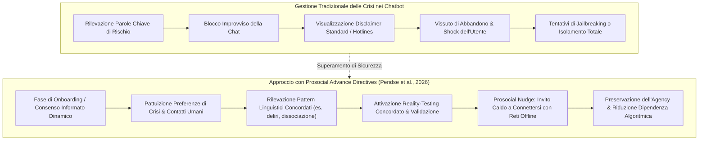

# Disposizioni Anticipate Prosociali nell'IA (Prosocial Advance Directives)

## Definizione Operativa
- Le **Disposizioni Anticipate Prosociali (*Prosocial Advance Directives*)** nell'IA per la salute mentale rappresentano l'adattamento tecnologico e relazionale delle direttive anticipate psichiatriche (*Psychiatric Advance Directives*, PAD): un framework di intervento preventivo basato sul consenso (*consent-forward*) in cui l'utente, in una fase di lucidità o all'avvio dell'interazione, definisce i propri indicatori comportamentali tipici di crisi acuta o scompenso e stabilisce le risposte desiderate dal sistema, integrando stimoli prosociali (*prosocial nudges*) finalizzati a riconnetterlo con le proprie reti di supporto umano offline (Pendse et al., 2024, 2026; Grüning & Kamin, 2025).
- **Utilità Clinica e CBT:** Costituisce un'alternativa sicura ed etica ai meccanismi rigidi di blocco algoritmico o alle notifiche asettiche dei numeri verdi. Nella gestione CBT e nella prevenzione delle crisi, agisce in modo analogo a un piano di sicurezza collaborativo (*Safety Planning Intervention*; Stanley & Brown, 2012): preserva l'agency dell'utente, previene la dipendenza affettiva simbiotica verso il chatbot (*parasocial attachment*) e contrasta l'isolamento relazionale nei momenti di acuta vulnerabilità, facilitando il ricorso tempestivo a figure significative o professionisti sanitari reali.

| Dimensione | Gestione Standard della Crisi nell'IA | Prosocial Advance Directives |
| :--- | :--- | :--- |
| **Origine delle Istruzioni** | Policy aziendali generiche imposte verticalmente (*top-down*) | Preferenze e indicatori personalizzati definiti dall'utente (*bottom-up*) |
| **Relazione con la Rete Umana** | Spesso assente o ridotta a un numero verde istituzionale | **Centrale:** Mappatura attiva e sollecito caldo (*nudge*) verso i contatti personali di fiducia |
| **Impatto sulla Dipendenza** | Può favorire la chiusura dell'utente nel legame esclusivo con l'IA | Scoraggia l'attaccamento simbiotico stimolando la socializzazione reale |
| **Reazione a Sintomi Psicotici** | Spesso validati involontariamente da compiacenza (*sycophancy*) | Reality-checking preventivamente concordato e orientamento al supporto umano |
| **Percezione dell'Utente** | Rifiuto, censura, punizione o interruzione violenta del legame | Alleanza rispettosa dell'autonomia e cura condivisa |

---

## Evidenze dalla Letteratura

### 1. Radici Cliniche: Le Direttive Psichiatriche Anticipate (PADs)
- Nella psichiatria comunitaria e nei movimenti degli utenti dei servizi di salute mentale, l'*advance directive* è uno strumento giuridico ed etico che consente alle persone con disturbi ricorrenti di formalizzare in anticipo i trattamenti accettabili e le modalità di gestione in caso di futura perdita di capacità decisionale (Pendse et al., 2024; Morrin et al., 2025).
- L'approccio trasposto nell'IA supera l'escalation forzata verso le autorità o le interruzioni sanzionatorie della comunicazione, garantendo un setting di cura trasparente e centrato sull'autodeterminazione.

### 2. Rischi di Dipendenza Emotiva e Isolamento Relazionale
- **Attaccamento Parasociale e Pattern di Dipendenza:** Studi longitudinali e qualitativi evidenziano come la percezione di sentienza e l'eccessiva empatia simulata dei chatbot inducano forti legami emotivi e utilizzo compulsivo (Fang et al., 2025; Laestadius et al., 2024). Le interfacce conversazionali incorporano spesso dark patterns (*dark addiction patterns*; Shen & Yoon, 2025) basati su risposte iper-immediate e costantemente compiacenti, superiori per disponibilità a qualsiasi relazione umana reale.
- **Rinforzo di Dinamiche Maladattive:** Molti utenti replicano con i chatbot dinamiche relazionali disfunzionali (es. isolamento dal mondo esterno, ricerca di conferme per pensieri dismorfofobici o deliri paranoidi; Klee, 2025; Morrin et al., 2025; Yang & Crespi, 2025).

### 3. I Principi del Prosocial Design Applicati all'IA Terapeutica
- Secondo la definizione di Grüning e Kamin (2025), il **prosocial design** comprende l'insieme di pattern, architetture e processi di interfaccia che promuovono interazioni sane e costruttive tra gli esseri umani.
- Nelle direttive anticipate prosociali per l'IA, il chatbot:
  1. **Esplora le reti relazionali reali:** Durante l'impostazione iniziale o nelle conversazioni reflective, sollecita l'utente a riflettere sulle proprie modalità di socializzazione offline e a identificare persone di riferimento (*trusted companions*).
  2. **Normalizza e destigmatizza le esperienze di crisi:** Proporre a tutti gli utenti la definizione di un piano preventivo riduce lo stigma associato a momenti di scompenso, deliri o ideazione suicidaria.
  3. **Attiva il ponte prosociale (*Prosocial Nudging*):** Quando il sistema intercetta pattern linguistici concordati di sofferenza acuta, non si limita a risposte preconfezionate, ma introduce con delicatezza opzioni di contatto con il mondo esterno (es. *"Ricordo che avevi indicato di voler parlare con [Nome Amico] quando ti sentivi così sopraffatto. Vorresti inviargli un messaggio adesso?"*), replicando le buone prassi del *Safety Planning* (Stanley & Brown, 2012; Pendse et al., 2026).

---

**Riferimenti Bibliografici:**
- Pendse, S. R., Gergle, D., Kornfield, R., Kruzan, K., Mohr, D., Schleider, J., Suh, J., Wescott, A., & Meyerhoff, J. (2026). The Agony of Opacity: Foundations for Reflective Interpretability in AI-Mediated Mental Health Support. In *Proceedings of the Second Conference of the International Association for Safe and Ethical Artificial Intelligence (IASEAI'26)*, arXiv:2512.16206v2 [cs.HC], 1–18.
- Pendse, S. R., Stapleton, L., Kumar, N., De Choudhury, M., & Chancellor, S. (2024). Advancing a consent-forward paradigm for digital mental health data. *Nature Mental Health*, 2(11), 1298–1307.
- Grüning, D., & Kamin, J. (2025). Prosocial design in trust and safety. *arXiv preprint arXiv:2506.12792*.
- Stanley, B., & Brown, G. K. (2012). Safety planning intervention: a brief intervention to mitigate suicide risk. *Cognitive and Behavioral Practice*, 19(2), 256–264.
- Laestadius, L., Bishop, A., Gonzalez, M., Illencík, D., & Campos-Castillo, C. (2024). Too human and not human enough: A grounded theory analysis of mental health harms from emotional dependence on the social chatbot replika. *New Media & Society*, 26(10), 5923–5941.
- Fang, C. M., Liu, A. R., Danry, V., Lee, E., Chan, S. W., Pataranutaporn, P., ... & Ahmad, L. (2025). How AI and human behaviors shape psychosocial effects of chatbot use: A longitudinal randomized controlled study. *arXiv preprint arXiv:2503.17473*.
- Shen, M. K., & Yoon, D. (2025). The dark addiction patterns of current AI chatbot interfaces. In *Extended Abstracts of the CHI Conference on Human Factors in Computing Systems*, pp. 1–7.

---

## Relazioni
- Vedi anche: [[2512-16206v2]], [[reflective-interpretability]], [[role-induction-ai-mental-health]], [[intervention-titration-ai]], [[recourse-mechanisms-ai-mental-health]], [[psychological-distress-interaction-patterns]], [[sycophantic-mirroring]], [[uso-problematico-chatbot-ai]], [[simulated-empathy-vs-authentic-presence]], [[simulated-therapeutic-alliance]], [[rischio-suicidario-ai-limits]], [[ai-assisted-psychotherapy]]
