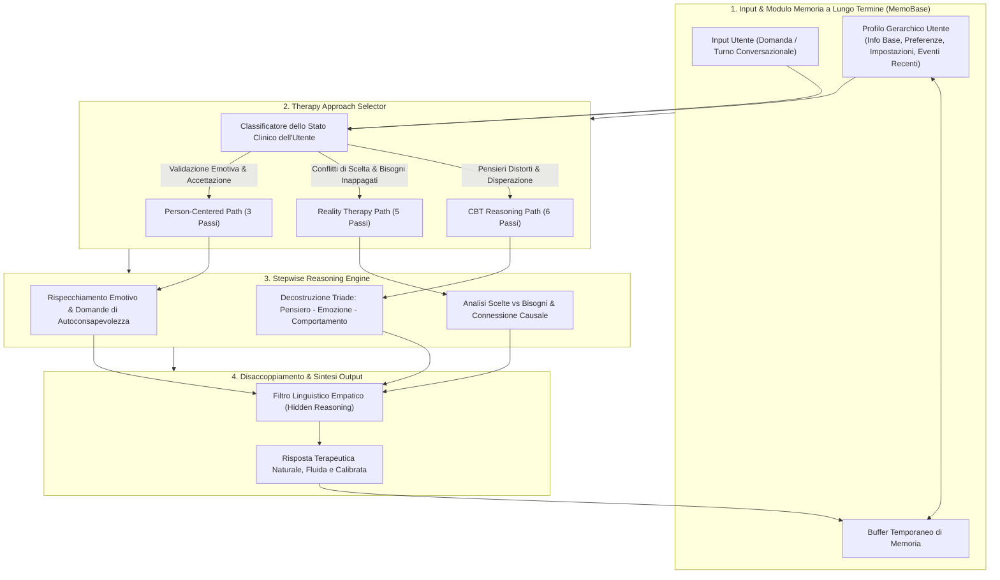

# PsychoLexTherapy Framework

## Definizione Operativa
- Architettura modulare di dialogo psicoterapeutico assistito da intelligenza artificiale progettata per operare interamente *on-device* tramite Small Language Models (SLM, modelli compatti sotto i 10 miliardi di parametri, come Gemma-3 4.3B) (Abbasi & Naderi, 2025).
- Il framework integra quattro componenti cardinali: (1) **PsychoLexEval**, benchmark per verificare la competenza psicologica di base del modello; (2) **Therapy Approach Selector**, un classificatore dinamico che analizza il bisogno clinico primario e instrada il dialogo verso il modello teorico più appropriato; (3) **Stepwise Therapeutic Reasoning Paths**, percorsi procedurali di inferenza clinica interna (per CBT, Reality Therapy e Person-Centered Therapy); (4) **MemoBase Long-Term Memory Module**, un sistema di gestione e profilazione dinamica gerarchica della memoria per la continuità multi-sessione.
- **Utilità CBT e Clinica:** Risolve il divario tra la mera fluidità conversazionale e la reale logica psicoterapeutica; disaccoppia la traccia inferenziale analitica dal messaggio empatico finale prevenendo l'intrusione di gergo pedante; assicura la riservatezza assoluta dei dati sanitari ed emotivi sensibili grazie all'esecuzione locale senza dipendenza da server cloud terzi.

## Evidenze dalla Letteratura

### 1. Limiti del Prompting Diretto e Necessità di Architetture Modulari
- Gli agenti conversazionali per la salute mentale basati su prompting diretto generano risposte calde ma superficiali (*surface-level empathy*), prive di progressione strategica verso il cambiamento cognitivo o comportamentale (Sorin et al., 2024; Abbasi & Naderi, 2025).
- L'approccio classico con Chain-of-Thought (CoT) non disaccoppiato tende a riversare il ragionamento diagnostico direttamente nell'output, inducendo freddezza e distruggendo l'alleanza terapeutica. PsychoLexTherapy risolve questa criticità strutturando il ragionamento in una sequenza invisibile all'utente, il cui esito viene tradotto in linguaggio empatico e naturale (Abbasi & Naderi, 2025).

### 2. Gestione della Memoria a Lungo Termine (MemoBase)
- Nelle conversazioni multi-turno prolungate, la semplice concatenazione del contesto storico (*naive context concatenation*) provoca perdita di informazioni rilevanti, sovraccarico di token e incoerenze affettive.
- PsychoLexTherapy impiega MemoBase per costruire e aggiornare costantemente profili utente articolati su quattro macro-dimensioni:
  1. *Basic Information:* Dati anagrafici, contestuali e linguistici.
  2. *Ongoing Preferences:* Argomenti sensibili, stile relazionale desiderato e mete di crescita.
  3. *Personalization Settings:* Calibrazione del registro comunicativo e lunghezza preferita delle risposte.
  4. *Recent Events:* Eventi di vita salienti memorizzati con etichette temporali.
- Il sistema include un'area di bufferaggio temporaneo che valida le nuove informazioni prima di consolidarle nel profilo stabile, prevenendo derive del profilo (*profile drift*).

### 3. Validazione Sperimentale
- **Selezione del Modello Base (Gemma-4B):** Nel benchmark PsychoLexEval (3.430 MCQ), Gemma-3 4.3B ha raggiunto un'accuratezza del 50,4%, dimostrando una competenza teorica idonea per il ragionamento clinico locale su computer standard, superando nettamente modelli come LLaMA-3.2 (28,7%) e Mistral-7B (31,2%).
- **Superiorità Single-Turn (PsychoLexQuery):** Nelle valutazioni automatizzate con LLM-as-a-judge, PsychoLexTherapy ha registrato un punteggio complessivo di 7.24 (rispetto a 6.45 dei sistemi multi-agente e 3.15 del prompting semplice), classificandosi al primo posto assoluto nella valutazione umana in cieco con psicologi (rank medio 1.43 vs 2.00 di Empathic Agents e 3.25 del prompt semplice).
- **Efficacia Multi-Turn (PsychoLexDialogue):** L'integrazione di MemoBase ha elevato il punteggio complessivo da 6.99 (senza memoria) a **8.14** (con memoria), con incrementi marcati nell'empatia percepita (9.2), nella coerenza dei contenuti (8.8), nell'allineamento terapeutico (8.8) e nella personalizzazione (8.6).

**Riferimenti Bibliografici:**
- Abbasi, M. A., & Naderi, H. (2025). PsychoLexTherapy: Simulating Reasoning in Psychotherapy with Small Language Models in Persian. *arXiv preprint arXiv:2510.03913v1 [cs.CL]*, 1–26. https://doi.org/10.48550/arXiv.2510.03913
- Packer, C., Fang, V., Patil, S. G., Lin, K., Wooders, S., & Gonzalez, J. E. (2023). MemGPT: Towards LLMs as Operating Systems. *arXiv preprint arXiv:2310.08560*.
- Xu, J., Li, Z., Chen, W., Wang, Q., Gao, X., Cai, Q., et al. (2024). On-device language models: A comprehensive review. *arXiv preprint arXiv:2409.00088*.
- Wiest, I. C., Ferber, D., Zhu, J., van Treeck, M., Meyer, S. K., Juglan, R., et al. (2024). Privacy-preserving large language models for structured medical information retrieval. *NPJ Digital Medicine*, 7, 257.

## Relazioni
- Vedi anche: [[2510.03913v1]], [[therapeutic-reasoning-paths]], [[on-device-slm-mental-health]], [[persian-psychotherapy-benchmarks]], [[memory-augmented-therapeutic-dialogue]], [[crdial-framework]], [[cbt-dialogue-systems-and-tools]], [[simulated-therapeutic-alliance]], [[stepwise-cot]]
