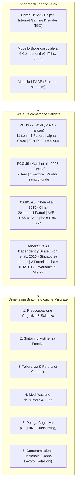
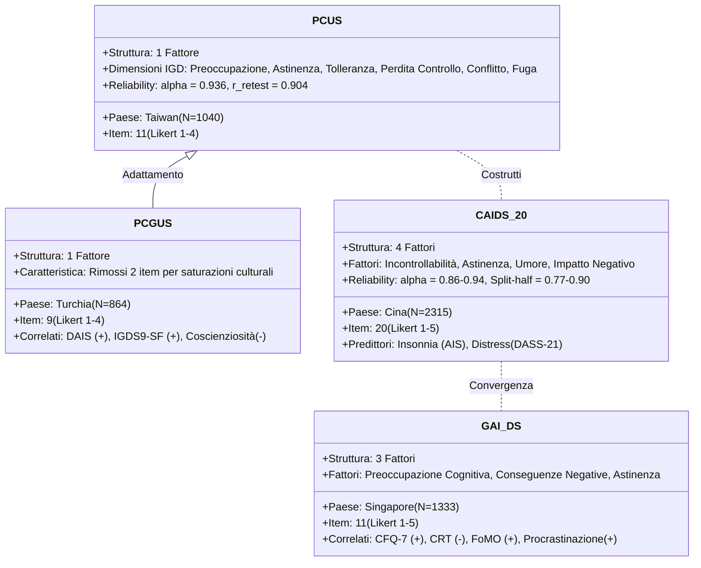
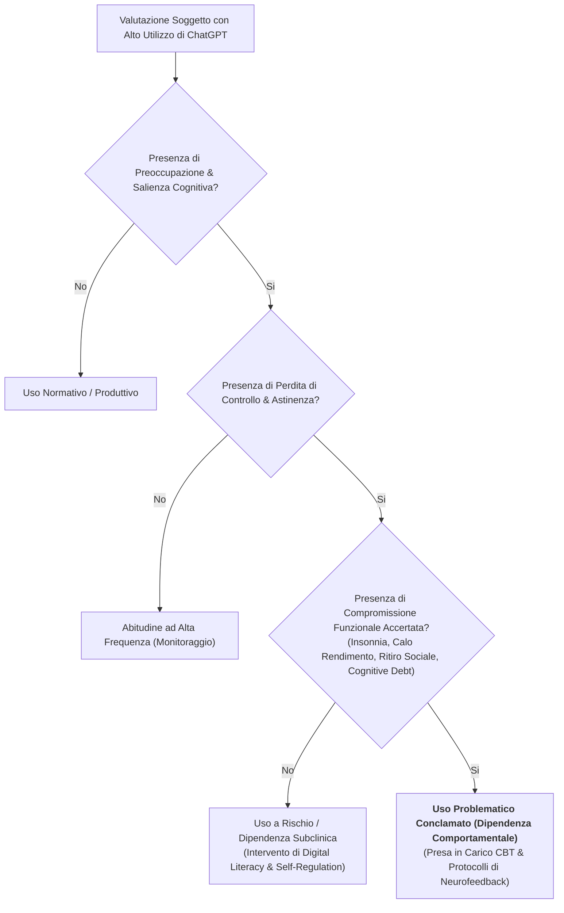

# Assessment Psicometrico dell'Uso Problematico e Dipendenza da IA Generativa (Psychometric Assessment of Problematic Generative AI Use)

## Definizione Operativa
- L'**Assessment Psicometrico dell'Uso Problematico di IA Generativa** comprende l'insieme di strumenti quantitativi standardizzati, validati empiricamente e ancorati ai modelli teorici delle dipendenze comportamentali (criteri IGD del DSM-5-TR, modello delle componenti di Griffiths, modello I-PACE) per misurare la severità della dipendenza psicologica, della perdita di controllo e dell'impatto disfunzionale legati all'interazione con assistenti virtuali intelligenti e LLM (Liao, Ko, & Yen, 2026).
- **Utilità Clinica e Diagnostica:** Consente di stabilire una **soglia diagnostica oggettiva** (*clinical cutoff*) in grado di discriminare tra l'utilizzo intensivo ma altamente adattivo (studio, lavoro, programmazione) e la reale dipendenza patologica (*maladaptive reliance*). Valuta dimensioni multidimensionali quali la preoccupazione cognitiva, l'astinenza affettiva, la tolleranza temporale, l'esternalizzazione cognitiva (*cognitive outsourcing*), l'intimità virtuale surrogata e la compromissione funzionale nella vita quotidiana.

---

## Analisi Comparativa delle Batterie Psicometriche

### 1. Problematic ChatGPT Use Scale (PCUS) – Yu et al. (2024)
- **Campione e Sviluppo:** Validata su un campione di $1.040$ adulti a Taiwan (età media $25.5$ anni).
- **Architettura del Costrutto:** 11 item su scala Likert a 4 punti ($1 = \text{fortemente in disaccordo}$ a $4 = \text{fortemente d'accordo}$). Mappa direttamente i 6 criteri diagnostici dell'IGD e del modello delle componenti:
  1. *Preoccupazione/Salienza:* Pensiero costante rivolto alle future interazioni con ChatGPT.
  2. *Astinenza:* Ansia, irritabilità o irrequietezza quando l'accesso a ChatGPT è precluso.
  3. *Tolleranza:* Necessità di prompt e sessioni sempre più prolungate per ottenere soddisfazione.
  4. *Perdita di Controllo:* Tentativi infruttuosi di ridurre o interrompere l'utilizzo.
  5. *Conflitto:* Deterioramento delle relazioni interpersonali o degli impegni quotidiani a causa dell'uso.
  6. *Modificazione dell'Umore/Escape:* Ricorso a ChatGPT per fuggire da stati emotivi negativi o noia.
- **Proprietà Psicometriche:** Struttura monofattoriale confermata da EFA e CFA. Coerenza interna $\alpha = 0.936$; stabilità test-retest a 4 settimane $r = 0.904$. Validità concorrente dimostrata dalla correlazione positiva con la depressione misurata tramite CES-D ($p < 0.001$).

---

### 2. Problematic ChatGPT Use Scale - Turkish (PCGUS) – Maral et al. (2025)
- **Campione e Adattamento:** Validata su un campione di $864$ adulti in Turchia suddivisi in due coorti indipendenti.
- **Modifiche di Scala:** Struttura a 9 item monofattoriale, derivata dall'eliminazione di 2 item della versione PCUS a causa di basse saturazioni fattoriali nel contesto culturale turco.
- **Validità Convergente e Discriminante:** Correlazione positiva statisticamente significativa con la scala di dipendenza da IA (*Digital Addiction / AI Scale* - DAIS), la dipendenza da Internet (*Young's Internet Addiction Test Short Form* - YIBT-SF) e l'IGDS9-SF. Correlazione negativa con il tratto di **Coscienziosità** (*Big Five Inventory* - BFI).
- **Modello di Mediazione:** Il distress psicologico e la carenza di autocontrollo (*Brief Multidimensional Self-Control Scale* - BMSCS) mediano interamente l'associazione tra punteggi PCGUS e il calo del benessere psicologico generale (GWB-SF).

---

### 3. Conversational AI Dependence Scale (CAIDS-20) – Chen et al. (2025)
- **Campione:** Sviluppata su una coorte di $2.315$ studenti universitari cinesi attraverso 3 studi iterativi di validazione.
- **Struttura a 4 Fattori (20 item):**
  1. *Incontrollabilità (*Uncontrollability*):* Include salienza cognitiva, tempo prolungato e tolleranza ($6$ item).
  2. *Sintomi di Astinenza (*Withdrawal Symptoms*):* Disagio psicofisico e craving in assenza di connessione ($5$ item).
  3. *Modificazione dell'Umore (*Mood Modification*):* Uso finalizzato alla compensazione emotiva e ricerca di intimità virtuale ($4$ item).
  4. *Impatto Negativo (*Negative Impact*):* Interferenza su rendimento accademico, vita sociale ed esternalizzazione cognitiva ($5$ item).
- **Indici Psicometrici:** $\alpha = 0.86 - 0.94$; Composite Reliability $\text{CR} = 0.86 - 0.91$; Average Variance Extracted $\text{AVE} = 0.55 - 0.72$; Split-half $= 0.77 - 0.90$.
- **Predittività Clinica:** Predice in modo altamente significativo i disturbi del sonno (*Athens Insomnia Scale*), il distress emotivo (*DASS-21*) e il declino del benessere soggettivo (*USP-SWB*).

---

### 4. Generative AI Dependency Scale – Goh et al. (2025)
- **Campione:** Sviluppata a Singapore su $1.333$ partecipanti attraverso 6 trial sperimentali e psicometrici.
- **Struttura a 3 Fattori (11 item su scala Likert 1-5):**
  1. *Preoccupazione Cognitiva (*Cognitive Preoccupation*):* Pensiero intrusivo e anticipazione continua dell'uso.
  2. *Conseguenze Negative (*Negative Consequences*):* Declino nelle prestazioni, procrastinazione ed errori esecutivi.
  3. *Astinenza (*Withdrawal*):* Senso di smarrimento o ansia quando l'IA non è disponibile.
- **Correlati Neurocognitivi Specifici:**
  - Correlazione positiva con il *Fear of Missing Out* (FoMO), la *General Procrastination Scale* e il *Cognitive Failures Questionnaire* (CFQ-7);
  - Correlazione negativa con il *Critical Thinking Disposition Scale* (CTDS-11), la performance lavorativa individuale e la chiarezza del concetto di sé (*Self-Views Scale*).

---

## Tabella Sinottica delle Proprietà Psicometriche

| Parametro Psicometrico | PCUS (Yu et al., 2024) | PCGUS (Maral et al., 2025) | CAIDS-20 (Chen et al., 2025) | GAI Dependency Scale (Goh et al., 2025) |
| :--- | :---: | :---: | :---: | :---: |
| **Numero Item** | 11 item | 9 item | 20 item | 11 item |
| **Scala di Risposta** | Likert 1–4 | Likert 1–4 | Likert 1–5 | Likert 1–5 |
| **Numero Fattori** | 1 fattore | 1 fattore | 4 fattori | 3 fattori |
| **Coerenza Interna ($\alpha$)** | $\alpha = 0.936$ | $\alpha > 0.90$ | $\alpha = 0.86 - 0.94$ | $\alpha = 0.92 - 0.93$ |
| **Stabilità Test-Retest** | $r = 0.904$ (4 sett.) | Adeguata | Split-half $0.77 - 0.90$ | $\text{ICC} = 0.87$ |
| **Validità Convergente** | CES-D ($p < 0.001$) | DAIS, YIBT, IGDS9 | $\text{AVE} = 0.55 - 0.72$ | Scale Dipendenza ($r = 0.85$) |
| **Invarianza Culturale/Genere** | Più elevata nei maschi | Testata su coorti TR | Invarianza fattoriale | Invarianza Genere & Cultura |

---

## Criteri per la Soglia Diagnostica e Compromissione Funzionale

Un punto focale sollevato da Liao et al. (2026) riguarda la **distinzione tra uso intensivo funzionale e dipendenza patologica**:
1. **L'Errore della Frequenza Pura:** Un elevato numero di ore trascorse su ChatGPT non costituisce di per sé un indice patologico, poiché programmatori, ricercatori e studenti possono impiegare lo strumento intensivamente come leva di produttività.
2. **Il Criterio Discriminante del *Functional Impairment*:** Perché si configuri una condizione clinica o subclinica di uso problematico, è necessaria la presenza documentata di:
   - *Compromissione Accademico/Lavorativa:* Incapacità di completare compiti senza l'ausilio di IA, procrastinazione cronica, declino della qualità del pensiero autonomo;
   - *Compromissione Relazionale/Sociale:* Sostituzione delle interazioni umane con il legame simulato con il chatbot;
   - *Sintomi Psicosomatici:* Insonnia, ansia da disconnessione e disregolazione emotiva in caso di blackout tecnologico.

---

## Related pages
- [[main-1]]
- [[uso-problematico-chatbot-ai]]
- [[cognitive-debt-in-generative-ai]]
- [[large-language-models]]
- [[anthropomorphism-in-ai]]
- [[quattro-condizioni-liceita-ia-psicologia]]
- [[modello-centauro-clinico]]
