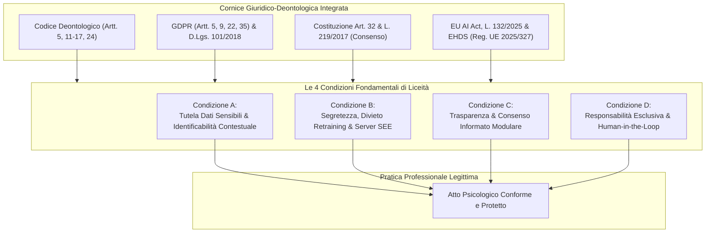
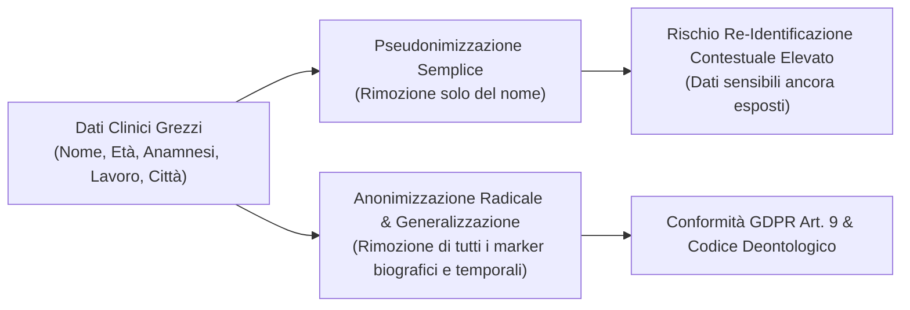
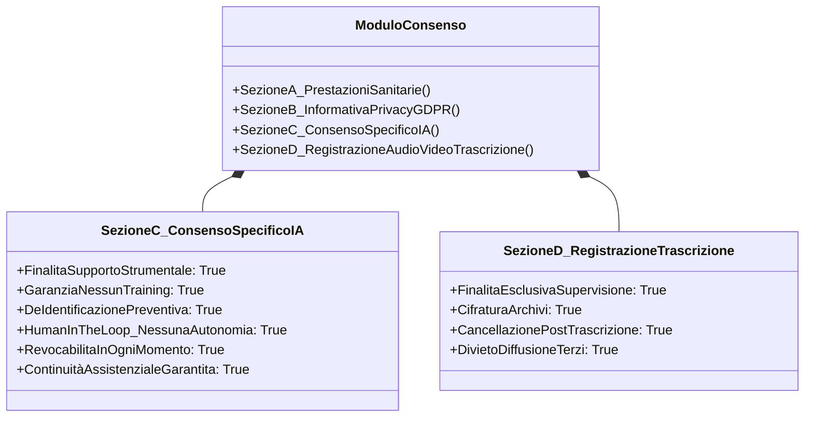

# Le Quattro Condizioni di Liceità e Correttezza Deontologica per l'IA in Psicologia

**Summary**: Modello dottrinale e procedurale formalizzato dal Gruppo di Lavoro Intelligenza Artificiale dell'Ordine delle Psicologhe e degli Psicologi del Veneto (OPPV, 2026). Definisce i quattro vincoli simultanei e non negoziabili che legittimano giuridicamente e deontologicamente l'adozione di sistemi di intelligenza artificiale nella professione psicologica: tutela rafforzata dei dati particolari (con superamento del mito della de-identificazione parziale), segretezza e sovranità dell'infrastruttura di trattamento, trasparenza contrattuale con consenso modulare (estensione del patto fiduciario) e titolarità esclusiva della decisione clinica (*Human-in-the-Loop*).
**Sources**: `Guida-Pratica-AI-OPPV.pdf` (OPPV, 2026)
**Last updated**: 2026-08-27
---

## Definizione Operativa e Fondamento Istituzionale

Le **Quattro Condizioni di Liceità e Correttezza Deontologica** costituiscono l'impalcatura regolatoria introdotta dall'[[guida-pratica-ai-oppv-1|OPPV (2026)]] per dirimere la tensione strutturale tra l'innovazione tecnologica dell'[[large-language-models|Intelligenza Artificiale Generativa]] e i doveri fiduciari della professione psicologica.

L'assunto di fondo stabilisce che l'impiego dell'IA non costituisce un semplice atto tecnico neutrale, ma si configura a tutti gli effetti come una complessa operazione di **trattamento di dati personali e particolari**, sottoposta a quattro livelli normativi concorrenti:
1. **Deontologia Professionale** (Codice Deontologico degli Psicologi Italiani, artt. 5, 11–17, 24);
2. **Protezione dei Dati Personali** (Regolamento UE 2016/679 - GDPR e D.Lgs. 101/2018);
3. **Diritto alla Salute e Autodeterminazione** (Costituzione Italiana art. 32 e Legge 219/2017 sul consenso informato);
4. **Governo e Sicurezza dell'Intelligenza Artificiale Sanitaria** (EU AI Act - Reg. UE 2024/1689, Legge 23 settembre 2025 n. 132, e Regolamento EHDS UE 2025/327).

> [!IMPORTANT]
> **Il Principio di Cumulatività:** Le quattro condizioni devono sussistere **simultaneamente**. Il mancato rispetto o la violazione anche di una sola di esse rende l'impiego dello strumento di IA **potenzialmente illecito e fonte di responsabilità civile, penale e disciplinare**.

---

## Analisi Approfondita delle Quattro Condizioni

### 1. Condizione A: Tutela Rafforzata dei Dati Particolari e Superamento del Mito dell'Anonimizzazione Parziale
- **Quadro Normativo:** Articolo 9 GDPR (*Trattamento di categorie particolari di dati personali*). I dati relativi alla salute mentale e al benessere psicologico appartengono alle categorie protette da divieto generale di trattamento, salvo specifiche deroghe per finalità di cura, diagnosi e assistenza sanitaria.
- **La Fallacia dell'Anonimizzazione Parziale:** Nella prassi clinica è frequente l'errore cognitivo secondo cui l'eliminazione del nome anagrafico (*"Tolgo Mario Rossi e scrivo Paziente X"*) renda il materiale anonimo. Nei contesti clinici e psicoterapeutici, la ricchezza narrativa del materiale (età esatta, professione specialistica in un'area geografica ristretta, eventi di vita traumatici unici, dinamiche familiari atipiche) comporta un'elevata **identificabilità per contesto (*contextual re-identification*)**.
- **Vincolo Operativo:** La pseudonimizzazione non equivale ad anonimizzazione irreversibile. Pertanto, l'immissione di descrizioni cliniche dettagliate all'interno di piattaforme di IA non conformi o aperte viola direttamente l'art. 9 GDPR e l'art. 11 del Codice Deontologico.

---

### 2. Condizione B: Segretezza Professionale, Sovranità del Dato e Divieto di Retraining
- **Quadro Normativo:** Artt. 11–17 Codice Deontologico; Artt. 5.1.f, 28, 44–49 GDPR.
- **Dovere di Tracciabilità dell'Infrastruttura:** Lo psicologo ha il dovere di conoscere e poter documentare **dove risiedono i server** dell'applicativo utilizzato, quali protocolli di crittografia vengono impiegati e con quali tempi di conservazione.
- **Il Rischio Sistemico del Riaddestramento (*Retraining*):** La maggior parte dei servizi gratuiti o "consumer" utilizza i prompt, i testi incollati, le immagini e le registrazioni vocali per migliorare e riaddestrare continuamente i pesi neurali dei modelli. Il frammento clinico immesso rischia di diventare parte della struttura statistica del modello e di essere riprodotto (anche parzialmente) in sessioni di altri utenti.
- **Requisiti Contrattuali (Art. 28 GDPR):** È vietato affidare dati clinici a servizi privi di clausole contrattuali esplicite di *Data Protection* (quali le versioni *Professional, Enterprise o Business* con *Enterprise Data Protection*), che escludano formalmente l'uso dei dati per il training e garantiscano la permanenza dei server nello Spazio Economico Europeo (SEE) o in conformità a decisioni di adeguatezza (*Data Privacy Framework UE-USA*).

---

### 3. Condizione C: Trasparenza Relazionale e Consenso Informato Modulare (Estensione del Patto Fiduciario)
- **Quadro Normativo:** Art. 24 Codice Deontologico; Artt. 13–14 GDPR; Legge 219/2017; Legge 23 settembre 2025 n. 132; Regolamento (UE) 2025/327 (EHDS).
- **L'IA come Trattamento di Dati Non Tacito:** L'adozione di software basati su IA non può mai avvenire all'insaputa del paziente o rimanere implicita. La trasparenza costituisce un'estensione diretta dell'alleanza terapeutica e del patto fiduciario.
- **Architettura Modulare del Consenso:** La Guida OPPV rifiuta il consenso "a pacchetto unico" (*all-in-one*), introducendo una struttura modulare in quattro sezioni distinte:
  1. *Sezione A:* Consenso alle prestazioni sanitarie psicologiche (in presenza e online);
  2. *Sezione B:* Presa d'atto dell'Informativa Privacy GDPR generale;
  3. *Sezione C (Consenso Specifico IA Generativa):* Rilascio opzionale del consenso all'uso di strumenti di IA generativa per supporto strumentale (es. revisione sintattica, appunti anonimi), con garanzia esplicita di *Human-in-the-loop*, *No-Training* e diritto di revoca senza interruzione del percorso di cura;
  4. *Sezione D (Registrazioni e Trascrizioni):* Consenso dedicato all'acquisizione di dati biometrici vocali/video, con obbligo di conservazione cifrata e cancellazione immediata del file originale una volta completata la trascrizione.

---

### 4. Condizione D: Responsabilità Professionale Esclusiva e Human-in-the-Loop Inderogabile
- **Quadro Normativo:** Artt. 3, 4, 5 Codice Deontologico; EU AI Act (Reg. UE 2024/1689); Legge n. 132/2025.
- **Divieto di Delega Algoritmica:** L'IA non può in alcun caso formulare diagnosi, stabilire indicazioni terapeutiche, valutare il rischio clinico o sostituire il ragionamento dello psicologo.
- **Imputabilità Giuridica e Deontologica Integrale:** L'IA è priva di personalità giuridica e di responsabilità morale. Ogni testo, bozza, interpretazione o sintesi generata dall'algoritmo diventa parte dell'atto professionale solo quando viene vagliata, corretta e assunta dallo psicologo, che ne risponde a titolo personale.
- **Mitigazione delle Allucinazioni e Bias:** Poiché gli LLM producono risposte basate su calcoli probabilistici e sono suscettibili ad allucinazioni (dati inventati verosimili) o distorsioni socioculturali, il principio *Human-in-the-Loop* (HITL) impone che nessun output venga impiegato prima di una verifica critica e fattuale approfondita.

---

## Matrice di Confronto e Rischio Deontologico

| Scenario di Utilizzo | Condizioni Impattate | Livello di Rischio | Valutazione Deontologica e Giuridica (OPPV) | Azione Correttiva Necessaria |
| :--- | :--- | :--- | :--- | :--- |
| **Incollare frammenti di seduta in ChatGPT gratuito senza consenso** | Condizioni A, B, C, D | **Critico (Illecito Grave)** | Violazione dell'art. 9 GDPR, dell'art. 11 (Segreto) e art. 24 (Consenso) del Codice Deontologico; rischio di cessione dati per training. | Sospendere immediatamente l'uso; adottare licenza Enterprise con No-Training e consenso Sezione C. |
| **Attivare Zoom AI Companion o Copilot durante sedute cliniche online** | Condizioni A, B, C | **Alto Rischio** | Violazione della riservatezza del setting; memorizzazione automatica di trascrizioni e summary sanitari su cloud terzi. | **Disattivare totalmente AI Companion, trascrizioni e registrazioni** durante i colloqui con pazienti. |
| **Trascrivere registrazioni di sedute con Plaud Note o TurboScribe consumer** | Condizioni A, B | **Alto Rischio** | Mancanza di garanzie art. 28 GDPR e possibile trasferimento non regolato di dati biometrici verso server extra-SEE. | Utilizzare solo per webinar/lezioni o simulazioni didattiche; non usare per sedute cliniche reali. |
| **Revisione sintattica di una relazione già completamente anonimizzata su Claude/ChatGPT con No-Training attivo e Consenso Sez. C firmato** | Condizioni A, B, C, D | **Conforme / Protetto** | **Piena liceità**: rispetto simultaneo di minimizzazione, sovranità del dato, consenso trasparente e controllo umano. | Mantenere la verifica critica dell'output e documentare la scelta nel Registro dei Trattamenti. |

---

## Obblighi Organizzativi e di Formazione Continua

Per rendere effettive le quattro condizioni, lo psicologo è tenuto ad attuare adempimenti organizzativi e formativi:

1. **Aggiornamento del Registro dei Trattamenti:** Integrazione dei flussi di trattamento con indicazione esplicita degli strumenti di IA impiegati e delle misure di sicurezza adottate (Art. 30 GDPR).
2. **Valutazione d'Impatto sulla Protezione dei Dati (DPIA):** Pur non sussistendo un obbligo automatico per qualsiasi uso sporadico, qualora il professionista o lo studio tratti regolarmente dati sanitari tramite architetture algoritmiche complesse, è opportuno redigere una DPIA ex art. 35 GDPR.
3. **Formazione Continua (Art. 5 Codice Deontologico):** Dovere di mantenere un'adeguata alfabetizzazione digitale, comprendendo la natura probabilistica degli LLM, la distinzione tra token e concetti, i meccanismi di conservazione dei server e le impostazioni di sicurezza delle piattaforme.

---

## Concetti Correlati

- [[guida-pratica-ai-oppv-1|Guida Operativa all'Utilizzo dell'AI nella Pratica Professionale (OPPV, 2026)]]: Documento sorgente e inquadramento generale.
- [[configurazione-sicurezza-piattaforme-ia-clinica|Configurazione di Sicurezza e Mitigazione del Rischio per Piattaforme di IA in Ambito Clinico]]: Guida operativa alle impostazioni tecniche dei software.
- [[informed-consent-for-clinical-ai|Consenso Informato per l'IA nella Pratica Clinica]]: Analisi del modello della divulgazione proporzionata.
- [[gdpr-governance-mental-health-ai|GDPR Governance e Protezione Dati nell'IA per la Salute Mentale]]: Disciplina europea sui dati sanitari e digital privacy.
- [[human-oversight-and-liability-in-clinical-ai|Supervisione Umana e Responsabilità Giuridica nell'IA Clinica]]: Quadro comparato sulla responsabilità sanitaria.
- [[modello-centauro-clinico|Modello Centauro Clinico]]: Integrazione post-seduta virtuosa e non invasiva dell'IA nel setting.
