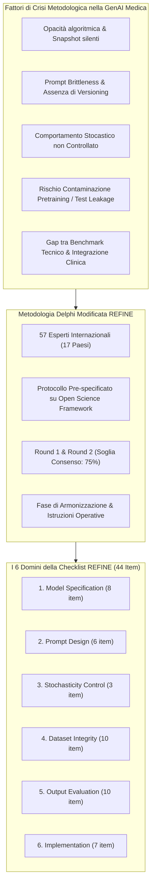
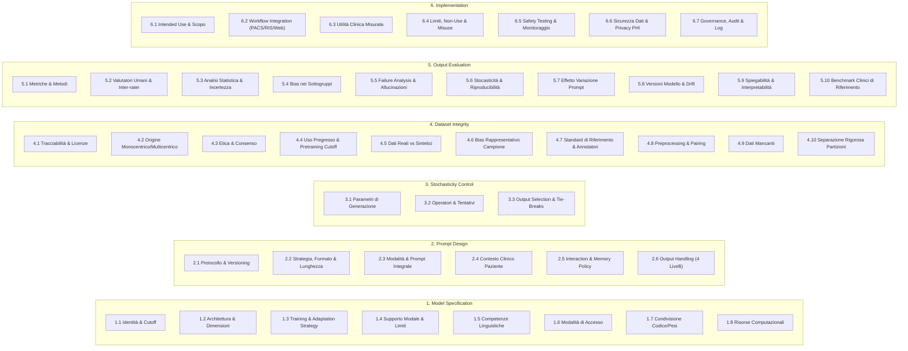

# Reporting Checklist for Foundation and Large Language Models in Medical Research (REFINE): An International Consensus Guideline (Mese et al., 2026)

## Definizione Operativa
- Il **REFINE** (*REporting checklist for FoundatIon and large laNguagE models*) è una linea guida metodologica internazionale sviluppata mediante processo di consenso Delphi modificato per standardizzare la rendicontazione trasparente, rigorosa e riproducibile degli studi biomedici e clinici basati su Foundation Models (FM) e Large Language Models (LLM), inclusi i modelli multimodali e le applicazioni in diagnostica per immagini.
- **Autori e Consenso Internazionale:** Pubblicato su *Diagnostic and Interventional Radiology* (2026; DOI: [10.4274/dir.2026.263812](https://doi.org/10.4274/dir.2026.263812)) da un consorzio internazionale di 57 contributori provenienti da 17 Paesi (guidato da Ismail Mese, Tugba Akinci D’Antonoli e Burak Kocak come steering committee, con il contributo di figure di spicco della radiologia e dell'IA sanitaria come Christian Bluethgen, Keno Bressem, Renato Cuocolo, Charles E. Kahn Jr., Seong Ho Park, Linda Moy e Jakob Nikolas Kather).
- **Architettura del Framework:** Si articola in una checklist strutturata di **44 item suddivisi in 6 macro-domini** (*Model Specification*, *Prompt Design*, *Stochasticity Control*, *Dataset Integrity*, *Output Evaluation*, *Implementation*), corredata da definizioni terminologiche standardizzate (Table 1) e istruzioni operative item-by-item (Table 3), supportata da una piattaforma web interattiva open-access ([refinechecklist.github.io](https://refinechecklist.github.io/refine/checklist.html)).
- **Collocazione nell'Ecosistema Metodologico:** REFINE estende e integra le linee guida EQUATOR tradizionali per l'IA deterministica ([[CLAIM]], [[TRIPOD-AI]], [[STARD-AI]], [[CONSORT-AI]]) e le iniziative specialistiche per modelli linguistici ([[mi-clear-llm-2025|MI-CLEAR-LLM]], [[TRIPOD-LLM]], [[DEAL]], [[chart-reporting-guideline|CHART]], [[CANGARU]]), coprendo l'intero ciclo di vita dello studio generativo: dall'identificazione algoritmica e ingegneria dei prompt alla gestione della non-determinatezza, prevenzione della contaminazione dei dati di test (*data leakage*), validazione clinica e governance di implementazione sicura.



---

## Terminologia Standardizzata REFINE

Per superare l'ambiguità lessicale diffusa nella letteratura sull'IA clinica (dove termini come *"validation"* o *"fine-tuning"* vengono impiegati con significati eterogenei o impropri), la fase di armonizzazione di REFINE ha formalizzato 8 definizioni chiave (Tabella 1):

| Termine | Definizione Standardizzata REFINE | Implicazione Metodologica |
| :--- | :--- | :--- |
| **Training** | Processo di ottimizzazione dei parametri di un modello tramite dati e una funzione obiettivo volta a minimizzare una perdita (*loss*) definita mediante aggiornamenti iterativi dei gradienti. | Implica sempre una modifica matematica permanente dei pesi interni della rete. |
| **Pretraining** | Addestramento condotto su dataset su larga scala, generali o debolmente supervisionati (spesso con apprendimento auto-supervisionato) per sviluppare rappresentazioni ampie e capacità fondazionali. | Costituisce la base dei modelli di fondazione; determina il *knowledge cutoff*. |
| **Post-training** | Fase di ottimizzazione successiva che include fine-tuning supervisionato (SFT), instruction tuning, adattamento specifico per dominio/task e metodi di allineamento (RLHF, RLAIF, DPO) per allineare il modello all'intento umano, alla sicurezza o a prestazioni specialistiche. | Distingue il modello grezzo (*base model*) da quello pronto all'uso clinico (*instruct/chat model*). |
| **Fine-tuning** | Forma mirata di post-training focalizzata sull'adattamento dei pesi del modello per uno specifico task, dataset o dominio, volta a raggiungere un obiettivo esplicito (es. accuratezza di classificazione o rispetto di istruzioni). | Può essere *full parameter* o *parameter-efficient* (PEFT, es. LoRA, QLoRA). |
| **Inference-time adaptation** | Adattamento ottenuto **senza aggiornamento dei pesi**, mediante condizionamento del contesto o meccanismi esterni quali prompt engineering, Retrieval-Augmented Generation (RAG), integrazione di tool o selezione dinamica di iperparametri. | Non altera il modello sottostante; richiede la conservazione esatta del contesto di input. |
| **Alignment** | Indirizzamento del comportamento del modello verso l'intento umano o specifici obiettivi di dominio, conseguito tramite metodi con aggiornamento dei pesi (RLHF, RLAIF, DPO) o metodi inferenziali (prompting, retrieval). | Garantisce che le risposte cliniche siano sicure, empatiche e prive di contenuti tossici o allucinati. |
| **Testing** | Valutazione finale, condotta una sola volta (*strictly unseen held-out evaluation*), su dati mai visti durante lo sviluppo, senza che alcuna scelta architetturale o di prompt sia stata informata dai risultati del test. | Gold standard per stimare la generalizzabilità non viziata da data leakage. |
| **Validation** | Qualsiasi processo di verifica che **non si riferisca** a una partizione di dati riservata (*non dataset split*). Nello standard REFINE, "validazione" indica la verifica di correttezza o adeguatezza di una procedura (es. controllo di plausibilità clinica), evitando l'ambiguità col *validation set* del machine learning classico. | Elimina la confusione tra partizionamento dei dati e validazione procedurale/qualitativa. |

---

## La Checklist REFINE: Analisi Dettagliata delle 6 Sezioni (44 Item)



### Sezione 1: Model Specification (Item 1.1 - 1.8)
1. **1.1 Model Identity and Knowledge Cutoff:** Denominazione esatta, sviluppatore/vendor (es. OpenAI, Stanford University), identificatore univoco di release/API (es. `GPT-5`, `gpt-4o-2024-08-06`), data di rilascio o data esatta di accesso, riferimento a *model card* o *changelog*, e data di cutoff dei dati di addestramento.
2. **1.2 Architecture and Characteristics:** Architettura di base (Transformer, State-Space Models come Mamba, MoE, modelli a diffusione), conteggio dei parametri. Per modelli multimodali: architettura dell'encoder visivo (ResNet, ViT) e meccanismo di fusione (es. *cross-attention*).
3. **1.3 Pretraining, Post-training, and Inference-time Adaptation:** Descrizione del ciclo di sviluppo: pretraining da zero o continuo (corpus e funzioni di perdita); post-training con aggiornamento dei pesi (SFT, RLHF, DPO, PEFT/LoRA, epoche, batch size, ottimizzatore); oppure adattamento inferenziale a pesi congelati (prompting, RAG, API esterne). Esplicitazione dell'eventuale impiego di dati clinici e della fase in cui sono stati introdotti.
4. **1.4 Modality Support and Limitations:** Modalità supportate in input e output (testo, immagini radiologiche, audio, video); vincoli tecnici (lunghezza massima di contesto, es. 128k token; risoluzione immagine $\le 1024 \times 1024$; pipeline di conversione DICOM in tensori 2D/3D).
5. **1.5 Language Capabilities:** Lingue in cui il modello è stato esaminato; competenze specialistiche settoriali (inglese medico, turco radiologico, linguaggio divulgativo per pazienti) o dichiarazione di mancata verifica multilingue.
6. **1.6 Model Access:** Modalità di interazione: interfaccia grafica (web chatbot) vs API (locale, cloud aziendale protetto, cloud pubblico).
7. **1.7 Sharing of Artifacts:** Disponibilità e URL pubblici per repository di codice (GitHub), pesi e checkpoint (Hugging Face), e dataset (Zenodo, PhysioNet). Dichiarazione trasparente dei motivi di eventuale non disponibilità (licenze proprietarie, privacy istituzionale).
8. **1.8 Computational Requirements:** Risorse hardware necessarie per sviluppo e inferenza (tipo e numero di GPU/TPU, VRAM, tempi di calcolo, specifiche cloud).

---

### Sezione 2: Prompt Design (Item 2.1 - 2.6)
1. **2.1 Prompt Engineering Protocol with Versioning:** Metodologia di ottimizzazione dei prompt: testing iterativo guidato da metriche predefinite, revisione human-in-the-loop con concordanza tra esperti, o framework automatizzati (es. DSPy). Composizione del team di prompt engineering, partizione dei dati usata e storico dettagliato delle versioni (*prompt versioning*).
2. **2.2 Strategy, Format, and Length:** Strategia adottata (zero-shot, few-shot con esempi rappresentativi, chain-of-thought, reflection prompting); formato (template strutturato con segnaposto, query aperta, prompt a singola immagine vs serie multimodale con bounding box); lunghezza del prompt (direttiva concisa vs contesto esteso).
3. **2.3 Modality, Technical Specs, and Full Content:** Modalità e tipologia dei dati di input (RX torace, referti istopatologici, lettere di dimissione); risoluzione ed elaborazioni preliminari; inclusione di esami pregressi longitudinali. **Testo integrale *verbatim* di tutti i prompt impiegati** (o script eseguibile nei supplementari).
4. **2.4 Integration of Patient Clinical Context:** Tipologia di metadati clinici inclusi (età, sesso, comorbidità, terapie pregresse); criteri di selezione (linee guida cliniche, giudizio esperto); standardizzazione lessicale (codici ICD-10, SNOMED-CT, RxNorm, BI-RADS/LI-RADS/PI-RADS); fonte primaria (cartella clinica elettronica, PACS).
5. **2.5 Interaction Style and Session Memory Policy:** Interazione a singolo turno (*one-shot query*) vs multi-turno (*conversational loop*). Politica di memoria: cancellazione della memoria al termine della sessione (*session memory*) vs memoria persistente inter-sessione (*cross-conversation persistent memory*).
6. **2.6 Output Handling and Control Levels:** Gestione e vincoli applicati all'output generato (JSON strutturato, testo libero, tabelle). REFINE formalizza 4 livelli di controllo:
   - *Livello I (No control):* Generazione libera non vincolata.
   - *Livello II (Control in prompt only):* Istruzioni sintattiche fornite nel testo del prompt.
   - *Livello III (Control during generation):* Generazione guidata via JSON schema, grammatiche formali (GBNF) o vincoli sui logit.
   - *Livello IV (Control after generation):* Pipeline post-hoc di validazione automatica dello schema, controllo di completezza o verifica di plausibilità clinica.

---

### Sezione 3: Stochasticity Control (Item 3.1 - 3.3)
1. **3.1 Generation Parameters:** Rendicontazione puntuale di tutti gli iperparametri di inferenza: temperatura ($T$), top-p (*nucleus sampling*), top-k, vincoli di lunghezza massima (*max output tokens*), penalità di ripetizione/frequenza, e random seed impostato. Per la generazione di immagini: numero di passi di campionamento (*inference steps*), scheduler, guidance scale (CFG) e risoluzione.
2. **3.2 Prompt Operator Characteristics:** Profilo degli operatori che hanno inserito i prompt: ruolo professionale (medico strutturato, specializzando, radiologo, ricercatore, tecnico), anni di esperienza clinica, familiarità con strumenti di IA, e numero esatto di tentativi di prompt effettuati per ciascun caso.
3. **3.3 Output Selection:** Criteri di selezione della risposta finale in caso di generazioni multiple: selezione basata su revisione esperta, selezione casuale/prima risposta (*first-run*), voto a maggioranza (*majority voting*), ranking algoritmico basato su score di confidenza, o selezione automatica da pipeline. Regole esplicite per la gestione dei pareggi (*tie-breaks*) e filtri di scarto.

---

### Sezione 4: Dataset Integrity (Item 4.1 - 4.10)
1. **4.1 Dataset Traceability, License, and Compliance:** Nome e versione del dataset (es. MIMIC-CXR v2.0, LIDC-IDRI, BraTS 2023), tipologia di accesso (pubblico, ad accesso controllato con credenziali come PhysioNet, privato istituzionale), citazione della fonte primaria, licenza d'uso e conformità ad accordi di utilizzo (DUA).
2. **4.2 Dataset Origin:** Provenienza monocentrica o multicentrica; numero e tipologia di strutture coinvolte (centri universitari, ospedali territoriali), distribuzione geografica nazionale o internazionale.
3. **4.3 Ethics and Consent Statements:** Approvazione del comitato etico/IRB con numero di protocollo o motivazione documentata per la deroga al consenso informato (es. studio retrospettivo su dati de-identificati).
4. **4.4 Prior Usage, Publication Date, and Contamination Risk:** Uso pregresso del dataset da parte degli autori. Data di rilascio pubblico del dataset per valutare il rischio di **contaminazione del pretraining** (dataset pubblici disponibili prima del cutoff temporale del modello possono essere già stati inclusi nel training set di base, invalidando la natura *held-out* della valutazione).
5. **4.5 Composition and Synthetic Data Details:** Proporzione di dati clinici reali vs dati sintetici generati (es. referti sintetizzati da LLM, immagini RM generate da modelli di diffusione, scansioni TC aumentate via GAN) e trasparenza sul metodo generativo impiegato.
6. **4.6 Sample Characteristics and Representational Bias:** Dati demografici della coorte (età, sesso), caratteristiche cliniche (patologie, stadiazione di gravità), modalità di imaging e distribuzione delle classi. Analisi formale del bias di rappresentatività (sottorappresentazione di fasce d'età, squilibri di genere o disparità geografiche).
7. **4.7 Reference Standard and Annotator Qualifications:** Definizione del gold standard diagnostico (istopatologia, referto radiologico confermato, follow-up clinico, consenso di panel multidisciplinare). Qualifiche degli annotatori (anni di esperienza, specializzazione), numero di revisori per caso e procedura di risoluzione delle discrepanze.
8. **4.8 Preprocessing, Anonymization, and Pairing:** Pipeline di preparazione: de-identificazione/anonimizzazione del testo (rimozione PHI tramite NLP o mascheramento regex); registrazione e co-registrazione delle immagini (accoppiamento referto-imaging, allineamento temporale longitudinale, window/level DICOM, normalizzazione dell'intensità, filtri anti-artefatto).
9. **4.9 Missing Data Assessment:** Percentuale di dati mancanti per ciascuna variabile, meccanismo sottostante (MCAR, MAR, MNAR) e strategia di gestione adottata (esclusione dei casi incompleti, imputazione per media/mediana, imputazione multivariata/model-based o nessuna imputazione).
10. **4.10 Separation of Partitions and Leakage Prevention:** Chiara distinzione tra dati di training, fine-tuning, test interno (*held-out* monocentrico) e test esterno (*external validation* multicentrico). Garanzia di indipendenza mediante partizionamento per ID paziente, data o centro ospedaliero. Conferma che nessun dato di test è stato esposto durante le fasi di addestramento o di ottimizzazione dei prompt.

---

### Sezione 5: Output Evaluation (Item 5.1 - 5.10)
1. **5.1 Evaluation Method and Metrics:** Metodi di misura della performance: revisione clinica umana (scale Likert, punteggi di leggibilità, utilità decisionale), metriche di accuratezza diagnostica (AUROC, F1-score, sensibilità, specificità, curve di calibrazione, Brier score), metriche di similarità semantica/lessicale (BLEU, ROUGE, BERTScore) o sistemi automatizzati (*LLM-as-a-judge*).
2. **5.2 Human Evaluator Characteristics and Reliability:** Numero di revisori clinici, specializzazione, anni di esperienza e training preliminare. Misurazione quantitativa della concordanza inter-rater e intra-rater (Cohen’s kappa, Fleiss’ kappa, Intraclass Correlation Coefficient - ICC).
3. **5.3 Statistical Analysis and Uncertainty Estimation:** Test di ipotesi formali, stima degli intervalli di confidenza (CI al 95%, intervalli bootstrap, credible intervals bayesiani), effect size e criteri di significatività predefiniti (soglie alfa, margini di non-inferiorità o equivalenza).
4. **5.4 Subgroup Performance and Output Bias:** Valutazione stratificata delle performance attraverso sottogruppi demografici e clinici (età, sesso, etnia, sottotipi patologici, produttori di scanner o centri clinici) per quantificare eventuali disparità prestazionali algoritmiche (*algorithmic disparities*).
5. **5.5 Failure Analysis and Error Categorization:** Tassonomia dettagliata degli errori riscontrati: allucinazioni fattuali (*hallucinations*), errori di ragionamento clinico, bias cognitivi/algoritmici, imprecisioni terminologiche, omissioni critiche o fallimenti di formattazione sintattica. Calcolo di tassi di errore quantitativi (es. *hallucination rate*, *omission rate*) ed esempi clinici rappresentativi.
6. **5.6 Output Stochasticity and Reproducibility Constraints:** Analisi quantitativa della variabilità generativa su query identiche ripetute a parità di parametri. Esplicitazione dei fattori limitanti la riproducibilità esatta (stocasticità intrinseca, mancato controllo del seed, opacità dei modelli proprietari closed-source, aggiornamenti asincroni del cloud).
7. **5.7 Impact of Prompt Strategies and Revisions:** Confronto controllato tra strategie di prompting eterogenee (zero-shot vs few-shot vs chain-of-thought, prompt monolingua vs traduzione) e impatto delle revisioni iterative dei prompt sulla qualità dell'output.
8. **5.8 Model Version Comparisons and Temporal Drift:** Valutazione comparativa tra versioni successive dello stesso modello (es. LLaMA 3.1 8B v1.0 vs v1.1) o tracciamento del degrado/mutamento temporale (*model drift*) per modelli fruiti via API nel corso del tempo.
9. **5.9 Explainability and Interpretability Methods:** Metodi impiegati per rendere interpretabile la decisione del modello (es. catene di ragionamento CoT esplicitate, mappe di attenzione, feature attribution, Grad-CAM per componenti visive) e discussione critica dei limiti intrinseci di fedeltà (*faithfulness*) delle spiegazioni post-hoc.
10. **5.10 Comparison with Clinically Relevant Benchmarks:** Confronto sistematico con lo standard di cura clinico (*clinical standard-of-care*, performance di medici specialisti, linee guida ufficiali). Distinzione esplicita tra benchmark clinici umani e benchmark tecnici (es. modelli di deep learning supervisionati specialistici preesistenti).

---

### Sezione 6: Implementation and Governance (Item 6.1 - 6.7)
1. **6.1 Declared Intended Application:** Scopo d'uso primario dichiarato: supporto alle decisioni diagnostiche (*CDSS*), question answering clinico, generazione automatica di referti, triage di urgenze radiologiche, comunicazione con il paziente, o simulazione didattica.
2. **6.2 Clinical Workflow Integration:** Modalità di inserimento nel flusso di lavoro ospedaliero: integrato nel PACS/RIS, integrato nella cartella clinica elettronica (EHR), cruscotto di supporto alle decisioni, interfaccia web standalone. Momento di interazione: triage pre-lettura (*prereading*), supporto concorrente (*concurrent reading*), revisione post-refertazione (*post-report review*) o audit di qualità.
3. **6.3 Measured Clinical Utility:** Valutazione dell'impatto clinico effettivo: miglioramento della sensibilità/accuratezza diagnostica del medico, riduzione dei tempi di refertazione o decisione, incremento dell'efficienza organizzativa, impatto sulla confidenza decisionale del medico e comprensione da parte del paziente.
4. **6.4 Explicit Non-Use Cases and Potential Misuse:** Limiti noti del sistema e dichiarazione esplicita degli scenari clinici controindicati (*contraindications / explicit non-use cases*, es. decision-making autonomo in emergenza senza supervisione umana qualificata, popolazioni pediatriche non validate, modalità di imaging non supportate) e analisi dei rischi prevedibili di uso improprio o *off-label*.
5. **6.5 Safety Testing and Monitoring Protocols:** Protocolli di collaudo pre-deployment per identificare output tossici, dannosi o clinicamente fuorvianti (*red-teaming*, sandboxing); sistemi di monitoraggio continuo in tempo reale (filtri di sicurezza automatici, interruzione d'emergenza, *human oversight*).
6. **6.6 Data Security and Privacy Safeguards:** Misure di protezione dei dati personali sanitari (PHI): policy di conservazione e retention, divieto contrattuale di riutilizzo dei dati dei prompt per il riaddestramento del modello da parte del vendor cloud, instradamento geografico dei server (es. datacenter conformi al GDPR nell'Unione Europea), crittografia end-to-end e anonimizzazione preventiva.
7. **6.7 Governance, Auditability, and Oversight:** Misure di governance istituzionale e tracciabilità operativa (*audit trail*): registrazione continua e immutabile di tutte le interazioni prompt-output, versioning dei sistemi, supervisione da comitati ospedalieri di IA clinica, e uso di account aziendali regolamentati rispetto ad account personali/pubblici.

---

## Metodologia Delphi e Costruzione del Consenso

Lo sviluppo di REFINE ha seguito un disegno metodologico rigoroso e pre-specificato, depositato preventivamente su Open Science Framework (OSF; Kocak, 2025):

```mermaid
sequenceDiagram
    autonumber
    actor Steering as Steering Committee (IM, TAD, BK)
    actor Panel as Delphi Panel (54 Esperti, 16 Paesi)
    actor Harmonization as Harmonization Group (CB, KB, RC + Steering)

    Steering->>Steering: Revisione sistematica della letteratura & Bozza iniziale (39 item, 5 sezioni)
    Steering->>Panel: Round 1 Delphi (Rating a 4 opzioni + Feedback testuale aperto)
    Panel-->>Steering: 54 risposte complete; tutti gli item superano il 75% di consenso; 3 item richiedono modifiche
    Steering->>Steering: Revisione Round 1, split item, creazione Sezione 6 (Implementation)
    Steering->>Panel: Round 2 Delphi (13 item: 4 rivalutati + 9 nuove proposte; scelta scala di risposta)
    Panel-->>Steering: 54 risposte complete; 100% consenso su tutti i 13 item; adozione scala Yes/Partial/No/N/A
    Steering->>Harmonization: Fase di Armonizzazione post-Delphi (Google Docs, 2 settimane)
    Harmonization->>Harmonization: Standardizzazione terminologica (Table 1), Istruzioni operative (Table 3), Checklist finale (44 item)
    Harmonization->>Steering: Rilascio piattaforma web interattiva (refinechecklist.github.io)
```

### Regole Decisionali e Soglie di Consenso
- **Scala di Valutazione:** *"Keep as is"*, *"Keep with modification"*, *"Remove"*, *"Unsure"* (i voti *unsure* non concorrevano al denominatore).
- **Consenso al Mantenimento:** $\ge 75\%$ di voti combinati tra *"Keep as is"* e *"Keep with modification"*.
- **Criterio di Modifica:** Se $\ge 33.3\%$ (un terzo) dei voti favorevoli richiedeva *"Keep with modification"*, l'item veniva formalmente riscritto e risottomesso al Round 2.
- **Consenso alla Rimozione:** $\ge 75\%$ di voti per *"Remove"*.
- **Opzioni di Risposta della Checklist Finale:** La maggioranza assoluta dei panelist nel Round 2 ha votato a favore della scala a 4 livelli: **Yes, Partial, No, N/A** (con l'opzione *N/A* che funge da meccanismo di filtraggio deliberato per non penalizzare studi con design specifici non applicabili).

---

## Posizionamento Comparativo con le Linee Guida Esistenti

REFINE si posiziona come lo standard più comprensivo e granulare per i modelli di fondazione in sanità, colmando le intersezioni tra visione computazionale, elaborazione del linguaggio naturale e implementazione clinica:

| Linea Guida / Framework | Focus Primario | Ambito di Applicazione | Gestione Stocasticità | Dettaglio Prompting | Integrità Dataset & Contaminazione | Governance & Safety Clinica |
| :--- | :--- | :--- | :--- | :--- | :--- | :--- |
| **REFINE (2026)** | Foundation Models & LLM in Ricerca Medica e Imaging | Generale Biomedico, Multimodale, Radiologico | **Esaustiva** (3 item specifici + analisi quantitativa) | **Massima** (Protocollo, versioning, 4 livelli di controllo output) | **Completa** (Rischio cutoff pretraining, de-identificazione, pairing) | **Integrata** (7 item: workflow, misuse, safety, privacy PHI, audit) |
| **[[mi-clear-llm-2025|MI-CLEAR-LLM (2025)]]** | Studi di accuratezza diagnostica di LLM/LMM | Imaging e Test Clinici | **Elevata** (Iperparametri e sintesi multi-query) | **Elevata** (Copy-paste verbatim, brittleness) | **Focalizzata** (Leakage diretto e indiretto) | **Marginale** (Focus prettamente metodologico/laboratoristico) |
| **[[TRIPOD-LLM]]** | Modelli predittivi e prognostici basati su LLM | Epidemiologia clinica e predizione di rischio | Moderata | Moderata | Elevata (Split train/validation) | Moderata |
| **[[DEAL]] (NEJM AI)** | Sviluppo e valutazione di modelli linguistici | Sanità generale (Dual-path: advanced vs off-the-shelf) | Moderata | Moderata | Moderata | Elevata |
| **[[chart-reporting-guideline|CHART Statement]]** | Valutazione di chatbot per consigli sanitari al paziente | Interazione medico-paziente e consulenza | Specifica per query | Elevata per consigli sanitari | Moderata | Elevata (Rischio clinico al paziente) |
| **[[CLAIM]] / CLAIM-2024** | Modelli di IA in diagnostica per immagini | Radiologia classica (CNN, modelli discriminativi) | Assente (pensato per IA deterministica) | Non applicabile | Elevata per immagini | Moderata |
| **[[CONSORT-AI]] / [[STARD-AI]]** | Trial clinici randomizzati e accuratezza diagnostica | Valutazione clinica formale | Assente | Non applicabile | Elevata | Elevata |

---

## Punti di Forza e Limiti dello Standard

### Punti di Forza
1. **Consenso Multidisciplinare e Internazionale:** Coinvolgimento di 57 leader scientifici distribuiti in 17 Paesi, combinando competenze in radiologia computazionale, machine learning, informatica medica ed editoria scientifica.
2. **Copertura Olistica End-to-End:** Superamento della frammentazione tra metriche di laboratorio (*technical benchmarking*) e adozione reale (*clinical workflow integration*).
3. **Piattaforma Web Open-Access:** Disponibilità di uno strumento digitale dinamico con istruzioni via *tooltip*, calcolo automatico dello stato di completamento per sezione, esportazione tabellare in formato Excel per revisioni sistematiche e generazione di report PDF per la sottomissione editoriale.
4. **Flessibilità Applicativa (Opzione N/A):** L'inclusione motivata dell'opzione "Not Applicable" consente l'adattamento trasparente a studi su modelli testo-centrici, modelli multimodali, o analisi off-the-shelf senza penalizzazioni di conformità.

### Limiti Riconosciuti
1. **Sovrarappresentazione dell'Area Radiologica:** Il panel include una prevalenza di esperti di imaging medico (68%) e un'alta concentrazione geografica (Germania e USA rappresentano il 51% del panel), con potenziale minore rappresentazione di contesti a risorse limitate o discipline non visive.
2. **Mancanza di Piloting Esterno Preventivo:** La checklist è stata licenziata direttamente dal panel di esperti senza una fase preliminare di test di usabilità (*user testing*) su ricercatori terzi non coinvolti.
3. **Natura Dinamica della Tecnologia:** La rapida evoluzione dei modelli agentici, del dynamic reasoning a lungo contesto e dei modelli a pesi aperti richiederà aggiornamenti ciclici biennali (previsti formalmente dal consorzio ogni 2 anni).

---

## Pagine Correlate della Wiki
- [[refine-reporting-checklist]] — Concetto metodologico sul framework REFINE e guida operativa all'adozione negli studi biomedici.
- [[dataset-integrity-and-contamination-in-medical-ai]] — Analisi dei rischi di data leakage, pretraining cutoff contamination e bias di rappresentatività nei modelli di fondazione.
- [[mi-clear-llm-2025]] — Linea guida specialistica per la rendicontazione dell'accuratezza diagnostica dei modelli linguistici in sanità.
- [[stochasticity-management-in-clinical-llms]] — Meccanismi fisici, iperparametrici e statistici per il controllo della stocasticità negli LLM clinici.
- [[chart-reporting-guideline]] — Standard di reporting per studi su chatbot di consulenza sanitaria al paziente.
- [[elevate-genai-framework]] — Framework strutturale per la trasparenza e la riproducibilità della GenAI nella ricerca medica.
- [[linee-guida-reporting-ai-generativa-chart-elevate]] — Quadro comparativo generale sulle linee guida per la ricerca con IA generativa.
