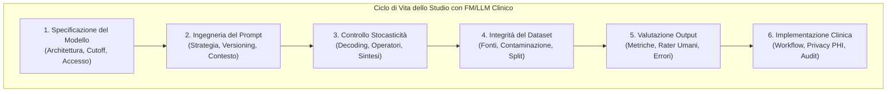
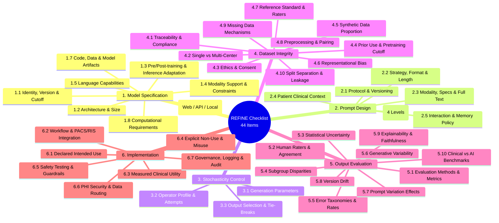
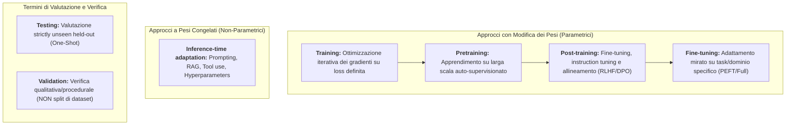
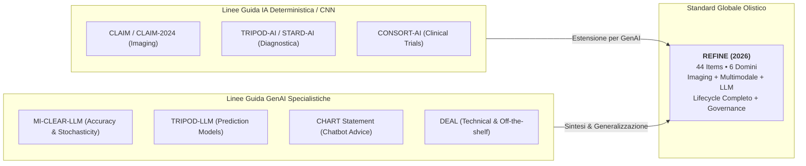
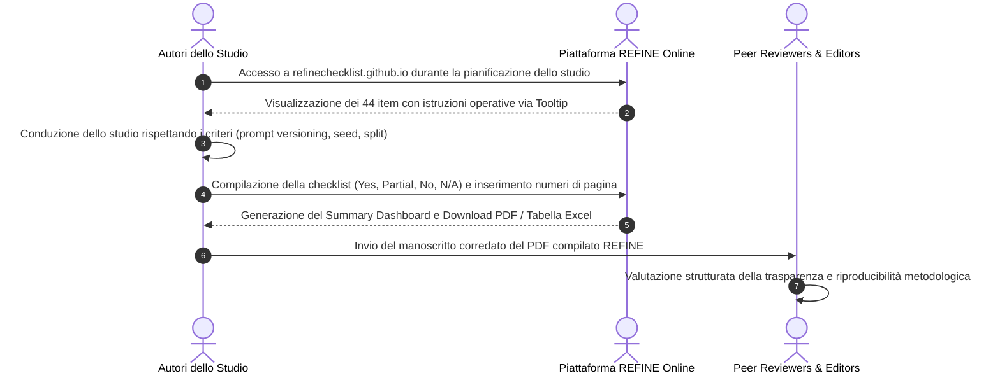

# REFINE Reporting Checklist for Foundation and Large Language Models

## Definizione Operativa
- La **REFINE Reporting Checklist** (*REporting checklist for FoundatIon and large laNguagE models*) è lo standard metodologico internazionale e consensuale di reporting specificamente progettato per guidare la progettazione, la rendicontazione, la peer review e la sintesi di evidenze scientifiche negli studi biomedici che impiegano **Foundation Models (FM)** e **Large Language Models (LLM)** unimodali e multimodali.
- **Sviluppo e Consenso Delphi:** Pubblicato nel 2026 da Mese et al. (*Diagnostic and Interventional Radiology*; DOI: [10.4274/dir.2026.263812](https://doi.org/10.4274/dir.2026.263812)), il framework è il risultato di un rigoroso processo Delphi modificato a due round, condotto su 54 panelist e 3 membri dello steering committee (57 esperti totali da 17 Paesi), seguito da una fase di armonizzazione terminologica e procedurale.
- **Architettura Strutturale:** Il framework comprende **44 item organizzati in 6 domini metodologici** sequenziali che coprono l'intero ciclo di vita del modello generativo:
  1. *Model Specification* (8 item)
  2. *Prompt Design* (6 item)
  3. *Stochasticity Control* (3 item)
  4. *Dataset Integrity* (10 item)
  5. *Output Evaluation* (10 item)
  6. *Implementation* (7 item)
- **Funzione di Filtraggio (Scala a 4 Livelli):** A differenza delle checklist binarie rigide, REFINE adotta una scala di conformità a 4 opzioni (**Yes, Partial, No, N/A**), in cui la voce *N/A (Not Applicable)* funge da meccanismo di filtraggio formale per consentire la valutazione equa di architetture eterogenee (es. studi puramente inferenziali senza retraining o benchmark puramente testuali) senza penalizzare il punteggio complessivo di trasparenza.

---

## I 6 Domini Metodologici di REFINE

### 1. Model Specification (Item 1.1 - 1.8)
Stabilisce i requisiti minimi per identificare univocamente l'oggetto di studio computazionale:
- **Snapshot univoco e knowledge cutoff:** Eliminazione dell'ambiguità legata a denominazioni commerciali generiche (es. specificare `gpt-4o-2024-08-06` anziché "GPT-4").
- **Dettagli architetturali:** Numero di parametri, moduli MoE, encoder visivi (ViT/ResNet) e strategie di fusione multimodale (cross-attention).
- **Trasparenza dell'accesso e artefatti:** Dichiarazione della modalità di fruizione (interfaccia grafica vs API cloud protetta vs deployment locale) e repository con pesi, commit hash e codice eseguibile.

### 2. Prompt Design (Item 2.1 - 2.6)
Tratta il prompt con lo stesso rigore riservato al codice sorgente negli algoritmi deterministici:
- **Prompt versioning:** Tracciamento sistematico delle iterazioni e degli esiti negativi (*negative reporting*).
- **Testo integrale *copy-paste ready*:** Pubblicazione verbatim dei prompt nei materiali supplementari per consentire la replicabilità.
- **Livelli di controllo dell'output:** Formalizzazione dei vincoli applicati prima, durante o dopo la generazione (schema JSON guidato, grammatiche GBNF, validatori post-hoc).

### 3. Stochasticity Control (Item 3.1 - 3.3)
Governa la natura non-deterministica dei modelli probabilistici autoregressivi:
- Esplicitazione di temperatura ($T$), top-p, top-k, penalità di ripetizione e semi casuali (*random seeds*).
- Dichiarazione del profilo e dell'esperienza clinica degli operatori di prompt e del numero di tentativi effettuati.
- Definizione a priori dei protocolli di aggregazione delle risposte multiple (majority voting, score medio, prima inferenza).

### 4. Dataset Integrity (Item 4.1 - 4.10)
Garantisce la trasparenza e l'indipendenza dei dati di addestramento e collaudo:
- **Rischio di contaminazione da pretraining:** Verifica che i dataset di test pubblici non siano antecedenti al cutoff del modello, scongiurando falsi incrementi di accuratezza.
- **Dati sintetici:** Percentuale esatta e modello generativo utilizzato per sintetizzare testo o immagini.
- **Separazione rigorosa:** Isolamento atomico per paziente/centro tra dati di training, fine-tuning e partizioni di test interno ed esterno.

### 5. Output Evaluation (Item 5.1 - 5.10)
Definisce standard di misura quantitativi e clinici multidimensionali:
- Concordanza inter-osservatore tra revisori clinici umani (Cohen/Fleiss' Kappa, ICC).
- Tassonomia degli errori clinici (allucinazioni, fallimenti logico-deduttivi, omissioni diagnostiche).
- Benchmark clinici reali (standard di cura, linee guida) distinti dai benchmark tecnici (modelli di deep learning supervisionati preesistenti).

### 6. Implementation and Governance (Item 6.1 - 6.7)
Colma il divario tra prototipo algoritmico e impiego al letto del paziente:
- Integrazione nei sistemi informativi ospedalieri (PACS, RIS, EHR) e momento di interazione nel workflow clinico (prereading, concurrent reading, post-report review).
- Definizione esplicita dei casi di non-uso (*explicit non-use cases*) e divieti operativi.
- Protocolli di sicurezza pre-deployment (*red-teaming*), salvaguardia della privacy dei dati sanitari (instradamento server, crittografia) e tracciabilità immutabile (*audit logging*).

---

## Standardizzazione Terminologica di REFINE

Per sanare le discrepanze lessicali nella letteratura medica, REFINE fissa definizioni operative non ambigue:

> [!IMPORTANT]
> **Uso del termine "Validation":** Nello standard REFINE, la parola *validation* non deve essere utilizzata per indicare un sottoinsieme di dati (*validation dataset*), poiché fonte di persistente confusione tra partizionamento matematico e verifica clinica procedurale. Si raccomanda di utilizzare la dicitura **"Internal Testing"** e **"External Testing"** per le partizioni di dati, riservando "Validation" alla conferma dell'adeguatezza metodologica.

---

## Posizionamento Comparativo nell'Ecosistema delle Linee Guida

| Dimensione di Confronto | REFINE (2026) | MI-CLEAR-LLM (2025) | TRIPOD-LLM (2025) | CHART (2025) | CLAIM (2024 Update) |
| :--- | :--- | :--- | :--- | :--- | :--- |
| **Copertura Modale** | Testo, Imaging, Dati Strutturati, Multimodale | Prevalentemente Testo / LMM in accuratezza | Modelli Predittivi Tabulari/Testuali | Chatbot conversazionali paziente | Imaging Radiologico Classico |
| **Fasi Coperte** | Dall'idea all'integrazione clinica | Focus su esecuzione del test di accuratezza | Sviluppo e validazione predittiva | Interazione e raccomandazione sanitaria | Pipeline di imaging supervisionato |
| **Contaminazione Pretraining** | Item esplicito su cutoff e dataset pubblici | Richiesta generale di indipendenza | Menziata | Non formalizzata | Riferita a split convenzionali |
| **Livelli di Controllo Output** | 4 livelli tassonomici espliciti | Non formalizzati | Non formalizzati | Non formalizzati | Non applicabile |
| **Governance & Audit Log** | 7 item dettagliati (PACS, PHI, Log) | Marginale | Moderata | Elevata per safety paziente | Moderata |

---

## Guida Operativa per Autori, Revisori ed Editori

### 1. Per gli Autori (Pianificazione e Stesura)
- **Fase Prospettica:** Consultare la checklist prima di avviare le sperimentazioni per predisporre il salvataggio dei log delle API, il blocco dei semi casuali (*seed locking*) e la de-identificazione preventiva dei referti.
- **Materiali Supplementari:** Allegare lo script di interrogazione integrale, il dataset dei prompt *verbatim* e la tabella compilata di REFINE generata online.

### 2. Per i Revisori Paritari e gli Editori (Appraisal Strutturato)
- Utilizzare i 6 domini per identificare rapidamente *red flags* metodologiche:
  - Mancata indicazione dello snapshot esatto del modello commerciale.
  - Valutazione su dataset pubblici rilasciati prima del cutoff del modello senza analisi di contaminazione.
  - Assenza di rendicontazione dei parametri di stocasticità o omissione dell'analisi della variabilità generativa.
  - Mancata indicazione delle limitazioni e degli scenari di non-uso clinico.

---

## Pagine Correlate della Wiki
- [[REFINE_2026]] — Sintesi completa della pubblicazione originale di Mese et al. (2026).
- [[dataset-integrity-and-contamination-in-medical-ai]] — Trattazione approfondita su data leakage, pretraining cutoff e bias di campionamento nei modelli sanitari.
- [[MI-CLEAR-LLM_2025]] — Linea guida specialistica per la rendicontazione dell'accuratezza diagnostica degli LLM.
- [[stochasticity-management-in-clinical-llms]] — Gestione statistica e iperparametrica della variabilità generativa nei modelli Transformer.
- [[chart-reporting-guideline]] — Linea guida per la rendicontazione degli studi su chatbot di consulenza sanitaria.
- [[elevate-genai-framework]] — Standard di trasparenza per la ricerca biomedica assistita da GenAI.
