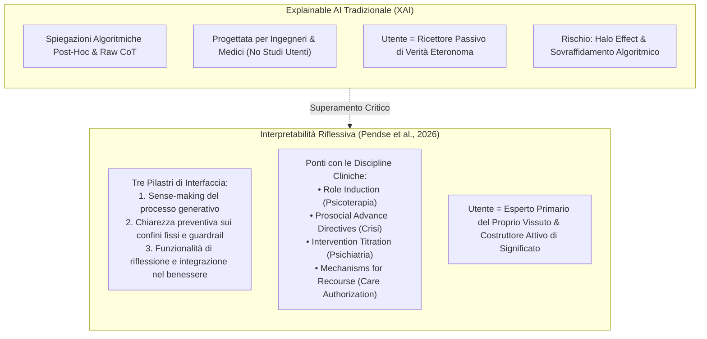

# Interpretabilità Riflessiva (Reflective Interpretability)

## Definizione Operativa
- L'**Interpretabilità Riflessiva (*Reflective Interpretability*)** è un paradigma di design e sicurezza per sistemi di supporto alla salute mentale mediati dall'intelligenza artificiale, definito come un processo iterativo e orientato alla preservazione dell'agency attraverso cui l'utente riflette attivamente sugli output generati dal modello (relativi alla propria esperienza di sofferenza o distress) e li interpreta per costruire un significato personale trasformativo, anziché accoglierli acriticamente come prescrizioni eteronome o direttive autoritarie (Pendse et al., 2026).
- **Utilità Clinica e CBT:** Supera le criticità della *Explainable AI* (XAI) convenzionale che, focalizzandosi sulla trasmissione passiva di spiegazioni tecniche o sull'esposizione disorientante di tracce *Chain-of-Thought* (CoT), rischia di indurre *algorithm appreciation* acritica e progressione patologica. Nel contesto della psicoterapia cognitiva, del colloquio motivazionale e della terapia narrativa, l'interpretabilità riflessiva riproduce il principio maieutico del cambiamento terapeutico, in cui la guarigione scaturisce dall'attribuzione attiva di significato (*meaning response*) e dalla ristrutturazione cognitiva guidata dall'individuo, supportato da un'interfaccia trasparente e delimitata.

| Dimensione | Explainable AI Tradizionale (XAI) | Interpretabilità Riflessiva (*Reflective Interpretability*) |
| :--- | :--- | :--- |
| **Destinatario Principale** | Esperti tecnici, ingegneri ML, clinici e auditor | Utente finale sofferente in stato di distress psicologico |
| **Postura Epistemologica** | **Spiegazione (*Explanation*):** Trasmissione di una giustificazione oggettiva o tecnica | **Interpretazione (*Interpretation*):** Elaborazione maieutica soggettiva e attribuzione di significato (*meaning-making*) |
| **Ruolo dell'Utente** | Ricettore passivo di informazioni o decisioni | Agente attivo ed esperto primario del proprio vissuto |
| **Trasparenza dei Confini** | Guardrail opache che bloccano bruscamente l'output (inducendo *jailbreak*) | Confini chiariti proattivamente via *Role Induction* e memorizzati nel system prompt |
| **Gestione delle Crisi** | Reindirizzamento generico verso linee telefoniche d'emergenza | *Prosocial Advance Directives* concordate preventivamente con *nudges* verso legami umani |
| **Esposizione del Ragionamento** | Tracce CoT complete (rischio di patologizzazione e senso di manipolazione) | *Intervention Titration* collaborativa con insight dosati ed empirismo condiviso |

---

## Evidenze dalla Letteratura

### 1. I Limiti della XAI Tradizionale nel Dominio Clinico
- **Assenza di Validazione Centrata sull'Umano:** Un'analisi sistematica condotta da Suh et al. (2025) rivela che meno dell'1% degli articoli pubblicati in ambito di interpretabilità e spiegabilità dell'IA include una qualche forma di studio con partecipanti umani per verificare se le informazioni fornite siano effettivamente comprensibili e utilizzabili.
- **Il Paradosso dell'Autorità Algoritmica (*Algorithm Appreciation*):** L'aggiunta di spiegazioni tecniche o visualizzazioni di feature salience (Cheng et al., 2024; Vig, 2019) rischia di rafforzare l'effetto alone (*halo effect*; Thorndike, 1920) e l'apprezzamento algoritmico acritico (Logg et al., 2019; Bogert et al., 2021). Negli utenti in stato di ansia o depressione, ciò abbassa la vigilanza critica e porta ad accettare gli output dell'IA come verità indiscutibili (Gino et al., 2012; Siddals et al., 2024).

### 2. Fondamenti Teorici: Etica Medica e Reflective Design
- **Consenso Informato come Dialogo Ermeneutico Continuo:** Nell'etica medica e nella psicoterapia, il consenso informato si è evoluto da una mera formalità di scarico di responsabilità legale a un processo continuo di negoziazione che rafforza la risposta di significato del paziente (*meaning response*; Trachsel & Grosse Holtforth, 2019; Fisher & Oransky, 2008). Nelle comunità di utenti dei servizi di salute mentale (Chamberlin, 1978; Clay, 2005), il consenso rappresenta lo strumento cardine per restituire l'agency sottratta dalle istituzioni asimmetriche.
- **Reflective Design in Human-Computer Interaction (HCI):** Secondo Sengers et al. (2005) e Baumer et al. (2014), la tecnologia riflessiva ha il compito di portare aspetti inconsapevoli dell'esperienza alla coscienza, aprendo nuove possibilità di scelta senza ergersi ad autorità finale su ciò che l'utente sta vivendo (*interpretative flexibility*; Schön, 1983).

### 3. I Tre Pilastri Fondazionali del Modello
1. **Senso della Generazione degli Output (*Sense-Making*):** L'utente deve poter decodificare come l'IA ha formulato una risposta (es. chiarendo quali dati la orientano e distinguendo le risposte basate su istruzioni dell'utente da quelle vincolate a principi etico-clinici generali).
2. **Chiarezza sui Confini Rigidi (*Fixed Boundaries*):** Esplicitazione netta e anticipata dei limiti del supporto offerto dal sistema, spiegando quali pattern attivano le guardrail per prevenire vissuti di rifiuto e tentativi di aggiramento (*jailbreaking*).
3. **Funzionalità per il Benessere e la Riflessione (*Reflective Integration*):** Inclusione di pause maieutiche, domande socratiche e prospettive multiple che sollecitano l'utente a integrare attivamente le intuizioni nel proprio contesto di vita reale.

### 4. Le Quattro Strategie di Attuazione Clinica
- **Role Induction (Psicoterapia):** Delineazione preventiva del ruolo non-umano del chatbot, negoziazione delle preferenze dell'utente e memorizzazione guidata nel *system prompt* per orientare la conversazione (Orne & Wender, 1968; Swift et al., 2023).
- **Prosocial Advance Directives (Intervento sulle Crisi):** Modulo opt-in per pianificare in anticipo le risposte a segnali di crisi acuta o deliri, integrando *prosocial nudges* che incentivano la riconnessione con figure umane di supporto (Pendse et al., 2024; Grüning & Kamin, 2025).
- **Intervention Titration (Psichiatria):** Calibrazione collaborativa dello stile di supporto (es. moduli CBT, DBT o narrativi) ed esclusione di *raw Chain-of-Thought* che potrebbero risultare manipolatori o patologizzanti (Caffrey & Borrelli, 2020; Dattilio & Hanna, 2012).
- **Mechanisms for Recourse (Autorizzazione delle Cure):** Hub trasparente di segnalazione e revisione umana indipendente per debriefing causale dopo interazioni avverse, restituendo agency e voce all'utente (The Human Line Project; Jost, 2011).

---

**Riferimenti Bibliografici:**
- Pendse, S. R., Gergle, D., Kornfield, R., Kruzan, K., Mohr, D., Schleider, J., Suh, J., Wescott, A., & Meyerhoff, J. (2026). The Agony of Opacity: Foundations for Reflective Interpretability in AI-Mediated Mental Health Support. In *Proceedings of the Second Conference of the International Association for Safe and Ethical Artificial Intelligence (IASEAI'26)*, arXiv:2512.16206v2 [cs.HC], 1–18.
- Sengers, P., Boehner, K., David, S., & Kaye, J. (2005). Reflective design. In *Proceedings of the 4th Decennial Conference on Critical Computing: Between Sense and Sensibility*, pp. 49–58.
- Suh, A., Hurley, I., Smith, N., & Siu, H. C. (2025). Fewer than 1% of explainable AI papers validate explainability with humans. In *Proceedings of the Extended Abstracts of the CHI Conference on Human Factors in Computing Systems*, pp. 1–7.
- Trachsel, M., & Grosse Holtforth, M. (2019). How to strengthen patients’ meaning response by an ethical informed consent in psychotherapy. *Frontiers in Psychology*, 10, 1747.
- Baumer, E. P., Khovanskaya, V., Matthews, M., Reynolds, L., Sosik, V. S., & Gay, G. (2014). Reviewing reflection: on the use of reflection in interactive system design. In *Proceedings of the 2014 Conference on Designing Interactive Systems*, pp. 93–102.
- Logg, J. M., Minson, J. A., & Moore, D. A. (2019). Algorithm appreciation: People prefer algorithmic to human judgment. *Organizational Behavior and Human Decision Processes*, 151, 90–103.
- Gross, J. J. (2002). Emotion regulation: Affective, cognitive, and social consequences. *Psychophysiology*, 39(3), 281–291.
- White, M., & Epston, D. (1990). *Narrative means to therapeutic ends*. WW Norton & Company.

---

## Relazioni
- Vedi anche: [[2512.16206v2]], [[role-induction-ai-mental-health]], [[prosocial-advance-directives]], [[intervention-titration-ai]], [[recourse-mechanisms-ai-mental-health]], [[psychological-distress-interaction-patterns]], [[sycophantic-mirroring]], [[calibrated-mismatches]], [[synthetic-psychopathology]], [[alignment-conflict-schema]], [[simulated-empathy-vs-authentic-presence]], [[ai-assisted-psychotherapy]], [[software-as-a-medical-device-salute-mentale]], [[risk-ontology-ai-psychotherapy]]
