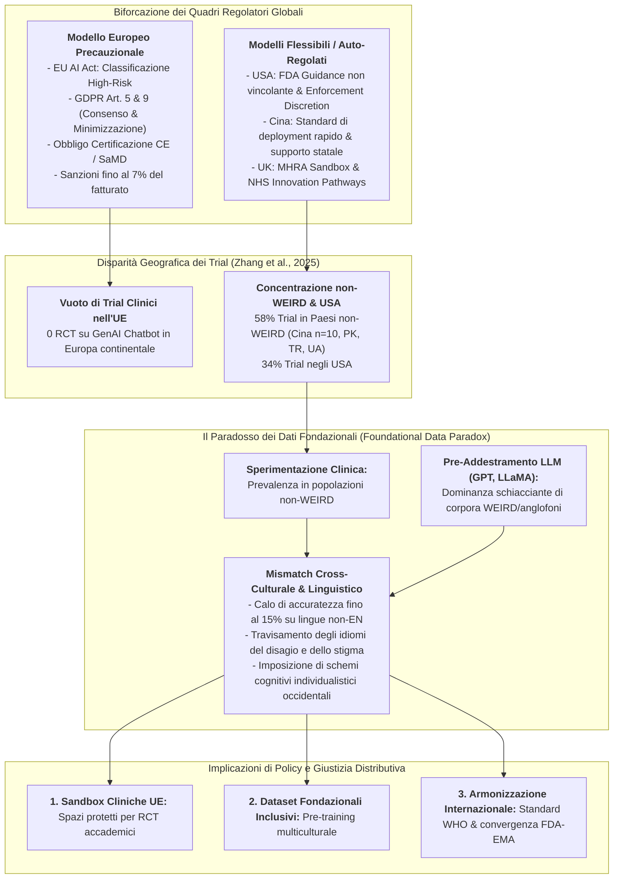
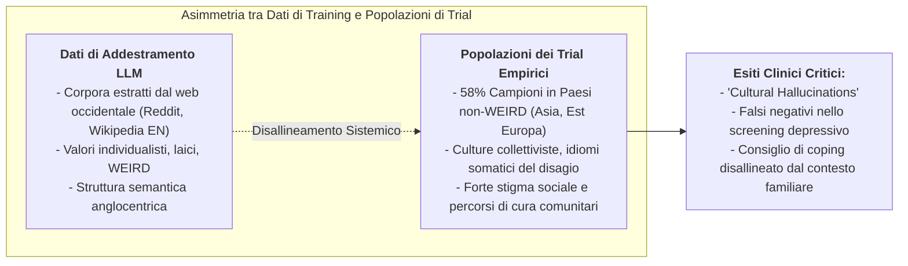

# Regulatory Bifurcation and Geographic Disparity in Mental Health AI (Biforcazione Regolatoria e Disparità Geografica nell'IA per la Salute Mentale)

## Definizione Operativa
- Fenomeno geopolitico, giuridico e bioetico identificato nella ricerca empirica sull'Intelligenza Artificiale applicata alla salute mentale (Zhang et al., 2025; Kandeel et al., 2026), caratterizzato dalla **netta divaricazione tra giurisdizioni a regolamentazione precauzionale e vincolante (in primis l'Unione Europea)** e **mercati a governance flessibile, settoriale o auto-regolata (come Stati Uniti, Cina e Regno Unito)**.
- **La Conseguenza Geografica sui Trial Clinici:** Tale asimmetria crea una frattura globale nell'ecosistema della ricerca clinica:
  - *Il Vuoto Europeo:* I severi oneri di conformità introdotti dall'**EU AI Act (2024)** — che classifica i sistemi di IA per la diagnosi e il supporto psicologico come *High-Risk* imponendo audit indipendenti, marchiatura CE e stringenti requisiti di trasparenza — congiuntamente al **GDPR (Art. 9 sui dati particolari di salute)**, determinano un'assenza pressoché totale di sperimentazioni cliniche randomizzate (RCT) su chatbot generativi condotte all'interno dell'UE (*Brussels Effect* - Siegmann & Anderljung, 2022);
  - *La Concentrazione non-WEIRD:* Al contrario, il **57.9% dei trial clinici empirici** (15 su 26 rassegnati da Zhang et al., 2025) si concentra in Paesi **non-WEIRD** (*non-Western, Educated, Industrialized, Rich, Democratic*), guidati dalla Cina (10 studi), affiancata da Pakistan, Turchia e Ucraina, dove quadri regolatori più flessibili o guidati da strategie industriali statali favoriscono una rapida adozione clinica.

---

## Il "Brussels Effect" e la Fuga della Sperimentazione Clinica

### 1. Il Quadro Europeo: EU AI Act e GDPR
- L'approccio europeo alla regolazione dell'Intelligenza Artificiale è radicato nel principio di precauzione e nella tutela dei diritti fondamentali:
  - **EU AI Act (Regolamento UE 2024/1689):** Gli algoritmi per la salute mentale e il triage diagnostico rientrano nella categoria di **sistemi ad alto rischio (High-Risk)**. Ciò impone sistemi di gestione del rischio (*risk management systems*), governance rigorosa dei dataset di addestramento, documentazione tecnica pre-market esaustiva, registrazione in banche dati UE, sorveglianza umana obbligatoria (*Human-in-the-Loop*) e audit di robustezza e cibersicurezza.
  - **GDPR (Regolamento UE 2016/679):** L'Articolo 9 vieta in linea di principio il trattamento di categorie particolari di dati (tra cui i dati sanitari e biometrici), salvo consenso esplicito o motivi di interesse pubblico rilevante, imponendo severe valutazioni d'impatto (DPIA) e il principio di minimizzazione dei dati (Art. 5).
- **L'Effetto Disincentivante (*Chilling Effect*):** I costi economici, legali e burocratici per condurre RCT conformi all'EU AI Act scoraggiano i ricercatori universitari e le start-up europee, traducendosi in un ritardo sistemico nell'introduzione e sperimentazione di DMHIs basati su GenAI all'interno degli ospedali e dei servizi sanitari comunitari europei.

### 2. Il Dinamismo dei Mercati Flessibili (USA, Cina, UK)
- Negli Stati Uniti, la FDA applica una politica di *enforcement discretion* per molte app digitali per la salute e il benessere (*wellness apps*), non richiedendo l'autorizzazione SaMD (*Software as a Medical Device*) purché non vantino indicazioni diagnostiche formali o eroghino terapie ad alto rischio autonomo (Benjamens et al., 2020; Kandeel et al., 2026).
- In Cina e in altri contesti non-WEIRD, l'assenza di barriere normative restrittive per le fasi pilota e la forte spinta statale verso l'adozione dell'IA hanno consentito la fioritura di sperimentazioni cliniche su larga scala negli ospedali e nelle università (es. studi di *Gan et al., 2025*, *He et al., 2022*, *Sabour et al., 2023*, *Wang et al., 2024*).

---

## Il Paradosso dei Dati Fondazionali (*Foundational Data Paradox*)

La combinazione tra la geografia dei trial e l'architettura dei modelli linguistici genera un paradosso metodologico ed epistemologico:

1. **WEIRD Pre-training vs Non-WEIRD Deploy:**
   - La quasi totalità dei modelli fondazionali (GPT-4, Claude, Gemini, LLaMA) è addestrata su miliardi di token provenienti prevalentemente da fonti Internet occidentali anglofone (Naous et al., 2024; Henrich et al., 2010).
   - I valori incorporati da questi modelli riflettono norme WEIRD: forte enfasi sull'auto-determinazione individuale, assertività, verbalizzazione diretta delle emozioni interiori e de-enfatizzazione delle dinamiche familiari/comunitarie.
2. **Impatto sulle Prestazioni Cliniche:**
   - Quando tali modelli vengono impiegati in popolazioni non-WEIRD (come documentato da Harrigian et al., 2021 e Liu et al., 2023), si registra un calo di accuratezza fino al 15% rispetto alle lingue native e una marcata difficoltà a interpretare espressioni somatiche di sofferenza psicologica o metafore culturali del dolore.
3. **Barriere Linguistiche e Dialettali:**
   - In contesti multilingue o in presenza di dialetti locali (es. varianti regionali in Cina o Pakistan), il modello generativo standard può fraintendere l'urgenza clinica o produrre risposte linguisticamente innaturali, compromettendo l'[[digital-therapeutic-alliance|alleanza terapeutica digitale]].

---

## Tabelle Sinottiche di Comparazione Regolatoria

| Regione / Giurisdizione | Strumento Normativo Cardine | Classificazione della GenAI in Salute Mentale | Requisiti di Compliance e Audit | Effetto sull'Attività di Ricerca Clinica |
| :--- | :--- | :--- | :--- | :--- |
| **Unione Europea (UE)** | **EU AI Act (2024)** + **GDPR (Art. 9)** | **High-Risk (Alto Rischio)** se inteso per triage, diagnosi o psicoterapia. | Valutazione di conformità CE, audit indipendenti, DPIA obbligatoria, divieto di manipolazione algoritmica. | **Forte contrazione e disincentivo:** assenza di grandi RCT clinici su GenAI censiti nelle rassegne sistematiche. |
| **Stati Uniti (USA)** | **FDA SaMD Guidance** + **HIPAA** | Variabile: *Wellness App* (basso vincolo) vs *Digital Therapeutic* (richiede 510(k) o De Novo). | Flessibilità per studi pilota e contesti educativi; conformità HIPAA per la trasmissione dei dati sanitari protetti (PHI). | **Elevata attività di trial accademici e commerciali** (34% dei trial globali censiti). |
| **Cina** | **Interim Measures for Generative AI (2023)** | Incoraggiata l'adozione clinico-sanitaria sotto linee guida etiche nazionali. | Registrazione degli algoritmi presso la CAC, aderenza a standard di sicurezza e sovranità dei dati sanitari. | **Leader mondiale per volume di trial RCT su GenAI** (oltre il 38% degli studi censiti da Zhang et al., 2025). |
| **Regno Unito (UK)** | **MHRA Software and AI as a Medical Device Roadmap** | Approccio pro-innovazione basato su *Sandbox* regolatorie e NHS AI Lab. | Integrazione agevolata tramite i percorsi *NHS Talking Therapies* con monitoraggio clinico del mondo reale. | **Presenza di studi innovativi su larga scala** (es. *Limbic Care*, Habicht et al., McFadyen et al.). |

---

## Raccomandazioni di Governance e Salute Pubblica Globale

Per superare la biforcazione regolatoria e garantire al contempo sicurezza dei pazienti ed equità di accesso all'innovazione clinica:

1. **Istituzione di Regulatory Sandboxes Cliniche nell'UE:**
   - Creazione di spazi di sperimentazione controllata all'interno delle università e dei centri di ricerca clinica europei, con protocolli di conformità agevolati per trial senza fini di lucro, evitando la paralisi della ricerca no-profit;
2. **Pre-Addestramento e Fine-Tuning Pluriculturale:**
   - Finanziamento di consorzi di ricerca aperti per la creazione di modelli linguistici fondazionali addestrati fin dall'origine su dataset demograficamente, linguisticamente e culturalmente diversificati, azzerando il bias WEIRD;
3. **Convergenza e Armonizzazione degli Standard Internazionali:**
   - Adozione globale dei principi guida dell'Organizzazione Mondiale della Sanità (*WHO Guidance on Ethics and Governance of Artificial Intelligence for Health*, 2021), promuovendo il riconoscimento reciproco degli audit di sicurezza clinica tra FDA, EMA e autorità asiatiche.

---

## Riferimenti Bibliografici
- Zhang, Q., Zhang, R., Xiong, Y., Sui, Y., Tong, C., & Lin, F.-H. (2025). Generative AI Mental Health Chatbots as Therapeutic Tools: Systematic Review and Meta-Analysis of Their Role in Reducing Mental Health Issues. *Journal of Medical Internet Research*, 27, e78238. https://doi.org/10.2196/78238
- Kandeel, M. E., Abo Hamza, E. G., Abouahmed, A., AbdelAziz, G. M., Hashish, A., Abo El Wafa, T., Khalil, A., & Eldakak, A. (2026). AI Applications Integrating Legal and Regulatory Perspectives in Mental Health: Systematic Review. *JMIR AI*, 5, e84305. https://doi.org/10.2196/84305
- Benjamens, S., Dhunnoo, P., & Meskó, B. (2020). The state of artificial intelligence-based FDA-approved medical devices and algorithms: an online database. *npj Digital Medicine*, 3(1), 60–64.
- Beyebach, M., Neipp, M. C., Solanes-Puchol, Á., & Martín-Del-Río, B. (2021). Bibliometric differences between WEIRD and non-WEIRD countries in the outcome research on solution-focused brief therapy. *Frontiers in Psychology*, 12, 754885.
- Harrigian, K., Aguirre, C., & Dredze, M. (2021). On the state of social media data for mental health research. *CLPsych 2021*, 15–24.
- Henrich, J., Heine, S. J., & Norenzayan, A. (2010). The weirdest people in the world? *Behavioral and Brain Sciences*, 33(2-3), 61–83.
- Liu, Y., Ye, H., Weissweiler, L., Pei, R., & Schuetze, H. (2023). Crosslingual transfer learning for low-resource languages based on multilingual colexification graphs. *EMNLP 2023*, 562.
- Naous, T., Ryan, M. J., Ritter, A., & Xu, W. (2024). Having beer after prayer? Measuring cultural bias in large language models. In *ACL 2024* (pp. 18653–18667).
- Siegmann, C., & Anderljung, M. (2022). The Brussels effect and artificial intelligence: how EU regulation will impact the global AI market. *APSA Preprints*. https://doi.org/10.33774/apsa-2022-vxtsl
- World Health Organization. (2021). *Ethics and governance of artificial intelligence for health*. WHO Guidance.

---

## Relazioni
- Vedi anche: [[jmir-v27-e78238]], [[weird-bias-cultural-adaptability-ai]], [[gdpr-governance-mental-health-ai]], [[software-as-a-medical-device-salute-mentale]], [[three-layer-governance-framework]], [[quattro-condizioni-liceita-ia-psicologia]], [[social-oriented-vs-task-oriented-chatbots]], [[algorithmic-paternalism-in-ai-mental-health]]
