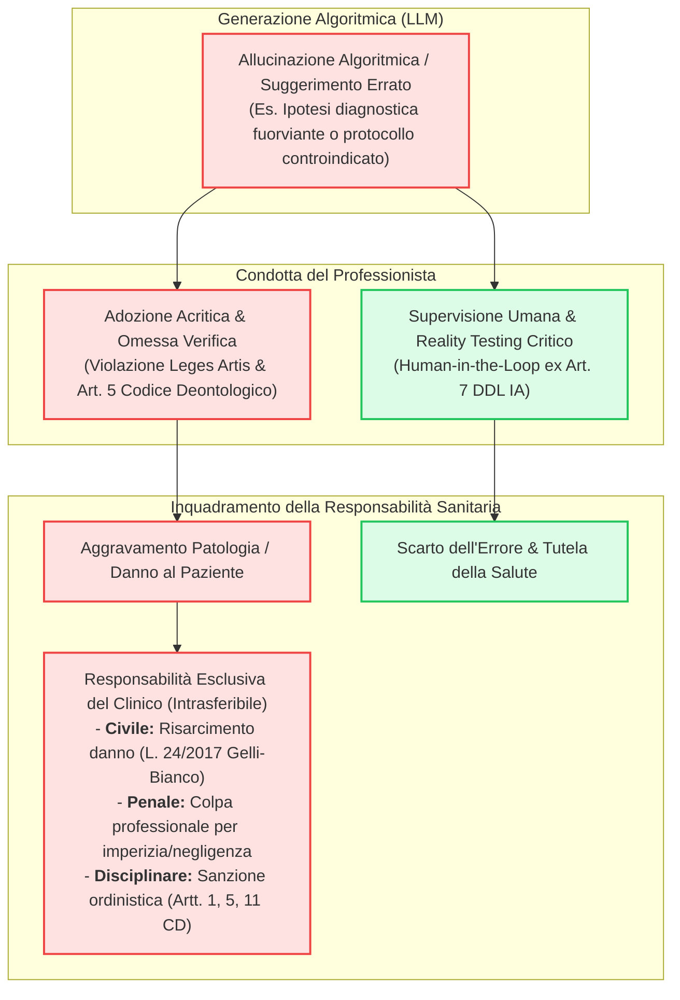

# Responsabilità Sanitaria e Intrasferibilità della Colpa per Allucinazioni Algoritmiche

## Definizione Operativa
- Principio giuridico-deontologico per cui lo psicologo che impiega sistemi di intelligenza artificiale assorbe per intero la responsabilità civile, penale e disciplinare derivante da errori o allucinazioni del modello, non potendo invocare il difetto del software come esimente.
- **Utilità CBT:** Previene l'adozione passiva (*automation bias*) di schemi di concettualizzazione del caso, diagnosi differenziali o prescrizioni di compiti a casa (homework) generati dall'LLM, imponendo un controllo critico basato sulle evidenze prima dell'atto terapeutico.

---

## Evidenze dalla Letteratura
- L'ordinamento giuridico italiano stabilisce che i sistemi di intelligenza artificiale in sanità operano come mero ausilio strumentale e consultivo, riservando la decisione clinica alla professione sanitaria e imponendo la prevalenza del lavoro intellettuale umano (Senato della Repubblica, 2024).
- La giurisprudenza in materia di responsabilità professionale sanitaria esclude l'operatività di esimenti legali per difetto algoritmico: l'interrogazione negligente o non supervisionata di un LLM con conseguente danno al paziente integra colpa per imperizia o inosservanza delle *leges artis* (Legge 24/2017 - Gelli-Bianco; Art. 622 c.p.).
- Il quadro deontologico ripristinato a seguito dell'annullamento giurisdizionale del referendum 2023 vincola lo psicologo a usare esclusivamente metodologie scientificamente validate e di cui possa indicare fonti certe, vietando l'adozione cieca di logiche *black-box* e sanzionando qualsiasi danno da affidamento tecnologico acritico (Consiglio di Stato, 2024; CNOP, 2024).
- Il Garante Privacy ha ribadito che il caricamento di dati clinici e referti su piattaforme di IA generativa espone a gravi rischi di allucinazione e dispersione dei dati sanitari, con conseguente responsabilità diretta del professionista in qualità di Titolare del Trattamento (Garante per la Protezione dei Dati Personali, 2023; 2025).

**Riferimenti Bibliografici:**
- Consiglio di Stato. (2024). *Sentenza n. 10376/2024 del 24 dicembre 2024 (Annullamento referendum revisione Codice Deontologico Psicologi)*. Roma: Consiglio di Stato.
- Consiglio Nazionale Ordine Psicologi [CNOP]. (2024). *Codice Deontologico degli Psicologi Italiani (Testo vigente 2013)*. Roma: CNOP. https://www.psy.it/
- Garante per la Protezione dei Dati Personali. (2023). *Sanità: decalogo del Garante Privacy sull'uso dell'intelligenza artificiale* (Provvedimento n. 9937730). Roma: Garante Privacy. https://www.garanteprivacy.it/home/docweb/-/docweb-display/docweb/9937730
- Garante per la Protezione dei Dati Personali. (2025). *Referti medici e IA, allarme del Garante privacy sui rischi di violazione della riservatezza* (Provvedimento n. 10154670). Roma: Garante Privacy. https://www.garanteprivacy.it/home/docweb/-/docweb-display/docweb/10154670
- Parlamento Italiano. (2017). *Legge 8 marzo 2017, n. 24: Disposizioni in materia di sicurezza delle cure e della persona assistita, nonché in materia di responsabilità professionale degli esercenti le professioni sanitarie (Legge Gelli-Bianco)*. Gazzetta Ufficiale n. 64 del 17 marzo 2017.
- Senato della Repubblica Italiana. (2024). *Disegno di Legge Atto Senato n. 1146-B recante disposizioni e delega al Governo in materia di intelligenza artificiale (Legge n. 132)*. Roma: Senato della Repubblica.

---

## Relazioni
- Vedi anche: [[Normativa_LLM_Psicologia_in_Italia]], [[quattro-condizioni-liceita-ia-psicologia]], [[human-oversight-and-liability-in-clinical-ai]], [[over-deference-in-llm-supervision]], [[clinical-decision-making-and-artificial-intelligence]], [[accuratezza-vs-fattualita-in-genai]], [[single-correct-answer-fallacy-in-clinical-ai]], [[Guida-Pratica-AI-OPPV]]
