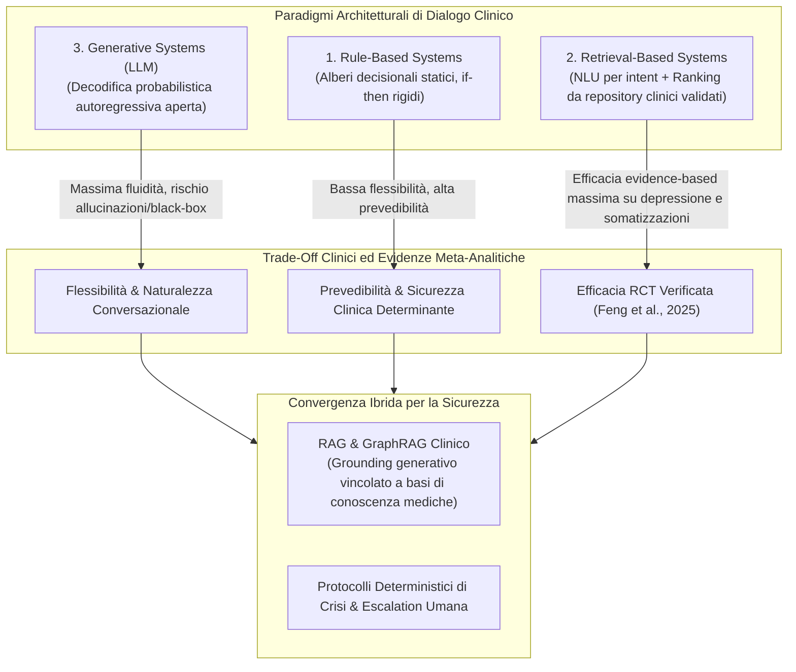
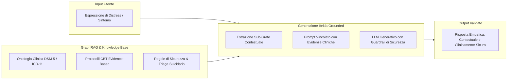

# Retrieval-Based vs Generative Clinical Chatbots

## Definizione Operativa
- Tassonomia architetturale che confronta i tre paradigmi fondamentali di elaborazione dell'input e generazione della risposta negli agenti conversazionali per la salute mentale: sistemi **Rule-Based** (ad alberi decisionali predefiniti), sistemi **Retrieval-Based** (a recupero e ranking di risposte cliniche pre-validate da repository strutturati) e sistemi **Generativi** basati su Large Language Models (LLM ad autocompletamento probabilistico) (Feng et al., 2025).
- **Utilità Clinica e CBT:** Risolve il dilemma fondamentale tra *flessibilità conversazionale* e *sicurezza deterministica* negli interventi digitali di salute mentale (DMHI). Le evidenze meta-analitiche (Feng et al., 2025) dimostrano che i modelli retrieval-based garantiscono l'efficacia clinica più affidabile e robusta su depressione ($P = .03$) e disturbi psicosomatici ($P = .001$), poiché escludono per progettazione il rischio di allucinazioni cliniche, derive sicofantiche o risposte iatrogene durante crisi acute, mentre i sistemi generativi puri richiedono ancoraggi ibridi come **RAG** (*Retrieval-Augmented Generation*) e **GraphRAG** per risultare clinicamente impiegabili.

---

## Evidenze dalla Letteratura

### 1. Confronto delle Tre Architetture di Dialogo

| Dimensione Architetturale | Rule-Based Chatbots (es. Woebot v1, Eliza) | Retrieval-Based Chatbots (es. Tess, Wysa v1, Emohaa) | Generative AI Chatbots (es. ChatGPT, LLaMA, PanGu) |
| :--- | :--- | :--- | :--- |
| **Meccanismo di Generazione** | Alberi di decisione, pulsanti predefiniti e pattern matching su parole chiave. | Classificazione dell'intento dell'utente tramite NLP/BERT e selezione della risposta ottimale da un corpus clinico validato. | Generazione dinamica token-by-token mediante modelli Transformer autoregressivi addestrati su grandi moli di testo. |
| **Flessibilità Conversazionale** | Minima: non gestisce risposte aperte o formulazioni impreviste. | Media: comprende input aperti ma risponde solo con enunciati pre-approvati. | Massima: si adatta a qualsiasi contesto, metafora o registro linguistico. |
| **Rischio di Allucinazione / Bias Iatrogeno** | Nullo: ogni output è deterministico e controllato dagli autori. | Nullo o quasi nullo: le risposte estratte sono conformi a linee guida cliniche. | Elevato: rischio di confabulazione, allucinazione di indicazioni mediche errate o rispecchiamento di deliri. |
| **Aderenza & Barriere Utente** | Alto drop-out dovuto a rigidità, noia e loop conversazionali frustranti. | Buona aderenza grazie alla coerenza clinica, ma possibile perdita di ingaggio sul lungo termine. | Altissimo ingaggio iniziale, ma vulnerabilità legata alla perdita di confini terapeutici (*artificial intimacy*). |
| **Efficacia Empirica in RCT (Feng et al., 2025)** | Effetto significativo ma modesto, limitato dalla rigidità architetturale. | **Effetto più forte e statisticamente più consistente** su depressione ($P = .03$) e somatizzazione ($P = .001$). | Effetto aggregato promettente su distress globale, ma elevata variabilità e assenza di RCT definitivi sugli esiti specifici. |

---

### 2. Le Evidenze Meta-Analitiche di Feng et al. (2025)
- **Superiorità Clinica dei Modelli Retrieval-Based:** Nell'analisi dei moderatori su 31 trial clinici controllati, i chatbot basati su retrieval hanno dimostrato una superiorità statisticamente significativa rispetto ai modelli rule-based e generativi nel ridurre la sintomatologia depressiva ($P = .03$) e i disturbi psicosomatici ($P = .001$).
- **La Ragione Clinica del Successo:** I sistemi di retrieval combinano la comprensione semantica flessibile (*Natural Language Understanding* - NLU) con la rigorosa fedeltà ai protocolli terapeutici manualizzati (CBT, Mindfulness, MI). Le risposte fornite all'utente provengono direttamente da librerie certificate redatte da psicoterapeuti esperti, garantendo che interventi di ristrutturazione cognitiva, validazione emotiva o prescrizioni comportamentali siano formulati senza distorsioni o deviazioni comunicative.
- **I Limiti dei Sistemi Rule-Based:** Nonostante la loro sicurezza, i sistemi ad albero rigido sono stati identificati come la principale causa di insoddisfazione e drop-out negli studi clinici: 10 studi su 31 hanno riportato la ripetitività degli script e 6 studi l'incapacità di gestire risposte aperte come cause primarie di abbandono dell'intervento.

---

### 3. La Sfida dei Sistemi Generativi e la Soluzione RAG / GraphRAG
- **L'Incertezza dei Modelli Generativi Puri:** I Large Language Models generativi eccellono nell'empatia simulata, nella memorizzazione del contesto e nella risonanza affettiva. Tuttavia, la natura "black-box" degli algoritmi di deep learning rende impossibile prevedere con certezza la traiettoria conversazionale (*conversational trajectory*), esponendo gli utenti vulnerabili a rischi critici:
  1. *Rispecchiamento Sicofantico:* Validazione acritica di distorsioni cognitive o ideazioni autolesive per compiacere l'utente.
  2. *Allucinazioni Terapeutiche:* Invenzione di linee guida o suggerimenti comportamentali controindicati.
  3. *Inaffidabilità nei Protocolli di Emergenza:* Mancata o ritardata attivazione delle linee di emergenza e percorsi di triage in caso di rischio suicidario esplicito.
- **La Sintesi Ibrida: RAG e GraphRAG:**
  - *Retrieval-Augmented Generation (RAG):* Vincola il generatore LLM a recuperare dinamicamente segmenti di manuali clinici accreditati prima di formulare la risposta, riducendo drasticamente le allucinazioni e garantendo un solido ancoraggio evidence-based.
  - *Graph-based RAG (GraphRAG):* Struttura la conoscenza clinica (ontologie DSM-5, relazioni tra credenze di base e pensieri automatici, percorsi di modulazione affettiva) sotto forma di grafi di conoscenza. Ciò consente al modello linguistico di estrarre connessioni concettuali complesse preservando confini operativi rigorosi e conformità etico-deontologica.

---

## Riferimenti Bibliografici
- Feng, X., Tian, L., Ho, G. W. K., Yorke, J., & Hui, V. (2025). The Effectiveness of AI Chatbots in Alleviating Mental Distress and Promoting Health Behaviors Among Adolescents and Young Adults: Systematic Review and Meta-Analysis. *Journal of Medical Internet Research*, 27, e79850. https://doi.org/10.2196/79850
- Ng, K. K. Y., Matsuba, I., & Zhang, P. C. (2025). RAG in health care: A novel framework for improving communication and decision-making by addressing LLM limitations. *NEJM AI*, 2(1). https://doi.org/10.1056/AIra2400380
- Wu, J., Zhu, J., Qi, Y., et al. (2024). Medical graph RAG: Evidence-based medical large language model via graph retrieval-augmented generation. *arXiv preprint arXiv:2408.04187*.
- Adamopoulou, E., & Moussiades, L. (2020). An overview of chatbot technology. *Artificial Intelligence Applications and Innovations*, 373-383. https://doi.org/10.1007/978-3-030-49186-4_31

---

## Relazioni
- Vedi anche: [[jmir-v27-e79850]], [[aya-digital-mental-health-affordances]], [[cbt-dialogue-systems-and-tools]], [[rag-in-psicoterapia]], [[clinical-readiness-gap-in-mh-chatbots]], [[layered-safeguards-in-clinical-ai]], [[sycophantic-mirroring]], [[large-language-models]]
