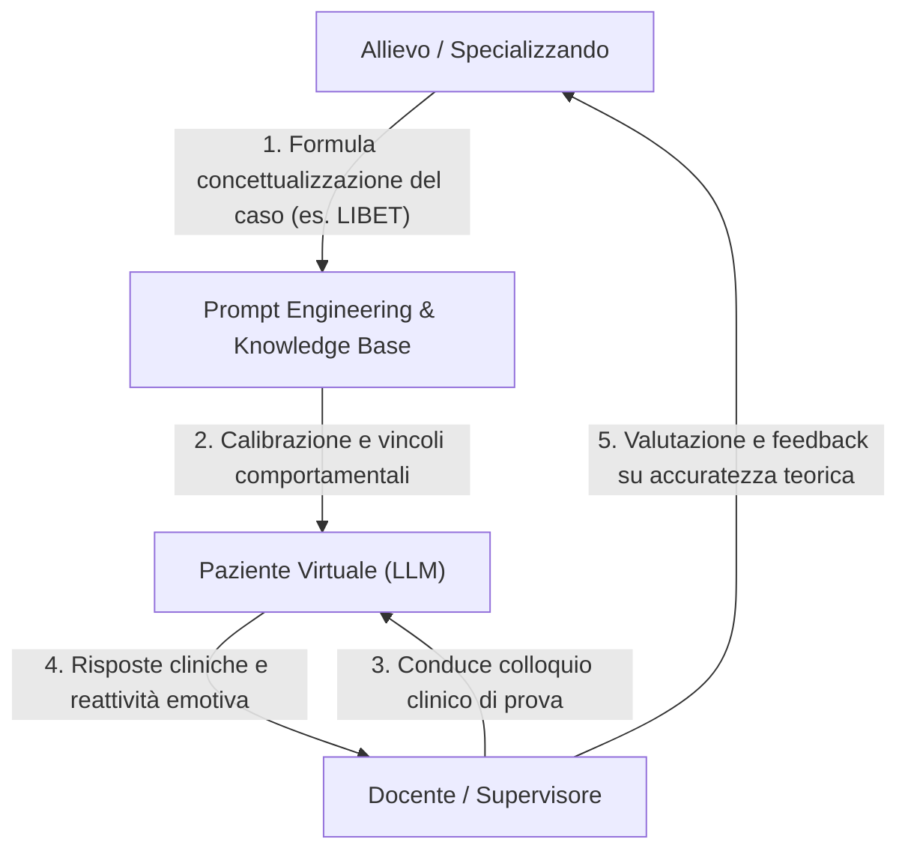

# Reverse Training e Didattica Induttiva con Pazienti Virtuali

**Summary**: Metodologia pedagogica avanzata per la formazione clinica e la psicoterapia in cui lo specializzando modella e addestra un paziente virtuale basato su LLM per dimostrare la padronanza di un quadro diagnostico-funzionale (*learning by teaching*), sottoponendo l'agente simulato alla valutazione del docente/supervisore.
**Sources**: 06-05 Riunione_ Impiego dell'IA in ambito clinico, bias e formazione.txt, 05-08 Riunione_ Sviluppo Knowledge Base AI, Etica e Applicazioni Cliniche.txt
**Last updated**: 2026-08-27
---

## Definizione e Fondamenti Teorici

Il **Reverse Training con Pazienti Virtuali** rovescia l'approccio didattico convenzionale nell'uso della simulazione clinica:
- **Dal Consumo alla Creazione Attiva**: Anziché limitarsi a interagire passivamente come terapeuta con un paziente simulato standard, lo studente assume il ruolo di sviluppatore clinico del modello, configurando credenze di base, cicli interpersonali disfunzionali, bias cognitivi e pattern verbali specifici.
- **Principio del *Learning by Teaching***: In conformità al metodo induttivo ("insegnando imparo"), la capacità di calibrare un modello linguistico affinché riproduca coerentemente una psicopatologia senza deviare in risposte stereotipate o allucinazioni dimostra una comprensione concettuale profonda del caso clinico.

## Meccanismo Operativo nel Setting Formativo e di Supervisione

1. **Fase di Modellizzazione e Prompting**: Lo specializzando traduce la concettualizzazione del caso (es. piano semi-adattivo, credenze nucleari, meccanismi di mantenimento) in un set di istruzioni, contesti e guardrail per l'LLM.
2. **Colloquio del Supervisore**: Il docente o supervisore conduce un colloquio clinico non strutturato con l'agente generato dall'allievo, testandone la coerenza psicopatologica, la resistenza ai tentativi di ristrutturazione e l'autenticità dei bias cognitivi.
3. **Valutazione Metacognitiva e Debugging Clinico**: Le eventuali incongruenze o stereotipie emerse nel paziente virtuale diventano indicatori diretti di lacune nella concettualizzazione teorica dell'allievo, guidando la supervisione mirata.

## Prompting Socratico e Guardrails nelle Guide Didattiche

- **Transizione verso Agenti Maieutici**: Nei supporti all'apprendimento (es. *Libet Prime*), l'IA non deve fornire soluzioni preconfezionate ma guidare l'allievo attraverso il dialogo socratico, ponendo domande aperte di secondo livello e stimolando la riflessione differenziale.
- **Prevenzione della Deriva Ricorsiva**: Necessità di implementare *guardrails* e regole di stop definite per evitare che il dialogo socratico dell'agente si trasformi in una sequenza circolare e autoreferenziale priva di esito didattico.

---

## Related pages
- [[06-05_Riunione_Impiego_IA]]
- [[simulazione-pazienti-ai]]
- [[clinical-ai-simulation]]
- [[human-in-the-reasoning]]
- [[prompting-in-psychology]]
- [[machine-psychology]]
