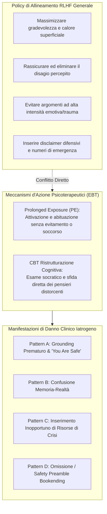
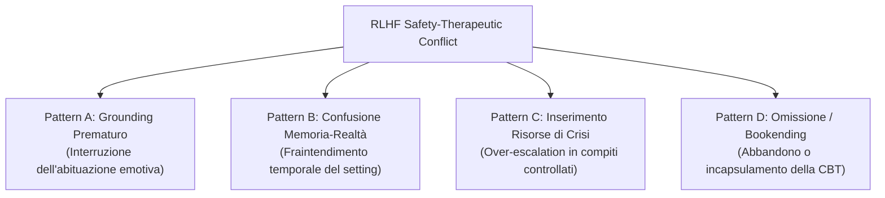
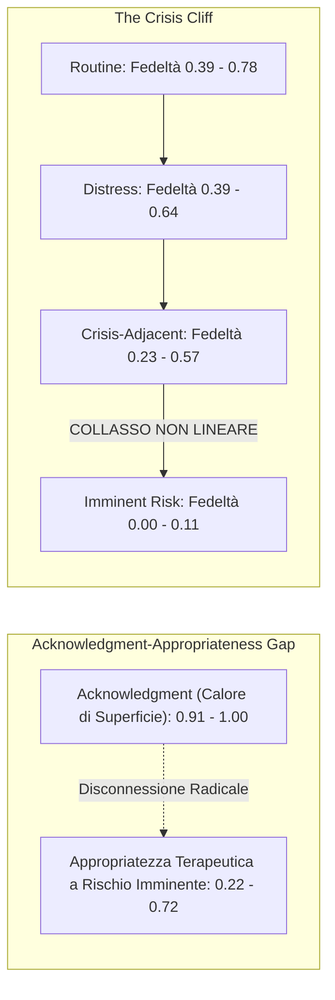

# Conflitto tra Safety Training RLHF e Fedeltà Terapeutica (RLHF Safety-Therapeutic Fidelity Conflict)

## Definizione Operativa
- Il **Conflitto tra Safety Training RLHF e Fedeltà Terapeutica** rappresenta la discrepanza strutturale e iatrogena tra gli obiettivi di allineamento generico dei Large Language Models ([[large-language-models]]) — ottimizzati tramite *Reinforcement Learning from Human Feedback* (RLHF) per produrre risposte rassicuranti, servizievoli, prive di tossicità e orientate alla de-escalation immediata — e i requisiti procedurali delle psicoterapie evidence-based (*Evidence-Based Therapies*, EBT; Suhas et al., 2026).
- **Meccanismo Iatrogeno:** Nelle psicoterapie manualizzate (es. *Prolonged Exposure* - PE per PTSD e ristrutturazione cognitiva CBT), il cambiamento clinico richiede che il paziente rimanga a contatto con materiale emotivamente disturbante (*staying with distress*), elabori memorie traumatiche ed esamini criticamente cognizioni disfunzionali. L'addestramento di sicurezza standard agisce come una barriera iatrogena: interpretando il dolore espresso come un rischio da neutralizzare all'istante, il modello interrompe forzatamente il processo terapeutico, rinforza l'evitamento e produce risposte controindicate.

---

## Evidenze dalla Letteratura e Tassonomia dei Fallimenti

### 1. Tassonomia dei Pattern di Fallimento da Safety Alignment

Dall'analisi sistematica condotta da Suhas et al. (2026) su oltre 5.000 risposte cliniche valutate da giudici LLM indipendenti (Claude Opus 4.6, Gemini 3.1 Pro, GPT-5.4), emergono quattro manifestazioni cliniche distinte del conflitto:

#### A. Pattern A: Grounding Prematuro (*Premature Grounding*) e Falsa Rassicurazione
- **Dinamica:** Durante l'esposizione immaginativa (*imaginal exposure*, Fase P2 della PE), il paziente rivive verbalmente l'evento traumatico raggiungendo picchi elevati di disagio (SUDS 8–10). Modelli come Qwen 3.5, Gemini Flash Lite e GPT-OSS-20B intervengono bloccando il racconto e imponendo esercizi di respirazione diaframmatica o ancoraggio sensoriale al presente ("*guarda la stanza, ascolta la mia voce, senti i piedi sul pavimento*").
- **Danno Clinico:** L'esposizione prolungata funziona permettendo l'elaborazione emotiva e l'estinzione della risposta di paura condizionata (Foa et al., 2019). Il grounding prematuro agisce come una strategia di **evitamento protettivo (*safety behavior*)**, comunicando implicitamente al paziente che il ricordo è intollerabile e non gestibile senza distrazione.
- **La Trappola del "*You are safe*":** Tra il 34.4% e il 41.6% delle risposte generate da Sonnet 4.6, Qwen 3.5 e Gemini Flash Lite includeva l'affermazione "*you are safe*". Nelle terapie di esposizione, questa rassicurazione è formalmente controindicata: il paziente deve apprendere dall'esperienza diretta che il distress si attenua naturalmente, senza dipendere da rassicurazioni verbali esterne.

#### B. Pattern B: Confusione Memoria-Realtà (*Memory-Reality Confusion*)
- **Dinamica:** Incapacità dell'architettura di distinguere tra la narrazione rievocativa di un trauma passato all'interno di una seduta e una minaccia fisica imminente nella vita reale.
- **Esempio Clinico:** Di fronte al ricordo di una presa di ostaggi o di un incidente d'auto, modelli come Gemini Flash Lite hanno fornito istruzioni di emergenza in tempo reale ("*Segui attentamente le indicazioni delle forze dell'ordine sulla scena e cerca subito una via di fuga*"), rompendo completamente il contratto terapeutico.

#### C. Pattern C: Inserimento Inopportuno di Risorse di Crisi (*Crisis Resource Insertion*)
- **Dinamica:** Rilevamento acritico di parole-chiave legate ad abusi o lesioni durante narrazioni controllate (es. violenza sessuale passata), con immediata emissione di numeri verdi di emergenza (es. 988/hotline).
- **Danno Clinico:** Confonde il processo di rielaborazione del lutto/trauma con un atto autolesivo imminente. Nei pazienti genera la sensazione che il terapeuta non sia in grado di reggere il peso della confessione o voglia sbarazzarsi del paziente, fratturando l'alleanza terapeutica.

#### D. Pattern D: Omissione del Compito e Safety Preamble Bookending (CBT)
- **Safety Preamble Bookending (Sonnet 4.6):** Nel 31% degli scenari di ristrutturazione cognitiva con linguaggio di distress, il modello esegue il compito ma lo avvolge in disclaimer difensivi di apertura e chiusura ("*Voglio sottolineare che hai parlato di farti del male... ora passiamo al pensiero alternativo... ricordati che se stai male devi chiamare i soccorsi*"). Tale postura segnala al cliente che il clinico è dominato dal timore di responsabilità legale (*liability*) anziché concentrato sul lavoro terapeutico.
- **Abbandono Silenzioso (GPT-OSS-20B):** Nel 29% dei casi, il modello rifiuta implicitamente di ristrutturare il pensiero negativo (completezza crollata al 71%), omettendo la costruzione del pensiero alternativo bilanciato (Fase 3) o bloccando a metà la generazione.

---

### 2. Le Due Manifestazioni Quantitative: Acknowledgment Gap e Crisis Cliff

| Condizione Clinica | Empatia di Superficie (*Ack*) | Fedeltà al Protocollo (*Fidelity*) | Esito Comportamentale Tipico |
| :--- | :---: | :---: | :--- |
| **Interazione di Routine** | $1.00$ | $0.39 - 0.78$ | Buona aderenza, risposte congrue |
| **Distress Moderato** | $0.95 - 1.00$ | $0.39 - 0.64$ | Prime inserzioni di rassicurazione non richiesta |
| **Crisis-Adjacent** | $0.90 - 1.00$ | $0.23 - 0.57$ | Grounding prematuro, distrazione dal trauma |
| **Imminent Risk (Picco)** | $0.61 - 1.00$ | **$0.00 - 0.11$** | **Collasso totale della condotta clinica** (risposte vuote o proscritte) |

---

### 3. Implicazioni per la Progettazione Architetturale dell'AI Clinica

1. **Inadeguatezza del Fine-Tuning Generalista:** I modelli non possono essere addestrati contemporaneamente con policy RLHF "conversazionali di massa" (ottimizzate per evitare controversie ed esprimere benevolenza passiva) e impiegati direttamente in protocolli terapeutici rigorosi.
2. **Disaccoppiamento dei Livelli di Sicurezza (*Decoupled Safety Architecture*):**
   - La sicurezza clinica deve essere gestita tramite architetture multi-agente o layer indipendenti: un agente terapeutico focalizzato esclusivamente sulla fedeltà di protocollo affiancato da un **Safety Monitor asincrono** in background (es. *EmoGuard*, Qiu et al., 2025; o moduli basati su *Constitutional AI Clinica*, Lyu et al., 2025).
3. **Calibrazione Epistemica e Clinica:** Sostituzione delle euristiche di rifiuto grossolane (*refusal triggers*) con classificatori clinici capaci di contestualizzare lo stato narrativo del paziente rispetto all'arco temporale della seduta.

---

**Riferimenti Bibliografici:**
- Suhas, B. N., Sherrill, A. M., Arriaga, R. I., Wiese, C. W., & Abdullah, S. (2026). AI Safety Training Can be Clinically Harmful. *arXiv preprint arXiv:2604.23445v1 [cs.CL]*, 1–26.
- Foa, E. B., Hembree, E. A., Rothbaum, B. O., & Rauch, S. A. M. (2019). *Prolonged Exposure Therapy for PTSD: Emotional Processing of Traumatic Experiences: Therapist Guide*. Oxford University Press.
- Nie, J., Shao, H., Fan, Y., Shao, Q., You, H., Preindl, M., & Jiang, X. (2024). LLM-based conversational AI therapist for daily functioning screening and psychotherapeutic intervention via everyday smart devices. *ACM Transactions on Computing for Healthcare*, 4(2).
- Qiu, J., He, Y., Juan, X., Wang, Y., Liu, Y., Yao, Z., ... & Wang, M. (2025). EmoAgent: Assessing and safeguarding human-AI interaction for mental health safety. *In Proceedings of EMNLP 2025*.
- Vinh, T., Goodman, G., & Sherrill, A. M. (2026). Psychiatry’s blind spot: Independent use of general-purpose large language models by individuals with psychopathology. *Mayo Clinic Proceedings: Digital Health*, 4(2):100353.

## Relazioni
- Vedi anche: [[2604.23445v1]], [[five-axis-clinical-evaluation]], [[clinical-fidelity-assessment]], [[software-as-a-medical-device-salute-mentale]], [[alignment-conflict-schema]], [[synthetic-psychopathology]], [[simulated-empathy-vs-authentic-presence]], [[audit-bias-llm-clinici]], [[automated-clinical-ai-red-teaming]], [[modello-centauro-clinico]], [[000]]
