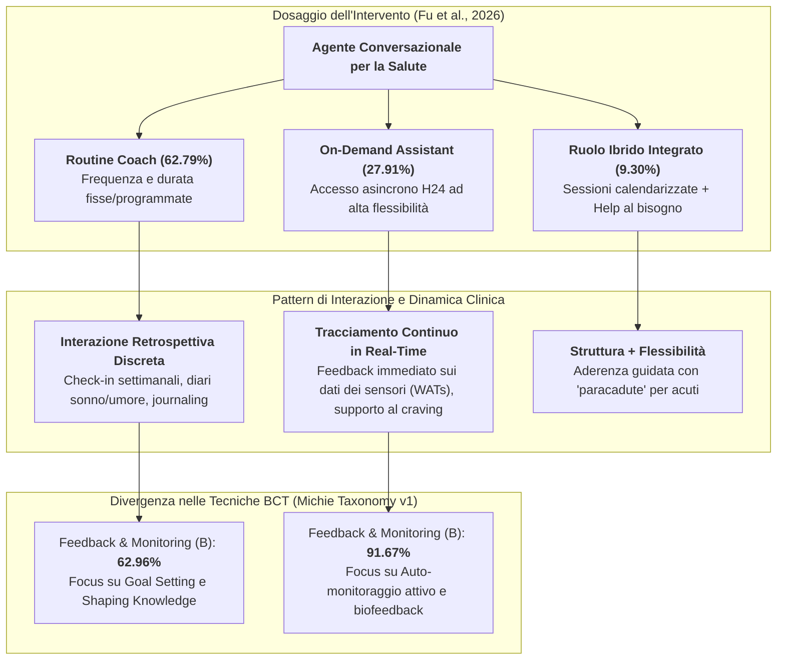
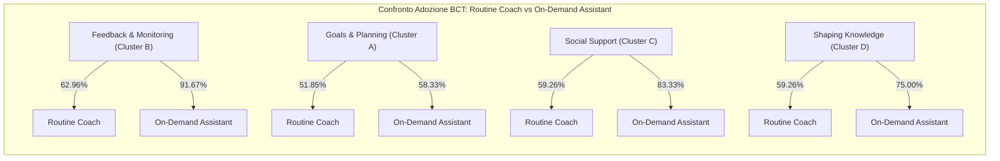

# Routine Coach vs On-Demand Assistant in Health Behavior Chatbots (Coach di Routine vs Assistente su Richiesta)

## Definizione Operativa
- Dicotomia funzionale e posologica formalizzata nello scoping review sistematico di Fu et al. (*JMIR*, 2026), che classifica gli agenti conversazionali di salute in base al **dosaggio dell'intervento** (*intervention dosage*), definito dalla frequenza d'uso e dalla durata per singola interazione:
  1. **Routine Coach (Coach di Routine):** Agente conversazionale che eroga interventi con una frequenza strutturata e una durata predeterminata (es. sessioni 3-4 volte a settimana, check-in settimanali programmati). Il dialogo si focalizza tipicamente su valutazioni retrospettive *una tantum*, come la riflessione sull'umore (*mood reflection*), la compilazione di diari del sonno (*sleep diaries*) o il journaling della gratitudine.
  2. **On-Demand Assistant (Assistente su Richiesta):** Agente conversazionale accessibile in modo continuo e asincrono (24 ore su 24, 7 giorni su 7), in cui l'utente stabilisce autonomamente quando, dove, quanto a lungo e con quale intensità interagire. Il sistema implementa un monitoraggio attivo e continuo dei comportamenti (*real-time tracking*), erogando feedback immediato e rinforzi contingenti in tempo reale.
- **Distribuzione Empirica e Modelli Ibridi (Fu et al., 2026):**
  - *Routine Coach esclusivo:* **62.79%** (27/43 studi);
  - *On-Demand Assistant esclusivo:* **27.91%** (12/43 studi);
  - *Modelli Ibridi Integrati (Dual-Role):* **9.30%** (4/43 studi), che combinano sessioni periodiche calendarizzate (promemoria e revisione obiettivi) con un supporto conversazionale *on-demand* per gestire momenti di crisi, craving o acuti cali motivazionali.

---

## Divergenza nelle Tecniche di Cambiamento Comportamentale (BCTs)

L'analisi condotta secondo la *Behavior Change Technique Taxonomy v1* (Michie et al., 2013) rivela somiglianze nei fattori di base ma una marcata differenziazione nei meccanismi di regolazione:

### 1. Tecniche Condivise (Core BCTs Comuni)
Entrambi i ruoli integrano regolarmente tre macro-cluster di tecniche conversazionali:
- **Obiettivi e Pianificazione (*Goals and Planning - Cluster A*, 55.81%):** Definizione collaborativa di target comportamentali (es. 7.000 passi al giorno, riduzione di sigarette) e formulazione di piani di azione "se-allora" (*action planning*);
- **Supporto Sociale (*Social Support - Cluster C*, 60.47%):** Espressione di empatia, incoraggiamento motivazionale personalizzato, uso di elementi espressivi (emoji, gif, grafici) e fornitura di contatti per l'escalation clinica umana o linee di emergenza (*crisis hotlines*);
- **Trasmissione di Conoscenza (*Shaping Knowledge - Cluster D*, 62.79%):** Istruzioni pratiche su come eseguire l'attività, psicoeducazione sui benefici dello stile di vita sano e tecniche di ristrutturazione cognitiva per superare le barriere percepite.

### 2. La Frattura su Feedback e Monitoraggio (Cluster B)
La principale asimmetria tra i due modelli risiede nell'implementazione del cluster *Feedback and Monitoring*:
- Negli **On-Demand Assistants**, il monitoraggio e il feedback sono presenti nel **91.67% (11/12)** dei sistemi, grazie all'interfacciamento in tempo reale con sensori, registri alimentari istantanei o scale sintomatologiche compilate nel momento esatto del bisogno;
- Nei **Routine Coaches**, la percentuale scende al **62.96% (17/27)**, limitandosi a resoconti periodici differiti.

---

## Fondamenti Teorici e Meccanismi Psicologici

La superiorità o appropriatezza dell'uno o dell'altro ruolo dipende dal costrutto teorico sottostante:

### 1. Il Modello di *Supportive Accountability* (Mohr et al., 2011) per i Routine Coaches
- Il *Routine Coach* capitalizza sul principio della **responsabilità supportata**: la consapevolezza che il chatbot invierà un promemoria o richiederà un check-in in un giorno e a un'ora precisa crea un'aspettativa sociale interiorizzata che previene la procrastinazione e stimola l'aderenza nel lungo termine.
- Si adatta idealmente a interventi di abitudini routinarie (es. camminata quotidiana, igiene del sonno, rispetto della dieta mediterranea).

### 2. Teoria dell'Autoregolazione e *Real-Time Coping* per gli On-Demand Assistants
- L'assistente *on-demand* risponde alle esigenze dell'*ecological momentary intervention* (EMI): interviene nel momento esatto e nel contesto ecologico in cui il paziente sperimenta vulnerabilità (es. un picco di stress acuto o un improvviso desiderio compulsivo di fumare).
- Fornisce strumenti immediati di de-escalation emotiva (respirazione diaframmatica, tecniche di distrazione, ristrutturazione socratico-cognitiva CBT istantanea).

---

## Tabella Comparativa Sinottica

| Dimensione | Routine Coach | On-Demand Assistant | Modello Ibrido Integrato |
| :--- | :--- | :--- | :--- |
| **Iniziativa dell'Interazione** | Proattiva del sistema (notifiche push, orari prefissati) | Reattiva su richiesta dell'utente | Mista (notifiche di routine + trigger dell'utente) |
| **Frequenza Tipica** | 1–4 volte a settimana; orari fissi | Imprevedibile; da multipla quotidiana a sporadica | Check-in settimanali + SOS continuo |
| **Durata della Sessione** | Breve e focalizzata (5–15 minuti) | Variabile in base al bisogno (2–30+ minuti) | Sessioni standard brevi + sessioni lunghe di crisi |
| **Adozione Feedback & Monitoring** | Moderata (62.96%) | Molto Alta (91.67%) | Massima (100%) |
| **Integrazione Wearable (WATs)** | Sincronizzazione periodica / retrospettiva | Streaming dati real-time / notifiche di biofeedback | Tracciamento continuo con reportistica periodica |
| **Comportamenti di Elezione** | Adozione progressiva di esercizio fisico, dieta, sonno | Gestione dello stress acuto, craving da fumo, alcol | Trattamenti multicomponenti complessi, obesità, DCA |
| **Rischio Principale** | Attrito da notifiche percepite come intrusive; noia | Dipendenza, calo di motivazione senza promemoria | Complessità architetturale e sovraccarico cognitivo |

---

## Implicazioni Architetturali e Tecnologiche

1. **Requisiti di Backend per i Routine Coaches:**
   - Motori di schedulazione temporale (*Cron Jobs*, serverless event triggers);
   - Algoritmi di ottimizzazione del momento di invio (*just-in-time notification timing*) basati sui ritmi circadiani e sulle abitudini storiche dell'utente;
   - Script conversazionali a moduli sequenziali.
2. **Requisiti di Backend per gli On-Demand Assistants:**
   - NLU ad alta accuratezza per la classificazione istantanea degli intenti e delle entità emotive/comportamentali;
   - Connessione a webhook a bassa latenza e database NoSQL (MongoDB, PostgreSQL) per recuperare immediatamente lo storico clinico dell'utente;
   - Riconoscimento immediato delle situazioni di pericolo/crisi per l'attivazione dei protocolli di emergenza (*red-flag escalation*).

---

## Collegamenti Strutturali con la Knowledge Base

- **Origine e Dati Empirici:** Estratto da [[jmir_v28i1e79677|Scoping Review JMIR 2026 (Fu et al.)]].
- **Framework di Misurazione:** Si collega a [[five-domain-chatbot-validation-framework|Framework di Validazione a Cinque Domini per Chatbot di Salute Comportamentale]].
- **Dicotomie Funzionali Complementari:** Confronta con la distinzione orientata ai fattori emotivi vs compiti in [[social-oriented-vs-task-oriented-chatbots|Social-Oriented vs Task-Oriented Chatbots]].
- **Architetture Tecniche di Risposta:** Si collega a [[retrieval-vs-generative-clinical-chatbots|Retrieval vs Generative Clinical Chatbots]].
- **Integrazione con Dispositivi:** Si articola con [[wearable-sensor-fusion-adherence|Wearable Sensor Fusion Adherence]].
- **Dinamiche Relazionali:** Si confronta con i meccanismi di [[digital-therapeutic-alliance|Alleanza Terapeutica Digitale]].

---
*Fonte Primaria: Fu L, Burns R, Xie Y, Shen J, Zhe S, Estabrooks P, Bai Y. "The Development and Use of AI Chatbots for Health Behavior Change: Scoping Review." Journal of Medical Internet Research (JMIR), 2026; 28:e79677. DOI: 10.2196/79677.*
