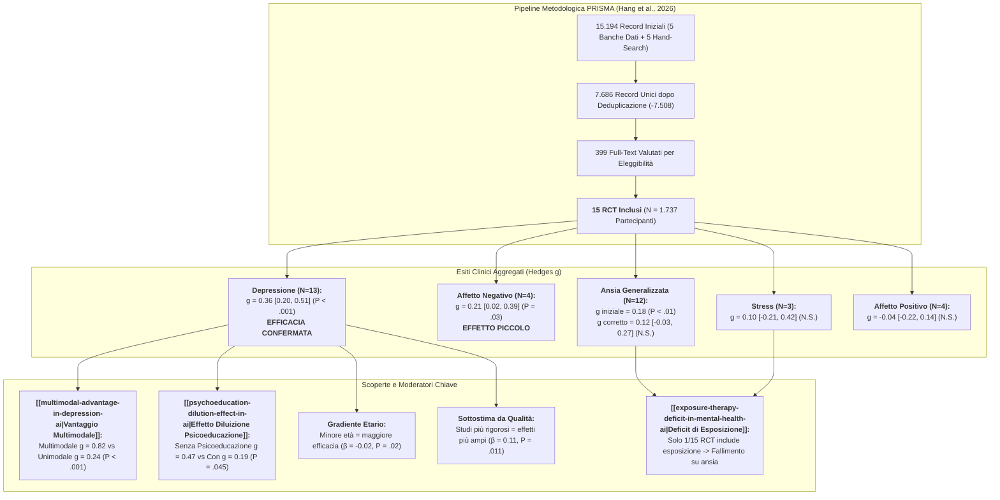
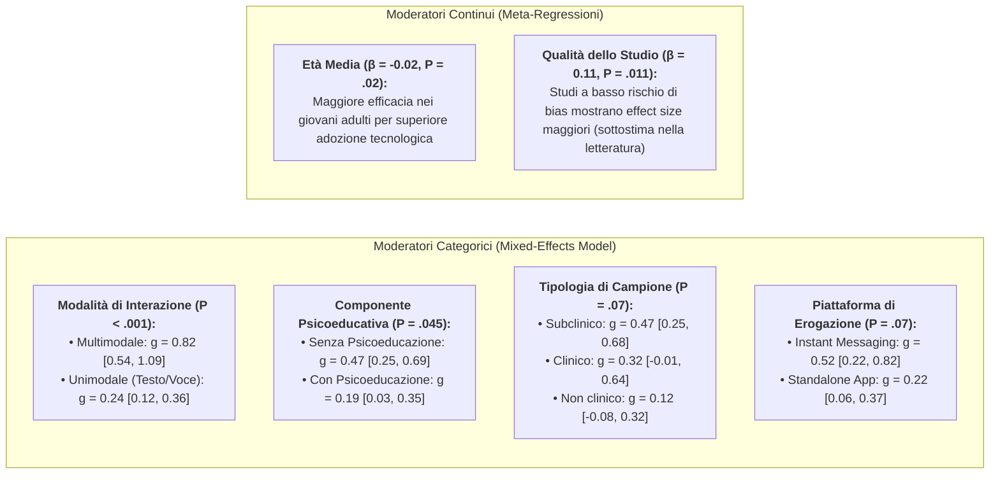

# The Effectiveness of CBT-Based NLP-Enabled AI Conversational Agents for Mental Health Intervention: A Systematic Review and Meta-Analysis (Hang et al., 2026)

## Definizione Operativa e Sintesi Esecutiva
- **Revisione sistematica e meta-analisi rigorosa** pubblicata su *npj Digital Medicine* (Nature Portfolio; 2026; DOI: [10.1038/s41746-026-02886-x](https://doi.org/10.1038/s41746-026-02886-x)) da Yaming Hang, Wenzhi Wu, Yi Feng, Kai Yan, Yinuo Liu, Xiyao Xiao e Zhihong Qiao (*Minnan Normal University*, *Beijing Normal University*, *Central University of Finance and Economics*, *Renmin University of China*, *Lingxin AI*).
- **Obiettivo Scientifico:** Isolare l'efficacia clinica specifica degli **agenti conversazionali guidati da intelligenza artificiale (AI Conversational Agents - CAs)** dotati di Natural Language Processing ([[large-language-models|NLP]]) o Machine Learning e fondati esplicitamente sulla **Terapia Cognitivo-Comportamentale (CBT)**, superando l'eterogeneità concettuale e tecnologica delle meta-analisi precedenti che aggregavano indistintamente sistemi deterministici basati su regole (*rule-based*) e approcci teorici eterogenei.
- **Campione e Selezione (PRISMA):** 15.194 record identificati attraverso 5 banche dati (*PubMed*, *PsycINFO*, *EMBASE*, *Cochrane Library*, *Web of Science*) fino al 1° febbraio 2025; inclusi **15 trial clinici randomizzati controllati (RCT)** per un totale di **1.737 partecipanti** adulti (campioni clinici $n=3$, subclinici $n=8$, non clinici $n=4$).
- **Risultati Quantitativi Primari (Post-Test):**
  - **Sintomi Depressivi:** Effetto statisticamente significativo da piccolo a moderato (**$\text{Hedges } g = 0.36$, $95\%\text{ CI } [0.20, 0.51]$, $P < .001$, $N=13$**, $I^2 = 45.3\%$), privo di publication bias (Trim-and-fill invariato, Egger $P = .14$).
  - **Affetto Negativo:** Effetto statisticamente significativo piccolo (**$g = 0.21$, $95\%\text{ CI } [0.02, 0.39]$, $P = .03$, $N=4$**, $I^2 = 0.0\%$).
  - **Ansia Generalizzata:** Effetto iniziale statisticamente significativo ($g = 0.18$, $95\%\text{ CI } [0.05, 0.31]$, $P < .01$, $N=12$), che tuttavia **perde significatività dopo la correzione per publication bias** tramite *trim-and-fill* di Duval e Tweedie (**$g_{\text{adj}} = 0.12$, $95\%\text{ CI } [-0.03, 0.27]$, $P > .05$**).
  - **Stress:** Effetto non significativo ($g = 0.10$, $95\%\text{ CI } [-0.21, 0.42]$, $P = .52$, $N=3$, $I^2 = 0.0\%$).
  - **Affetto Positivo:** Effetto non significativo ($g = -0.04$, $95\%\text{ CI } [-0.22, 0.14]$, $P = .68$, $N=4$, $I^2 = 0.0\%$).
- **Scoperte Fondamentali sui Moderatori:**
  1. **[[multimodal-advantage-in-depression-ai|Vantaggio Multimodale]]:** Gli agenti multimodali (testo + voce + stimoli visivi) hanno ottenuto una riduzione dei sintomi depressivi drasticamente superiore (**$g = 0.82$, $95\%\text{ CI } [0.54, 1.09]$**) rispetto agli agenti unimodali testuali/vocali (**$g = 0.24$, $95\%\text{ CI } [0.12, 0.36]$**; $Q_b(1) = 13.84, P < .001$), azzerando l'eterogeneità residua ($I^2 = 0.0\%$).
  2. **[[psychoeducation-dilution-effect-in-ai|Effetto Diluizione della Psicoeducazione]]:** I CAs privi di moduli formali di psicoeducazione hanno mostrato dimensioni dell'effetto significativamente più elevate (**$g = 0.47$, $95\%\text{ CI } [0.25, 0.69]$**) rispetto ai CAs contenenti psicoeducazione esplicita (**$g = 0.19$, $95\%\text{ CI } [0.03, 0.35]$**; $Q_b(1) = 4.03, P = .045$), a causa del minor carico cognitivo e della focalizzazione su tecniche attive ed esperienziali.
  3. **Età dei Partecipanti:** L'età media è risultata un moderatore continuo negativo significativo ($\beta = -0.02, P = .02$), con una maggiore responsività nei giovani adulti grazie a una superiore digital literacy e familiarità con interfacce conversazionali.
  4. **Qualità Metodologica:** La meta-regressione ha rivelato una relazione positiva tra qualità dello studio e dimensione dell'effetto ($\beta = 0.11, P = .011$), indicando che gli studi più rigorosi registrano benefici maggiori e che la letteratura attuale potrebbe **sottostimare** la reale efficacia dei sistemi AI di qualità elevata.
  5. **[[exposure-therapy-deficit-in-mental-health-ai|Deficit di Esposizione]]:** Il 86.7% degli studi ha implementato la ristrutturazione cognitiva (13/15) e il 33.3% l'attivazione comportamentale (5/15), ma solo 1 studio su 15 (6.7%) ha incluso protocolli di esposizione comportamentale, spiegando la mancata efficacia su ansia e stress.

---

## Analisi Quantitativa degli Esiti Clinici

La meta-analisi ha aggregato i dati post-test estraendo medie, deviazioni standard e dimensioni campionarie con modello a effetti casuali (*random-effects model*), correggendo per bias dei piccoli campioni mediante la metrica $g$ di Hedges (0.20 = piccolo, 0.50 = medio, $\ge 0.80$ = grande):

| Esito Clinico | $N$ (Studi) | Hedges $g$ [95% CI] | Valore $Z$ | $P$-value | Eterogeneità $Q$ (df) | $I^2$ (%) | Publication Bias (Trim-and-Fill / Egger) | Esito Aggiustato |
| :--- | :--- | :--- | :--- | :--- | :--- | :--- | :--- | :--- |
| **Sintomi Depressivi** | 13 | **0.36 [0.20, 0.51]** | 4.52 | **< .001** | $Q(12) = 21.94, P < .05$ | 45.3% | Nessun imputato; Egger $P = .14$ | $g = 0.36$ (Robusto) |
| **Affetto Negativo** | 4 | **0.21 [0.02, 0.39]** | 2.22 | **.03** | $Q(3) = 2.32, P = .51$ | 0.0% | Nessun imputato; Egger $P = .32$ | $g = 0.21$ (Robusto) |
| **Ansia Generalizzata** | 12 | 0.18 [0.05, 0.31] | 2.66 | < .01 | $Q(11) = 12.60, P = .32$ | 12.7% | **2 studi imputati a sinistra**; Egger $P = .12$ | **$g = 0.12 [-0.03, 0.27]$ ($P > .05$, Non significativo)** |
| **Stress Percepito** | 3 | 0.10 [-0.21, 0.42] | 0.65 | .52 | $Q(2) = 0.99, P = .61$ | 0.0% | Nessun imputato; Egger $P = .36$ | $g = 0.10$ (Non significativo) |
| **Affetto Positivo** | 4 | -0.04 [-0.22, 0.14] | -0.42 | .68 | $Q(3) = 0.72, P = .87$ | 0.0% | Nessun imputato; Egger $P = .49$ | $g = -0.04$ (Non significativo) |

---

## Analisi Dettagliata dei Moderatori per i Sintomi Depressivi

L'analisi dei sottogruppi e le meta-regressioni condotte da Hang et al. (2026) evidenziano le determinanti strutturali e cliniche dell'efficacia degli agenti conversazionali CBT:

### Tabella Completa dei Sottogruppi (Sintomi Depressivi)

| Variabile Moderatrice | Categoria | $N$ Studi | Hedges $g$ [95% CI] | $Q_w$ ($P$) | $Q_b$ ($P$) | Interpretazione Clinica |
| :--- | :--- | :--- | :--- | :--- | :--- | :--- |
| **Modalità di Interazione** | **Multimodale** (Testo+Voce+Visivo) **Unimodale** (Testo o Voce) | 2 11 | **0.82 [0.54, 1.09]** 0.24 [0.12, 0.36] | 0.00 (.99) 8.10 (.62) | **$Q_b = 13.84$ ($P < .001$)** | La presenza sociale e la ricchezza sensoriale amplificano l'efficacia sulla depressione riducendo l'isolamento. |
| **Presenza di Psicoeducazione** | **No** (Solo Tecniche Attive) **Sì** (Include Psicoeducazione) | 8 5 | **0.47 [0.25, 0.69]** 0.19 [0.03, 0.35] | 13.56 (.06) 3.27 (.51) | **$Q_b = 4.03$ ($P = .045$)** | I formati snelli e orientati alla pratica esperienziale evitano il sovraccarico cognitivo. |
| **Tipologia di Campione** | **Subclinico** Clinico Non clinico | 8 3 2 | **0.47 [0.25, 0.68]** 0.32 [-0.01, 0.64] 0.12 [-0.08, 0.32] | 14.64 (.04) 0.40 (.82) 0.43 (.51) | $Q_b = 5.25$ ($P = .07$) | [[subclinical-depression-window-of-opportunity|Finestra subclinica]]: massima responsività nel distress precoce. |
| **Piattaforma di Erogazione** | Instant Messenger (es. WeChat, Messenger) Standalone App | 5 8 | 0.52 [0.22, 0.82] 0.22 [0.06, 0.37] | 13.61 (.009) 4.14 (.76) | $Q_b = 3.20$ ($P = .07$) | Minore attrito d'accesso nelle piattaforme di messaggistica quotidiane. |
| **Approccio Terapeutico** | Solo CBT Integrativo (CBT dominante) | 10 3 | 0.37 [0.19, 0.54] 0.36 [0.20, 0.52] | 16.28 (.06) 5.51 (.06) | $Q_b = 0.00$ ($P = .96$) | L'inclusione di elementi terzi (mindfulness, ACT) non altera l'efficacia se il nucleo CBT è solido. |
| **Durata dell'Intervento** | Breve (0–4 settimane) Estesa (> 4 settimane) | 9 4 | 0.40 [0.22, 0.58] 0.36 [0.20, 0.52] | 12.01 (.15) 8.33 (.04) | $Q_b = 0.34$ ($P = .56$) | Effetti rapidi raggiungibili già entro il primo mese di micro-interventi. |
| **Ristrutturazione Cognitiva** | Presente Assente | 11 2 | 0.38 [0.20, 0.55] 0.24 [-0.18, 0.65] | 21.70 (.02) 0.03 (.87) | $Q_b = 0.37$ ($P = .54$) | Ingrediente cardine presente nella quasi totalità dei protocolli efficaci. |
| **Attivazione Comportamentale** | Presente Assente | 4 9 | 0.19 [-0.01, 0.38] 0.43 [0.24, 0.63] | 3.22 (.36) 15.00 (.06) | $Q_b = 3.05$ ($P = .08$) | L'attivazione comportamentale testuale richiede compiti nel mondo reale più difficili da monitorare. |
| **Esercizi di Rilassamento** | Presente Assente | 6 7 | 0.48 [0.24, 0.73] 0.29 [0.11, 0.47] | 6.77 (.24) 10.74 (.10) | $Q_b = 1.52$ ($P = .22$) | Effetto positivo aggiuntivo sulla regolazione emotiva. |
| **Mindfulness** | Presente Assente | 7 6 | 0.40 [0.15, 0.64] 0.31 [0.11, 0.50] | 15.25 (.02) 6.29 (.28) | $Q_b = 0.32$ ($P = .57$) | Modesta sinergia non statisticamente discriminante. |

---

## Mappatura dei 15 Trial Randomizzati Inclusi

La Tabella 1 del lavoro originale censisce i 15 studi analizzati, evidenziando le architetture computazionali ([[retrieval-vs-generative-clinical-chatbots|Retrieval vs Generative]]) e i componenti tecnici impiegati:

| Primo Autore, Anno (Paese) | Campione ($N$, Popolazione) | Età Media (% F) | Nome Agente (Piattaforma) | Architettura AI & Modalità | Tecniche CBT Incluse | Durata | Gruppo di Controllo | Misure Primarie |
| :--- | :--- | :--- | :--- | :--- | :--- | :--- | :--- | :--- |
| **Burton et al., 2016** (ROU, ES, GB) | $N=27$, Clinico | 38.50 (67.0%) | **Help4Mood** (Standalone App) | Retrieval-based, Testuale | Mood tracking, Ristrutturazione cognitiva, Attivazione comportamentale, Rilassamento | 4 sett. | Controllo attivo | BDI-2, QIDS-SR, DAS-SF, EQ-5D-5L |
| **Danieli et al., 2022** (ITA) | $N=45$, Subclinico | 55.58 (78.0%) | **TEO** (Standalone App) | Retrieval-based, Testuale | Tecnica ABC, Rilassamento | 8 sett. | Waitlist / Assessment-only | PHQ-8, GAD-7, PSS |
| **Fitzpatrick et al., 2017** (US) | $N=70$, Subclinico | 22.20 (67.0%) | **Woebot** (Standalone App) | Retrieval-based, Testuale | Psicoeducazione, Mood tracking, Ristrutturazione cognitiva, Attivazione comportamentale, Mindfulness | 2 sett. | Controllo informativo (e-book) | PHQ-9, GAD-7, PANAS |
| **Fulmer et al., 2018** (US) | $N=75$, Subclinico | 22.90 (69.0%) | **Tess** (Instant Messenger) | Retrieval-based, Testuale | Mood tracking, Rilassamento, Ristrutturazione cognitiva, Mindfulness | 2–4 sett. | Controllo informativo | GAD-7, PHQ-9 |
| **He et al., 2022** (CN) | $N=125$, Subclinico | 18.78 (80.0%) | **XiaoE** (Instant Messenger) | **Ibrido (Retrieval + Generativo), Multimodale** | Identificazione pensieri, Ristrutturazione cognitiva, Rilassamento, Mindfulness | 1 sett. | Controllo attivo | PHQ-9 |
| **Jang et al., 2021** (KOR) | $N=46$, Subclinico | 25.10 (57.0%) | **Todaki** (Standalone App) | Retrieval-based, Testuale | Psicoeducazione, Rilassamento, Mindfulness | 4 sett. | Controllo informativo | QIDS-SR, SAS, PSS |
| **Karkosz et al., 2024** (POL) | $N=68$, Subclinico | 25.68 (72.0%) | **Fido** (Instant Messenger) | Retrieval-based, Testuale | Psicoeducazione, Ristrutturazione cognitiva / Dialogo socratico, Tecnica ABC | 2 sett. | Controllo informativo | CESD-R, PHQ-9, PSWQ, STAI, PANAS, SWLS |
| **Klos et al., 2021** (ARG) | $N=73$, Non clinico | NR (87.0%) | **Tess** (Instant Messenger) | Retrieval-based, Testuale | Mood tracking, Rilassamento, Ristrutturazione cognitiva, Tolleranza al distress, Mindfulness | 8 sett. | Controllo informativo | PHQ-9, GAD-7 |
| **Liu et al., 2022** (CN) | $N=83$, Subclinico | 23.08 (55.0%) | **XiaoNan** (Instant Messenger) | **Retrieval-based, Multimodale** | Mood tracking, Ristrutturazione cognitiva | 16 sett. | Controllo attivo | PHQ-9, GAD-7, PANAS |
| **MacNeill et al., 2024** (CAN) | $N=76$, Clinico | 42.87 (69.0%) | **Wysa** (Standalone App) | Retrieval-based, Testuale | Mood tracking, Ristrutturazione cognitiva, Mindfulness, Contingency management | 4 sett. | Waitlist / Assessment-only | PHQ-9, GAD-7, PSS |
| **Oh et al., 2020** (KOR) | $N=41$, Clinico | 40.53 (51.0%) | **Todaki** (Standalone App) | Retrieval-based, **Vocale** | Mood tracking, Ristrutturazione cognitiva, **Exposure training**, Rilassamento | 4 sett. | Controllo informativo | HADS |
| **Prochaska et al., 2021** (US) | $N=152$, Subclinico | 40.00 (65.0%) | **Woebot** (Standalone App) | Retrieval-based, Testuale | Psicoeducazione, Mood tracking, Ristrutturazione cognitiva, Attivazione comportamentale, Mindfulness | 8 sett. | Waitlist / Assessment-only | PHQ-8, GAD-7 |
| **Sabour et al., 2023** (CN) | $N=247$, Non clinico | 30.90 (80.0%) | **Emohaa** (Instant Messenger) | **Generativo (LLM), Testuale** | Mood tracking, Ristrutturazione cognitiva, Attivazione comportamentale, Rilassamento | 3 sett. | Waitlist / Assessment-only | PHQ-9, GAD-7, PANAS |
| **Suganuma et al., 2018** (JPN) | $N=457$, Non clinico | 38.07 (70.0%) | **SABORI** (Web-based) | Retrieval-based, Testuale | Tecnica ABC, Rilassamento | 4 sett. | Waitlist / Assessment-only | WHO-5-J, K10, BADS |
| **Suharwardy et al., 2023** (US) | $N=152$, Non clinico | 34.00 (100.0%) | **Woebot** (Standalone App) | Retrieval-based, Testuale | Psicoeducazione, Mood tracking, Ristrutturazione cognitiva, Attivazione comportamentale, Mindfulness | 6 sett. | Controllo attivo | PHQ-9, GAD-7 |

---

## Approfondimenti Teorico-Clinici ed Epistemologici

### 1. Il Meccanismo del Vantaggio Multimodale
La marcata superiorità degli agenti multimodali ($g = 0.82$ vs $g = 0.24$) getta luce sulla fenomenologia della depressione:
- I disturbi depressivi sono intrinsecamente caratterizzati da ritiro relazionale, anedonia sociale e disconnessione interpersonale.
- Un'interfaccia puramente testuale impone uno sforzo di astrazione e decodifica simbolica che può risultare arido per un paziente depresso; al contrario, la **stimolazione multimodale (sintesi vocale espressiva, elementi visivi sincronizzati, avatar relazionali)** ricrea un senso di **presenza sociale percepita** (*social presence*) che attiva circuiti di risonanza affettiva e facilita l'aderenza continuativa.

### 2. Il Paradosso della Psicoeducazione e la Teoria del Carico Cognitivo
Il dato controintuitivo per cui l'assenza di psicoeducazione esplicita produce effect size maggiori ($g = 0.47$ vs $g = 0.19$) trova spiegazione nella **Cognitive Load Theory** (Sweller; Baxter et al., 2025) e nel principio di **Combinatory Congruency** (O'Toole et al., 2025):
- Gli agenti conversazionali non sono manuali di testo o corsi online: quando tentano di "erogare lezioni" di psicoeducazione, sovraccaricano la memoria di lavoro dell'utente con informazioni passive (*extraneous cognitive load*), riducendo l'agenzia conversazionale.
- Al contrario, le architetture focalizzate che guidano direttamente l'utente nella ristrutturazione di uno specifico pensiero automatico negativo (PAN) o nella registrazione del tono dell'umore forniscono **apprendimento esperienziale in-situ**, massimizzando l'acquisizione delle abilità di coping.

### 3. La Spiegazione del Fallimento sull'Ansia: L'Exposure Deficit
Hang et al. (2026) confermano e consolidano il fenomeno dell'[[exposure-therapy-deficit-in-mental-health-ai|Exposure Therapy Deficit in Mental Health AI]]:
- L'ansia generalizzata e lo stress richiedono protocolli di **apprendimento inibitorio** (*inhibitory learning*) ed estinzione della paura basati sull'esposizione a stimoli enterocettivi o situazionali temuti.
- Poiché 14 su 15 chatbot inclusi offrono solo ristrutturazione verbale e tecniche di rilassamento (spesso utilizzate dai pazienti ansiosi come *comportamenti di sicurezza iatrogeni* per sfuggire all'arousal somatico), l'effetto aggregato sull'ansia si dissolve ($g_{\text{adj}} = 0.12, P > .05$).

### 4. Il Paradosso della Qualità e la Sottostima dell'Efficacia
La meta-regressione positiva sulla qualità metodologica ($\beta = 0.11, P = .011$) smentisce l'ipotesi che i benefici dell'IA siano frutto di artefatti metodologici di studi deboli. Al contrario, trial rigorosi con adeguata cecità degli assessor e gestione rigorosa dell'attrition bias mostrano effetti terapeutici più marcati, suggerendo che **il reale potenziale clinico dell'AI-CBT è attualmente sottostimato** a causa di studi pilota sottodimensionati o condotti in modo sub-ottimale.

---

## Valutazione del Rischio di Bias (Cochrane RoB)

La qualità metodologica complessiva degli studi inclusi presenta eterogeneità e criticità strutturali tipiche della digital health:
- **Solo 1 studio su 15 (6.7%)** ha soddisfatto tutti e 6 i criteri di qualità Cochrane (He et al., 2022).
- **Cecità dei partecipanti e del personale (Performance Bias):** 10 studi su 15 presentano un rischio elevato a causa dell'intrinseca difficoltà di accecare gli utenti rispetto all'interazione con un'app/chatbot rispetto a liste d'attesa.
- **Cecità della valutazione degli esiti (Detection Bias):** 8 studi su 15 presentano un rischio non chiaro per l'uso esclusivo di scale self-report non verificate da valutatori indipendenti ciechi.
- **Dati incompleti (Attrition Bias):** Circa il 20% degli studi presenta rischio non chiaro o elevato per tassi di dropout non gestiti mediante analisi intention-to-treat (ITT) formali.

---

## Limiti dello Studio e Prospettive di Ricerca

1. **Assenza di Pre-registrazione:** La revisione non è stata pre-registrata su PROSPERO, introducendo un potenziale rischio di bias analitico post-hoc.
2. **Predominanza di Architetture Retrieval-Based:** 13 studi su 15 utilizzano sistemi di recupero deterministici/semantici pre-LLM. Solo 1 studio impiega LLM generativi puri (Sabour et al., 2023) e 1 impiega un sistema ibrido (He et al., 2022). I risultati **non sono direttamente estrapolabili ai moderni Large Language Models (LLM)** senza ulteriori trial mirati.
3. **Mancanza di Follow-Up a Lungo Termine:** La quasi totalità dei dati riflette esiti post-test immediati (2–16 settimane), senza evidenze consolidate sul mantenimento dei guadagni clinici o sulla prevenzione delle ricadute a 6-12 mesi.
4. **Esclusione di Studi Non in Lingua Inglese:** Possibile omissione di trial pubblicati in altre lingue (es. letteratura asiatica non indicizzata internazionalmente).

---

## Pagine e Concetti Correlati
- [[multimodal-advantage-in-depression-ai|Vantaggio Multimodale negli Agenti Conversazionali per la Depressione]]
- [[psychoeducation-dilution-effect-in-ai|Effetto Diluizione della Psicoeducazione negli Agenti Conversazionali]]
- [[exposure-therapy-deficit-in-mental-health-ai|Deficit di Esposizione Comportamentale nell'IA per la Salute Mentale]]
- [[subclinical-depression-window-of-opportunity|Finestra di Opportunità Subclinica nell'IA]]
- [[retrieval-vs-generative-clinical-chatbots|Sistemi di Recupero vs Architetture Generative in Sanità Mentale]]
- [[conceptual-architecture-of-ai-guided-cbt|Architettura Concettuale dell'AI-Guided CBT]]
- [[digital-therapeutic-alliance|Alleanza Terapeutica Digitale]]
- [[jmir_v27i1e69639|Efficacia degli Agenti Conversazionali AI per la Salute Mentale Giovanile (Feng et al., 2025)]]
- [[healthcare-14-02334|AI-Guided CBT for Depression and Anxiety (Stojanovic et al., 2026)]]
