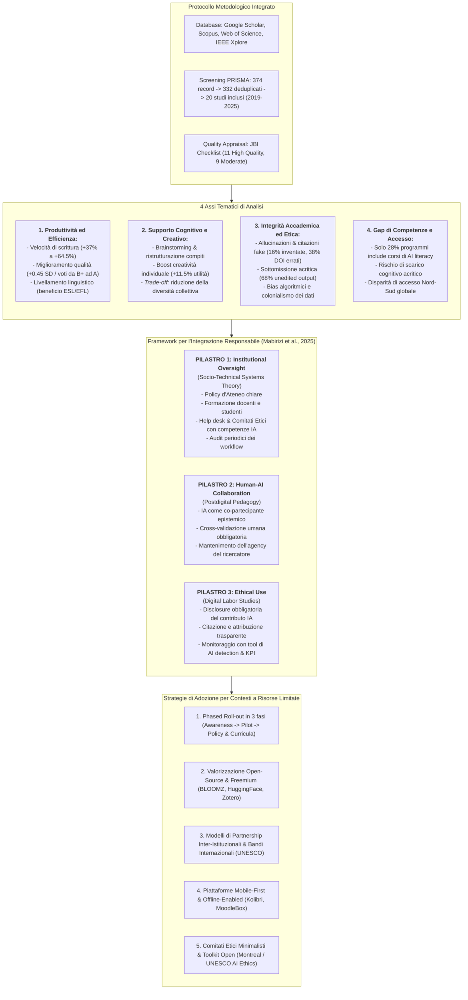
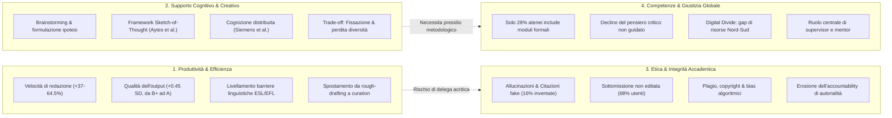
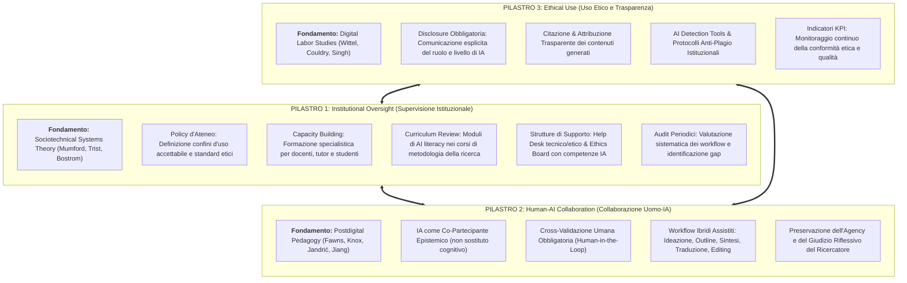
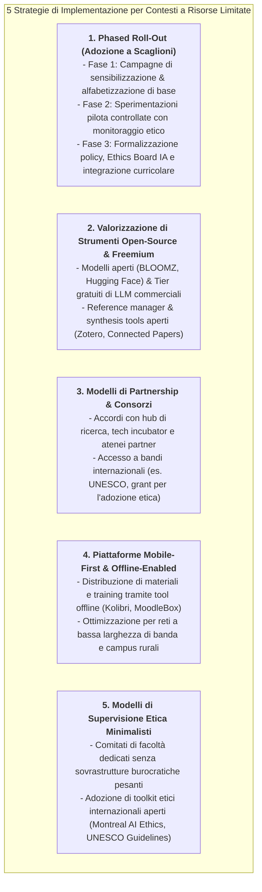

# A Systematic Review of the Impact of Generative AI on Postgraduate Research: Opportunities, Challenges, and Ethical Implications (Mabirizi et al., 2025)

## Definizione Operativa
- **Inquadramento dello Studio:** Revisione sistematica della letteratura condotta da Vicent Mabirizi, Calorine Katushabe, Gloria Muhoza e Jack Rugasira (*Department of Information Technology, Department of Computer Science, Department of Procurement and Logistics Management, Kabale University*, Uganda), pubblicata nel 2025 su *Discover Artificial Intelligence* (Springer Nature, Vol. 5, Art. 238, doi: [10.1007/s44163-025-00495-3](https://doi.org/10.1007/s44163-025-00495-3)).
- **Obiettivi e Quesiti di Ricerca:** Mappa in modo rigoroso l'impatto degli strumenti di Intelligenza Artificiale Generativa (GenAI), con particolare riferimento ai Large Language Models (LLM come GPT-3, GPT-4, DeepSeek), sulla qualità, l'efficienza, l'etica e la capacità di innovazione nella ricerca post-laurea e dottorale, articolandosi su quattro quesiti cardinali:
  1. *RQ1 (Produttività ed Efficienza):* In che misura la GenAI impatta la produttività e la velocità di redazione/ricerca dei ricercatori post-laurea?
  2. *RQ2 (Supporto Cognitivo e Creativo):* In quali modalità la GenAI sostiene l'ideazione, la formulazione di ipotesi e i processi creativi?
  3. *RQ3 (Etica e Integrità Accademica):* Quali rischi di allucinazione, fabbricazione di citazioni, plagio e perdita di agency emergono?
  4. *RQ4 (Gap di Competenze e Trasformazione dei Ruoli):* Quali lacune di formazione e disparità di accesso caratterizzano il corpo accademico e dottorale?
- **Framework Metodologico Integrato:** Unisce il modello in cinque fasi per scoping studies di **Arksey & O'Malley (2005)** con le linee guida **PRISMA-ScR (2020)** per garantire trasparenza e riproducibilità, integrando la valutazione della qualità metodologica tramite la **JBI (Joanna Briggs Institute) Critical Appraisal Checklist** su 5 dimensioni (disegno di studio, campionamento, raccolta dati, conformità etica, analisi dei dati).
- **Proposta Teorica e Operativa:** Sviluppa un innovativo **Framework a Tre Pilastri** (*Institutional Oversight*, *Human-AI Collaboration*, *Ethical Use*) ancorato a tre solide basi teoriche (Teoria dei Sistemi Socio-Tecnici, Pedagogia Postdigitale, Studi sul Lavoro Digitale), corredato da 5 strategie pratiche di implementazione scalabile concepite per mitigare il divario digitale globale (*Global South* e contesti a risorse infrastrutturali limitate).

---

## Evidenze dalla Letteratura

### 1. Metodologia della Revisione e Valutazione Qualitativa (JBI)

La revisione adotta un protocollo sistematico rigoroso:
- **Strategia di Ricerca:** Eseguita su quattro database accademici primari (*Google Scholar*, *Web of Science*, *IEEE Xplore*, *Scopus*) per il periodo temporale 2019–2025, impiegando combinazioni booleane:
  `("generative AI" OR "ChatGPT" OR "GPT-4" OR "large language models" OR "AI in research") AND ("postgraduate research" OR "academic writing" OR "research productivity" OR "AI in academia") AND ("ethics" OR "integrity" OR "AI applications" OR "research challenges")`.
- **Flusso di Selezione PRISMA (Fig. 1 del paper):**
  - Record iniziali identificati: $n = 374$;
  - Rimozione duplicati: $n = 42$ (rimasti $n = 332$);
  - Esclusione su titolo: $n = 271$ (rimasti $n = 61$);
  - Esclusione su abstract ($n = 36$): studi di sola rassegna ($n = 10$), non in lingua inglese ($n = 4$), uso di IA non esplicitato ($n = 19$), pubblicati prima del 2019 ($n = 3$);
  - Valutazione del testo completo ($n = 25$): esclusi $n = 5$ ($n = 3$ carenza di dati empirici su post-laurea, $n = 2$ soli protocolli);
  - Studi inclusi nella sintesi finale: **$n = 20$ articoli peer-reviewed**.
- **Valutazione Qualitativa JBI (Table 1 del paper):**
  - Valutati su 5 criteri cardinali: chiarezza del disegno di studio (Q1), adeguatezza del campionamento (Q2), rigore della raccolta dati (Q3), considerazioni etiche (Q4), appropriatezza dell'analisi dei dati (Q5).
  - Esito dell'appraisal: **11 studi con rating complessivo Alto (*High*)** e **9 studi con rating Moderato (*Moderate*)**.

---

### 2. Tabella Sinottica degli Studi Inclusi nella Revisione (Table 1 & 2)

| Autore / Anno | Disegno di Studio e Campione | Obiettivo Principale | Outcome Primario | Risultati Chiave ed Evidenze Empiriche | Rating JBI |
| :--- | :--- | :--- | :--- | :--- | :--- |
| **English et al. [25] (2025)** | Survey su 75 dottorandi (PhD) in 19 atenei UK | Indagare l'uso della GenAI nell'automazione di compiti di ricerca | La maggioranza dei dottorandi usa ChatGPT per ideazione, ricerca bibliografica, riassunto e coding | Aumento dell'efficienza della ricerca e liberazione di tempo per compiti analitici e creativi complessi. | High |
| **Hoffman [33] (2016/2024)** | Studio qualitativo su 11 studentesse di master (log ChatGPT) | Esplorare benefici, sfide e pattern d'uso della GenAI | Supporto efficace in scrittura accademica, pianificazione e traduzione | L'efficacia reale dipende criticamente dal livello di engagement e dalle competenze valutative dell'utente. | Moderate |
| **Usdan & Chang [56] (2024)** | Metodi misti su 27 studenti post-laurea | Valutare l'impatto sulla produttività di scrittura e sulle valutazioni | I voti sono saliti da B+ ad A; il tempo di redazione si è ridotto del 64.5% | Impatto positivo riscontrato sia per studenti madrelingua sia per parlanti inglese come seconda lingua (ESL). | High |
| **Noy & Zhang [48] (2023)** | Esperimento randomizzato (RCT) su 453/444 professionisti laureati | Misurare causalmente l'impatto di ChatGPT su produttività, qualità e percezione | Compiti svolti il 37–40% più velocemente; qualità aumentata di 0.45 deviazioni standard (+18%) | Il **68%** dei partecipanti ha sottomesso output grezzo di ChatGPT non editato: rischio di pura sostituzione anziché collaborazione. | High |
| **Chen et al. [16] (2025)** | Studio descrittivo-qualitativo su studenti post-laurea | Esplorare il ruolo della GenAI nell'ideazione concettuale di gruppo | L'IA stimola prospettive alternative nelle discussioni peer-to-peer | Creatività potenziata quando l'IA è impiegata a complemento dell'intelligenza umana con supervisione etica. | High |
| **Puapongsakorn & Brazdeikyte [50] (2023)** | Studio pilota su ricercatori | Esaminare l'integrazione dell'IA nella fase di ideazione e sensemaking | Aiuta i ricercatori a generare prospettive multiple e diversificate | L'IA fornisce strutture e framework sistematici che ampliano la creatività scientifica. | Moderate |
| **Moongela et al. [46] (2024)** | Studio sperimentale su studenti post-laurea | Valutare l'effetto dei prompt generati da IA sul pensiero divergente | L'uso di prompt rischia di innescare fissazione concettuale (*design fixation*) | L'eccessiva dipendenza da suggerimenti IA riduce la novità delle idee; indispensabile il pensiero critico. | High |
| **Lee et al. [42] (2025)** | Survey su knowledge workers (ACM CHI 2025) | Valutare l'impatto della GenAI sul pensiero critico e sforzo cognitivo | I partecipanti delegano all'IA con minore sforzo mentale (*cognitive offloading*) | Rischio elevato di overconfidence acritica nei confronti dell'output generato dall'IA. | Moderate |
| **Aytes et al. [4] (2025)** | Valutazione su concetti teorici e proposte di ricerca | Potenziare le capacità di ragionamento dei modelli tramite vincoli cognitivi | Proposta del framework *"Sketch-of-Thought"* per bilanciare profondità e pertinenza | Migliora la focalizzazione e la chiarezza del testo accademico senza disperdersi in verbosità generica. | High |
| **Athaluri et al. [3] (2023)** | Studio sperimentale su 50 proposte di ricerca redatte con ChatGPT | Verificare l'accuratezza e l'autenticità delle citazioni bibliografiche generate | Il **38%** delle referenze conteneva DOI errati e il **16%** era completamente fabbricato (*fake*) | Inaffidabilità critica delle citazioni autonome generate da LLM; imperativa la verifica manuale. | High |
| **Cotton et al. [19] (2024)** | Valutazione delle attitudini di docenti e studenti universitari | Rilevare le lacune di policy istituzionali sull'uso accettabile dell'IA | Diffusa assenza di linee guida istituzionali chiare e vincolanti | Urgenza per gli atenei di definire policy contestualizzate su etica, didattica e ricerca. | Moderate |
| **Kajiwara & Kawabata [39] (2024)** | Studio pilota sulle competenze digitali di studenti post-laurea | Promuovere l'alfabetizzazione etica e metodologica nell'uso di chatbot | Raccomandata formazione specifica su prompt engineering e pratiche citazionali | Necessità di istituire programmi strutturati di AI literacy a livello di ateneo. | Moderate |
| **Zhai et al. [59] (2024)** | Valutazione delle competenze su studenti universitari | Esplorare le conseguenze dell'uso di IA in assenza di supervisione diretta | L'uso non supervisionato correla con una riduzione del pensiero critico | La guida didattica è imprescindibile per preservare il rigore accademico e prevenire il declino cognitivo. | High |
| **Kaplan [40] (2024)** | Indagine sui curricula dei programmi post-laurea universitari | Censire la presenza di moduli dedicati all'IA nei percorsi formativi | Solo il **28%** dei programmi include una formazione formale sulla GenAI responsabile | Urgente revisione curricolare per integrare moduli sull'uso etico e metodologico dell'IA. | Moderate |
| **Grande et al. [30] (2024)** | Studio osservazionale su studenti di computing | Analizzare il ruolo di docenti e supervisor nell'uso etico degli LLM | I tutor guidano con successo gli studenti nella valutazione etica dell'output | Il coinvolgimento attivo del supervisor è il fattore protettivo primario contro l'uso scorretto. | High |
| **Bianchini et al. [8] (2023)** | Valutazione delle disparità istituzionali e continentali di accesso | Mappare i driver e le barriere all'adozione dell'IA nella ricerca | L'accesso limitato a tool avanzati (reliance su free tier obsoleti) frena la produttività | Il divario digitale penalizza i ricercatori del Sud Globale e dei contesti a risorse limitate. | Moderate |
| **Tadimalla & Maher [54] (2024)** | Proposta di policy e modello curricolare per il post-laurea | Integrare l'alfabetizzazione all'IA nella formazione avanzata | Proposta di un curriculum socio-tecnico con moduli etici e centri di supporto IA | Raccomandata un'integrazione sistemica e multi-livello a livello istituzionale e pedagogico. | Moderate |
| **Doshi & Hauser [23] (2024)** | Esperimento online pre-registrato (293 autori, 600 valutatori - Science Adv) | Esaminare l'impatto causale della GenAI su novità, utilità e diversità | La GenAI aumenta la creatività del singolo (+11.5% utilità), ma rende i testi più simili tra loro | **Paradosso della diversità collettiva:** l'IA livella verso l'alto i singoli ma omogeneizza l'output aggregato. | Moderate |
| **Siemens et al. [51] (2022)** | Analisi concettuale post-digitale e scienze cognitive | Esplorare l'interazione tra cognizione umana e intelligenza artificiale | Inquadramento dell'IA come partner cognitivo e fonte di incertezza epistemica | L'IA estende la cognizione ma destabilizza i concetti tradizionali di autorialità e agire epistemico. | High |
| **Chang & Li [15] (2025)** | Studio empirico su brainstorming collaborativo con LLM | Esaminare l'integrazione di LLM nelle sessioni di gruppo | L'IA stimola la produzione di idee innovative nel brainwriting tra pari | L'IA è efficace quando co-partecipa all'esplorazione senza sostituire il ragionamento di gruppo. | High |

---

### 3. I Quattro Assi Tematici di Analisi Critica

#### A. Asse 1: Produttività ed Efficienza nella Ricerca
- **Guadagni Temporali e Qualitativi:** L'impiego di LLM come assistenti di ricerca accelera drasticamente le fasi preliminari del lavoro scientifico. Noy & Zhang (2023) riscontrano una riduzione del tempo di completamento dei compiti del 37–40% e un incremento della qualità di 0.45 deviazioni standard (+18%). Usdan & Chang (2024) rilevano una contrazione del tempo di scrittura accademica del 64.5% e un innalzamento dei voti da B+ ad A.
- **Inclusione Linguistica e Livellamento delle Abilità (*Skill-Leveling*):** Gli strumenti generativi abbattono le asimmetrie linguistiche storiche, consentendo ai ricercatori *English as a Second Language* (ESL/EFL) di produrre manoscritti conformi agli standard sintattici e lessicali internazionali (Hoffman, 2024; Usdan & Chang, 2024). Inoltre, la GenAI avvantaggia in misura sproporzionatamente maggiore i ricercatori con baseline di scrittura inferiore, riducendo la disparità individuale di rendimento.
- **Riconfigurazione del Flusso di Lavoro:** Si osserva una netta transizione dallo sforzo dedicato alla stesura della prima bozza grezza (*rough-drafting*) verso attività di ordine superiore come la generazione di idee, la strutturazione logica, la sintesi e il refinement editoriale (Noy & Zhang, 2023; English et al., 2025).

#### B. Asse 2: Supporto Cognitivo e Creativo (Opportunità e Rischi)
- **Cognizione Distribuita e Co-Costruzione di Significato:** Sotto la lente della *cognizione distribuita* (Siemens et al., 2022), la creatività accademica cessa di essere un atto puramente solitario per configurarsi come un processo ibrido uomo-algoritmo. L'IA funge da *trampolino concettuale* (*springboard*), ampliando lo spazio di ricerca delle ipotesi e agevolando il reframing dei problemi (Chen et al., 2025; Chang & Li, 2025; Puapongsakorn & Brazdeikyte, 2023).
- **Il Paradosso della Diversità Collettiva (Doshi & Hauser, 2024):** Mentre la GenAI aumenta la creatività del singolo autore (+11.5% in termini di utilità e novità percepita per i profili meno creativi), i testi generati con il supporto dell'IA tendono a convergere semanticamente, **riducendo la varianza e la diversità collettiva dell'ecosistema scientifico**.
- **Fissazione del Design e Scarico Cognitivo Passivo:** L'esposizione precoce a prompt e strutture generate da LLM può indurre *design fixation* (Moongela et al., 2024), intrappolando il ricercatore entro i confini dei pattern probabilistici del modello. Lee et al. (2025) documentano il fenomeno del *cognitive offloading*, caratterizzato da un minore investimento mentale e da una pericolosa *overconfidence* nei confronti di risposte formalmente fluide ma concettualmente vuote o errate.

#### C. Asse 3: Integrità Accademica e Dilemmi Deontologici
- **Allucinazioni e Fabbricazione Bibliografica:** Gli LLM non sono motori di verità o database deterministici, bensì generatori probabilistici addestrati a predire il token successivo. Studi sperimentali evidenziano tassi drammatici di inaffidabilità citazionale:
  - Bhattacharyya et al. (2023): solo il **7%** delle referenze mediche generate da ChatGPT risultava autentica e corretta;
  - Athaluri et al. (2023): su 50 protocolli di ricerca generati, il **38% dei DOI era errato** e il **16% delle referenze era interamente inventato**.
- **Sottomissione Acritica e Ambiguità di Autorialità:** Noy & Zhang (2023) rilevano che il **68% dei partecipanti ha sottomesso il testo di ChatGPT senza alcuna modifica o rielaborazione critica**, evidenziando una diffusa tendenza alla mera *sostituzione passiva* anziché alla collaborazione critica. Tale prassi mina i criteri internazionalmente riconosciuti di autorialità accademica (COPE, ICMJE) e rischia di alimentare forme invisibili di plagio e distorsione del lavoro intellettuale (Lund et al., 2023; Cotton et al., 2024).
- **Bias Algoritmici e Colonialismo dei Dati:** Gli LLM replicano ed esacerbano i pregiudizi sistemici insiti nei dataset di addestramento (dominati dalla produzione anglofona e occidentale), marginalizzando prospettive epistemiche minoritarie o contesti culturali non egemoni (Birhane, 2022; Couldry & Mejias, 2019).

#### D. Asse 4: Gap di Competenze, Formazione e Giustizia Globale
- **Carenza Strutturale di Alfabetizzazione all'IA:** Nonostante l'adozione spontanea superi il 75–81% tra studenti e ricercatori (Jung et al., 2024; Liao et al., 2024), solo il **28% dei programmi post-laurea include corsi formali sull'uso etico e metodologico della GenAI** (Kaplan, 2024).
- **Vulnerabilità Metodologica e Ruolo dei Supervisori:** Gli studenti privi di adeguate competenze valutative tendono ad accettare gli output dell'IA acriticamente (*at face value*), con conseguente erosione del rigore scientifico (Zhai et al., 2024). Grande et al. (2024) dimostrano come la presenza attiva del supervisor o del tutor costituisca il fattore abilitante per trasformare l'IA da minaccia deontologica a strumento di potenziamento riflessivo.
- **Divario Digitale Nord-Sud Globale:** I ricercatori operanti in istituzioni del *Global South* o con risorse infrastrutturali limitate si trovano confinati all'uso di versioni gratuite o superate di LLM, spesso con connettività intermittente, subendo una penalizzazione competitiva e una ridotta esposizione agli standard emergenti di ricerca aumentata (Bianchini et al., 2023).

---

## Il Framework per l'Integrazione Responsabile della GenAI

Mabirizi et al. (2025) propongono un modello teorico-operativo strutturato su **Tre Pilastri Interdipendenti**, radicato nelle scienze organizzative, pedagogiche e sociologiche:

### 1. Pilastro 1: Supervisione Istituzionale (*Institutional Oversight*)
- **Base Teorica:** *Sociotechnical Systems Theory (STS)* (Mumford, 2006; Trist, 1981; Bostrom et al., 2009), la quale sancisce che i massimi benefici organizzativi scaturiscono dal co-design congiunto tra componenti tecnologiche e strutture sociali.
- **Azioni Operative:**
  - Emanazione di linee guida e regolamenti d'ateneo chiari;
  - Istituzione di percorsi di alfabetizzazione all'IA per docenti e dottorandi;
  - Integrazione di moduli formativi obbligatori di etica e metodologia computazionale nei corsi di dottorato;
  - Creazione di *Help Desk* consultivi e *Research Ethics Boards* specializzati in tecnologie emergenti;
  - Conduzione di audit periodici per valutare la penetrazione e la conformità delle pratiche di IA nella produzione scientifica dell'istituzione.

### 2. Pilastro 2: Collaborazione Uomo-IA (*Human-AI Collaboration*)
- **Base Teorica:** *Pedagogia Postdigitale* (Fawns, 2022; Knox, 2019; Jandrić et al., 2018; Jiang et al., 2024), che dissolve la falsa dicotomia tra analogico e digitale, inquadrando la tecnologia come parte integrante delle pratiche conoscitive umane.
- **Azioni Operative:**
  - Rifiuto del modello di delega passiva (*replacement*) a favore di un partenariato dialogico;
  - Presidio umano inderogabile su compiti concettuali primari (validazione delle fonti, interpretazione teorica, conclusioni epistemiche);
  - Utilizzo assistito e iterativo per compiti procedurali (perfezionamento sintattico, esplorazione della letteratura, sintesi preliminare, generazione di bozze di scalette).

### 3. Pilastro 3: Uso Etico e Trasparenza (*Ethical Use*)
- **Base Teorica:** *Studi sul Lavoro Digitale (Digital Labor Studies)* (Wittel, 2014; Couldry & Mejias, 2019; Singh & Pushpanadham, 2024), focalizzati sulla tutela del valore intellettuale del lavoro umano e sulla prevenzione dell'appropriazione/misattribuzione di paternità.
- **Azioni Operative:**
  - Dichiarazione trasparente (*mandatory disclosure*) della presenza, natura e grado di supporto algoritmico all'interno di tesi e manoscritti;
  - Adozione di rigorosi formati di citazione per i contributi generativi (con annotazione di prompt, parametri, versione del modello e data di interrogazione);
  - Implementazione di protocolli di verifica dell'autenticità e di metriche KPI per monitorare l'integrità accademica complessiva.

---

## Strategie di Implementazione per Contesti a Risorse Limitate

Per rendere il framework applicabile in contesti caratterizzati da vincoli di bilancio, divario digitale o strutture regolatorie emergenti (es. università del *Global South*), gli autori delineano cinque strategie pratiche:

1. **Phased Roll-Out (Adozione Progressiva in 3 Fasi):** Basato sulla teoria dell'apprendimento organizzativo (Fauske & Raybould, 2005; Greve, 2003). La Fase 1 promuove la consapevolezza di base; la Fase 2 sperimenta l'uso dell'IA in corsi pilota selezionati; la Fase 3 istituzionalizza le policy definitive e l'adeguamento curricolare globale sulla scorta dei dati raccolti.
2. **Valorizzazione di Risorse Open-Source e Piattaforme Freemium:** Utilizzo combinato di modelli open-weight (BLOOMZ, Hugging Face), versioni gratuite di chatbot commerciali, motori aperti di sintesi e gestione citazionale (Zotero, Connected Papers) e correttori linguistici di base, in conformità con i principi delle *Open Educational Resources (OER)* (Butcher, 2015; Croft & Brown, 2020).
3. **Modelli di Partnership Inter-Istituzionale:** Creazione di consorzi con poli di ricerca tecnologica, incubatori universitari e organismi internazionali (UNESCO) per condividere infrastrutture di calcolo, corsi di formazione e linee guida operative.
4. **Piattaforme Mobile-First e Strumenti Offline:** Per superare le limitazioni di connettività internet nelle sedi periferiche o rurali, adozione di tecnologie educative offline-enabled (come *Kolibri* e *MoodleBox*), in ossequio ai principi delle tecnologie appropriate (Hoepfl, 2013).
5. **Supervisione Etica Minimalista e Toolkit Aperti:** In assenza di comitati etici d'ateneo complessi, istituzione di comitati snelli a livello di dipartimento o facoltà guidati da framework etici globali preesistenti (*Linee Guida di Montreal sull'IA Responsabile*, *Raccomandazioni UNESCO sull'Etica dell'IA*).

---

## Conclusioni e Implicazioni per la Formazione alla Ricerca

1. **L'IA come Agente di Trasformazione Culturale, Non Mero Tool:** L'IA generativa riconfigura i processi cognitivi della ricerca accademica, sfumando i confini tra pensiero umano e computazionale. Il rischio cardine risiede nella *disattivazione critica* del ricercatore e nell'affidamento passivo per la formulazione di idee originali.
2. **Equilibrio tra Efficienza e Rigore:** I notevoli incrementi di velocità (-64.5% del tempo di redazione) e qualità (+0.45 SD) devono essere costantemente bilanciati da una supervisione umana inflessibile (*Human-in-the-Loop*), volta a sradicare la sottomissione acritica (presente nel 68% dei casi non regolamentati) e la proliferazione di citazioni allucinate (fino al 38% di DOI errati e 16% di fonti fake).
3. **Imperativo Pedagogico dell'Alfabetizzazione all'IA:** Superare l'approccio passivo o punitivo (*laissez-faire* o mero divieto) attraverso la sistematica introduzione dell'AI literacy nei corsi di metodologia scientifica e la valorizzazione del ruolo di guida e orientamento etico dei docenti e supervisor.

---

## Riferimenti Bibliografici

- Mabirizi, V., Katushabe, C., Muhoza, G., & Rugasira, J. (2025). A systematic review of the impact of generative AI on postgraduate research: opportunities, challenges, and ethical implications. *Discover Artificial Intelligence*, 5, Article 238. https://doi.org/10.1007/s44163-025-00495-3
- Alkaissi, H., & McFarlane, S. I. (2023). Artificial hallucinations in ChatGPT: implications in scientific writing. *Cureus*, 15(2), e35179. https://doi.org/10.7759/cureus.35179
- Arksey, H., & O'Malley, L. (2005). Scoping studies: towards a methodological framework. *International Journal of Social Research Methodology*, 8(1), 19–32. https://doi.org/10.1080/1364557032000119616
- Athaluri, S. A., Manthena, S. V., Kesapragada, V. S. R. K. M., Yarlagadda, V., Dave, T., & Duddumpudi, R. T. S. (2023). Exploring the boundaries of reality: investigating the phenomenon of artificial intelligence hallucination in scientific writing through ChatGPT references. *Cureus*, 15(4), e37432. https://doi.org/10.7759/cureus.37432
- Aytes, S. A., Baek, J., & Hwang, S. J. (2025). Sketch-of-thought: Efficient llm reasoning with adaptive cognitive-inspired sketching. *arXiv preprint*, arXiv:2503.05179.
- Baxter, G., & Sommerville, I. (2011). Socio-technical systems: from design methods to systems engineering. *Interacting with Computers*, 23(1), 4–17.
- Bayer, A. E. (1991). Academic tribes and territories: intellectual enquiry and the cultures of disciplines. *Journal of Higher Education*, 62(5), 603–606.
- Bhattacharyya, M., Miller, V. M., Bhattacharyya, D., & Miller, L. E. (2023). High rates of fabricated and inaccurate references in ChatGPT-generated medical content. *Cureus*, 15(5), e39238. https://doi.org/10.7759/cureus.39238
- Bianchini, S., Müller, M., & Pelletier, P. (2023). Drivers and Barriers of AI Adoption and Use in Scientific Research. *arXiv preprint*, arXiv:2312.09843.
- Birhane, A. (2022). The unseen Black faces of AI algorithms. *Nature*, 610, 451–452. https://doi.org/10.1038/d41586-022-03050-7
- Borgman, C. L. (2010). *Scholarship in the digital age: Information, infrastructure, and the Internet*. MIT Press.
- Bostrom, R. P., Gupta, S., & Thomas, D. (2009). A meta-theory for understanding information systems within sociotechnical systems. *Journal of Management Information Systems*, 26(1), 17–48. https://doi.org/10.2753/MIS0742-1222260102
- Buholayka, M., Zouabi, R., & Tadinada, A. (2023). The readiness of ChatGPT to write scientific case reports independently: a comparative evaluation between human and artificial intelligence. *Cureus*, 15(5), e39386. https://doi.org/10.7759/cureus.39386
- Butcher, N. (2015). *Basic guide to open educational resources (OER)*. UNESCO/Commonwealth of Learning.
- Chandel, P., & Lim, F. V. (2024). Generative AI and literacy development in the language classroom: a systematic review of literature. *Ubiquitous Learning: An International Journal*, 18(2), 31–49. https://doi.org/10.18848/1835-9795/CGP/v18i02/31-49
- Chang, H.-F., & Li, T. (2025). A framework for collaborating a large language model tool in brainstorming for triggering creative thoughts. *Thinking Skills and Creativity*, 56, 101755. https://doi.org/10.1016/j.tsc.2025.101755
- Chen, L., Song, Y., Guo, J., Sun, L., Childs, P., & Yin, Y. (2025). How generative AI supports human in conceptual design. *Design Science*, 11, e9.
- Cheng, A., Calhoun, A., & Reedy, G. (2025). Artificial intelligence-assisted academic writing: recommendations for ethical use. *Advances in Simulation*, 10(1), 22. https://doi.org/10.1186/s41077-025-00350-6
- Chugh, R., Turnbull, D., Morshed, A., Sabrina, F., Azad, S., Md Mamunur, R., et al. (2025). The Promise and pitfalls: a literature review of generative artificial intelligence as a learning assistant in ICT education. *Computer Applications in Engineering Education*, 33(2), e70002. https://doi.org/10.1002/cae.70002
- Cotton, D. R. E., Cotton, P. A., & Shipway, J. R. (2024). Chatting and cheating: ensuring academic integrity in the era of ChatGPT. *Innovations in Education and Teaching International*, 61(2), 228–239. https://doi.org/10.1080/14703297.2023.2190148
- Couldry, N., & Mejias, U. A. (2019). Data colonialism: rethinking big data's relation to the contemporary subject. *Television & New Media*, 20(4), 336–349. https://doi.org/10.1177/1527476418796632
- Croft, B., & Brown, M. (2020). Inclusive open education: presumptions, principles, and practices. *Distance Education*, 41(2), 156–170. https://doi.org/10.1080/01587919.2020.1757410
- Da Silva, A. F. A. (2024). *Critical Thinking and Artificial Intelligence in Education*. Universidade NOVA de Lisboa.
- Doshi, A. R., & Hauser, O. P. (2024). Generative AI enhances individual creativity but reduces the collective diversity of novel content. *Science Advances*, 10(28), eadn5290. https://doi.org/10.1126/sciadv.adn5290
- Ebadi, S., Nejadghanbar, H., Salman, A. R., & Khosravi, H. (2025). Exploring the impact of generative AI on peer review: insights from journal reviewers. *Journal of Academic Ethics*. https://doi.org/10.1007/s10805-025-09604-4
- English, R., Nash, R., & Mackenzie, H. (2025). 'A rather stupid but always available brainstorming partner': use and understanding of Generative AI by UK postgraduate researchers. *Innovations in Education and Teaching International*. https://doi.org/10.1080/14703297.2024.2446236
- Fauske, J. R., & Raybould, R. (2005). Organizational learning theory in schools. *Journal of Educational Administration*, 43(1), 22–40.
- Fawns, T. (2022). An entangled pedagogy: looking beyond the pedagogy—technology dichotomy. *Postdigital Science and Education*, 4(3), 711–728.
- Gilmour, R., & Cobus-Kuo, L. (2011). Reference management software: a comparative analysis of four products. *Issues in Science and Technology Librarianship*, 66, 63–75.
- Gonsalves, C. (2024). Generative AI's impact on critical thinking: revisiting Bloom's taxonomy. *Journal of Marketing Education*. https://doi.org/10.1177/02734753241305980
- Grande, V., Kiesler, N., & Francisco, R. M. A. (2024). Student Perspectives on Using a Large Language Model (LLM) for an Assignment on Professional Ethics. In *Proceedings of the 2024 on Innovation and Technology in Computer Science Education* (Vol. 1, pp. 478–484). ACM. https://doi.org/10.1145/3649217.3653624
- Greve, H. R. (2003). *Organizational learning from performance feedback: A behavioral perspective on innovation and change*. Cambridge University Press.
- Hoepfl, M. (2013). Appropriate technology as the basis for a technology education curriculum. *Technology Education for the Future: A Play on Sustainability*, 238–244.
- Hoffman, A. J. (2024). The Impact of Generative AI Tools on Postgraduate Students' Learning Experiences: New Insights Into Usage Patterns. *Informing Science*, 32, 255–272.
- Jacsó, P. (2005). Google Scholar: the pros and the cons. *Online Information Review*, 29(2), 208–214.
- Jandrić, P., Knox, J., Besley, T., Ryberg, T., Suoranta, J., & Hayes, S. (2018). *Postdigital science and education*. Educational Philosophy and Theory. Taylor & Francis.
- Jiang, J., Vetter, M. A., & Lucia, B. (2024). Toward a 'more-than-digital' AI literacy: Reimagining agency and authorship in the postdigital era with ChatGPT. *Postdigital Science and Education*, 6(3), 922–939. https://doi.org/10.37965/jait.2023.0184
- Jung, M., Zhang, A., Lee, J., & Liang, P. P. (2024). Quantitative Insights into Language Model Usage and Trust in Academia: An Empirical Study. *arXiv preprint*, arXiv:2409.09186.
- Kacena, M. A., Plotkin, L. I., & Fehrenbacher, J. C. (2024). The use of artificial intelligence in writing scientific review articles. *Current Osteoporosis Reports*, 22(1), 115–121. https://doi.org/10.1007/s11914-023-00852-0
- Kajiwara, Y., & Kawabata, K. (2024). AI literacy for ethical use of chatbot: will students accept AI ethics? *Computers and Education: Artificial Intelligence*, 6, 100251. https://doi.org/10.1016/j.caeai.2024.100251
- Kaplan. (2024). *Kaplan Survey: Most Colleges and Universities Take Laissez Faire Approach Towards Use of GenAI in Admissions*. Kaplan Press.
- Knox, J. (2019). What does the 'Postdigital' mean for education? Three critical perspectives on the digital, with implications for educational research and practice. *Postdigital Science and Education*, 1(2), 357–370. https://doi.org/10.1007/s42438-019-00045-y
- Lee, H.-P., Sarkar, A., Tankelevitch, L., Drosos, I., Rintel, S., Banks, R., & Wilson, N. (2025). The impact of generative AI on critical thinking: Self-reported reductions in cognitive effort and confidence effects from a survey of knowledge workers. In *Proceedings of the 2025 CHI Conference on Human Factors in Computing Systems* (pp. 1–22). ACM. https://doi.org/10.1145/3706598.3713778
- Liao, Z., Antoniak, M., Cheong, I., Cheng, E. Y.-Y., Lee, A.-H., Lo, K., et al. (2024). LLMs as Research Tools: A Large Scale Survey of Researchers' Usage and Perceptions. *arXiv preprint*, arXiv:2411.05025.
- Lund, B. D., Wang, T., Mannuru, N. R., Nie, B., Shimray, S., & Wang, Z. (2023). ChatGPT and a new academic reality: artificial intelligence-written research papers and the ethics of the large language models in scholarly publishing. *Journal of the Association for Information Science and Technology*, 74(5), 570–581. https://doi.org/10.1002/asi.24750
- McGowan, J., Straus, S., Moher, D., Langlois, E. V., O'Brien, K. K., Horsley, T., et al. (2020). Reporting scoping reviews-PRISMA ScR extension. *Journal of Clinical Epidemiology*, 123, 177–179.
- Moongela, H., Matthee, M., Turpin, M., & van der Merwe, A. (2024). The Effect of Generative Artificial Intelligence on Cognitive Thinking Skills in Higher Education Institutions: A Systematic Literature Review. In *Southern African Conference for Artificial Intelligence Research* (pp. 355–371). Springer. https://doi.org/10.1007/978-3-031-78255-8_21
- Mumford, E. (2006). The story of socio-technical design: reflections on its successes, failures and potential. *Information Systems Journal*, 16(4), 317–342. https://doi.org/10.1111/j.1365-2575.2006.00221.x
- Noy, S., & Zhang, W. (2023). Experimental evidence on the productivity effects of generative artificial intelligence. *Science*, 381(6654), 187–192. https://doi.org/10.1126/science.adh2586
- Nwozor, A. (2025). Artificial intelligence (AI) and academic honesty-dishonesty nexus: Trends and preventive measures. In *AI and Ethics, Academic Integrity and the Future of Quality Assurance in Higher Education* (p. 27).
- Puapongsakorn, P., & Brazdeikyte, E. (2023). *Exploring the Integration of Artificial Intelligence in the Ideation Stage of Product Development in Swedish Startups*. Lund University Publications.
- Siemens, G., Marmolejo-Ramos, F., Gabriel, F., Medeiros, K., Marrone, R., Joksimovic, S., & de Laat, M. (2022). Human and artificial cognition. *Computers and Education: Artificial Intelligence*, 3, 100107. https://doi.org/10.1016/j.caeai.2022.100107
- Singh, P., & Pushpanadham, K. (2024). AI Ethics in Higher Education: Bridging the Gap Between Principles and Practices. In *Generative Artificial Intelligence in Higher Education: A Handbook for Educators and Leaders* (p. 64).
- Strzelecki, A., Cicha, K., Rizun, M., & Rutecka, P. (2024). Acceptance and use of ChatGPT in the academic community. *Education and Information Technologies*, 29, 12765–12785. https://doi.org/10.1007/s10639-024-12765-1
- Tadimalla, S. Y., & Maher, M. L. (2024). AI Literacy for All: Adjustable Interdisciplinary Socio-technical Curriculum. *arXiv preprint*, arXiv:2409.10552.
- Trist, E. L. (1981). *The evolution of socio-technical systems* (Vol. 2). Ontario Quality of Working Life Centre.
- Usdan, J. H., & Chang, H. (2024). Generative AI's Impact on Graduate Student Writing Productivity and Quality. *SSRN Electronic Journal*, 1–36. https://doi.org/10.2139/ssrn.4941022
- Wittel, A. (2014). Digital labor: the internet as playground and factory. *Information, Communication & Society*, 17(7), 910–912. https://doi.org/10.1080/1369118X.2013.829512
- Xu, X., Chen, Y., & Miao, J. (2024). Opportunities, challenges, and future directions of large language models, including ChatGPT in medical education: a systematic scoping review. *Journal of Educational Evaluation for Health Professions*, 21, 6. https://doi.org/10.3352/jeehp.2024.21.6
- Zhai, C., Wibowo, S., & Li, L. D. (2024). The effects of over-reliance on AI dialogue systems on students' cognitive abilities: a systematic review. *Smart Learning Environments*, 11, 24. https://doi.org/10.1186/s40561-024-00316-7

---

## Relazioni
- Vedi anche: [[three-pillar-postgraduate-ai-framework]], [[individual-boost-vs-collective-homogenization]], [[criteria-centric-genai-integration]], [[eight-step-genai-research-workflow]], [[structured-literature-reviews]], [[ai-literacy-in-academia]], [[ai-research-ethics]], [[mabirizi-et-al-2025]], [[final_textbook_genAIinpsychologyresearchandtraining]]
