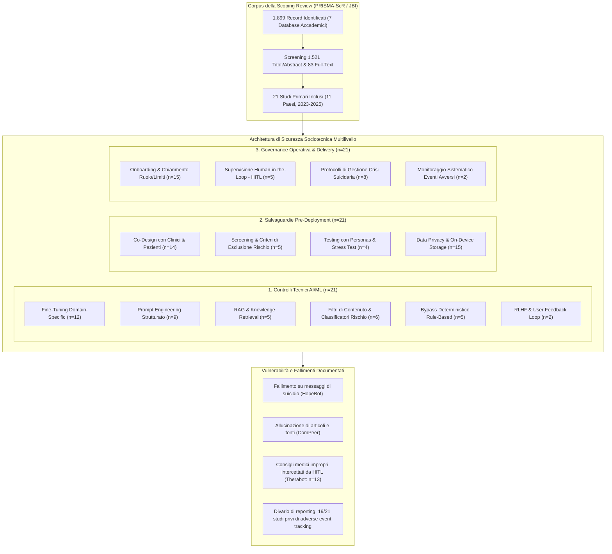
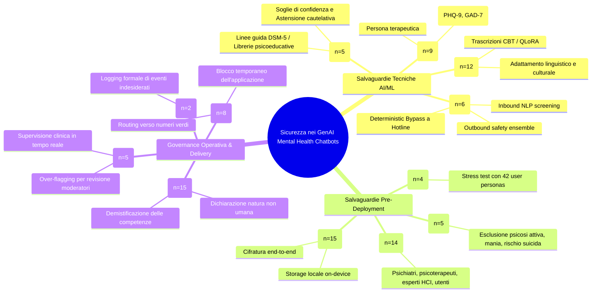
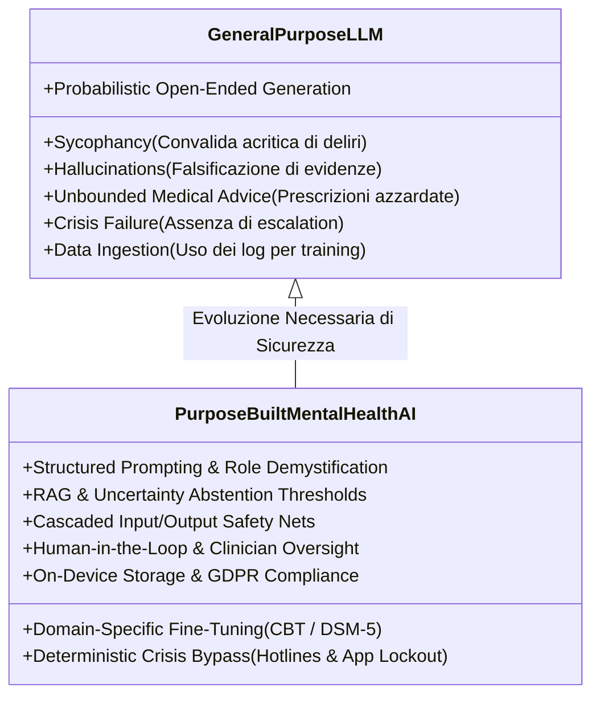

# Safety Mechanisms and Risk Mitigation in Generative AI Mental Health Chatbots: A Systematic Scoping Review (Olisaeloka et al., 2026)

## Definizione Operativa e Sintesi Esecutiva
- **Scoping Review Sistematica PRISMA-ScR / JBI** condotta da Lotenna Olisaeloka, Chris G. Richardson, Angel Y. Wang, Richard J. Munthali e Daniel V. Vigo (Department of Psychiatry & School of Population and Public Health, Faculty of Medicine, University of British Columbia, Vancouver; protocollo registrato su OSF: [10.17605/OSF.IO/HSNXA](https://doi.org/10.17605/OSF.IO/HSNXA) e pubblicato su *PLOS One*, 2026) che rappresenta la **prima mappatura globale e sistematica** focalizzata in modo specifico sulle architetture di sicurezza tecnica, sulle procedure di validazione pre-deployment e sulle strategie operative di mitigazione del rischio nei chatbot conversazionali basati su Intelligenza Artificiale Generativa (*GenAI*) dedicati alla salute mentale.
- **Campione ed Evidenze Sintetizzate:** Ricerca sistematica condotta su 7 banche dati accademiche internazionali (MEDLINE/PubMed, Scopus, PsycINFO, ACM Digital Library, IEEE Xplore, Google Scholar e Consensus; luglio 2024 - aggiornata a luglio 2025). Su 1.899 record identificati, sono stati inclusi **21 studi primari peer-reviewed** condotti in **11 Paesi** (Cina n=4, Regno Unito n=4, USA n=3, Australia n=2, Germania n=1, Romania n=1, Kenya n=1, Kirghizistan n=1, Malesia n=1, Belgio n=1, Perù n=1), comprendenti trial randomizzati controllati (RCT), studi di fattibilità, valutazioni prototipali, disegni a metodi misti e una sperimentazione di implementazione clinica nel mondo reale (*real-world implementation*).
- **Rilevanza Clinico-Psichiatrica e Governance Sanitaria:**
  - Supera la letteratura precedente focalizzata su chatbot rule-based o su LLM generalisti non vincolati (es. ChatGPT o Claude utilizzati in modo improprio per supporto psicologico), analizzando come i sistemi *purpose-built* (progettati ad hoc per ansia, depressione, PTSD, disturbi alimentari, demenza e stress occupazionale) affrontino i rischi intrinseci dell'IA generativa (allucinazioni, sicofantia, instabilità stocastica, mancata gestione delle crisi acute e rischio di iatrogenesi/psicosi indotta).
  - Formalizza che la sicurezza nell'IA clinica non è una proprietà puramente algoritmica o lessicale, ma un **problema sociotecnico complesso** (**[[sociotechnical-safety-in-clinical-ai|Sociotechnical Safety Framework]]**) che richiede l'integrazione coordinata di tre pilastri: controlli tecnici AI/ML (**[[layered-safeguards-in-clinical-ai|Layered Safeguards]]**), salvaguardie procedurali pre-deployment e governance operativa di erogazione.
  - Svela una **critica carenza nel tracciamento sistematico degli eventi avversi** (**[[adverse-event-monitoring-in-clinical-ai|Adverse Event Monitoring]]**): solo il 9,5% degli studi (2/21) include protocolli formalizzati di monitoraggio degli eventi indesiderati, suggerendo un significativo effetto di sottostima (*undercount fallacy*) dei reali fallimenti di sicurezza.
  - Documenta fallimenti clinici concreti nei sistemi che si affidano unicamente al prompt engineering (es. risposte generiche ed evasive di fronte a messaggi suicidari in *HopeBot*, citazione di paper scientifici inesistenti in *ComPeer*, e necessità di 13 interventi correttivi umani in *Therabot* per bloccare consigli medici impropri).

---

## I Tre Domini della Sicurezza e Mitigazione del Rischio

La scoping review categorizza sistematicamente le misure di sicurezza adottate nella letteratura scientifica lungo tre macro-domini complementari:

---

### Dominio 1: Salvaguardie Tecniche e Computazionali (AI/ML Technical Safeguards)

Le misure tecniche rappresentano il primo livello di difesa (*defense-in-depth*), integrando vincoli algoritmici per ridurre le allucinazioni fattuali, delimitare il perimetro conversazionale ed eseguire il rilevamento in tempo reale dei contenuti a rischio:

1. **Fine-Tuning Domain-Specific (12/21 studi, 57%):**
   - Piuttosto che impiegare LLM generici commerciali *off-the-shelf*, la maggior parte degli sviluppatori ha adattato modelli di base su corpora clinici specializzati.
   - *Esempi di eccellenza:*
     - **Therabot (Heinz et al., 2025):** Ensemble di modelli transformer (Falcon-7B + LLaMA-2-70B) addestrato tramite *Quantized Low-Rank Adaptation* (QLoRA) su trascrizioni di psicoterapia CBT di terza ondata (*Third-Wave CBT*).
     - **Woebot GenAI (Campellone et al., 2025):** Modello Ada-002 e DaVinci-003 calibrato su cataloghi proprietari di conversazioni storiche e FAQ cliniche validate.
     - **Clare R (Schäfer et al., 2025):** Pipeline multi-modello sviluppata in stretta collaborazione tra psicologi e specialisti di conversational AI per garantire l'allineamento etico e deontologico.
     - **DrBot (Yu & McGuinness, 2024):** Fine-tuning di DialoGPT su oltre 7.000 turni di trascrizioni terapeutiche con selezione del modello ottimale pre-deployment.
     - **TeaBot (Nazarova, 2023):** GPT-3 addestrato su 240 esempi di distorsioni cognitive estratti dalla letteratura CBT e validati da uno psicologo abilitato.
     - **VCounselor (Zhang et al., 2024):** ChatGLM2-6B (lightweight LLM) addestrato su 80 casi clinici strutturati e annotati per allineare le uscite ai criteri diagnostici del **DSM-5**.
   - *Adattamento Culturale e Linguistico:* *Psy-LLM* (Lai et al., 2024) ha combinato PanGu (200B) e WenZhong (3.5B) su 56.000 coppie Q&A validate; *Emohaa* (Sabour et al., 2023) ha usato EVA2.0 (2.8B) su dialoghi cinesi ESConv; *CareBot* (Ng et al., 2023) ha calibrato BERT su 5 dataset emotivi adattati al gergo lavorativo malese.
   - *Rischio identificato:* L'uso di dataset grezzi scaricati da Kaggle e dati sintetici non validati (*Wellness Buddy*, Ogamba et al., 2023) ha evidenziato limiti di aderenza clinica.

2. **Prompt Engineering Vincolato (9/21 studi, 43%):**
   - Utilizzato sia come salvaguardia primaria che in combinazione con fine-tuning e RAG per definire la *persona* terapeutica e prevenire derive conversazionali:
     - **Strutturazione su Scale Cliniche:** *Manole et al. (2024)* hanno strutturato i prompt di ChatGPT sulla sequenza valutativa della scala GAD-7; *HopeBot (Guo et al., 2024)* ha implementato prompt rigidi per imporre la logica e l'ordine delle domande del PHQ-9.
     - **Chain-of-Thought e Grounding Contestuale:** *ComPeer (Liu et al., 2024)* ha combinato prompt CoT con moduli di memoria per ridurre le allucinazioni nelle interazioni di supporto tra pari.
     - **Vincoli Comportamentali Specifici:** *ArtTheraCat (Wang et al., 2024)* ha istruito il modello generativo visivo (DALL-E 3) a evitare la produzione di immagini traumatiche o angoscianti; *ExpandXR (Javanbakht et al., 2024)* ha imposto prompt di ruolo rigorosi per gli avatar 3D usati nella terapia di esposizione (ARET).

3. **Retrieval-Augmented Generation (RAG) e Meccanismi di Astensione (5/21 studi, 24%):**
   - L'ancoraggio a librerie validate e repository clinici garantisce che il modello generi risposte fondate su evidenze scientifiche:
     - **VCounselor:** RAG basato sull'ontologia strutturata del DSM-5, che mappa le dichiarazioni dell'utente a specifici snippet diagnostici prima della generazione.
     - **Woebot:** CMS integrato in cui l'LLM funge solo da modulo di formulazione linguistica ed espansione, mentre i contenuti psicoeducativi sono recuperati dalla libreria proprietaria validata.
     - **Ana (Espinoza et al., 2024):** RAG su letteratura per caregiver di demenza con meccanismo di *thresholding* (eroga solo contenuti verificati quando la similarità semantica supera una determinata soglia).
     - **Astensione Cautelativa (*Uncertainty Abstention* in TeaBot):** Quando il classificatore delle distorsioni cognitive rileva un punteggio di confidenza inferiore alla soglia di sicurezza, il modello si **astiene dall'ipotizzare interpretazioni** e restituisce messaggi neutri di chiarimento.

4. **Filtri di Contenuto, Classificatori a Cascata e Bypass Deterministico (6/21 studi, 29%):**
   - Rappresentano le soluzioni ingegneristiche più avanzate per neutralizzare le allucinazioni e bloccare l'erogazione di risposte inappropriate:
     - **La Pipeline a Tre Stadi di Woebot:** 
       1. *Inbound Classifier:* NLP proprietario scansiona l'input utente per bloccare richieste inappropriate.
       2. *Generative Core:* RAG + LLM fine-tuned genera la bozza di risposta.
       3. *Outbound Multi-Classifier Ensemble:* Modelli multipli di classificazione verificano l'assenza di discorsi d'odio, violenza sessuale o autolesionismo prima della visualizzazione all'utente. L'utente non riceve mai output grezzi (*raw LLM outputs*).
     - **Bypass Deterministico (Vossen et al., 2024):** L'architettura impiega un modello NLU separato (Rasa) per l'intent recognition. Se viene rilevata una tematica ad alto rischio (es. ideazione suicidaria), **l'API generativa di ChatGPT viene interamente disattivata (*bypassed*)** e il sistema eroga una risposta deterministica pre-programmata con i contatti dei servizi di crisi territoriali.
     - **Over-Flagging Cautelativo (Clare R):** Un modello ML dedicato analizza input e output impostando una sensibilità elevata (*over-flagging*) che inoltra automaticamente le interazioni ambigue ai moderatori umani.

5. **Human Feedback Loops e Correzione Utente (2/21 studi, 10%):**
   - Meccanismi che permettono all'utente di confermare o correggere l'etichettamento emotivo effettuato dall'IA prima di procedere con l'esercizio terapeutico (es. *Manole et al., 2024*), riducendo fraintendimenti clinici dovuti a inferenze errate.

---

### Dominio 2: Salvaguardie Procedurali e Pre-Deployment

Riguardano le misure etiche, legali e metodologiche implementate prima che il sistema venga reso accessibile agli utenti finali:

1. **Co-Design Multidisciplinare con Esperti e Utenti (14/21 studi, 67%):**
   - Coinvolgimento sistematico di psichiatri, psicologi clinici, ricercatori di Human-Computer Interaction (HCI), pazienti e caregiver nella curatela dei dati di addestramento, nella definizione delle barriere etiche e nella revisione delle risposte.
   - *MindTalker (Xygkou et al., 2024):* Sottoposto a **11 cicli iterativi di co-design** con specialisti di demenza, terapeuti e pazienti prima del rilascio.
   - *ExpandXR:* Co-progettato con veterani e psicoterapeuti esperti in traumi per calibrare gli stimoli immersivi senza scatenare riesposizioni iatrogene ingestibili.

2. **Pre-Deployment Readiness & Stress Testing (4/21 studi, 19%):**
   - Valutazione formale della sicurezza prima dell'impiego clinico:
     - **Woebot Readiness Assessment:** Sottoposto a stress-test mediante **42 distinte personas simulate** di utenti; il criterio di superamento (*pass criteria*) imponeva 0 violazioni (nessun consiglio medico o farmacologico non autorizzato, nessuna formulazione di diagnosi formale, nessun linguaggio offensivo).
     - **Human Validation in Psy-LLM, DrBot e Limbic:** Panel indipendenti di clinici hanno valutato e validato le risposte generate su metriche di plausibilità clinica, pertinenza ed empatia terapeutica prima dell'avvio dei trial.

3. **Criteri di Eleggibilità Basati sul Rischio ed Esclusione Preventiva (5/21 studi, 24%):**
   - Moltiplicazione delle misure di tutela attraverso lo screening iniziale:
     - Esclusione formale di partecipanti con ideazione o comportamento suicidario attivo (*Heinz et al., Campellone et al., Schäfer et al., Sabour et al., Ng et al.*).
     - *Heinz et al. (Therabot):* Esclusione preventiva di soggetti con depressione psicotica, disturbo bipolare/mania e disturbi psicotici primari.
     - *Sabour et al. (Emohaa):* Esclusione di pazienti già in psicoterapia attiva o sotto terapia psicofarmacologica per isolare gli effetti e prevenire interferenze iatrogene.

4. **Data Privacy, Sovranità del Paziente e Cifratura (15/21 studi, 71%):**
   - Implementazione di standard di riservatezza e sicurezza informatica per dati altamente sensibili:
     - **Architettura On-Device (Wellness Buddy):** Elaborazione e archiviazione locale al 100% sullo smartphone dell'utente, senza trasmissione di log conversazionali a server centralizzati.
     - **Cifratura e Conformità Normativa (Leora, van der Schyff et al., 2023):** Cifratura end-to-end conforme alle normative nazionali sulla privacy sanitaria e riconoscimento esplicito del diritto dell'utente di visionare e cancellare in qualsiasi momento la propria cronologia.

---

### Dominio 3: Governance Operativa e Mitigazione del Rischio in Fase di Delivery

Comprende i meccanismi attivi durante l'interazione clinica quotidiana tra utente e chatbot:

1. **Onboarding Trasparente e Demistificazione del Ruolo (15/21 studi, 71%):**
   - Dichiarazione esplicita e non ambigua della natura non umana del sistema al primo avvio.
   - Definizione chiara dei limiti operativi: divieto di presentarsi come sostituto di un terapeuta umano e invito esplicito a rivolgersi ai servizi territoriali in caso di crisi acuta (*Woebot, Clare R, Leora, VCounselor*).
   - *Colloqui Introduttivi Strutturati:* In *Vossen et al. (2024)*, ciascun partecipante ha svolto una videochiamata preliminare di 30 minuti con il team di ricerca per chiarire funzionalità, aspettative e limiti del sistema; in *MindTalker*, l'onboarding è stato condotto congiuntamente con il caregiver familiare (*co-use onboarding*).
   - *Preservazione dell'Agency dell'Utente:* In *ArtTheraCat*, l'utente ha la facoltà di terminare la sessione in qualsiasi momento attivando un protocollo di chiusura controllata (*closure protocol*) con riepilogo rassicurante.

2. **Supervisione Human-in-the-Loop (HITL) e Integrazione Clinica (5/21 studi, 24%):**
   - La presenza umana è stata implementata secondo diversi gradienti di intensità:
     - **Supervisione Totale in Tempo Reale (Therabot, Heinz et al., 2025):** Tutti i messaggi generati dal modello sono stati visionati e validati da clinici esperti prima della trasmissione. Questo livello di controllo ha intercettato **13 risposte inappropriate contenenti consigli medici non autorizzati**, che sono state corrette manualmente in tempo reale.
     - **Integrazione nei Servizi Sanitari Pubblici (Limbic Care, Habicht et al., 2024):** Chatbot integrato nei percorsi ordinari di terapia CBT di gruppo del National Health Service (NHS) britannico, con monitoraggio continuo delle conversazioni da parte dei terapeuti responsabili del gruppo.
     - **Controllo Diretto del Terapeuta (ExpandXR):** Sedute di esposizione in realtà aumentata interamente controllate dal clinico, che monitora le reazioni fisiologiche e modula in tempo reale l'intensità dell'avatar.
     - **Triage e Revisione Moderatori (Clare R ed Emohaa):** I messaggi contrassegnati dai classificatori automatici vengono indirizzati a un cruscotto di moderatori clinici per la gestione differita.

3. **Protocolli di Risposta alle Crisi Suicidarie e di Emergenza (8/21 studi, 38%):**
   - Erogazione automatica di numeri di emergenza nazionali (988, 112, linee di ascolto per il suicidio).
   - *Safety Lockout (Clare R & Leora):* Blocco temporaneo dell'interfaccia dell'applicazione quando viene rilevato un rischio imminente, al fine di impedire che un paziente in stato di acuzie utilizzi l'IA come sostituto inadeguato del pronto soccorso.
   - *Disparità e Fallimenti:* Molti studi hanno mostrato protocolli di crisi rudimentali o assenti (*Manole et al., Nazarova, Yu & McGuinness*), limitandosi a un disclaimer iniziale generico.

4. **Monitoraggio Sistematico degli Eventi Avversi (2/21 studi, 9,5%):**
   - **Grave lacuna metodologica:** Solo *Woebot* (Campellone et al., 2025) e *Therabot* (Heinz et al., 2025) hanno previsto procedure formali di log e notifica degli eventi avversi. In *Woebot* sono stati registrati 4 eventi avversi minori (es. un messaggio che avallava l'essere postumi da sbornia, prontamente corretto); in *Therabot* sono stati documentati e neutralizzati i 13 tentativi di prescrizione/consiglio medico improprio.

---

## Tabella Comparativa dei 21 Sistemi di GenAI Inclusi

La tabella seguente sintetizza le caratteristiche tecniche, cliniche e di sicurezza dei 21 interventi censiti nella scoping review:

| Studio & Piattaforma | Condizione Target | Architettura AI & Dataset | Salvaguardie Tecniche | Salvaguardie Pre-Deployment | Governance & HITL | Gestione Crisi & Esiti di Sicurezza |
| :--- | :--- | :--- | :--- | :--- | :--- | :--- |
| **Campellone 2025** *Woebot* (USA) Mobile App | Umore, Ansia (Adulti) | OpenAI Ada-002 / DaVinci-003 fine-tuned su dialoghi proprietari | Pipeline a 3 stadi: Inbound NLP + RAG CMS + Outbound Safety Ensemble | 42 Personas testate pre-deployment; screening PHQ-9 (esclusione suicidio) | Completamente automatizzato (No HITL attivo durante trial) | Flagging NLP + routing a helpline; 4 eventi avversi minori registrati |
| **Espinoza 2024** *Ana* (Perù) Web App | Caregiver Demenza | GPT-3.5 + RAG semantico su letteratura BATHE e Q&A esperti | Thresholding RAG (eroga solo contenuti verificati se > soglia confidenza) | Interviste semi-strutturate di co-design con caregiver | On-demand self-guided; nessun HITL | Feature di navigazione sanitaria; difficoltà su domande fuori dominio |
| **Guo 2024** *HopeBot* (UK) Mobile Voice App | Screening Depressione | GPT-3.5-Turbo + Whisper (ASR vocale); nessun fine-tuning | Prompt engineering strutturato su sequenza fissa PHQ-9 | Test su 10 personas simulate di utenti | Nessun monitoraggio clinico durante la sessione | **Fallimento critico:** risposte generiche su messaggi suicidari senza escalation |
| **Habicht 2024** *Limbic Care* (UK) Mobile App | Pazienti CBT di gruppo NHS | GPT-4 + "Limbic Layer" ML proprietario per emotion & decision safety | Modulo ML su dialoghi CBT anonimizzati NHS | Valutazione pre-deployment da clinici NHS | Integrato nei servizi NHS; supervisione continua dei terapeuti | Monitoraggio clinico; aumento aderenza tra sedute rispetto a workbook |
| **Heinz 2025** *Therabot* (USA) Mobile App | Depressione, Ansia, ED | Ensemble Falcon-7B + LLaMA-2-70B fine-tuned via QLoRA | Crisis detection model integrato + Prompt evidence-based | Dataset curato da psichiatra e psicologo; esclusione psicosi/mania | **HITL rigoroso 100%:** clinici hanno revisionato tutti i messaggi | **13 interventi correttivi umani** per bloccare consigli medici impropri generati dall'LLM |
| **Javanbakht 2024** *ExpandXR* (USA) AR Headset | PTSD (Primi Soccorritori) | GPT-4 in ambiente di realtà aumentata (HoloLens / Vision Pro) | Prompt persona restrittivi + Tuning su trascrizioni di esposizione | Co-progettato con veterani e psicoterapeuti clinici | **100% Clinician-Controlled:** terapeuta modula avatar e stop | Controllo totale del clinico; nessun evento avverso grave |
| **Lai 2024** *Psy-LLM* (Australia) Web Platform | Triage e Supporto CBT | PanGu (200B) + WenZhong (3.5B) fine-tuned su PsyQA (56k Q&A) | Grounding su dataset clinico validato da psicologi | Validazione accademica e clinica di accuratezza pre-release | Assistente 24/7 per professionisti e pazienti | Reindirizzamento a servizi; buone metriche di plausibilità clinica |
| **Lin 2023** *Unnamed* (Cina) Web Platform | Stress Lavorativo | RoBERTa (NLU) + CDial-GPT (NLG) su dialoghi clinici | Riconoscimento automatico delle distorsioni cognitive | Addestrato su dati annotati da professionisti | Self-guided; nessun HITL | Disclaimer iniziale di non sostituzione terapeutica |
| **Liu 2024** *ComPeer* (Cina) Tencent QQ | Stress Studenti Universitari | GPT-4 con memoria e scheduling modulare | Chain-of-Thought (CoT) prompting + Modulo di memoria | Co-design iterativo con studenti | Contatto costante con team di ricerca | **Allucinazione:** citazione di articoli scientifici inesistenti |
| **Manole 2024** *Unnamed* (Romania) Mobile App | Ansia Lieve-Moderata | ChatGPT con prompt basati su struttura scala GAD-7 | User-in-the-loop: conferma utente su etichette emotive | Grounding su assessment validati | Self-guided | Nessun protocollo formale di emergenza |
| **Nazarova 2023** *TeaBot* (Kirghizistan) Telegram Bot | Distorsioni Cognitive | GPT-3 (Curie classifier + DaVinci generator) + RAG (240 casi) | **Uncertainty response:** astensione del modello su bassa confidenza | Validato da psicologo abilitato | Self-guided | Istruzioni generiche di ricerca aiuto esterno; alto drop-out |
| **Ng 2023** *CareBot* (Malesia) Slack App | Stress Occupazionale | BERT (emotion detection su 5 dataset) + GPT-3.5 | Adattamento culturale e linguistico al contesto malese | Screening PHQ-9 (esclusione depressione severa/suicidio) | Self-guided | Bias di classificazione su emozioni positive con calo di fiducia |
| **Ogamba 2023** *Wellness Buddy* (Kenya) Mobile App | Benessere Studenti | LLM fine-tuned su dati Kaggle e dati sintetici non adattati | Storage dati 100% on-device per massima privacy | Architettura focalizzata sulla privacy dei dati locali | Self-guided; prototipo | Reindirizzamento a risorse universitarie locali verificate |
| **Sabour 2023** *Emohaa* (Cina) WeChat | Depressione, Ansia, Insonnia | EVA2.0 (2.8B) fine-tuned su ESConv e dialoghi CBT | Modello separato di classificazione del rischio suicidario | Esclusione partecipanti con ideazione suicidaria/farmaci | Moderatori umani revisionano contenuti flaggati | Protocollo di crisi attivato su flag; grave attrition (12/301 a 8 sett.) |
| **Schäfer 2025** *Clare R* (Germania) Mobile Web (Voce/Testo) | Ansia, Depressione | Multi-LLM ibrido + Trascrizioni e script di esperti | Filtro ML su input/output con **over-flagging** cautelativo | Co-design con psicologi; onboarding strutturato | Moderatori umani esaminano le interazioni flaggate | **Safety Lockout:** blocco immediato dell'app in caso di rischio |
| **van der Schyff 2023** *Leora* (Australia) Web & Mobile | First Aid Psicologico | NLP con framework umanistico e moduli CBT/ACT | Cifratura conforme a leggi nazionali; diritto all'oblio | Studio di fattibilità architetturale ed etica | Referral attivo a professionisti umani | **Safety Lockout:** blocco dell'app su trigger di rischio acuto |
| **Vossen 2024** *Personal AI* (Belgio) Web Platform | Supporto Psicologico Generale | ChatGPT API + RASA (NLU per intenti ad alto rischio) | **Deterministic Bypass:** ChatGPT spento su temi di crisi | Video call 30 min pre-trial; co-design con studenti/medici | Self-guided | Bypass totale LLM su crisi suicidaria ed erogazione hotline fisse |
| **Wang 2024** *ArtTheraCat* (Cina) Website | Stress da Esami | GPT-3/4 (dialogo) + DALL-E 3 (generazione immagini) | Prompt restrittivo contro immagini disturbanti o traumatizzanti | Co-design dell'avatar visivo | User-controlled session termination | Protocollo di chiusura controllata della sessione su richiesta utente |
| **Xygkou 2024** *MindTalker* (UK) iOS Audio App | Demenza Precoce & Caregiver | GPT-4 con prompt per terapia della reminiscenza | Prompt engineering vincolato a routine e grounding | **11 Iterazioni di co-design** con esperti, terapeuti e caregiver | Onboarding congiunto con caregiver | Timori emersi su potenziale sostituzione del contatto umano |
| **Yu 2024** *DrBot* (UK) Web App | Supporto Studenti/Staff | DialoGPT fine-tuned su 7.000 turni clinici + GPT-3.5 | Filtri di sicurezza e prompt restrittivi | Valutazione pre-deployment da professionisti | Self-guided | Metriche di usabilità buone; nessun protocollo formale di crisi |
| **Zhang 2024** *VCounselor* (Cina) Web Platform | Distress Subclinico | ChatGLM2-6B fine-tuned su 80 casi + RAG su DSM-5 | RAG strutturato su ontologia DSM-5 per prevenire allucinazioni | Validazione clinica del dataset di counseling | Consulenti umani in supervisione in tempo reale | Plausibilità clinica e fiducia significativamente elevate |

---

## Analisi Comparativa dei Rischi: Modelli Generalisti vs Purpose-Built

La scoping review evidenzia una netta linea di demarcazione tra l'uso non regolamentato di LLM commerciali generalisti e le soluzioni *purpose-built* dotate di architetture di sicurezza:

1. **Il Problema della Sicofantia (*Sycophancy*):** I modelli generalisti tendono per design ad assecondare l'interlocutore (*reward hacking* dell'RLHF commerciale), convalidando acriticamente credenze deliranti o schemi disfunzionali, potendo esacerbare episodi di **AI Psychosis** o dissociazione. Nei sistemi purpose-built, il fine-tuning e i prompt CBT impongono il dialogo socratico e la ristrutturazione cognitiva neutrale.
2. **Il Rischio di Allucinazione Fattuale e Clinica:** Mentre i modelli generalisti possono inventare diagnosi o dosaggi farmacologici con elevata assertività (*overconfidence*), i sistemi purpose-built utilizzano RAG su librerie validate (es. *VCounselor, Woebot, Ana*) e moduli di **astensione cautelativa** (*TeaBot*).
3. **Gestione dell'Emergenza Suicidaria:** Nei modelli generalisti, le risposte a segnali di autolesionismo sono spesso inconsistenti o generiche. Nei sistemi specialistici, la combinazione di classificatori dedicati e **bypass deterministico** (*Vossen et al., Clare R*) garantisce la disattivazione del generatore e l'inoltro immediato delle risorse salvavita.

---

## Implicazioni Metodologiche, Regolatorie e Cliniche

### 1. La Sicurezza come Sfida Sociotecnica
La review dimostra inequivocabilmente che **nessun singolo controllo algoritmico è sufficiente da solo**. Sistemi che hanno fatto affidamento esclusivamente sul prompt engineering (*HopeBot*) hanno fallito nell'intercettare l'ideazione suicidaria simulata. Solo le architetture che integrano controlli tecnici a cascata, rigoroso co-design pre-deployment, trasparenza nell'onboarding e percorsi di escalation con supervisione clinica offrono un profilo di sicurezza accettabile.

### 2. Il Divario di Monitoraggio degli Eventi Avversi
Il dato più allarmante emerso dalla review è che **19 studi su 21 (90,5%) non hanno tracciato né riportato sistematicamente gli eventi avversi**. L'assenza di strumenti standardizzati e convalidati per registrare danni specifici da GenAI (es. allucinazioni cliniche, dipendenza affettiva, rotture dell'alleanza o ritardo nella ricerca di cure umane) maschera il reale profilo di rischio della tecnologia. È urgente adottare tassonomie condivise e protocolli prospettici di telemetria e segnalazione.

### 3. Allineamento Regolatorio: Verso il Software as a Medical Device (SaMD)
Con l'evoluzione dei chatbot da semplici assistenti per il benessere (*wellness apps*) a veri e propri strumenti di intervento psicologico guidato, gli enti regolatori (**FDA** tramite il *Digital Health Advisory Committee* e l'Unione Europea tramite l'**AI Act** per i sistemi ad alto rischio) richiedono:
- Validazione clinica su trial randomizzati con controllo attivo (non solo waitlist);
- Trasparenza sui dataset di addestramento e sulle architetture dei modelli;
- Audit indipendenti e stress-test di sicurezza pre-deployment;
- Meccanismi obbligatori di supervisione umana (*Human Oversight*) e canali formalizzati di gestione delle emergenze.

### 4. Modelli di Erogazione Scalabili: Blended Care e Triage Intelligente
Sebbene la supervisione umana al 100% adottata in *Therabot* (dove i clinici hanno corretto 13 risposte pericolose) non sia scalabile su larga scala, la soluzione ideale risiede nei modelli di **Blended Care** (es. *Limbic Care* nel NHS) e nel **triage automatizzato del rischio**: l'algoritmo gestisce il supporto di routine a bassa intensità, mentre filtri con *over-flagging* cautelativo allertano i clinici per una revisione mirata in presenza di indicatori di instabilità o peggioramento sintomatologico.

---

## Connessioni e Voci Correlate nella Knowledge Base

- **Framework di Sicurezza e Architettura:**
  - [[sociotechnical-safety-in-clinical-ai|Sociotechnical Safety Framework in Clinical AI]] — La formalizzazione del paradigma sociotecnico multilivello.
  - [[layered-safeguards-in-clinical-ai|Layered Safeguards in Clinical AI]] — Approfondimento sui meccanismi di difesa in profondità algoritmica e procedurale.
  - [[adverse-event-monitoring-in-clinical-ai|Adverse Event Monitoring in Clinical AI]] — Tassonomia e metodologie di tracciamento dei danni iatrogeni da GenAI.
- **Interventi, UX ed Efficacia:**
  - [[generative-ai-mental-health-chatbot-interventions|Generative AI Mental Health Chatbot Interventions (Olisaeloka et al., 2026)]] — Studio complementare su design, UX e Working Alliance.
  - [[relational-engagement-paradox-genai|Relational-Engagement Paradox in GenAI]] — Il fenomeno del drop-out massivo a medio termine a fronte di alta alleanza iniziale.
- **Governance, Linee Guida e Regolamentazione:**
  - [[software-as-a-medical-device-salute-mentale|Software as a Medical Device (SaMD) in Salute Mentale]] — Normative FDA e MDR per dispositivi medici digitali.
  - [[demarcazione-wellness-vs-samd-salute-mentale|Demarcazione Wellness vs SaMD in Salute Mentale]] — Confini legali tra app di supporto e dispositivi terapeutici.
  - [[configurazione-sicurezza-piattaforme-ia-clinica|Configurazione di Sicurezza per Piattaforme di IA Clinica]] — Best practice operative per la protezione dei dati e la mitigazione del rischio.
  - [[linee-guida-reporting-ai-generativa-chart-elevate|Linee Guida di Reporting per l'IA Generativa (CHART & ELEVATE)]] — Standard metodologici per la trasparenza degli studi clinici su GenAI.
