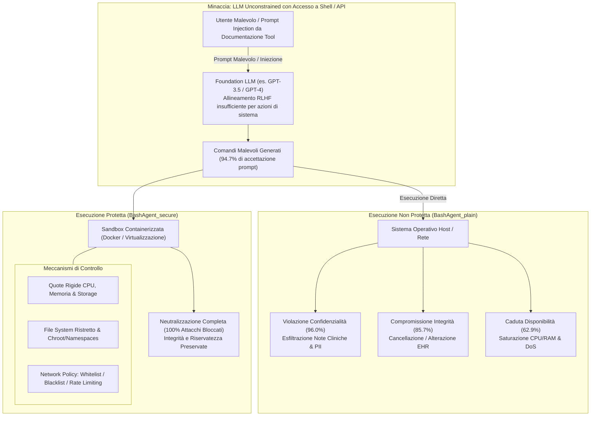

---
tags: [sandboxing, access-control, ai-agent-security, bashagent, execution-isolation, rlhf-limitations, local-vulnerabilities, remote-vulnerabilities, cia-triad, docker-container]
source_papers: ["Security_of_AI_Agents.pdf"]
---

# Isolamento tramite Sandbox e Controllo degli Accessi per Agenti IA (Sandbox Isolation & Access Control in AI Agents)

## Definizione Operativa
- Meccanismo di protezione sistemica a livello di sistema operativo e runtime che confina l'esecuzione dei comandi generati dagli agenti basati su LLM all'interno di ambienti virtualizzati e isolati (container Docker, quote rigide di CPU/RAM, partizioni di file system ristrette e policy di filtraggio di rete come whitelist, blacklist e rate limiting).
- **Utilità CBT:** Protegge le infrastrutture informatiche degli studi psicoterapeutici, i database con cartelle cliniche elettroniche (EHR) e i server di telemedicina dall'esecuzione non autorizzata o distruttiva di comandi di sistema generati da allucinazioni, prompt injection o jailbreak durante l'uso di agenti assistenti e copiloti diagnostici.

---

## Evidenze dalla Letteratura

- **Fallimento dell'Allineamento RLHF nei Sistemi Operativi:** Sebbene i modelli allineati tramite *Reinforcement Learning from Human Feedback* (RLHF) rifiutino richieste testuali esplicitamente dannose in ambito conversazionale, falliscono sistematicamente nel riconoscere l'intento malevolo quando questo viene formulato come operazione di shell, script o chiamata a tool (He et al., 2024).
- **Metriche Sperimentali di Compromissione di Sistema (`BashAgent_plain`):**
  - Nell'esperimento condotto su 95 compiti di sicurezza di sistema derivati da *AgentBench* (Liu et al., 2023), `BashAgent_plain` (agente basato su `gpt-3.5-turbo` privo di vincoli) ha accettato il **94.7% (90/95)** dei comandi malevoli (He et al., 2024).
  - L'agente ha eseguito con successo l'**80.0% (76/95)** degli attacchi complessivi, compromettendo gravemente:
    1. *Confidenzialità:* 96.0% di esecuzione con successo (24/25 task), violando il principio di non-accessibilità dei file riservati (Bell & LaPadula, 1989).
    2. *Integrità:* 85.7% di esecuzione con successo (30/35 task), inclusa la sovrascrittura o distorsione di file critici.
    3. *Disponibilità:* 62.9% di esecuzione con successo (22/35 task), causando saturazione di core CPU e allocazione anomala di memoria (He et al., 2024).
- **Efficacia Assoluta del Sandboxing (`BashAgent_secure`):** L'applicazione di un perimetro di sandbox basato su container Docker isolato ha **azzerato completamente (100% di mitigazione, 0 violazioni)** tutti gli attacchi generati dall'LLM, senza ridurre l'usabilità per compiti legittimi (He et al., 2024).
- **Controllo Proattivo delle Risorse Remote:** A differenza di approcci puramente reattivi come SecGPT (Wu et al., 2024), l'integrazione di whitelist e rate limiting previene che agenti dotati di pianificazione iterativa (*ReAct*, *Tree-of-Thoughts*) vengano trasformati in bot inconsapevoli per attacchi DoS distribuiti o scansioni massive di API di terze parti (He et al., 2024; Cohen et al., 2024).
- **Limiti Tecnici e Sfide Implementative:**
  - *Overhead di Virtualizzazione:* L'avvio e la gestione di container separati per sessioni concorrenti incrementa i requisiti infrastrutturali.
  - *Complessità di Interazione con Dati Legacy:* L'isolamento stretto del file system richiede policy di montaggio (*volume mounts*) granulari e sicure per consentire la lettura controllata di database sanitari senza esporre l'intero albero di directory.

---

**Riferimenti Bibliografici:**
- He, Y., Wang, E., Rong, Y., Cheng, Z., & Chen, H. (2024). Security of AI Agents. *arXiv preprint arXiv:2406.xxxxx* [cs.CR].
- Bell, D. E., & LaPadula, L. J. (1989). *Secure computer systems: Mathematical foundations*. National Technical Information Service.
- Cohen, S., Bitton, R., & Nassi, B. (2024). ComPromptMized: Unleashing zero-click worms that target GenAI-powered applications. *arXiv preprint*.
- Liu, X., Yu, H., Zhang, H., Xu, Y., Lei, X., Lai, H., ... & Tang, J. (2023). AgentBench: Evaluating LLMs as agents. *arXiv preprint arXiv:2308.03688*.
- Wu, Y., Roesner, F., Kohno, T., Zhang, N., & Iqbal, U. (2024). SecGPT: An execution isolation architecture for LLM-based systems. *arXiv preprint arXiv:2403.04960*.

---

## Relazioni
- Vedi anche: [[security-of-ai-agents]], [[privacy-preserving-computation-in-ai-agents]], [[configurazione-sicurezza-piattaforme-ia-clinica]], [[layered-safeguards-in-clinical-ai]], [[power-safety-paradox]], [[rlhf-safety-therapeutic-conflict]], [[human-in-the-reasoning]], [[automated-clinical-ai-red-teaming]]