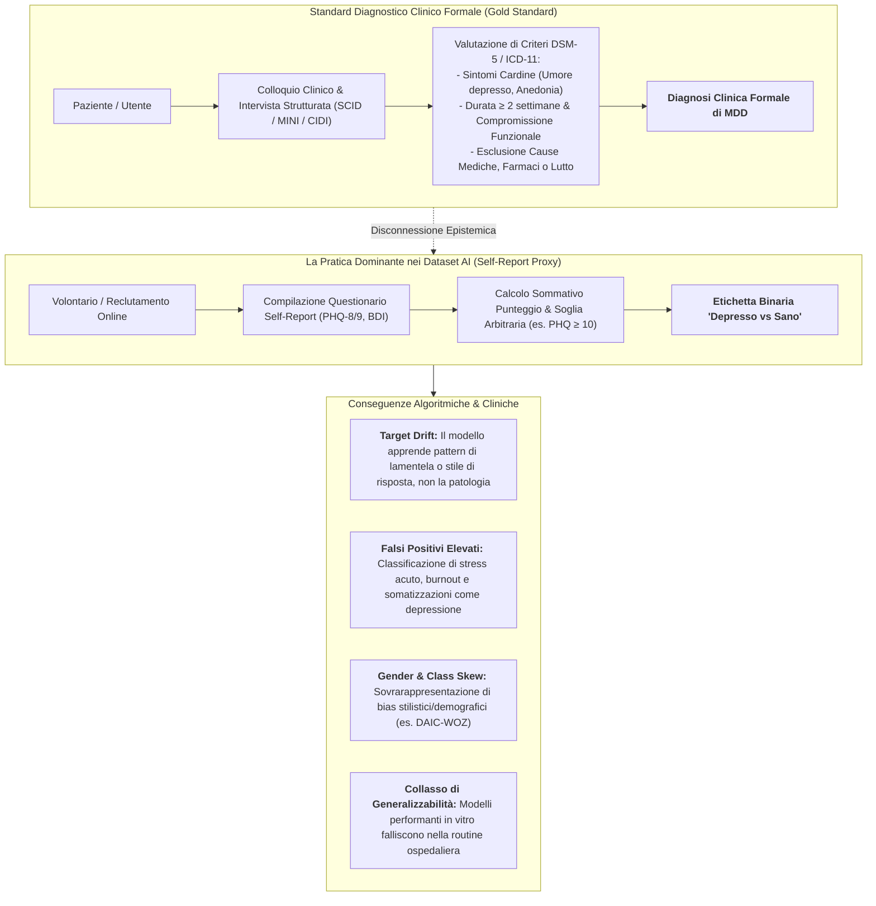
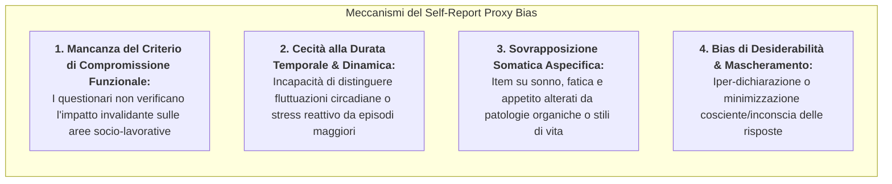
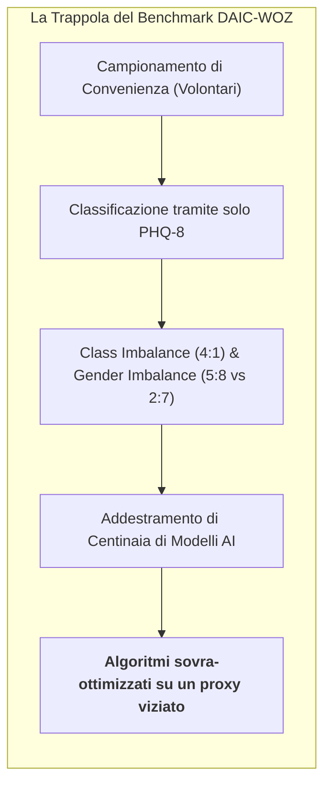
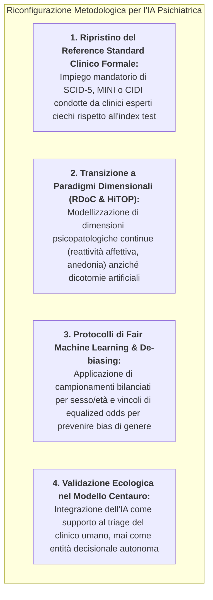

# Self-Report Proxy Bias in AI (Bias del Proxy da Autovalutazione nei Modelli Diagnostici di IA)

## Definizione Operativa
- Il **Self-Report Proxy Bias** (o *Bias del Bersaglio Vicariante da Autovalutazione*) è una distorsione metodologica ed epistemologica sistematica nella psichiatria computazionale e nell'apprendimento automatico applicato alla salute mentale, che si manifesta quando gli algoritmi di Intelligenza Artificiale vengono addestrati, calibrati e validati per predire **punteggi soglia di questionari autosomministrati** (es. PHQ-8/PHQ-9, BDI-II, GAD-7) invece di **diagnosi cliniche formali** basate sui criteri nosografici del DSM-5-TR o dell'ICD-11 ottenute tramite interviste diagnostiche strutturate (*SCID, MINI, CIDI*; Maran et al., 2025; *JMIR Mental Health*, doi: [10.2196/67802](https://doi.org/10.2196/67802); Di et al., 2021).
- **Lo Slittamento dell'Obiettivo Clinico (*Target Drift*):**
  - Quando un modello AI impiega un punteggio di screening (es. $PHQ-9 \ge 10$) come *ground truth*, l'obiettivo computazionale subisce una mutazione radicale: il sistema **non impara a diagnosticare la patologia psichiatrica**, bensì a **predire la probabilità che un individuo compili il questionario totalizzando un punteggio superiore alla soglia convenzionale** (Maran et al., 2025).
  - Tale traslazione confonde il costrutto psicometrico di *distress emotivo soggettivo o demoralizzazione transitoria* con l'entità clinico-nosologica del *Disturbo Depressivo Maggiore (MDD)*, compromettendo la validità ecologica, l'affidabilità diagnostica e l'applicabilità clinica dei sistemi di IA.

---

## Meccanismi di Disallineamento Nosologico ed Epistemico

Maran et al. (2025), nella loro meta-analisi su 105 studi di analisi automatica del parlato, evidenziano che oltre il **70.5% dei lavori scientifici ha utilizzato questionari self-report (PHQ-8/9 nel 48.6%, BDI/BDI-II nel 21.9%)**, mentre solo una quota marginale ha impiegato interviste cliniche strutturate (DSM-IV nel 9.5%, CIDI nel 3.8%, MINI nel 2.9%).

Questo divario genera profonde distorsioni strutturali:

### 1. Distress Aspecifico vs Quadro Sindromico Maggiore
- I questionari self-report misurano un continuum dimensionale aspecifico di sofferenza psicologica (*general psychological distress*).
- Condizioni transitorie come stress da lavoro correlato, lutto recente non complicato, insonnia situazionale o sindromi dolorose croniche totalizzano facilmente punteggi $\ge 10$ al PHQ-9 senza soddisfare i criteri per un Disturbo Depressivo Maggiore secondo il DSM-5-TR.
- L'algoritmo di Machine Learning, addestrato su tali etichette, viene ingannato dall'etichetta positiva e associa le caratteristiche biometriche del soggetto (es. stanchezza vocale, pause da fatica) alla depressione clinica.

### 2. Eterogeneità degli Item e Peso dei Sintomi Somatici
- Nelle scale come il PHQ-9, oltre un terzo del punteggio è determinato da sintomi neurovegetativi e somatici (disturbi del sonno, astenia, alterazioni dell'appetito, rallentamento psicomotorio).
- Pazienti affetti da patologie mediche croniche (es. ipotiroidismo, insufficienza renale, broncopneumopatia, diabete) totalizzano punteggi elevati in virtù della condizione organica, venendo falsamente etichettati come depressi nei dataset di addestramento.

### 3. Rigidità delle Soglie Dicotomiche (*Cut-off Binarization*)
- La trasformazione di un punteggio continuo (PHQ-9 da 0 a 27) in una variabile binaria ($0 = \text{sano}$, $1 = \text{depresso}$) attraverso una soglia arbitraria (generalmente $\ge 10$) introduce una perdita massiccia di informazione clinica.
- Un soggetto con punteggio 9 viene categorizzato come "sano" allo stesso modo di uno con punteggio 0, mentre un soggetto con punteggio 10 viene equiparato a un quadro severo con punteggio 25, forzando il classificatore ad apprendere una frontiera di decisione artificiale (*decision boundary distortion*).

---

## Impatto sui Dataset e Distorsioni Algoritmiche

L'adozione del self-report come proxy diagnostico genera distorsioni a cascata sull'intero ciclo di vita del modello computazionale:

| Dimensione di Impatto | Manifestazione nei Dataset (es. DAIC-WOZ) | Conseguenza sull'Algoritmo di Intelligenza Artificiale |
| :--- | :--- | :--- |
| **Sbilanciamento di Classe (*Class Imbalance*)** | Nei dataset basati su volontari, la prevalenza di soggetti positivi al proxy è spesso anomala (es. ratio 4:1 sani/depressi in DAIC-WOZ; Ndaba, 2023). | Il modello impara a massimizzare l'accuratezza banale predicendo la classe maggioritaria o incorre in tassi insostenibili di falsi positivi nel mondo reale. |
| **Bias di Genere Incrociato (*Gender Skew*)** | Le donne riportano più frequentemente sintomi depressivi nei questionari (in DAIC-WOZ ratio femmine depresse/sane $\approx 5:8$ vs maschi $\approx 2:7$; Bailey & Plumbley, 2021). | L'algoritmo correla tratti vocali tipicamente femminili (o specifici pattern prosodici di genere) alla classe "depresso", generando discriminazione algoritmica (*disparate impact*). |
| **Speaker Identity Overfitting** | In assenza di una diagnosi clinica solida, i modelli Deep Learning complessi memorizzano le feature individuali dei partecipanti anziché i biomarcatori della patologia (Zuo & Mak, 2023). | Il modello mostra accuratezze artificialmente elevate durante la cross-validation ($>85\%$), ma collassa completamente quando testato su nuovi parlatori in coorti cliniche esterne. |
| **Inflazione da Ottimismo Sperimentale** | Ricercatori ottimizzano i modelli per massimizzare la correlazione con il PHQ-9 anziché verificare la concordanza con il giudizio clinico di psichiatri indipendenti. | Divario incolmabile tra le metriche pubblicate negli articoli e il fallimento nella sperimentazione clinica reale (*clinical readiness gap*). |

---

## Il Caso Esemplare del Dataset DAIC-WOZ

Il **Distress Analysis Interview Corpus - Wizard of Oz (DAIC-WOZ)** (Gratch et al., 2014) rappresenta il dataset pubblico più utilizzato al mondo per la depression detection vocale e multimodale (impiegato in oltre il 33.3% degli studi esaminati da Maran et al., 2025).

Nonostante il suo valore storico pionieristico, DAIC-WOZ incarna paradigmaticamente il *Self-Report Proxy Bias*:
1. **Assenza di Diagnosi Clinica:** I partecipanti (189 interviste) sono stati classificati unicamente tramite il questionario PHQ-8 somministrato prima del colloquio con l'agente virtuale *Ellie*;
2. **Artefatto da Avatar Virtuale:** L'interazione con un avatar virtuale non replica la complessità interpersonale, l'alleanza terapeutica e il transfert tipici di una visita psichiatrica vis-à-vis;
3. **Mancanza di Dati Longitudinali:** Lo score PHQ-8 riflette lo stato degli ultimi 14 giorni, ma la registrazione vocale cattura lo stato affettivo puntuale di pochi minuti, ignorando la latenza temporale e la stabilità del quadro psicopatologico.

---

## Strategie di Superamento e Riconfigurazione Metodologica

Per superare l'impasse del Self-Report Proxy Bias, la letteratura clinico-computazionale più recente (Maran et al., 2025; Orrù & Mannarini, 2026) raccomanda un cambio di paradigma fondato su 4 pilastri:

1. **Reclutamento Clinico con Interviste Strutturate (*Gold Standard*):**
   - Gli studi di AI devono arruolare coorti cliniche reali in cui la diagnosi di depressione sia formalizzata secondo il DSM-5-TR mediante interviste diagnostiche strutturate (**SCID-5, MINI o CIDI**) eseguite da psichiatri o psicologi clinici indipendenti.
2. **Integrazione di Standard Dimensionali (RDoC e HiTOP):**
   - Superare la rigida divisione binaria sano/depresso adottando i framework **RDoC** (*Research Domain Criteria*) e **HiTOP** (*Hierarchical Taxonomy of Psychopathology*), addestrando i modelli a quantificare costrutti funzionali specifici (es. valenza negativa, ipo-reattività alla ricompensa, rallentamento motorio laringeo) correlati biologicamente ai biomarcatori vocali e fisiologici.
3. **Fair Machine Learning e Tecniche di Disentanglement:**
   - Implementare algoritmi di *speaker disentanglement* e *fair representation learning* (Zuo & Mak, 2023; Ravi et al., 2024) per scorporare i fattori biometrici identitari e demografici (genere, età, accento) dai pattern acustici patologici.
4. **Trasparenza nei Protocolli e Checklist AI-DTA Dedicate:**
   - Superare i limiti dello strumento QUADAS-2 convenzionale adottando framework specifici per l'IA diagnostica (come le linee guida internazionali **FUTURE-AI** o il protocollo **CHART-GenAI**; Maran et al., 2025), garantendo il blinding completo tra estrazione delle feature e classificazione clinica.

---

## Riferimenti Bibliografici
- Maran, P. L., Braquehais, M. D., Vlaic, A., Alonzo-Castillo, M. T., Vendrell-Serres, J., Ramos-Quiroga, J. A., & Rodríguez-Urrutia, A. (2025). Performance of Automatic Speech Analysis in Detecting Depression: Systematic Review and Meta-Analysis. *JMIR Mental Health*, 12, e67802. https://doi.org/10.2196/67802
- Bailey, A., & Plumbley, M. D. (2021). Gender bias in depression detection using audio features. *29th European Signal Processing Conference (EUSIPCO)*, 23–27. https://doi.org/10.23919/eusipco54536.2021.9615933
- Di, Y., Wang, J., Li, W., & Zhu, T. (2021). Using i-vectors from voice features to identify major depressive disorder. *Journal of Affective Disorders*, 288, 161–166. https://doi.org/10.1016/j.jad.2021.04.004
- Gratch, J., Artstein, R., Lucas, G., et al. (2014). The distress analysis interview corpus of human and computer interviews. *LREC 2014*, 3123–3128.
- Ndaba, S. (2023). Class imbalance handling techniques used in depression prediction and detection. *International Journal of Data Mining & Knowledge Management Process*, 13(1/2), 17–33. https://doi.org/10.5121/ijdkp.2023.13202
- Orrù, L., & Mannarini, S. (2026). The Role of Artificial Intelligence in Clinical Psychology: How AI and NLP Systems Are Reshaping Psychological Interventions. A Systematic Review. *Clinical Psychology & Psychotherapy*, 33, e70242. https://doi.org/10.1002/cpp.70242
- Ravi, V., Wang, J., Flint, J., & Alwan, A. (2024). Enhancing accuracy and privacy in speech-based depression detection through speaker disentanglement. *Computer Speech & Language*, 86, 101605. https://doi.org/10.1016/j.csl.2023.101605
- Regier, D. A., Narrow, W. E., Clarke, D. E., et al. (2013). DSM-5 field trials in the United States and Canada, part II: test-retest reliability of selected categorical diagnoses. *American Journal of Psychiatry*, 170(1), 59–70. https://doi.org/10.1176/appi.ajp.2012.12070999
- Zuo, L., & Mak, M. (2023). Avoiding dominance of speaker features in speech-based depression detection. *Pattern Recognition Letters*, 173, 50–56. https://doi.org/10.1016/j.patrec.2023.07.016

---

## Relazioni
- [[mental_v12i1e67802]]: Systematic review e meta-analisi a 3 livelli di Maran et al. (2025) su Automatic Speech Analysis e depressione.
- [[vocal-biomarkers-in-depression]]: Tassonomia completa dei biomarcatori vocali e delle feature acustico-computazionali.
- [[algorithmic-tractability-in-psychotherapy]]: Analisi del bias verso costrutti manualizzati e strutturati rispetto alla complessità psicopatologica.
- [[epistemological-paradox-in-clinical-ai]]: Il dilemma metodologico tra sicurezza della validazione e testing su popolazioni vulnerabili.
- [[clinical-readiness-gap-in-mh-chatbots]]: Divario tra metriche algoritmiche di laboratorio e affidabilità diagnostico-terapeutica reale.
- [[measurement-phantoms]]: Artefatti di misurazione e proxy illusori nell'interazione con sistemi di intelligenza artificiale.
- [[modello-centauro-clinico]]: Architettura collaborativa che bilancia screening algoritmico e supervisione clinica esperta.
