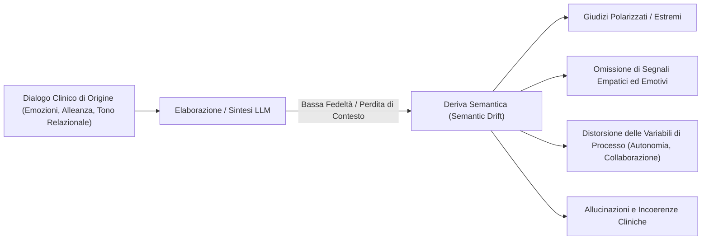

# Deriva Semantica nella Psicoterapia Computazionale (Semantic Drift)

## Definizione Operativa
- Fenomeno di distorsione e degradazione progressiva in cui un modello linguistico (LLM) devia dal significato originario, dall'intento terapeutico, dall'intensità affettiva o dalle dinamiche relazionali espresse in un dialogo clinico reale durante compiti di sintesi, riscrittura o classificazione.
- **Utilità CBT:** Nel processo decisionale e nella pratica clinica cognitivo-comportamentale, la deriva semantica può portare a riassunti di seduta fuorvianti che minimizzano o esagerano distorsioni cognitive, resistenze, segnali di rottura dell'alleanza o livelli di aderenza del terapeuta (es. travisando un intervento collaborativo per uno autoritario o prescindendo dall'atteggiamento non giudicante), compromettendo la concettualizzazione del caso e la supervisione clinica.

## Evidenze dalla Letteratura
- **Formalizzazione e Misurazione della Deriva:** Kumar et al. (2025) quantificano la deriva semantica valutando lo scostamento ($\Delta = \text{Punteggio Predetto} - \text{Ground Truth}$) tra le valutazioni Likert (1–5) assegnate dai modelli linguistici e l'annotazione di esperti clinici lungo le dimensioni del *Motivational Interviewing Treatment Integrity* (MITI 4.1).
- **Variazioni Sistematiche tra Architetture:**
  - *Scarsa Profondità Descrittiva e Polarizzazione (Gemini-2.0 Flash):* Mostra la massima deriva semantica per via di sintesi eccessivamente sintetiche e superficiali che falliscono nel riflettere l'intensità delle emozioni dei pazienti, inducendo giudizi estremi e distorti (Kumar et al., 2025).
  - *Perdita di Contesto e Allucinazioni nei Prompt Lunghi (DeepSeek-V3):* Manifesta vulnerabilità al fenomeno del *lost in the middle* nei prompt estesi (Liu et al., 2024; Kumar et al., 2025), producendo incoerenze e allucinazioni cliniche visibili nelle conclusioni di sintesi.
  - *Minima Deviazione e Risoluzione Relazionale (ChatGPT-4.0):* Mantiene la più alta fedeltà contestuale con scostamenti contenuti ($\Delta \in [-1, +1]$), dimostrando capacità descrittive equilibrate e ridotta tendenza a omettere elementi empatici e relazionali (Kumar et al., 2025).
- **Mitigazione tramite Prompting Progressivo:** Il passaggio da prompt zero-shot generici a strategie di prompting guidato *one-shot* e *few-shot* (incorporanti esempi e definizioni analitiche delle ancore Likert) riduce in modo tangibile la dispersione e la deriva semantica nei modelli (Kumar et al., 2025).
- **Implicazioni per la Sicurezza e la Non-Discriminazione:** La deriva semantica non controllata amplifica bias preesistenti e disparità nell'accesso alle cure e nella qualità dell'assistenza psicologica digitale (Sogancioglu et al., 2024; Tripathi et al., 2024).

**Riferimenti Bibliografici:**
- Kumar, V., Rajawat, P. S., & Ntoutsi, E. (2025). Mitigating semantic drift: Evaluating LLMs’ efficacy in psychotherapy through MI dialogue summarization leveraging MITI code. In *2025 International Joint Conference on Neural Networks (IJCNN)*, pp. 1–8. arXiv preprint arXiv:2511.22818v1.
- Moyers, T. B., Rowell, L. N., Manuel, J. K., Ernst, D., & Houck, J. M. (2016). The Motivational Interviewing Treatment Integrity code (MITI 4): Rationale, preliminary reliability and validity. *Journal of Substance Abuse Treatment*, 65, 36–42.
- Liu, N. F., Lin, K., Hewitt, J., Paranjape, A., Bevilacqua, M., Petroni, F., & Liang, P. (2024). Lost in the middle: How language models use long contexts. *Transactions of the Association for Computational Linguistics*, 12, 157–173.
- Sogancioglu, G., Mosteiro, P., Salah, A. A., Scheepers, F., & Kaya, H. (2024). Fairness in AI-based mental health: Clinician perspectives and bias mitigation. In *Proceedings of the AAAI/ACM Conference on AI, Ethics, and Society*, 7(1), 1390–1400.
- Tripathi, S., Sukumaran, R., & Cook, T. S. (2024). Efficient healthcare with large language models: Optimizing clinical workflow and enhancing patient care. *Journal of the American Medical Informatics Association*, 31(3), ocad258.

## Relazioni
- Vedi anche: [[2511.22818v1]], [[miti-annotation-scheme]], [[clinical-fidelity-assessment]], [[clinical-nlp-domain-shift]], [[supervisione-clinica-ai]], [[bottom-up-clinical-documentation]], [[validita-psicometrica-llm]], [[in-session-warning-signs]], [[misurazione-bias-razziale-llm]]
