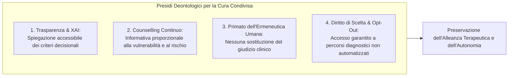

# Decisione Clinica Condivisa nell'Era dell'Intelligenza Artificiale (Shared Decision-Making in Clinical AI)

## Definizione Operativa
- Il modello di **Decisione Clinica Condivisa mediata dall'IA (*AI-augmented Shared Decision-Making, SDM*)** ridefinisce il processo deliberativo sanitario in cui scelte diagnostiche, prognostiche e terapeutiche vengono concordate tra medico e paziente con l'intermediazione di sistemi algoritmici di supporto decisionale (CDSS, modelli predittivi, LLM generativi) (Lorenzini et al., 2023; Montanari Vergallo et al., 2025).
- **Trasformazione Epistemologica e Relazionale:** L'ingresso dell'IA trasforma la classica diade clinica (*Medico-Paziente*) in una **configurazione triadica (*Medico-Paziente-IA*)**. Tale paradigma espande le opzioni informative ma introduce rischi critici: l'esclusione di entrambi gli attori umani dal processo deliberativo a favore di soluzioni preconfezionate dalla macchina, l'erosione dell'autonomia decisionale e l'insorgenza di un [[algorithmic-paternalism-in-ai-mental-health|paternalismo tecnologico]] basato sull'assunto che il computer "sappia meglio" (*computer knows best*; McDougall, 2019).

```mermaid
flowchart TD
    subgraph TraditionalSDM ["Modello Diadico Tradizionale (SDM Classico)"]
        D1["Medico:<br/>- Competenza Clinica<br/>- Empatia & Ascolto<br/>- Proposta Terapeutica"]
        P1["Paziente:<br/>- Valori & Preferenze<br/>- Storia Esistenziale<br/>- Autodeterminazione"]
        D1 <-->|Deliberazione Dialogica Ermeneutica| P1
    end

    subgraph TriadicSDM ["Modello Triadico con IA (Montanari Vergallo et al., 2025)"]
        AI["Sistema di IA / CDSS / LLM:<br/>- Correlazioni su Big Data<br/>- Probabilità Statistica<br/>- Soluzioni Standardizzate"]
        D2["Medico Curante:<br/>- Filtro Critico (Human-in-the-Loop)<br/>- Valutazione della Plausibilità<br/>- Spiegazione Trasparente (XAI)"]
        P2["Paziente Informato:<br/>- Comprensione di Benefici/Rischi IA<br/>- Scelta Libera & Consapevole<br/>- Diritto di Rifiuto (Opt-Out)"]
        
        AI -.->|Output / Raccomandazione| D2
        AI -.->|Accesso Diretto (es. Chatbot Triage)| P2
        D2 <-->|Alleanza Terapeutica & Deliberazione| P2
    end

    subgraph FailureModes ["Rischi di Fallimento Relazionale"]
        F1["Erosione SDM: Esclusione del Dialogo<br/>(Subordinazione passiva all'algoritmo)"]
        F2["Paternalismo Tecnologico ('Computer Knows Best')"]
        F3["Atrofia Diagnostica & De-skilling del Medico"]
    end

    TriadicSDM --> FailureModes
```

---

## Dimensioni Concettuali e Dinamiche Cliniche

### 1. La Transizione dalla Diade alla Triade Clinica
Nel modello di cura centrato sulla persona (*patient-centred medicine*), la decisione terapeutica non è un'inferenza puramente matematica ma un incontro ermeneutico: il clinico apporta la propria perizia scientifica ed empatica, mentre il paziente esprime la propria gerarchia di valori, aspettative e limiti esistenziali (Shortliffe & Sepúlveda, 2018; Lorenzini et al., 2023).
- **L'Inserimento dell'Attore Computazionale:** L'IA entra nel setting clinico sia come strumento professionale di supporto (*Clinical Decision Support Systems* - CDSS, refertazione assistita), sia come risorsa direttamente consultata dal paziente (piattaforme consumer come *Glass AI*, chatbot generativi basati su GPT-4 o Google Bard/Gemini; Hryciw et al., 2023).
- **Rischio di Alienazione e Standardizzazione:** Quando l'algoritmo formula una proposta "ottimale" fondata su evidenze statistiche astratte, riduce il margine di personalizzazione sartoriale. La decisione medica rischia di smarrire il suo valore dialogico, trasformando il medico in un mero trasmettitore di calcoli e il paziente in un'entità statistica anonima (Montanari Vergallo et al., 2025).

---

### 2. Paternalismo Tecnologico e "Computer Knows Best"
Uno dei rischi etici più insidiosi evidenziati dalla letteratura è la riproposizione del paternalismo in una veste tecnocratica:
- **Dal Paternalismo Medico al Paternalismo Algoritmico:** Se la bioetica contemporanea ha superato il paternalismo autoritario del medico in favore dell'autonomia del paziente, l'impiego acritico dell'IA rischia di reintrodurre una forma di paternalismo opaco, dove l'autorità non risiede più nell'esperienza umana ma nelle direttive inappellabili del software (*algorithmic paternalism*; McDougall, 2019; Woopen, 2019).
- **Asimmetria Informativa e Falsa Obiettività:** Poiché i modelli deep learning operano come "black box" non lineari, la mancanza di esplicabilità (*explainability*) priva il paziente e il clinico degli strumenti logici necessari per verificare se la raccomandazione rifletta pregiudizi nei dati, logiche di contenimento costi aziendali o criteri clinici autentici (Hildt, 2025; WHO, 2021).

---

### 3. Il Paradosso del Tempo e il Sovraccarico Comunicativo
I sostenitori dell'IA in medicina evidenziano frequentemente la promessa della tecnologia di liberare il medico dalle incombenze burocratiche di compilazione delle cartelle cliniche elettroniche (EHR), restituendo tempo per l'ascolto e l'interazione umana (*time to care*; Topol, 2019; Kingsford & Ambrose, 2024). Tuttavia, la realtà clinica ed etica evidenzia un evidente paradosso:
1. **Dovere di Verifica Primaria:** Per validare una diagnosi assistita dall'IA, il medico non può fidarsi ciecamente del risultato; deve esaminare autonomamente i dati grezzi e le immagini per escludere allucinazioni e bias (WHO, 2021).
2. **Onere Informativo Aggiuntivo:** Il medico ha l'obbligo deontologico e legale di comunicare l'uso dell'IA, spiegarne il funzionamento logico, i tassi di accuratezza, i margini di errore e le politiche di trattamento dei dati (Mello et al., 2025; AI Act 2024/1689).
3. **Bilancio Netto del Tempo:** L'attività esplicativa e di counselling personalizzato richiede un investimento cognitivo e temporale superiore a quello tradizionalmente dedicato al consenso standard, richiedendo una reale riorganizzazione dei tempi di visita (Cartolovni et al., 2023; Montanari Vergallo et al., 2025).

---

## Confronto: Paradigma Tradizionale vs Triadico Mediato da IA

| Dimensione Operativa | Shared Decision-Making Tradizionale | Shared Decision-Making Mediato da IA |
| :--- | :--- | :--- |
| **Configurazione Relazionale** | Diade interpersonale: Medico $\leftrightarrow$ Paziente. | Triade complessa: Medico $\leftrightarrow$ Paziente $\leftrightarrow$ Sistema IA. |
| **Fonte delle Opzioni Cliniche** | Linee guida evidence-based intermediate dall'esperienza clinica del medico. | Algoritmi predittivi, ranking probabilistici su Big Data, generative summary. |
| **Ruolo dell'Empatia** | Centrale nella modulazione della comunicazione e nella rilevazione del non verbale. | Esclusiva dell'essere umano; l'IA emula la sintassi empatica senza risonanza affettiva autentica. |
| **Formulazione del Consenso** | Discussione su diagnosi, prognosi, rischi/benefici dell'intervento medico. | Consenso multilivello esteso a funzionamento del tool, trasparenza algoritmica, flussi cloud e privacy. |
| **Rischio Predominante** | Paternalismo medico classico o asimmetria informativa specialistica. | [[algorithmic-paternalism-in-ai-mental-health\|Paternalismo algoritmico]], automation bias, de-skilling del clinico e spersonalizzazione. |
| **Responsabilità Giuridica e Morale** | Unicamente in capo al professionista sanitario e alla struttura. | Conservata in capo al medico umano (*human-in-the-loop*), che risponde dell'omessa supervisione o del mancato disclosure. |

---

## Requisiti Deontologici per la Preservazione dell'SDM



1. **L'IA come 'Second Opinion' Ausiliaria:** I sistemi di supporto decisionale devono rimanere rigorosamente consultivi, operando come secondo lettore o generatore di alternative che il medico discute criticamente con il paziente (Hildt, 2025).
2. **Counselling Clinico Multilivello:** La comunicazione non deve ridursi alla consegna di un'informativa scritta, ma integrarsi in un dialogo continuo che esplora le paure, i dubbi e le aspettative del paziente rispetto alla tecnologia (Zaami et al., 2022; Mello et al., 2025).
3. **Teleologia del Bene Personale (Etica Tomista e Jonasiana):** La tecnica medica trova la propria legittimazione morale solo quando è ordinata come mezzo al bene integrale della persona umana, respingendo qualsiasi automatismo dettato da mere convenienze economiche o aziendali (Aquinas, 1981; Jonas, 1984; Montanari Vergallo et al., 2025).

---

## Riferimenti Bibliografici
- Montanari Vergallo, G., Campanozzi, L. L., Gulino, M., Bassis, L., Ricci, P., Zaami, S., Marinelli, S., Tambone, V., & Frati, P. (2025). How Could Artificial Intelligence Change the Doctor–Patient Relationship? A Medical Ethics Perspective. *Healthcare*, 13(18), 2340. https://doi.org/10.3390/healthcare13182340
- Lorenzini, G., Arbelaez Ossa, L., Shaw, D. M., & Elger, B. S. (2023). Artificial intelligence and the doctor–patient relationship expanding the paradigm of shared decision making. *Bioethics*, 37(5), 424–429. https://doi.org/10.1111/bioe.13158
- Bhasin, R., El-Sayed, W., Salami, K., et al. (2025). Clinical Decision-Making and Artificial Intelligence: The Role of Large Language Models in Medicine. *Clinical Research in Practice*, 11(1), eP3601. https://doi.org/10.22237/crp/1743681960
- Cartolovni, A., Malešević, A., & Poslon, L. (2023). Critical analysis of the AI impact on the patient-physician relationship: A multi-stakeholder qualitative study. *Digital Health*, 9, 20552076231220833. https://doi.org/10.1177/20552076231220833
- Hildt, E. (2025). What Is the Role of Explainability in Medical Artificial Intelligence? A Case-Based Approach. *Bioengineering*, 12(4), 375. https://doi.org/10.3390/bioengineering12040375
- Jonas, H. (1984). *The Imperative of Responsibility: In Search of An Ethics for the Technological Age*. University of Chicago Press.
- Kingsford, P. A., & Ambrose, J. A. (2024). Artificial intelligence and the doctor-patient relationship. *American Journal of Medicine*, 137(5), 381–382. https://doi.org/10.1016/j.amjmed.2024.01.006
- McDougall, R. J. (2019). Computer knows best? The need for value-flexibility in medical AI. *Journal of Medical Ethics*, 45(3), 156–160. https://doi.org/10.1136/medethics-2018-105118
- Mello, M. M., Char, D., & Xu, S. H. (2025). Ethical Obligations to Inform Patients About Use of AI Tools. *JAMA*, 334(8), 767–770. https://doi.org/10.1001/jama.2025.10985
- Shortliffe, E. H., & Sepúlveda, M. J. (2018). Clinical decision support in the era of artificial intelligence. *JAMA*, 320(21), 2199–2200. https://doi.org/10.1001/jama.2018.17163
- Topol, E. J. (2019). *Deep Medicine: How Artificial Intelligence Can Make Healthcare Human Again*. Basic Books.
- World Health Organization [WHO]. (2021). *Ethics and Governance of Artificial Intelligence for Health*. Geneva: WHO.

---

## Relazioni
- Vedi anche: [[healthcare-13-02340]], [[comparative-ai-health-governance]], [[clinical-decision-making-and-artificial-intelligence]], [[algorithmic-paternalism-in-ai-mental-health]], [[informed-consent-for-clinical-ai]], [[human-oversight-and-liability-in-clinical-ai]], [[modello-centauro-clinico]], [[single-correct-answer-fallacy-in-clinical-ai]], [[information-without-explanation-in-clinical-ai]], [[simulated-empathy-vs-authentic-presence]]
