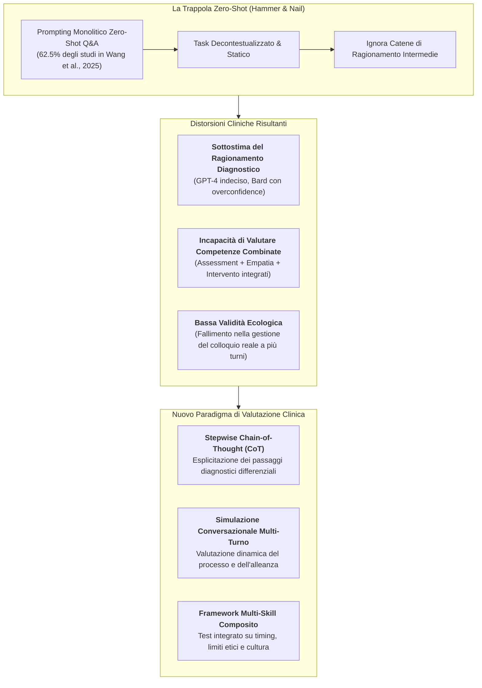
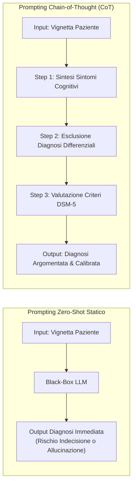

# Trappola della Valutazione Zero-Shot a Singolo Compito nell'IA Clinica

## Definizione Operativa
- La **Trappola della Valutazione Zero-Shot a Singolo Compito (*Single-Task Zero-Shot Evaluation Trap*)**, nota anche come la "Legge dello Strumento" (*Hammer and Nail Problem*) nella ricerca su LLM e salute mentale, indica la distorsione metodologica per cui le capacità psicoterapeutiche e diagnostiche dei modelli linguistici vengono misurate quasi esclusivamente tramite prompt **zero-shot statici a singolo turno domanda-risposta (Q&A)** su scenari isolati (Wang et al., 2025; Kojima et al., 2022).
- **Utilità Clinica e Psicoterapia:** Questo approccio genera una duplice distorsione: da un lato **sottostima il potenziale di ragionamento complesso** dei modelli (sbloccabile tramite tecniche di prompting avanzato come *Few-Shot* e *Chain-of-Thought*); dall'altro **sovrastima la tenuta clinico-relazionale** della GenAI, poiché la pratica terapeutica reale non consiste mai in risposte nozionistiche isolate, ma in un processo combinatorio, contingente e iterativo di abilità cliniche integrate (assessment, alleanza, tolleranza dell'ambiguità, psicoeducazione, interventi CBT).

---

## Evidenze dalla Letteratura e Critica Metodologica

### 1. La Dominanza del Zero-Shot nella Ricerca Empirica
Nella revisione sistematica di Wang et al. (2025) pubblicata su *JMIR Mental Health*, la maggioranza schiacciante degli studi empirici inclusi (**62.5%, 5 su 8**) ha fatto ricorso unicamente al prompting zero-shot:
- **Razdan et al. (2024):** Valutazione di risposte isolate a domande predefinite sulla salute sessuale;
- **Maurya et al. (2025):** Prompting domanda-risposta su 7 categorie di psicoeducazione clinica;
- **Elyoseph et al. (2023) & Hadar-Shoval et al. (2023):** Somministrazione di scenari scritti LEAS a singolo passaggio per la consapevolezza emotiva;
- **Elyoseph & Levkovich (2024):** Giudizio prognostico su singole vignette testuali sulla schizofrenia.

Questo fenomeno riflette il bias euristico *"se l'unico strumento disponibile è un martello, ogni problema clinico viene trattato come un chiodo"*, confinando l'IA a un'interrogazione nozionistica di tipo accademico (Wang et al., 2025; Wei et al., 2022).

---

### 2. Sblocco delle Capacità di Ragionamento con Chain-of-Thought (CoT)
L'evidenza empirica dimostra che il limite diagnostico dell'IA non risiede necessariamente nell'architettura del modello, ma nella modalità di sollecitazione (*prompting*):
- **Diagnosi Differenziale AD vs CN (Balamurali & Chen, 2024):**
  - Con prompting zero-shot convenzionale, **GPT-4** manifestava un pattern evitante/indeciso (identificazione CN pari al 56%), mentre **Google Bard** cadeva nell'eccesso di fiducia (*overconfidence*), diagnosticando Alzheimer anche su controlli sani con un alto tasso di falsi positivi.
  - L'introduzione di un prompting strutturato basato su **Chain-of-Thought (CoT)** — che guida il modello a esplicitare step-by-step la disamina dei sintomi cognitivi, temporali e funzionali prima del verdetto finale — ha **incrementato significativamente l'accuratezza e la coerenza logica di GPT-3.5 e GPT-4**, riducendo l'instabilità decisionale.

---

### 3. La Fallacia della Valutazione a Singola Abilità (*Single-Skill Fallacy*)
Nella pratica clinica e psicoterapeutica, le competenze professionali non operano mai in isolamento (Falender & Shafranske, 2004; Prochaska & DiClemente, 1982):
- **Combinazione Sequenziale e Flessibile:** Il terapeuta umano non si limita a erogare psicoeducazione; valuta in tempo reale lo stato affettivo del paziente, calibra il livello di calore e validazione emotiva durante l'assessment, tollera i silenzi, verifica la comprensione e somministra tecniche di ristrutturazione cognitiva solo quando l'alleanza di lavoro è salda.
- **Limiti dei Benchmark Attuali:** Valutare la psicoeducazione separatamente dall'assessment anamnestico porta a ignorare i problemi riscontrati dai pazienti reali, che lamentano risposte "tecnicamente corrette ma erogate troppo in fretta, senza previo ascolto clinico" (Alanezi, 2024; Wang et al., 2025).

---

## Confronto Metodologico tra Paradigmi di Valutazione

| Dimensione | Valutazione Zero-Shot Tradizionale | Valutazione Composita Multi-Step (Proposta) |
| :--- | :--- | :--- |
| **Struttura del Prompt** | Singolo turno Q&A (Zero-shot statico) | Multi-turno dinamico con istruzioni Few-Shot e CoT strutturato |
| **Contesto Fornito** | Vignetta generica e decontestualizzata | Anamnesi ricca, profilo culturale, stato emotivo, vincoli di setting |
| **Abilità Esaminate** | Singola competenza isolata (es. solo psychoeducation) | Competenze combinate (assessment + empatia + intervento CBT + timing) |
| **Profondità Diagnostica** | Classificazione superficiale o binaria | Ragionamento differenziale esplicitato a passaggi intermedi (*Stepwise Reasoning*) |
| **Validità Ecologica** | Molto bassa (artefatto di laboratorio) | Elevata (simulazione realistica di sedute cliniche prolungate) |
| **Valutatori Coinvolti** | Spesso solo esperti clinici accademici | Panel congiunto: clinici esperti, pazienti reali e metriche di processo |

---

## Linee Guida per il Futuro Benchmarking dell'IA in Psicoterapia

1. **Adozione Sistematica di Stepwise Chain-of-Thought e Meta-Prompting:** I benchmark clinici per LLM devono richiedere l'esplicitazione formale delle tappe di ragionamento clinico (esplorazione ipotesi, pesatura dei criteri DSM-5, esclusione condizioni mediche e calcolo del livello di confidenza) (Wei et al., 2022; Zhang et al., 2023).
2. **Protocolli di Simulazione Interattiva a Turni Multipli:** Valutare gli agenti conversazionali su scenari dinamici in cui pazienti virtuali (o attori) introducono resistenze, incongruenze verbali, cambiamenti d'umore improvvisi e deviazioni tematiche.
3. **Misurazione della Tempestività Clinica (*Clinical Pacing*):** Verificare la capacità del modello di astenersi dall'erogare consigli prescrittivi prematuri, premiando i comportamenti algoritmici che privilegiano l'ascolto socratico e l'approfondimento anamnestico nelle prime fasi dell'interazione.
4. **Stress-Test Transculturali:** Introdurre compiti che richiedano la decodifica di manifestazioni somatiche del disagio e idiomi culturali non occidentali secondo il modello di Sue (2006).

---

**Riferimenti Bibliografici:**
- Wang, L., Bhanushali, T., Huang, Z., Yang, J., Badami, S., & Hightow-Weidman, L. (2025). Evaluating Generative AI in Mental Health: Systematic Review of Capabilities and Limitations. *JMIR Mental Health*, 12, e70014. https://doi.org/10.2196/70014
- Alanezi, F. (2024). Assessing the effectiveness of ChatGPT in delivering mental health support: a qualitative study. *Journal of Multidisciplinary Healthcare*, 17, 461–471. https://doi.org/10.2147/JMDH.S447368
- Balamurali, B. T., & Chen, J. M. (2024). Performance assessment of ChatGPT versus Bard in detecting Alzheimer’s dementia. *Diagnostics*, 14(8), 817. https://doi.org/10.3390/diagnostics14080817
- Elyoseph, Z., Hadar-Shoval, D., Asraf, K., & Lvovsky, M. (2023). ChatGPT outperforms humans in emotional awareness evaluations. *Frontiers in Psychology*, 14, 1199058. https://doi.org/10.3389/fpsyg.2023.1199058
- Elyoseph, Z., & Levkovich, I. (2024). Comparing the perspectives of generative AI, mental health experts, and the general public on schizophrenia recovery: case vignette study. *JMIR Mental Health*, 11, e53043. https://doi.org/10.2196/53043
- Falender, C., & Shafranske, E. P. (2004). *Clinical Supervision: A Competency-Based Approach*. American Psychological Association.
- Hadar-Shoval, D., Elyoseph, Z., & Lvovsky, M. (2023). The plasticity of ChatGPT’s mentalizing abilities: personalization for personality structures. *Frontiers in Psychiatry*, 14, 1234397. https://doi.org/10.3389/fpsyt.2023.1234397
- Kojima, T., Gu, S. S., Reid, M., Matsuo, Y., & Iwasawa, Y. (2022). Large language models are zero-shot reasoners. *arXiv preprint arXiv:2205.11916*.
- Maurya, R. K., Montesinos, S., Bogomaz, M., & DeDiego, A. C. (2025). Assessing the use of ChatGPT as a psychoeducational tool for mental health practice. *Counselling and Psychotherapy Research*, 25(1). https://doi.org/10.1002/capr.12759
- Prochaska, J. O., & DiClemente, C. C. (1982). Transtheoretical therapy: toward a more integrative model of change. *Psychotherapy: Theory, Research & Practice*, 19(3), 276–288.
- Razdan, S., Siegal, A. R., Brewer, Y., Sljivich, M., & Valenzuela, R. J. (2024). Assessing ChatGPT’s ability to answer questions pertaining to erectile dysfunction: can our patients trust it? *International Journal of Impotence Research*, 36(7), 734–740. https://doi.org/10.1038/s41443-023-00797-z
- Sue, S. (2006). Cultural competency: from philosophy to research and practice. *Journal of Community Psychology*, 34(2), 237–245. https://doi.org/10.1002/jcop.20095
- Wei, J., Wang, X., Schuurmans, D., et al. (2022). Chain-of-thought prompting elicits reasoning in large language models. *arXiv preprint arXiv:2201.11903*.
- Zhang, Y., Yuan, Y., & Yao, A. C. C. (2023). Meta prompting for AI systems. *arXiv preprint arXiv:2311.11482*.

---

## Relazioni
- Vedi anche: [[mental-v12-e70014]], [[clinician-user-evaluation-discrepancy]], [[stepwise-cot]], [[five-axis-clinical-evaluation]], [[traffic-light-quality-appraisal-clinical-ai]], [[clinical-fidelity-assessment]], [[modello-centauro-clinico]], [[simulated-empathy-vs-authentic-presence]], [[ai-enhanced-cbt]], [[cultural-adaptation-in-mental-health-llms]]
