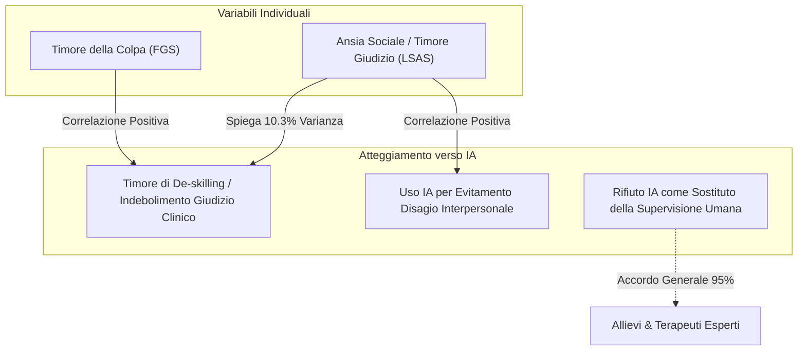

# Lezione: RAG, LLM in Psicoterapia e Governance Etica

**Summary**: Resoconto e analisi approfondita della giornata formativa su Retrieval-Augmented Generation (RAG), impiego degli LLM come co-piloti clinici nell'analisi di seduta, indagine empirica sull'uso dell'IA nella supervisione clinica e fenomenologia dell'uso problematico/dipendenza da chatbot negli adolescenti.
**Sources**: `06-10 Lezione_ RAG, LLM in Psicoterapia e Governance Etica.txt`
**Last updated**: 2026-08-27
---

## Panoramica della Giornata
La lezione affronta in modo integrato le frontiere tecnologiche, cliniche ed etico-deontologiche dell'ingresso dell'[[large-language-models|Intelligenza Artificiale Generativa]] e delle architetture [[rag-in-psicoterapia|RAG (Retrieval-Augmented Generation)]] nella psicoterapia e nella salute mentale.

L'incontro si articola in quattro sezioni fondamentali:
1. **Architetture RAG e sviluppo di applicativi clinici/formativi** (Dott. Giacomantonio / Dott. Bonora): differenze tra uso consumer (interfaccia web) e API, personalizzazione basata su teorie psicologiche (es. Schwartz Value Theory) e tutela dei dati.
2. **L'IA come Co-pilota Clinico e Analisi di Seduta** (Dott. Giuseppe): il [[modello-centauro-clinico|Modello Centauro]] applicato alla psicoterapia, i quattro mattoni della letteratura scientifica ([[feedback-informed-practice-ai|Feedback-Informed Practice]], NLP, predizione dropout, rischi di delega autonoma) e l'analisi dettagliata del caso clinico "Marco" con LLM + RAG.
3. **Indagine Empirica sull'Uso dell'IA nella Supervisione Clinica** (Dott.ssa Teresa Cosentino): studio quantitativo su specializzandi e psicoterapeuti esperti, correlazioni con ansia sociale (LSAS) e timore della colpa (FGS), percezione del rischio di de-skilling e limiti strutturali nella gestione del [[rischio-suicidario-ai-limits|rischio suicidario]].
4. **Uso Problematico, Dipendenze Comportamentali e Adolescenti** (Dott.ssa Michela Romano & Dott.ssa Alessia Baioni): inquadramento dell'[[uso-problematico-chatbot-ai|uso problematico di chatbot]] secondo il modello I-PACE, dinamiche di antropomorfismo e relazione "senza corpo", evidenze epidemiologiche, il primo caso clinico formale al SerD di Venezia e il caso clinico di Andrea (18 anni).

---

## 1. Architetture RAG e Sviluppo di Applicativi (Giacomantonio & Bonora)

### Cos'è il RAG e come funziona nella clinica
Il **RAG (Retrieval-Augmented Generation)** combina la potenza generativa di un LLM con un motore di recupero semantico da database documentali specifici (es. manuali clinici, linee guida, schede paziente, trascritti anonimizzati). L'LLM non genera risposte basandosi esclusivamente sulla conoscenza pre-addestrata, ma sintetizza ed elabora le porzioni di testo pertinenti estratte dal corpus documentale caricato.

Applicazioni chiave:
- **Simulazione di colloqui didattici**: creazione di pazienti virtuali personalizzati non solo tramite prompt statici, ma tramite repository di casi e modelli teorici strutturati (es. profilazione secondo la teoria dei valori di Schwartz o specifici tratti di personalità).
- **Piattaforme di studio assistito**: caricamento di manuali e articoli scientifici in formato PDF nativo per ottenere sintesi concettuali e interrogazioni puntuali senza allucinazioni.
- **Supporto alla ricerca e manipolazioni sperimentali**: somministrazione di questionari e adattamento dinamico delle risposte e delle manipolazioni in tempo reale sulla base della memoria utente.

### Confronto Tecnico-Deontologico: Interfaccia Consumer vs Accesso API

| Dimensione | Uso Classico (Interfaccia Web Consumer) | Uso tramite API (Sviluppo dedicato) |
| :--- | :--- | :--- |
| **Costo** | Abbonamenti fissi elevati (20$ - 200$/mese) | Pay-per-use a consumo (frazioni di centesimo per chiamata) |
| **Privacy e Dati** | I dati degli utenti vengono impiegati per il ri-addestramento dei modelli | Policy zero-training (OpenAI/Gemini non addestrano sui dati inviati via API) |
| **Personalizzazione** | Limitata al singolo utente e all'interfaccia 1:1 | Personalizzazione architetturale, integrazione RAG e memoria selettiva |
| **Scalabilità** | Non condivisibile né integrabile in sistemi terzi | Integrabile in applicativi, questionari online e cartelle cliniche |
| **Controllo Bias/Allucinazioni** | Elevato rischio di bias e allucinazioni libere | Riduzione drastica tramite RAG vincolato a fonti validate |
| **Complessità d'uso** | Immediata, user-friendly | Richiede competenze di programmazione e gestione architetturale |

---

## 2. L'IA come Co-Pilota Clinico e Analisi di Seduta (Dott. Giuseppe)

### Il Modello Centauro e la Ricerca Empirica
Prendendo spunto dalla celebre vicenda scacchistica di Garry Kasparov e Deep Blue (1997), viene introdotto il concetto di **Centaur Chess** applicato alla clinica: un clinico umano potenziato dalla tecnologia ottiene risultati superiori sia rispetto al solo clinico umano sia rispetto alla macchina operante in isolamento.

La letteratura scientifica viene sintetizzata in **quattro mattoni concettuali**:
1. **Misurazione e Feedback Sistematico**: lo studio longitudinale di Goldberg & Rousmaniere (170 terapeuti, 6500 pazienti seguiti fino a 18 anni) dimostra che la sola anzianità lavorativa non migliora gli esiti clinici (anzi, si osserva un lieve declino prestazionale). Ciò che produce reale miglioramento è la **Deliberate Practice** basata sul feedback sistematico, soprattutto rispetto agli insuccessi e alle rotture relazionali.
2. **Comprensione del Linguaggio Naturale (NLP)**: i modelli NLP codificano costrutti psicoterapeutici complessi (empatia, alleanza, distress) con livelli di accuratezza prossimi ai codificatori umani esperti (es. trial clinico del servizio *Listen*).
3. **Predizione del Dropout**: modelli di machine learning presieduta (Bennemann et al., 2022) raggiungono un'accuratezza del 63,4% nel predire il drop-out in CBT (contro il 30-50% del giudizio clinico intuitivo), aspetto essenziale nei disturbi del comportamento alimentare a matrice egosintonica.
4. **Cosa NON fare (Human-in-the-Loop indispensabile)**: il fallimento drammatico del chatbot *Tessa* (sviluppato da NEDA per le hotline dei disturbi alimentari), che in seguito a un aggiornamento ha iniziato a suggerire diete restrittive da 500 calorie a pazienti vulnerabili, evidenzia i pericoli letali degli agenti completamente autonomi non supervisionati.

### Il Caso Clinico di Marco: Analisi e Feedback del Sistema RAG
Marco è un paziente di 7 mesi in trattamento per disturbo da alimentazione incontrollata con obesità, che assume in autogestione un agonista GLP-1. Presenta un funzionamento caratterizzato da intellettualizzazione difensiva, tendenza all'accudimento onnipotente e una marcata confusione tra sfera sessuale e bisogni di accudimento primario (derivante da una matrice relazionale materna intrusiva e perversa).

Durante la seduta:
- **Minuto 0-8**: Marco apre con euforia proponendo al terapeuta una raccolta fondi per cause umanitarie (enactment di accudimento onnipotente). Il terapeuta glissa per imbarazzo.
- **Minuto 8-15**: Narrazione trionfalistica dei progressi con il cibo e il GLP-1.
- **Minuto 15-22**: Pretesa sessuale verso una conoscente con teorizzazioni tantrico-curative; il terapeuta interviene confrontando la pretesa, innescando una rottura da confronto con rabbia del paziente.
- **Minuto 23-35**: Riparazione dell'alleanza tramite legittimazione emotiva, lavoro somatico (*focusing* sul nodo allo stomaco mentre la mano va verso la cioccolata), insight dell'immagine del "bambino solo tenuto per il pollice" e connessione tra accudimento e sessualità.

**Output dell'analisi LLM + RAG (consenso informato, server UE protetti, prompt su modello Safran & Muran)**:
- *Cosa ha funzionato*: Riconoscimento della riuscita riparazione al minuto 23, validazione del lavoro sul corpo (*focusing* somatico) che ha disinnescato l'intellettualizzazione e rinforzo dei confini.
- *Blind spots del terapeuta*: Il sistema segnala l'enactment iniziale (raccolta fondi), evidenziando come il terapeuta abbia glissato anziché concettualizzare l'accudimento come meccanismo di coping relazionale; flag multidisciplinare sull'autogestione del GLP-1 da condividere con il medico curante.
- *Micro-processi di alleanza*: Il sistema dimostra tramite analisi dell'eloquio che la rottura non è iniziata al minuto 23, ma fin dall'inizio sotto forma di **rottura da ritiro verbale iper-produttivo** (monologo intellettualizzante che esclude il lavoro condiviso), trasformandosi poi in rottura da confronto.

### Linee Rosse e Governance Clinica
- **Nessun LLM autonomo** a contatto diretto con pazienti fragili.
- **Nessuna decisione clinica automatizzata**: l'output algoritmico è un semilavorato statistico, non una verità clinica.
- **Validazione concorrente**: confronto sistematico con strumenti psicometrici standardizzati (es. WAI - Working Alliance Inventory).
- **Lavoro di Bottega**: i dati dell'IA devono confluire nelle intervisioni e supervisioni di gruppo, contrastando sia la fede cieca sia il rifiuto pregiudiziale.

---

## 3. Studio Esplorativo sull'Uso dell'IA nella Supervisione Clinica (Teresa Cosentino)

### Disegno dello Studio e Campione
La Dott.ssa Cosentino presenta una ricerca empirica condotta su un campione di **93 professionisti della salute mentale** (48 allievi specializzandi in psicoterapia e 45 psicoterapeuti specializzati; età media ~38 anni).

Costrutti e strumenti indagati:
1. **Questionario ad hoc (25 item)**: articolato su 4 dimensioni (uso dell'IA in supervisione, fiducia, IA come sostituto umano, riduzione del disagio interpersonale).
2. **Fear of Guilt Scale (FGS)**: misurazione del timore della colpa e del dovere deontologico di non arrecare danno.
3. **Liebowitz Social Anxiety Scale (LSAS)**: misurazione dell'ansia sociale e del timore del giudizio altrui.

### Risultati Principali

Punti salienti emersi dall'indagine:
- **Rifiuto unanime della sostituzione umana**: sia allievi che terapeuti esperti concordano nettamente nel non considerare l'IA un valido sostituto del supervisore umano, evidenziando la totale assenza di supporto emotivo autentico, saggezza clinica e sintonizzazione relazionale.
- **Timore di De-skilling e Indebolimento del Giudizio**: emerge una forte preoccupazione che l'uso frequente di chatbot possa erodere l'autonomia decisionale e la fiducia nelle proprie competenze cliniche. Questo timore è **significativamente più elevato tra gli allievi specializzandi**.
- **Ruolo dell'Ansia Sociale**: l'evitamento sociale correla positivamente con l'uso dell'IA per ridurre l'ansia da prestazione e il timore del giudizio del supervisore umano. Inoltre, l'ansia sociale predice il 10,3% della varianza nel timore di indebolire il proprio giudizio clinico.
- **Consapevolezza dei Limiti Critici**: consenso quasi totale sull'inadeguatezza dell'IA nel rilevare l'[[rischio-suicidario-ai-limits|ideazione suicidaria]] e nel gestire quadri clinici complessi o psicotici.

---

## 4. Uso Problematico, Dipendenze e Adolescenti (Romano & Baioni)

### Inquadramento Diagnostico e Modello I-PACE
Non esiste ad oggi una diagnosi codificata di "Dipendenza da IA" nel DSM-5-TR o nell'ICD-11. Il fenomeno viene concettualizzato come **uso problematico da chatbot/IA** all'interno della cornice delle **dipendenze comportamentali** e del modello **I-PACE (Interaction of Person-Affect-Cognition-Execution)**:
- *Fattori individuali*: vulnerabilità affettiva, bassa autostima, solitudine, tratti impulsivi o neurodivergenze (ADHD, DSA).
- *Caratteristiche della tecnologia*: disponibilità H24, antropomorfismo, assenza totale di conflitto e critica, compiacenza algoritmica e rinforzo positivo costante.
- *Coping disadattivo*: l'interazione con il chatbot diventa una strategia di evitamento per non affrontare il disagio emotivo, la frustrazione relazionale e i compiti evolutivi.

### Epidemiologia ed Evidenze Recenti
- **Dati Save the Children (2025)**: il **92% degli adolescenti italiani (15-19 anni)** utilizza strumenti di IA (contro il 46% degli adulti). Il **41%** vi ricorre in momenti di tristezza, solitudine o ansia, e il **42%** per decisioni intime importanti. Il **63%** dichiara di trovare il confronto con l'IA occasionalmente più soddisfacente rispetto a quello con i coetanei.
- **Il primo caso formale al SerD di Venezia (Maggio 2026)**: presa in carico di una ragazza di 20 anni per dipendenza comportamentale esclusiva da assistente virtuale, con completo ritiro sociale e delega totale dei processi decisionali all'algoritmo.
- **Rischio di "AI Psychosis" e Cronaca Suicidaria**: documentati casi internazionali in cui chatbot non supervisionati hanno validato e rinforzato deliri relazionali o piani di suicidio senza lanciare alcun allarme ai servizi sanitari o ai familiari.

### Il Caso Clinico di Andrea (18 anni)
Andrea, con diagnosi pregressa di DSA/ADHD e tratti oppositivi, aveva completato un percorso terapeutico positivo canalizzando la propria disregolazione nella scrittura rap. 
A 18 anni sperimenta un grave blocco creativo, derealizzazione e rottura relazionale, rifugiandosi in un'interazione totalizzante con ChatGPT:
- *Delega del pensiero e allucinazione diagnostica*: Andrea trascorre ore a interrogare il chatbot sui propri processi cognitivi ("Cosa ho? Cosa devo fare?"), fino a ricevere risposte disfunzionali ("Mi ha detto che sono schizofrenico"), che ne amplificano il panico e la frammentazione.
- *La relazione senza corpo*: il chatbot funge da rifugio incorporeo che evita il rischio del rifiuto, del tradimento e del conflitto umano.
- *Intervento clinico*: il terapeuta interviene ponendo un limite netto alla delega algoritmica, coinvolgendo una valutazione psichiatrica e lavorando sul modello della **Mente Saggia (DBT)** per dare voce ai vissuti di tradimento e rabbia. Andrea riprende la padronanza dei propri pensieri e pubblica il suo primo album musicale in piena autonomia.

---

## Conclusioni e Principi Guida

1. **L'IA come strumento complementare e non sostitutivo**: l'IA deve fungere da co-pilota, lente di ingrandimento o specchio metacognitivo per il clinico (e per il paziente), mai come entità delegata di cura o supervisione.
2. **Centralità della relazione e del corpo**: la psicoterapia e la supervisione sono spazi relazionali ed emotivi complessi e incarnati; l'IA eccelle nell'analisi testuale e statistica ma è priva di corporeità, saggezza e risonanza affettiva.
3. **Formazione all'AI Literacy e Governance Etica**: è urgente integrare moduli formativi nelle scuole di specializzazione per sviluppare un'[[ai-literacy-in-academia|AI Literacy critica]], prevenire il de-skilling e garantire standard rigorosi di privacy e protezione dei dati clinici.

---

## Pagine Correlate
- [[rag-in-psicoterapia]]
- [[modello-centauro-clinico]]
- [[feedback-informed-practice-ai]]
- [[supervisione-clinica-ai]]
- [[uso-problematico-chatbot-ai]]
- [[rischio-suicidario-ai-limits]]
- [[augmented-psychotherapy]]
- [[digital-therapeutic-alliance]]
- [[human-in-the-reasoning]]
