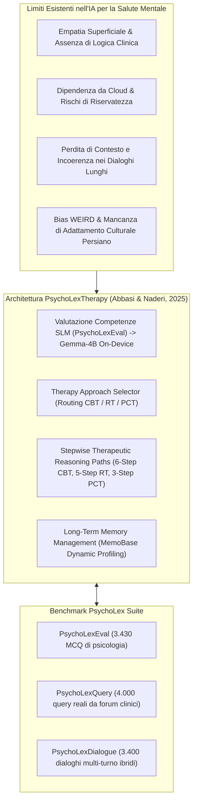
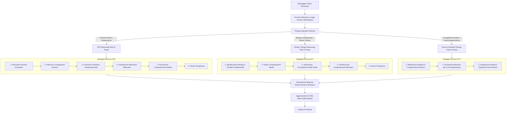

# PsychoLexTherapy: Simulating Reasoning in Psychotherapy with Small Language Models in Persian

**Summary**: Questo studio presenta **PsychoLexTherapy**, il primo framework clinico computazionale per la lingua persiana progettato per simulare il ragionamento psicoterapeutico tramite Small Language Models (SLM, <10B parametri) su dispositivi locali (*on-device*). Il sistema integra un selettore dinamico dell'approccio terapeutico, percorsi di ragionamento strutturati *stepwise* per tre paradigmi clinici principali (Terapia Cognitivo-Comportamentale - CBT, Reality Therapy - RT, Terapia Centrata sul Cliente - PCT) e un modulo di memoria a lungo termine gerarchica basato su MemoBase. Per validare il framework, gli autori hanno introdotto tre dataset di riferimento: **PsychoLexEval** (3.430 domande a scelta multipla per saggiare le competenze psicologiche degli SLM), **PsychoLexQuery** (~4.000 quesiti reali estratti da forum clinici persiani) e **PsychoLexDialogue** (3.400 sessioni psicoterapeutiche simulate multi-turno). I risultati evidenziano che l'integrazione di ragionamento terapeutico strutturato e memoria dinamica supera nettamente il prompting generico, le catene di empatia e i sistemi multi-agente in termini di coerenza, empatia clinica, appropriatezza culturale e personalizzazione.
**Sources**: `2510.03913v1.pdf` (arXiv:2510.03913v1 [cs.CL], Iran University of Science and Technology, Tehran)
**Last updated**: 2026-08-27
---

## Inquadramento e Rilevanza Clinico-Tecnologica

L'applicazione dei modelli linguistici nella salute mentale ha mostrato potenzialità promettenti per il supporto empatico e la psicoeducazione. Tuttavia, la letteratura evidenzia gravi limitazioni:
1. **Assenza di Ragionamento Clinico Esplicito**: I framework correnti si affidano a prompting generico o a una simulazione superficiale dell'empatia (*surface-level empathy*), mancando di strutture procedurali che ricalchino la reale presa decisionale terapeutica.
2. **Sotto-rappresentazione Linguistica e Culturale**: La quasi totalità dei benchmark e dei modelli è sviluppata in inglese. L'assenza di adattamento a specifici idiomi di disagio, dinamiche familiari e norme sociali (come nel contesto iraniano e nella lingua persiana) inficia l'accettabilità e l'efficacia terapeutica.
3. **Mancanza di Memoria a Lungo Termine Strutturata**: I modelli standard soffrono di amnesia inter-sessione o degradano rapidamente la coerenza quando la cronologia di dialogo viene concatenata in modo grezzo (*naive concatenation*).
4. **Criticità di Privacy nei Modelli Cloud-Based**: L'invio di dati psicologici altamente confidenziali a server esterni pone seri rischi etici e legali. L'impiego di Small Language Models (SLMs) distribuiti in locale (*on-device*) rappresenta una soluzione cruciale ma richiede la verifica delle loro competenze di dominio.

---

## I Tre Dataset di Riferimento (PsychoLex Suite)

Gli autori hanno costruito tre risorse fondamentali per colmare il divario nei dataset clinici in lingua persiana:

### 1. PsychoLexEval (Valutazione della Conoscenza di Dominio)
- **Scopo**: Verificare se gli SLM compatti possiedono una solida base di conoscenze teorico-cliniche prima dell'impiego.
- **Composizione**: **3.430 domande a scelta multipla** (4 opzioni, 1 corretta) derivate da esami di ammissione alle scuole di specializzazione in psicologia, concorsi professionali, testi autorevoli in persiano e generazioni controllate con GPT-4o.
- **Aree coperte**: Psicologia clinica, cognitiva, dello sviluppo e sociale.

### 2. PsychoLexQuery (Quesiti Clinici Reali Single-Turn)
- **Scopo**: Valutare l'accuratezza, l'empatia e l'allineamento culturale in contesti ecologici a singolo turno.
- **Fonte**: Circa **4.000 quesiti reali di utenti** estratti da tre piattaforme persiane di consulenza psicologica (*EhyaCenter*, *Moshaverfa*, *Simiaroom*).
- **Pre-processing etico**: Anonimizzazione manuale rigorosa (pseudonimizzazione di nomi, generalizzazione geografica, rimozione di metadati e titoli specifici).
- **Distribuzione tematica principale**:
  - Difficoltà relazionali e di coppia: **53,7%**
  - Problemi comportamentali in bambini e adolescenti: **9,6%**
  - Disturbi d'ansia: **7,7%**
  - Problemi di autostima: **6,7%**
  - Depressione: **5,8%**
  - Altre tematiche (stress lavorativo, lutto, abuso di sostanze, DCA, transizioni di vita): **16,5%**

### 3. PsychoLexDialogue (Sessioni Psicoterapeutiche Multi-Turno)
- **Scopo**: Valutare la continuità temporale, l'alleanza terapeutica e l'impatto della memoria a lungo termine su interazioni estese.
- **Composizione**: **3.400 dialoghi** suddivisi su 16 categorie tematiche, con una media di **10–14 turni per sessione**.
- **Generazione Ibrida Scripted + Agenti LLM**:
  1. *Profilazione psicologica strutturata*: Estrazione dal quesito di temi emotivi, conflitti cardine, pattern cognitivo-comportamentali e obiettivi terapeutici.
  2. *Narrativa clinica in 5 stadi* (ispirata alla Person-Centered Therapy): (1) Alleanza e fiducia, (2) Riflessione emotiva, (3) Esplorazione libera, (4) Ristrutturazione e crescita, (5) Sintesi e pianificazione.
  3. *Co-simulazione a due agenti*: Uno scheletro di copione (*scripted backbone*) viene dinamicamente affinato da un agente terapeuta e un agente cliente per evitare la rigidità meccanica garantendo al contempo aderenza clinica.

---

## Architettura del Framework PsychoLexTherapy

L'architettura di PsychoLexTherapy formalizza il processo di consultazione psicologica in un flusso modulare end-to-end:

### 1. Modulo Selettore dell'Approccio Clinico (*Therapy Approach Selector*)
Analizza la richiesta dell'utente e il suo profilo per instradare la risposta verso la scuola teorica più indicata:
- **CBT**: Attivata in presenza di distorsioni cognitive, pensieri automatici negativi e senso di impotenza.
- **Reality Therapy (RT)**: Scelta quando emergono conflitti legati a bisogni psicologici insoddisfatti, evitamento di responsabilità o scelte disfunzionali.
- **Person-Centered Therapy (PCT)**: Impiegata per richieste di ascolto incondizionato, risonanza affettiva ed esplorazione guidata del sé.

### 2. I Percorsi di Ragionamento Stepwise (*Reasoning Paths*)

| Approccio | Fasi del Percorso di Ragionamento | Obiettivo Clinico |
| :--- | :--- | :--- |
| **Cognitive Behavioral Therapy (CBT)** | 1. Estrazione pensieri automatici negativi 2. Inferenza delle conseguenze emotive 3. Proiezione dei pattern comportamentali correlati 4. Generazione di alternative cognitive bilanciate 5. Derivazione di strategie comportamentali adattive 6. Sintesi in una risposta priva di gergo tecnico | Ristrutturare i pensieri disfunzionali attraverso la triade cognitiva (pensiero-emozione-comportamento) integrando sensibilità culturale. |
| **Reality Therapy (RT)** | 1. Riconoscimento dei bisogni primari (amore, appartenenza, potere, libertà, sicurezza) 2. Analisi delle azioni correnti del cliente 3. Valutazione critica delle conseguenze comportamentali 4. Pianificazione operativa di comportamenti alternativi 5. Formulazione di un messaggio supportivo ma orientato alla responsabilità | Promuovere l'agency personale, il decision-making consapevole e l'allineamento tra azioni quotidiane e bisogni nucleari. |
| **Person-Centered Therapy (PCT)** | 1. Riflessione empatica e validazione affettiva 2. Formulazione di domande esplorative aperte 3. Risposta supportiva non-direttiva orientata alla crescita | Creare un contesto di sicurezza emotiva (*unconditional positive regard*) che favorisca l'introspezione e l'auto-scoperta. |

### 3. Modulo di Gestione della Memoria a Lungo Termine (MemoBase)
Implementato su architettura **MemoBase**, il modulo gestisce un profilo utente dinamico e gerarchico articolato in 4 sezioni:
- **Informazioni di Base**: Dati demografici, contesto lavorativo, ubicazione, lingua, fuso orario.
- **Preferenze Correnti**: Stile conversazionale preferito, temi personali critici, obiettivi clinici.
- **Parametri di Personalizzazione**: Preferenze su tono (formale/informale, umorismo) e lunghezza delle risposte.
- **Eventi Recenti**: Cambiamenti di vita salienti estratti dai turni precedenti con marcatura temporale.

Il sistema adotta un **meccanismo di buffering**: i nuovi elementi vengono raccolti temporaneamente prima di essere consolidati nel profilo a lungo termine, prevenendo derive di memoria (*profile drift*) e allucinazioni contestuali.

---

## Risultati Sperimentali

### 1. Valutazione delle Conoscenze Psicologiche degli SLM (PsychoLexEval)

| Modello | Dimensione (Parametri) | Accuratezza Zero-Shot (%) |
| :--- | :--- | :--- |
| **Gemma-3** | **7.8B** | **55,2%** |
| **Qwen-3** | **8.2B** | **53,0%** |
| **Gemma-3 (Scelto come base)** | **4.3B** | **50,4%** |
| **Qwen-3** | **4.0B** | **48,3%** |
| Gemma-3 | 1.0B | 33,1% |
| Mistral | 7.2B | 31,2% |
| LLaMA-3.2 | 3.2B | 28,7% |
| LLaMA-3.2 | 1.2B | 21,3% |

*Scelta del Modello*: **Gemma-4B** (50,4% di accuratezza) è stato selezionato per lo sviluppo di PsychoLexTherapy per il suo perfetto equilibrio tra adeguatezza psicologica di base, fattibilità di esecuzione su singolo PC consumer e garanzia di confidenzialità totale *on-device*.

---

### 2. Valutazione Single-Turn su PsychoLexQuery

#### Valutazione Automatica LLM-as-a-Judge (Scala 1-10)

| Metodo | Empatia | Coerenza & Struttura | Cultural Fit | Allineamento Terapeutico | Accuratezza Contenuto | Adattabilità | Fluenza | Chiarezza | Human-likeness | Media Globale |
| :--- | :---: | :---: | :---: | :---: | :---: | :---: | :---: | :---: | :---: | :---: |
| **Simple Prompt** | 3.12 | 2.92 | 4.42 | 1.24 | 1.90 | 0.42 | 3.26 | 5.21 | 2.50 | **3.15** |
| **Simple + Selector** | 3.96 | 4.16 | 5.62 | 2.50 | 0.42 | 2.08 | 5.62 | 5.42 | 3.33 | **3.67** |
| **Empathy Chain** | 2.43 | 1.62 | 2.92 | 1.70 | 1.44 | 1.44 | 2.71 | 1.88 | 3.95 | **6.19** |
| **Empathic Agents** | 5.42 | 7.08 | 6.88 | 7.92 | 6.24 | 6.24 | 6.67 | 6.46 | 5.21 | **6.45** |
| **PsychoLexTherapy** | **6.25** | **8.76** | **7.29** | **8.34** | **7.08** | **7.50** | **7.08** | **6.88** | **6.04** | **7.24** |

#### Valutazione Umana da Parte di Giudici Esperti (Ranking Medio, punteggio più basso = migliore)
- **PsychoLexTherapy**: **1.43** (Migliore in assoluto)
- **Empathic Agents**: **2.00**
- **Empathy Chain**: **3.16**
- **Simple Prompt + Selector**: **3.20**
- **Simple Prompt**: **3.25**

*Insight clinico*: I giudici umani hanno confermato che la semplice categorizzazione (*Simple + Selector*) senza percorsi di ragionamento intermedi genera risposte generiche e didascaliche. Al contrario, i workflow strutturati di PsychoLexTherapy producono interventi focalizzati e privi di cliché moralistici o culturali incongrui.

---

### 3. Valutazione Multi-Turno su PsychoLexDialogue (Impatto della Memoria)

| Variante / Modello | Empatia | Cultural Fit | Allineamento Terapeutico | Accuratezza | Personalizzazione | Coerenza Contenuto | Coerenza Emotiva | Fluenza | Chiarezza | Human-likeness | Media Globale |
| :--- | :---: | :---: | :---: | :---: | :---: | :---: | :---: | :---: | :---: | :---: |
| **Multi-Turn senza Memoria** (raw history) | 7.8 | 8.0 | 6.8 | 7.2 | 6.4 | 6.8 | 6.6 | 3.1 | 3.5 | 3.4 | **5.43** |
| **Multi-Turn con Memoria** (MemoBase) | 8.4 | 8.4 | 7.8 | 7.8 | 7.4 | 7.8 | 7.6 | 4.2 | 4.3 | 4.6 | **6.34** |
| **PsychoLexTherapy senza Memoria** | 8.6 | 8.6 | 8.2 | 8.2 | 7.6 | 7.8 | 7.8 | 5.6 | 5.8 | 5.7 | **6.99** |
| **PsychoLexTherapy COMPLETO** (+ Memoria) | **9.2** | **9.0** | **8.8** | **8.6** | **8.6** | **8.8** | **8.6** | **7.3** | **7.1** | **7.6** | **8.14** |

---

## Conclusioni e Implicazioni Clinico-Informatiche

1. **Efficacia del Ragionamento Disaccoppiato**: La separazione tra traccia di ragionamento terapeutico interna (*hidden reasoning trace*) e messaggio testuale finale impedisce all'agente di produrre output analitici pedanti o formule stereotipate.
2. **Sinergia Ragionamento-Memoria**: Mentre i percorsi di ragionamento garantiscono l'accuratezza clinica a breve termine, la memoria a lungo termine strutturata (*MemoBase*) è indispensabile per mantenere la continuità affettiva e la personalizzazione nel corso di sedute prolungate.
3. **Fattibilità dell'IA Clinica On-Device**: Il lavoro dimostra che non è necessario dipendere da modelli commerciali chiusi (GPT-4/Claude) per ottenere simulazioni terapeutiche di qualità: modelli aperti compatti (<10B) su hardware locale offrono prestazioni cliniche eccellenti preservando la riservatezza del paziente.
4. **Limiti Dichiarati**: PsychoLexTherapy è un prototipo di ricerca accademica e non un dispositivo medico; non include ancora protocolli validati di escalation per crisi acute/suicidio, né supporta approcci di terza onda (ACT, EFT, Schema Therapy).

---

## Concetti Correlati nel Vault

- [[psycholextherapy-framework]]: Architettura modulare end-to-end con routing e memoria gerarchica.
- [[therapeutic-reasoning-paths]]: Formalizzazione procedurale di CBT, Reality Therapy e PCT in LLM.
- [[persian-psychotherapy-benchmarks]]: I benchmark PsychoLexEval, PsychoLexQuery e PsychoLexDialogue.
- [[on-device-slm-mental-health]]: Impiego di Small Language Models in locale per la privacy clinica.
- [[memory-augmented-therapeutic-dialogue]]: Sistemi di memoria persistente e profilazione dinamica per agenti terapeutici.
- [[synthetic-clinical-dialogues]]: Generazione controllata di conversazioni cliniche simulate.
- [[weird-bias-cultural-adaptability-ai]]: Adattamento socioculturale ed ecologico degli agenti di salute mentale.
- [[conversational-agents-mental-health]]: Tassonomia e stato dell'arte dei chatbot psicologici.
